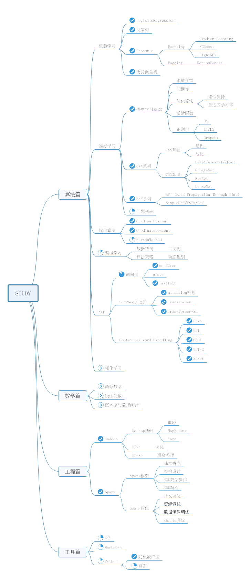

# SelfLearning

本项目共分为四大部分，分别为**算法篇**，**工程篇**和**工具篇**

- **算法篇**

  计划包含机器学习、深度学习、NLP、推荐系统、优化算法、强化学习和编程

。

- **工程篇**

  计划包含Spark、Hadoop、Kafka、Flume、Flink、ES和Redis。

- **工具篇**

  计划包含Git、Vim、Linux和python。

- 数学篇

  计划包含高等数学、线性代数和概率论与数理统计。

> 上面列的大纲比较宽泛，学习过程中需谨记：**有侧重点、结合实际，再就是构建自己框架**

项目架构图，如下，
   

​    
