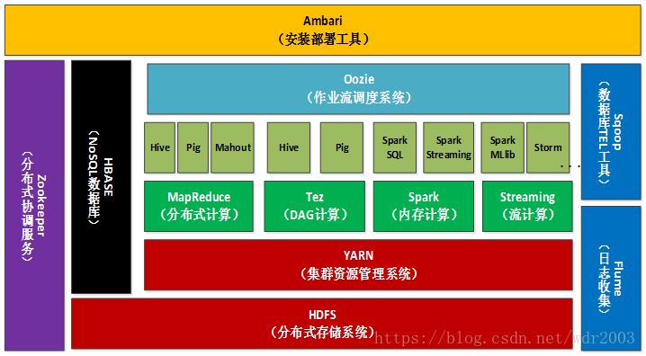
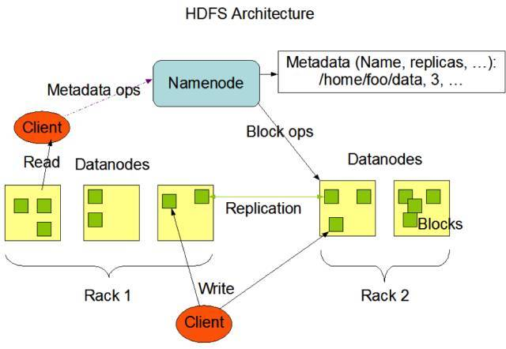
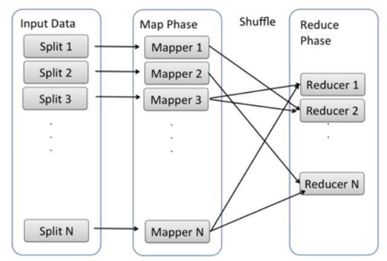
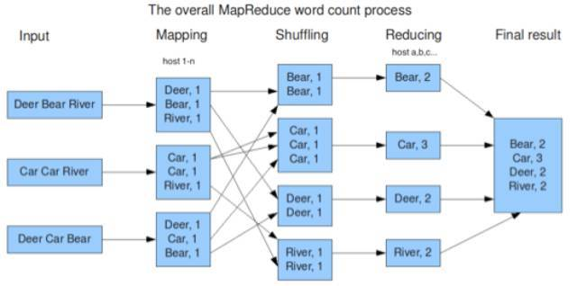

[TOC]

# Hadoop

Hadoop是Apache软件基金会旗下的一个开源分布式平台。Hadoop以分布式文件系统HDFS(Hadoop Distributed File System)和MapReduce为核心，为用户提供了系统底层细节透明的分布式基础架构。
Hadoop生态系统主要包括Hive，Hbase，Spark，Storm，Mahout，Flume，ZooKeeper，Pig，Sqoop，Shark，Phoenix，Tez，Ambari。架构图如下，


## 1. Hadoop基础 
Hadoop基础部分主要包含了HDFS、MapReduce和Yarn三大核心。

### 1.1 HDFS
一个HDFS集群是有一个NameNode和一定数目的DataNode组成。
- NameNode   
NameNode是一个中心服务器，负责管理文件系统的名字空间(namespace)以及客户端对文件的访问。
在 HDFS 里， Name node 保存了整个文件系统信息，包括文件和文件夹的结构。其实和 linux 上的真的很像，HDFS 可以存很大的文件，所以每个文件都被分成一些 data block，存在不同机器上, name node 就负责记录一个文件有哪些 data block，以及这些 data block 分别存放在哪些机器上。

- DataNode   
存储data block的机器叫做DataNodes，在读写过程中，DataNode负责直接把用户读取的block传给client，也负责直接接收用户写的文件。

HDFS整体架构图，   


HDFS数据上传过程，
1) Client端发送一个添加文件到HDFS的请求给NameNode；
2) NameNode告诉Client端如何来分发数据块以及分发的位置；
3) Client端把数据分为块(block)，然后把这些块分发到DataNode中；
4) DataNode在NameNode的指导下复制这些块，数据备份。

#### 1.1.1 数据备份
- Rack   
通常若干台机器垂直的组成一个Rack，类似一个书架，一个rack共享一个电源，一条网线和一个交换机。HDFS存储数据默认一份数据存储三份，通常在同一个rack上存储一份，然后在另外一个rack上存储另外两份，保证数据 有更高的安全性。

- 读写
	- 写   
如果HDFS为每一个block存储三份，那client如何来写，是否同时像三个DataNode写，显然不是这样。当 client 写文件创建新 block 的时后，Name nodes 会为这个 block 创建一个整个 HDFS cluster 里独有的 block ID，并且决定哪些 DataNodes 来存储这个 block 的所有备份。这些被选择的 DataNodes 组成一个队列，client 向队列的第一个 Data node 写，那么第一个 DataNode 除了把数据存在自己的硬盘上以外，还要把数据传给队列里的下一个 DataNode，如此这般，直到最后一个 DataNode 接到数据完毕。
	- 读   
同样的，当 HDFS client 读取一个文件时，它首先从 Name nodes 获得这个文件所有 blocks 和每个 block 的所有备份所在机器位置。当 client 开始读取 block 时，client 会选择从“最近”的一台机器读取备份（“最近”指的是网络延迟最短），如果第一个备份出现问题，比如网络突然中断，或者硬盘出故障，那 client 就从第二个备份读，以此类推。

> 在读写一个文件时，当我们从 NameNodes 得知应该向哪些 DataNodes 读写之后，我们就直接和 DataNode 打交道，不再通过 NameNodes.

### 1.2 MapReduce
MapReduce是一个快速、高效、简单用于编写并行处理大数据程序并应用在大集群上的编程框架，整体分为三个阶段，分别是Map，Shuffle和Reduce。
- Map阶段   
每台机器处理本机的数据，产生运算结果

- Shuffle阶段   
将Map阶段结果汇总（按照关键字组合，相同的key会被传送到同一个reducer中），这就是Shuffle阶段

- Reduce阶段   
处理shuffle后的结果，产出最终的结算结果

下面是MapReduce模型架构图，   


#### 1.2.1 Shuffle优化
下面是word count的MapReduce架构图，   


我们从这个例子的图中可以看出，每个 map function 会输出一组 key value pair, Shuffle 阶段需要从所有 map host 上把相同的 key 的 key value pair 组合在一起，组合后传给 reduce host, 作为输入进入 reduce function 里。   
所有map function产生的key可能有成百上千，经过shuffle组合key工作后，依然是相同的数目，而负责reduce host可能只有几十个，几百个，那 Hadoop 的分配 key value pair 的策略是什么？
**Partitioner component**负责计算哪些 key 应当被放到同一个 reduce host里(比如key值的hash value)。

- Map端操作   
    Map function 的运行方式就是从 RecordReader 那边读出一个 input key value pair, 处理，然后把处理结果（通常也是 key value pair 形式）写到一个Hadoop maintained memory buffer 里，然后读取下一个 input key value pair。
    Hadoop maintained memory buffer 里的 key value pair 按 key 值排序，并且按照 reduce partition 分到不同 partition 里（这就是 partitioner 被调用的时候）。一旦 memory buffer 满了，就会被 Hadoop 写到 file 里，这个过程叫 spill, 写出的 file 叫 spill file.

    >注意，这些 spill file 存在 map 所在 host 的 local disk 上，而不是我们之前介绍过的 HDFS.    

    随着 Map 不断运行，有可能有多个 spill file 被制造出来。当 Map 结束时，这些 spill file 会被 merge 起来——不是 merge 成一个 file，而是按 reduce partition 分成多个。

- 在 Reduce 端的运作   
由于 Map tasks 有可能在不同时间结束，所以 reduce tasks 没必要等所有 map tasks 都结束才开始。事实上，每个 reduce task 有一些 threads 专门负责从 map host copy map output（默认是5个，可以通过 $mapred.reduce.parallel.copies 参数设置），考虑到网络的延迟问题，并行处理可以在一定程度上提高效率。

### 1.3 Yarn

#### 1.3.1 之前的Hadoop的Component架构
- JobTracker   
JobTracker一个进程的形式运行，一直等待用户提交的任务，当JobTracker接收了用户的提取交的任务（指定mapper function/reducer function/data path）后，接下来挑选机器执行相应的函数。

- TaskTracker   
上面提到了，需要JobTracker挑选机器来执行相应的函数，那么需要定义一下每台机器的繁忙程度，Hadoop所做的是为每一台机器定义N个slot，slot占用的个数来衡量机器的繁忙程度，slot是通过机器cpu和内存的情况设定的。JobTracker只是运行在一台机器上的一个进程，它是如何知道其它机器有哪些slot呢？
它是通过TaskTracker完成的，TaskerTracker是运行在每一台机器上的一个[daemon](https://baike.baidu.com/link?url=mID4rL3vgdW_nrMaposCBC-At_NdgqB_YuHyTWgr8XufNXXH49MrM4IIHvwanEEj41BPhn3WSDCDimd7Vh5mDEDRUAcCaeh_GP_qLqOwo2a)，它的首要任务就是跟踪本台机器有那些slot，当TaskTracker启动时，它从机器管理员写的config file中读取这台机器有几个slot，当JobTracker分配给这台机器一个mapper function或者reducer function时，那TaskTracker就会将slot个数减少一个。

- TaskTracker和Slots   
TaskTracker 有一个 heartbeat 机制，就是每隔几秒钟或者几分钟向 JobTracker 发一个信息，告之当前机器还有几个 free slot. 这样，JobTracker 就知道所有 Hadoop 机器资源使用情况。那么下次 JobTracker 收到用户提交的任务时，就有足够的信息决定向哪个机器分配 mapper 或 reducer 任务。

#### 1.3.2 MRv2（YARN）
经典的MapReduce程序最严重的限制主要关系到可伸缩性、资源利用和对与MapReduce不同工作的负载支持。在MapReduce框架中，作业执行受两种类型的进程控制：一个称为JobTracker的主要进程，它负责协调在集群上运行的所有作业，分配要在TaskTracker上要运行mapper function或者reducer function任务；另外一个就是许多的TaskerTracker进程，他们负责运行分配的任务并定期向JobTracker报告进度。

基于之前存在缺点，YARN（也称为MRv2）诞生，它主要包括ResourceManager、ApplicationMaster、NodeManager，其中ResourceManager用来代替集群管理器，ApplicationMaster代替一个专用且短暂的JobTracker，NodeManager代替TaskTracker。
MRv2最核心的思想是将之前的JobTracker的两个主要功能分离为连个单独的组件，这两个功能是资源管理和任务调度/监控。资源管理器(ResourceManager)负责全局管理所有的应用程序计算资源的分配，每一个应用程序的ApplicationMaster负责相应的调度和监控。这里的应用程序指MapReduce任务或者DAG（有向无环图）任务。

yarn架构图如下，   


将JobTracker和TaskTracker进行分离，它由下面几大构成组件：   
a. 一个全局的资源管理器 ResourceManager   
b. ResourceManager的每个节点代理 NodeManager   
c. 表示每个应用的 ApplicationMaster   
d. 每一个ApplicationMaster拥有多个Container在NodeManager上运行   

- **ResourceManager(资源管理器，RM)**   
RM有两个重要的组件：Scheduler和ApplicationsManager。
	- Scheduler   
	负责分配资源给每个正在运行的应用（仅负责分配资源），资源的形态以container表示，后面介绍
    - ApplicationManager   
    负责管理整个系统中所有应用程序，包括应用程序提交、与调度器协商资源以启动ApplicationMaster、监控ApplicationMaster运行状态并在失败时重新启动它等

- **ApplicationMaster(AM)**   
用户提交的每一个应用程序均包含一个AM，主要功能：
	- 与RM调度器协商以获取资源（container）   
	- 与NM通信以启动/停止任务   
	- 监控所有任务的运行状态，并在任务失败时重新申请资源以重启任务   

- **NodeManager(NM)**   
NM是每个节点上的资源和任务管理器，一方面，它会定时地向RM汇报本节点上的资源使用情况和各个Container的运行状态；另一方面，它接收并处理来自AM的Container启动/停止等各种请求。

> Container是YARN中的资源抽象，它封装了某个节点上的多维度资源，如内存、CPU、磁盘、网络等，当AM向RM申请资源时，RM为AM返回的资源便是用Container表示。YARN会为每个任务分配一个Container，且该任务只能使用该Container中描述的资源。


## 2. Hadoop生态系统：Hive

用于Hdoop的一个数据仓库系统，它提供类似SQL的查询语言，通过使用该语言，可以方便对数据进行汇总，特定查询以及分析存放在Hadoop兼容文件系统中的大数据。

### 2.1 Hive表 

#### 2.1.1 分区
- 动态分区   

  ```sql
  set hive.exec.dynamic.partition=true;
  set hive.exec.dynamic.partition.mode=nonstrict;
  ```
- 静态分区   

  插入数据时，需要指定分区的具体取值。
> 两者的区别主要是插入数据时，静态分区需要指定分区的取值，而动态分区不需要指定，会自动根据列的取值进行分区（当分区级数多且数据量大时方便）

#### 2.1.2 分桶

```sql
set hive.enforce.bucketing=true;
set hive.enforce.sorting=true;
```
分桶的主要优势为两个，一个是方便抽样，再一个是提高join查询效率(相同分桶表，桶数是倍数关系)

> 分桶和分区的区别，参考[链接](https://blog.csdn.net/weixin_39393048/article/details/82530254)，分区是针对hdfs目录的操作（粗粒度），分桶是针对文件的操作（细粒度）

### 2.2 Hive查询操作优化

个人理解，优化分主要分两大部分，第一部分为架构方面优化，第二部分数据倾斜的优化

#### 2.2.1 MapReduce架构

显然MapReduce架构层面分为三部分，分别为Map，Shuffle和Reduce，核心是根据不同的任务设置合理的Map和Reduce个数，尤其是Reduce的个数，参考[hive中控制map和reduce数量](https://blog.csdn.net/zhong_han_jun/article/details/50814246)，写的非常不错，有例子说明。

- Map优化

  - `mapred.min.split.size.per.node`， 一个节点上split的至少的大小   

  - `mapred.min.split.size.per.rack` 一个交换机下split至少的大小   

  - `mapred.max.split.size` 一个split最大的大小   

    参考[链接](https://www.cnblogs.com/xd502djj/p/3799432.html)

- Shuffle优化

  - `io.sort.mb` 这个参数控制 map 端 memory buffer 大小，越大每次 map 要 spill 的 file 就越大，总 spill file 个数越少; 所以如果你的 Hadoop Job map output 很多，适当增加这个参数有助于 performance；
  - `io.sort.spill.percent` 这个参数控制 map memory buffer 到达多少比例时开始 spill. 我们知道 spill 是写 IO 操作，所以需要时间。如果 percentage 太高，有可能当 spill 还没有完成时，map output 已经把 memory buffer 填满，这样影响 performance；同样，太低会造成太多 spill fie;
  - `tasktracker.http.threads` 控制 map 端有多少个 thread 负责向 reduce 传送 map output. 本着并行计算的原则，可以适当调高;
  - `mapred.reduce.parallel.copies` 这个参数控制 reduce 端有多少个 thread 去 copy map output. 本着并行计算的原则，可以适当调高;
  - `mapred.job.reduce.input.buffer.percent` 控制 reduce host 上 JVM 中用于 merge map output 的比例。可以适当调高;
  - `io.sort.factor`控制 reduce 端同时被 sort 的文件的个数。我们说 reduce 端 file sor t分批进行，这个参数就是每批有多少个。如果内存大，可以适当增加，以减少 sort 批次。

- Reduce优化

  reduce数量由以下三个参数决定，

  - `mapred.reduce.tasks` 强制指定reduce的任务数量

  - `hive.exec.reducers.bytes.per.reducer`每个reduce任务处理的数据量，默认为1000^3=1G

  - `hive.exec.reducers.max`每个任务最大的reduce数，默认为999

    > 计算reducer数的公式N=min( hive.exec.reducers.max ，总输入数据量/ hive.exec.reducers.bytes.per.reducer )，只有一个reduce的场景（没有group by的汇总，order by和笛卡尔积）

#### 2.2.2 数据倾斜优化

从MapReduce的结构可以看出，数据倾斜主要存在Map端（每个map task的数据集倾斜）和Reduce端（每个reduce task数据发生倾斜）的数据中，具体表现，

- Map端

  - key值分布不均匀
  - 业务数据本身的特点
  - 建表时考虑不周全

- Reduce端

  `join`/`group by`/`count distinct` 三种操作易导致reduce task中数据发生倾斜

对于Map端的数据倾斜，多可以通过map task任务数量来控制，此处可以参考上面**Map优化**

针对Reduce端导致的数据倾斜，说先需要明确`join`/`group by`/`count distinct`的[MapReduce执行方案](https://tech.meituan.com/2014/02/12/hive-sql-to-mapreduce.html)，

- `join`倾斜原因及优化

  - key中空值或者异常值特别多

    针对此种情况，可以提前将空值和异常值过滤，也可以将空值用随机数字替代，随机分配到不同的reducer中

  - 大表和小表（小于1000条记录）join

    可以考虑使用[mapjoin的方式](https://www.jianshu.com/p/859e39475832)

  - key值分布不均匀

    可以设置参数

    ```sql
    set hive.optimize.skewjoin = true;
    set hive.skewjoin.key = skew_key_threshold -- (表示join的key对应的行数，如果超过这个值就会拆分，default = 100000)
    -- 可以就按官方默认的1个reduce 只处理1G 的算法，那么skew_key_threshold= 1G/平均行长.或者默认直接设成250000000 (差不多算平均行长4个字节)
    ```

- `group by`倾斜原因及优化

  `group by`中数据倾斜多为key值分布不均匀导致，可以设置的参数，如下

  ```sql
  set hive.map.aggr=true;  --相当于在map阶段对数据进行提前预聚合
  set hive.groupby.mapaggr.checkinterval = 100000; -- (默认)执行聚合当超过此条数
  set hive.map.aggr.hash.min.reduction=0.5; -- 默认值,如果hash表的容量与输入行数之比超过这个数，那么map端的hash聚合将被关闭，默认是0.5，设置为1可以保证hash聚合永不被关闭；
  set hive.groupby.skewindata=true; --控制生成两个MR Job,第一个MR Job Map的输出结果随机分配到reduce做次预汇总,减少某些key值条数过多某些key条数过小造成的数据倾斜问题
  ```

- `count distinct`倾斜原因及优化

  主要是key值的分布不均匀，可以更换sql表达方式，

  ```sql
  select count(distinct id) from tablename;
  
  -- after optimize
  
  select count(1) from (select distinct id from tablename) tmp;
  select count(1) from (select id from tablename group by id) tmp;
  ```

> 以上三种方式主要导致的数据倾斜均发生在reduce端，所以通用的一种设置方式就是增加reduce task的个数，参考上面的**Reduce优化**部分

### 2.3 Hive job优化

一些基本原则
- 尽量尽早地过滤数据，减少每个阶段的数据量,对于分区表要加分区，同时只选择需要使用到的字段

- 尽量原子化操作，尽量避免一个SQL包含复杂逻辑

- join操作   

    - 小表要注意放在join的左边，否则会引起磁盘和内存的大量消耗
    - 若小表数据极少，考虑使用map join

- 如果`union all`的部分个数大于2，或者每个union部分数据量大，应该拆成多个`insert into`语句，实际测试过程中，执行时间能提升50%

- 写SQL要先了解数据本身的特点，如果有join ,group操作的话，要注意是否会有数据倾斜，优化部分参考上面的部分

- 并行化执行   
每个查询被Hive转化为多个阶段，有些阶段关联性不大，则可以并行化执行，减少执行时间

  ```sql
    set hive.exec.parallel=true;
    set hive.exec.parallel.thread.number=8;
  ```
  
- 小文件问题   
	
  - 输入小文件
  
    若输入的数据（主要为map端）中包含很多小文件可以考虑将其合并，这和map task设置基本一样
    
    ```sql
      set hive.input.format=org.apache.hadoop.hive.ql.io.CombineHiveInputFormat;
      -- 以下三个设置和map task个数设置一样
      set mapred.max.split.size=256000000;
      set mapred.min.split.size.per.node=256000000;
      set mapred.min.split.size.per.rack=256000000;
    ```
	
	- 输出小文件
	  
    如果设置的reduce task个数较多，则容易导致存在较多的小文件，此时可以考虑将小文件合并
	  
	  ```sql
	  -- 相当于额外启动一个MR任务，来合并输出的小文件
	    set hive.merge.mapredfiles = false; --是否合并 reduce 输出文件，默认为 false 
	    set hive.merge.size.per.task = 256*1000*1000; --合并文件的大小
	    set hive.merge.smallfiles.avgsize=1024000000; --当输出文件的平均大小小于1GB时，启动一个独立的map-reduce任务进行文件merge
	  ```

### 2.4 (order/sort/distribute/cluster) by异同

- `order by`

  `order by`是全局排序，相当于所有的数据在一个reduce端完成，显然效率较慢

- `sort by`

  `sort by`是局部排序，相当于对每个reduce task中的数据进行排序

- `distribute by`

  hive中（`distribute by` + “表中字段”）关键字控制map输出结果的分发,相同字段的map输出会发到一个 reduce节点去处理。sort by为每一个reducer产生一个排序文件，他俩一般情况下会结合使用。

- `cluster by`

  相当于是distribute by sort by的结合，不过只能是降序，不能指定 `desc`和`asc`参数

## 3. Hadoop生态系统：HBase

一种分布式的、可伸缩的、大数据存储库，支持随机、实时读/写访问。

源自Google的Bigtable论文，发表于2006年11月，传统的关系型数据库是对面向行的数据库。HBase是Google Bigtable克隆版，HBase是一个针对结构化数据的可伸缩、高可靠、高性能、分布式和面向列的动态模式数据库。和传统关系数据库不同，HBase采用了BigTable的数据模型：增强的稀疏排序映射表（Key/Value），其中，键由行关键字、列关键字和时间戳构成。HBase提供了对大规模数据的随机、实时读写访问，同时，HBase中保存的数据可以使用MapReduce来处理，它将数据存储和并行计算完美地结合在一起。 
Hbase表的特点

- 大：一个表可以有数十亿行，上百万列；
- 无模式：每行都有一个可排序的主键和任意多的列，列可以根据需要动态的增加，同一张表中不同的行可以有截然不同的列；
- 面向列：面向列（族）的存储和权限控制，列（族）独立检索；
- 稀疏：空（null）列并不占用存储空间，表可以设计的非常稀疏；
- 数据多版本：每个单元中的数据可以有多个版本，默认情况下版本号自动分配，是单元格插入时的时间戳；
- 数据类型单一：Hbase中的数据都是字符串，没有类型。    
 Hbase物理模型 
每个column family存储在HDFS上的一个单独文件中，空值不会被保存。 
Key 和 Version number在每个 column family中均有一份； 
HBase 为每个值维护了多级索引,即：”key, column family, column name, timestamp”，其物理存储：

1. Table中所有行都按照row key的字典序排列；
2. Table在行的方向上分割为多个Region；
3. Region按大小分割的，每个表开始只有一个region，随着数据增多，region不断增大，当增大到一个阀值的时候，region就会等分会两个新的region，之后会有越来越多的region；
4. Region是Hbase中分布式存储和负载均衡的最小单元，不同Region分布到不同RegionServer上。、
5. Region虽然是分布式存储的最小单元，但并不是存储的最小单元。Region由一个或者多个Store组成，每个store保存一个columns family；每个Strore又由一个memStore和0至多个StoreFile组成，StoreFile包含HFile；memStore存储在内存中，StoreFile存储在HDFS上。


## Reference
- [五分钟零基础搞懂Hadoop](https://zhuanlan.zhihu.com/p/20176725)
- [5分钟深入浅出 HDFS](https://zhuanlan.zhihu.com/p/20267586)
- [五分钟深入 Hadoop 内核](https://zhuanlan.zhihu.com/p/20176737)
- [yarn(百度百科)](https://baike.baidu.com/link?url=pKvKqtKFCPVQ7o8P7872cj1unPEYeppXheM_rzon2HchYzWmMpLCByKtFKc9QqSbgd-sTVczzyvU_B-XlbtWk_)
- [5分钟 Hadoop Shuffle 优化](https://zhuanlan.zhihu.com/p/20261259)
- [Hive之——Hive SQL优化](https://blog.csdn.net/l1028386804/article/details/80629279)
- [hive的查询注意事项以及优化总结](https://www.cnblogs.com/xd502djj/p/3799432.html)
- [hive中的distribute by](https://blog.csdn.net/fantasticqiang/article/details/80769316)
