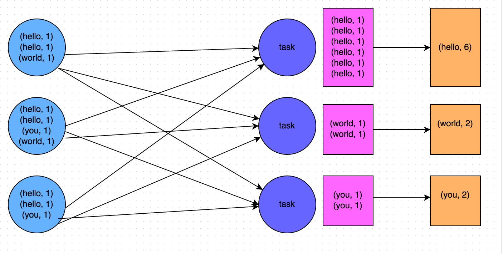
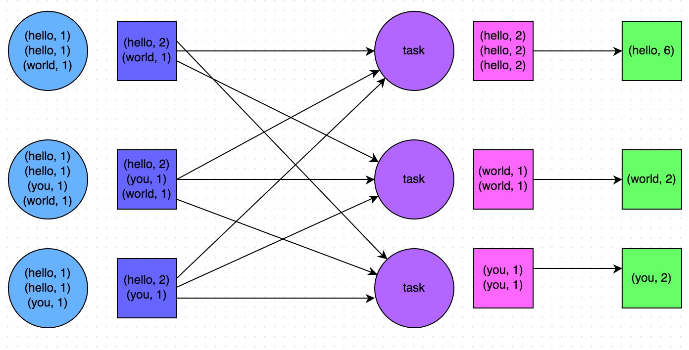
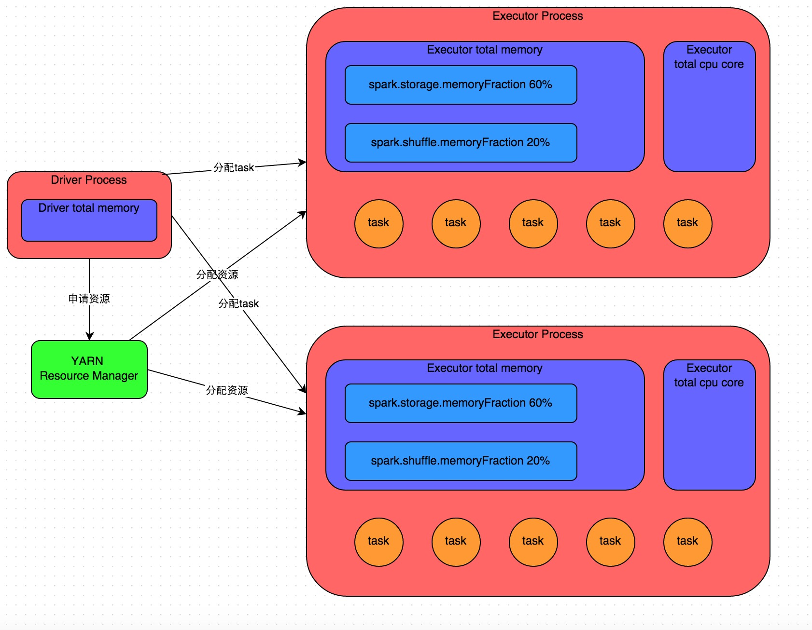
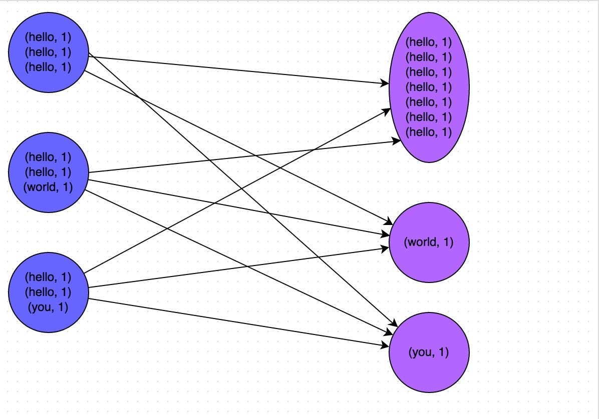
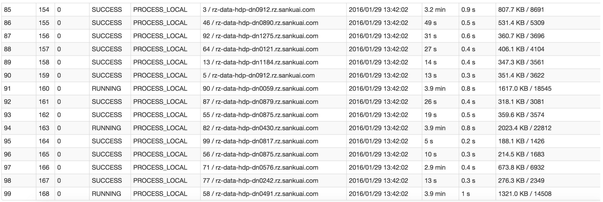
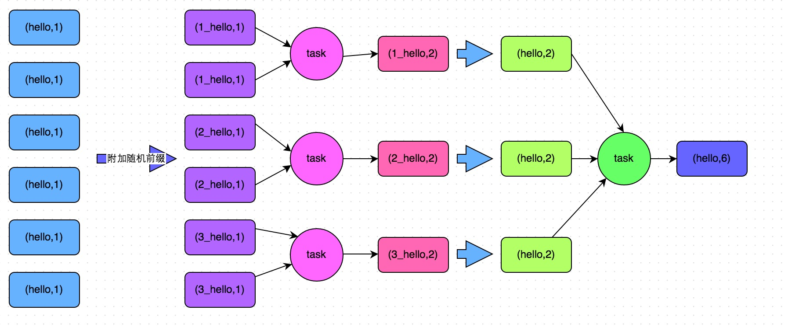
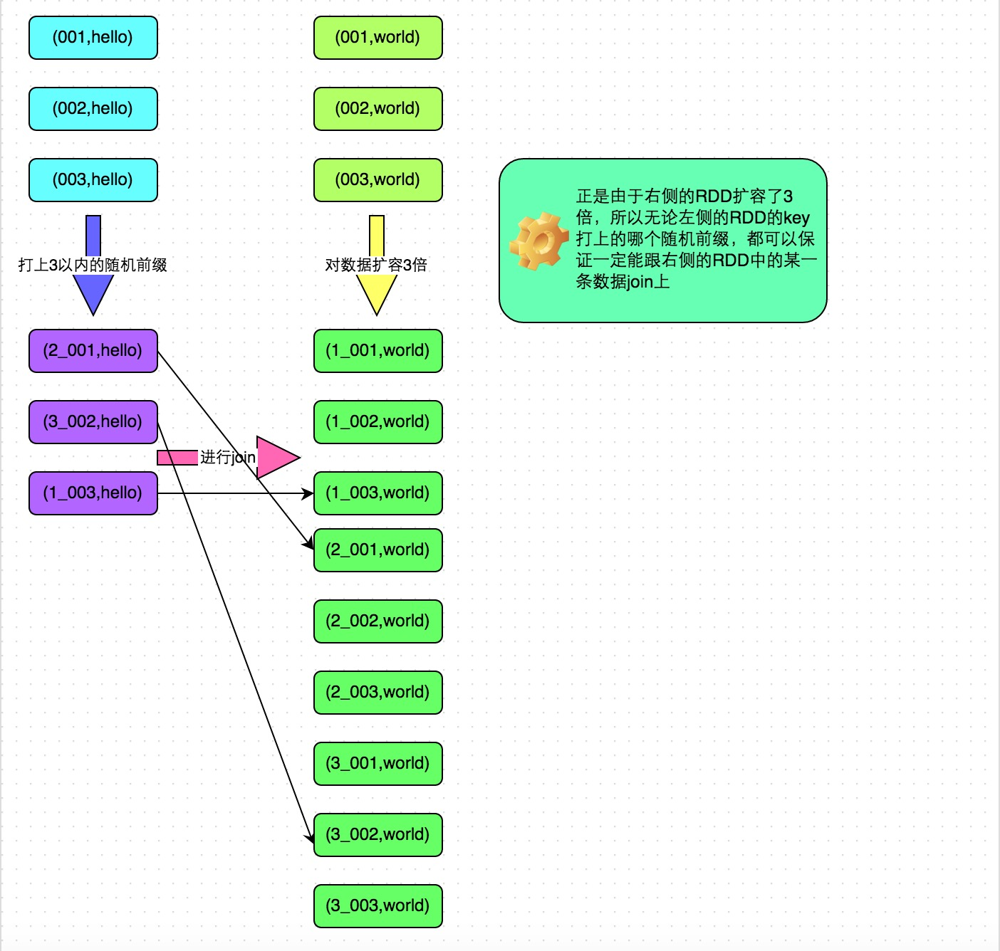

# Spark概述

[TOC]

## 1. spark 简介

spark是一个实现快速通用的集群计算平台。它是由加州大学伯克利分校AMP实验室 开发的通用内存并行计算框架，用来构建大型的、低延迟的数据分析应用程序。它扩展了广泛使用的MapReduce计算模型。高效的支撑更多计算模式，包括交互式查询和流处理。spark的一个主要特点是能够在内存中进行计算，及时依赖磁盘进行复杂的运算，spark比MapReduce更加高效。


### 1.1 spark组件

spark项目包含多个紧密集成的组件。spark的核心是一个对由很多计算任务组成的、运行在多个工作机器或者是一个计算集群上应用进行调度、分发以及监控的计算引擎。其主要组件如下图，


- Spark Core

  实现Spark的基本功能，包括任务调度、内存管理、错误恢复、与存储系统交互等，以及RDD（Resilient Distributed Dataset, 弹性分布式数据集）API的定义。

  > RDD表示分布在多个计算节点上可以并行操作的元素集合，是Spark的主要编程对象

- Spark SQL

  Spark SQL是Spark用来操作结构化数据的程序包。通过Spark SQL，我们可以使用SQL或者Hive（hql）来查询数据，Spark SQL支持多种数据源，比如hive 表、Parquet以及JSON等。

- Spark Streaming

  用来对实时数据进行流式计算的组件，Streaming中提供操作流式数据的API与RDD高度对应。Streaming与日志采集工具Flume、消息处理Kafka等可集成使用。 

- MLlib

  机器学习（ML）的功能库，提供多种学习算法，包括分类、回归、聚类、协同过滤等，还提供了模型评估、数据导入等功能。 

- GraphX

  用来操作图的程序库，可以用于并行的图计算。扩展了RDD API功能，用来创建一个顶点和边都包含任意属性的有向图。支持针对图的各种操作，如图的分割subgraph、操作所有的顶点mapVertices、三角计算等。 

- 集群管理器

  Spark支持在各种集群管理器（cluster manager）上运行，包括Hadoop的YARN、Apache的Mesos以及Spark自带的一个简易调度器，叫独立调度器。

> 上面提到的Spark Strenming和GraphX目前不熟悉

### 1.2 spark优势特点

- 高效性

  不同于MapReduce将中间计算结果放入磁盘中，Spark采用内存存储中间计算结果，减少了迭代运算的磁盘IO，并通过并行计算DAG图的优化，减少了不同任务之间的依赖，降低了延迟等待时间。内存计算下，Spark 比 MapReduce 快100倍。

- 易用性

  不同于MapReduce仅支持Map和Reduce两种编程算子，Spark提供了超过80种不同的Transformation和Action算子，如map,reduce,filter,groupByKey,sortByKey,foreach等，并且采用函数式编程风格，实现相同的功能需要的代码量极大缩小。

  

- 通用性

  Spark提供了统一的解决方案。Spark可以用于批处理、交互式查询（Spark SQL）、实时流处理（Spark Streaming）、机器学习（Spark MLlib）和图计算（GraphX）。

  这些不同类型的处理都可以在同一个应用中无缝使用。这对于企业应用来说，就可使用一个平台来进行不同的工程实现，减少了人力开发和平台部署成本。

  

- 

- 兼容性

  Spark能够跟很多开源工程兼容使用。如Spark可以使用Hadoop的YARN和Apache Mesos作为它的资源管理和调度器，并且Spark可以读取多种数据源，如HDFS、HBase、MySQL等。

  


## 2. Spark框架

### 2.1 Spark基本概念

- RDD(Resilient Distributed Dataset)

  RDD，弹性分布式数据集， 是分布式内存的一个抽象概念，RDD提供了一种高度受限的共享内存模型，即RDD是只读的记录分区的集合，只能通过在其他RDD执行确定的转换操作（如map、join和group by）而创建，然而这些限制使得实现容错的开销很低。对开发者而言，RDD可以看作是Spark的一个对象，它本身运行于内存中，如读文件是一个RDD，对文件计算是一个RDD，结果集也是一个RDD ，不同的分片、 数据之间的依赖 、key-value类型的map数据都可以看做RDD。

- DAG(Directed Acyclic Graph)

  DAG，有向无环图，反应RDD之间的依赖关系。

---

以下为spark架构设计相关概念，

- Driver Program

  控制程序，负责为Application构建DAG图。

- Cluster Manager

  集群资源管理中心，负责分配计算资源。

- Worker Node

  工作节点，负责完成具体计算。

- Executor

  是运行在工作节点（Worker Node）上的一个进程，负责运行Task，并为应用程序存储数据。

---

以下为任务相关的概念，

- Application

  用户编写的Spark应用程序，一个Application包含多个Job。

- Job

  作业，一个Job包含多个RDD及作用于相应RDD上的各种操作。，一个Job包含多个Stage

- Stage

  阶段，是作业的基本调度单位，一个作业会分为多组任务，每组任务被称为“阶段”，一个Stage包含多个Task。

- Task

  任务，运行在Executor上的工作单元，是Executor中的一个线程。

任务相关的概念可以下图概括，


> **总结：Application由多个Job组成，Job由多个Stage组成，Stage由多个Task组成。Stage是作业调度的基本单位。**

### 2.2 Spark架构设计

Spark集群由Driver, Cluster Manager（Standalone,Yarn 或 Mesos），以及Worker Node组成。对于每个Spark应用程序，Worker Node上存在一个Executor进程，Executor进程中包括多个Task线程。


### 2.3 Spark运行流程

1. Application首先被Driver构建DAG图并分解成Stage。

2. 然后Driver向Cluster Manager申请资源。

3. Cluster Manager向某些Work Node发送征召信号。

4. 被征召的Work Node启动Executor进程响应征召，并向Driver申请任务。

5. Driver分配Task给Work Node。

6. Executor以Stage为单位执行Task，期间Driver进行监控。

7. Driver收到Executor任务完成的信号后向Cluster Manager发送注销信号。

8. Cluster Manager向Work Node发送释放资源信号。

9. Work Node对应Executor停止运行。

整个过程如下所示，


### 2.4 Spark部署模式

- Local

  本地运行模式，非分布式

- Standalone

  使用Spark自带集群管理器，部署后只能执行Spark任务

- Yarn

  Hadoop集群管理器，部署后可以同时运行MapReduce，Spark，Storm，Hbase等各种任务。

  > 有关Yarn的相关资源管理框架参考`../hadoop/hadoop.md`中介绍

- Mesos

  与Yarn最大的不同是Mesos 的资源分配是二次的，Mesos负责分配一次，计算框架可以选择接受或者拒绝。

> 多数使用Yarn资源管理器，可以同时运行MR和Spark程序

### 2.5 RDD数据的操作

RDD是弹性分布式数据集，是Spark的基本数据结构，它代表一个**不可变**、**可分区**、其中元素可以并行计算的集合。一般有两种方式创建RDD，

- 读取文件中的数据生成RDD
- 将内存中的对象**并行化**后生成RDD

在RDD创建完成后，即可以使用各种操作对RDD进行编程，RDD操作有两种类型，Transformation和Action。

- Transformation

  从一个已经存在的RDD创建一个新的RDD

- Action

  从一个已经存在的RDD上进行计算，并将计算结果返回到Driver端

> Transformation操作具有Lazy特性，即Spark不会立刻进行实际的计算，只会记录执行的轨迹，只有触发Action操作的时候，它才会根据DAG图真正的执行。


上面提到了RDD的操作有两种关系（Transformation和Action），RDD之间的依赖关系也有两种，即**宽依赖**和**窄依赖**。

- 窄依赖

  父RDD的分区和子RDD的分区关系是一对一或者多对一的关系

- 宽依赖

  父RDD的分区和子RDD的分区是一对多或者多对多的关系

> 宽依赖关系操作一般具有shuffle的过程，即通过一个partitioner函数将父RDD中每个分区上key不同的记录分发到不同的子RDD分区


在**2.1 Spark 基本概念**中提到了任务相关的概念，而RDD的依赖关系确定了Stage的切分方式。

- **切割规则**(从后往前，遇到宽依赖就切割Stage)

  RDD之间的依赖关系形成一个DAG有向无环图，DAG会提交给DAGScheduler，DAGScheduler会把DAG划分成相互依赖的多个Stage，划分Stage的依据就是RDD之间的宽窄依赖。遇到宽依赖就划分Stage,每个Stage包含一个或多个task任务。然后将这些task以taskSet的形式提交给TaskScheduler运行。


#### 2.5.1 word count示例

```scala
# scala code
val file = sc.textFile("hello.txt")
val word = file.flatMap(_.split(","))
val wordOne = word.map((_,1))
wordOne.reduceByKey(_+_)
```


### 2.5 RDD编程

本部分主要介绍RDD相关的code操作，包括RDD的创建、相应的Transformation和Action的操作。

> 主要以pyspark作为示例，整个spark环境基于win10[本地搭建](https://blog.csdn.net/cymy001/article/details/78430892)

参考[Spark入门系列（二）| 1小时学会RDD编程](https://mp.weixin.qq.com/s?__biz=MzI0ODcxODk5OA==&mid=2247506619&idx=5&sn=b349f75f63cf58903fb2a2fe3805e4dc&chksm=e99ee942dee96054a6fbd228cc63e1c539ae56dd79c0789508f1e71ce0c5363e9a2134420496&mpshare=1&scene=1&srcid=&sharer_sharetime=1565498914824&sharer_shareid=e53fc678b87c854a7577418ee1c671ac&pass_ticket=M6p7g9GapUuLwImC5D4ka9nJ1kIyTeLmjB4o6SeJwseu2TDwwGeLQbr%2FnGtX1Qqr#rd)

## 3. Spark调优

主要分为**开发调优**、**资源调优**、**数据倾斜调优**和**shuffle调优**四个部分。

- 开发调优和资源调优

  是所有Spark作业都需要注意和遵循的一些基本原则，是高性能Spark作业的基础；

- 数据倾斜调优

  主要讲解了一套完整的用来解决Spark作业数据倾斜的解决方案；

- shuffle调优
面向的是对Spark的原理有较深层次掌握和研究的同学，主要讲解了如何对Spark作业的shuffle运行过程以及细节进行调优。

### 3.1 开发调优

Spark性能优化的第一步，就是要在开发Spark作业的过程中注意和应用一些性能优化的基本原则。开发调优，就是了解以下一些Spark基本开发原则，包括：RDD lineage设计、算子的合理使用、特殊操作的优化等。在开发过程中，时时刻刻都应该注意以上原则，并将这些原则根据具体的业务以及实际的应用场景，灵活地运用到自己的Spark作业中。

#### 3.1.1 避免创建重复的RDD

通常来说，我们在开发一个Spark作业时，首先是基于某个数据源（比如Hive表或HDFS文件）创建一个初始的RDD；接着对这个RDD执行某个算子操作，然后得到下一个RDD；以此类推，循环往复，直到计算出最终我们需要的结果。在这个过程中，多个RDD会通过不同的算子操作（比如map、reduce等）串起来，这个“RDD串”，就是RDD lineage，也就是**RDD的血缘关系链**。

我们在开发过程中要注意：对于同一份数据，只应该创建一个RDD，不能创建多个RDD来代表同一份数据。

一些Spark初学者在刚开始开发Spark作业时，或者是有经验的工程师在开发RDD lineage极其冗长的Spark作业时，可能会忘了自己之前对于某一份数据已经创建过一个RDD了，从而导致对于同一份数据，创建了多个RDD。这就意味着，我们的Spark作业会进行多次重复计算来创建多个代表相同数据的RDD，进而增加了作业的性能开销。如下所示，

```scala
// 需要对名为“hello.txt”的HDFS文件进行一次map操作，再进行一次reduce操作。也就是说，需要对一份数据执行两次算子操作。

// 错误的做法：对于同一份数据执行多次算子操作时，创建多个RDD。
// 这里执行了两次textFile方法，针对同一个HDFS文件，创建了两个RDD出来，然后分别对每个RDD都执行了一个算子操作。
// 这种情况下，Spark需要从HDFS上两次加载hello.txt文件的内容，并创建两个单独的RDD；第二次加载HDFS文件以及创建RDD的性能开销，很明显是白白浪费掉的。
val rdd1 = sc.textFile("hdfs://192.168.0.1:9000/hello.txt")
rdd1.map(...)
val rdd2 = sc.textFile("hdfs://192.168.0.1:9000/hello.txt")
rdd2.reduce(...)

// 正确的用法：对于一份数据执行多次算子操作时，只使用一个RDD。
// 这种写法很明显比上一种写法要好多了，因为我们对于同一份数据只创建了一个RDD，然后对这一个RDD执行了多次算子操作。
// 但是要注意到这里为止优化还没有结束，由于rdd1被执行了两次算子操作，第二次执行reduce操作的时候，还会再次从源头处重新计算一次rdd1的数据，因此还是会有重复计算的性能开销。
// 要彻底解决这个问题，必须结合“原则三：对多次使用的RDD进行持久化”，才能保证一个RDD被多次使用时只被计算一次。
val rdd1 = sc.textFile("hdfs://192.168.0.1:9000/hello.txt")
rdd1.map(...)
rdd1.reduce(...)
```

#### 3.1.2 尽可能复用同一个RDD

  除了要避免在开发过程中对一份完全相同的数据创建多个RDD之外，在对不同的数据执行算子操作时还要尽可能地复用一个RDD。比如说，有一个RDD的数据格式是key-value类型的，另一个是单value类型的，这两个RDD的value数据是完全一样的。那么此时我们可以只使用key-value类型的那个RDD，因为其中已经包含了另一个的数据。对于类似这种多个RDD的数据有重叠或者包含的情况，我们应该尽量复用一个RDD，这样可以尽可能地减少RDD的数量，从而尽可能减少算子执行的次数。

  ```java
  // 错误的做法。
  
  // 有一个<Long, String>格式的RDD，即rdd1。
  // 接着由于业务需要，对rdd1执行了一个map操作，创建了一个rdd2，而rdd2中的数据仅仅是rdd1中的value值而已，也就是说，rdd2是rdd1的子集。
  JavaPairRDD<Long, String> rdd1 = ...
  JavaRDD<String> rdd2 = rdd1.map(...)
  
  // 分别对rdd1和rdd2执行了不同的算子操作。
  rdd1.reduceByKey(...)
  rdd2.map(...)
  
  // 正确的做法。
  
  // 上面这个case中，其实rdd1和rdd2的区别无非就是数据格式不同而已，rdd2的数据完全就是rdd1的子集而已，却创建了两个rdd，并对两个rdd都执行了一次算子操作。
  // 此时会因为对rdd1执行map算子来创建rdd2，而多执行一次算子操作，进而增加性能开销。
  
  // 其实在这种情况下完全可以复用同一个RDD。
  // 我们可以使用rdd1，既做reduceByKey操作，也做map操作。
  // 在进行第二个map操作时，只使用每个数据的tuple._2，也就是rdd1中的value值，即可。
  JavaPairRDD<Long, String> rdd1 = ...
  rdd1.reduceByKey(...)
  rdd1.map(tuple._2...)
  
  // 第二种方式相较于第一种方式而言，很明显减少了一次rdd2的计算开销。
  // 但是到这里为止，优化还没有结束，对rdd1我们还是执行了两次算子操作，rdd1实际上还是会被计算两次。
  // 因此还需要配合“原则三：对多次使用的RDD进行持久化”进行使用，才能保证一个RDD被多次使用时只被计算一次。
  ```

#### 3.1.3 对多次使用的RDD进行持久化

  当你在Spark代码中多次对一个RDD做了算子操作后，恭喜，你已经实现Spark作业第一步的优化了，也就是尽可能复用RDD。此时就该在这个基础之上，进行第二步优化了，也就是要保证对一个RDD执行多次算子操作时，这个RDD本身仅仅被计算一次。

  Spark中对于一个RDD执行多次算子的默认原理是这样的：每次你对一个RDD执行一个算子操作时，**都会重新从源头处计算一遍**，计算出那个RDD来，然后再对这个RDD执行你的算子操作。这种方式的性能是很差的。

  因此对于这种情况，我们的建议是：对多次使用的RDD进行持久化。此时Spark就会根据你的持久化策略，将RDD中的数据保存到内存或者磁盘中。以后每次对这个RDD进行算子操作时，都会直接从内存或磁盘中提取持久化的RDD数据，然后执行算子，而不会从源头处重新计算一遍这个RDD，再执行算子操作。

  ```java
  // 如果要对一个RDD进行持久化，只要对这个RDD调用cache()和persist()即可。
  
  // 正确的做法。
  // cache()方法表示：使用非序列化的方式将RDD中的数据全部尝试持久化到内存中。
  // 此时再对rdd1执行两次算子操作时，只有在第一次执行map算子时，才会将这个rdd1从源头处计算一次。
  // 第二次执行reduce算子时，就会直接从内存中提取数据进行计算，不会重复计算一个rdd。
  val rdd1 = sc.textFile("hdfs://192.168.0.1:9000/hello.txt").cache()
  rdd1.map(...)
  rdd1.reduce(...)
  
  // persist()方法表示：手动选择持久化级别，并使用指定的方式进行持久化。
  // 比如说，StorageLevel.MEMORY_AND_DISK_SER表示，内存充足时优先持久化到内存中，内存不充足时持久化到磁盘文件中。
  // 而且其中的_SER后缀表示，使用序列化的方式来保存RDD数据，此时RDD中的每个partition都会序列化成一个大的字节数组，然后再持久化到内存或磁盘中。
  // 序列化的方式可以减少持久化的数据对内存/磁盘的占用量，进而避免内存被持久化数据占用过多，从而发生频繁GC。
  val rdd1 = sc.textFile("hdfs://192.168.0.1:9000/hello.txt").persist(StorageLevel.MEMORY_AND_DISK_SER)
  rdd1.map(...)
  rdd1.reduce(...)
  ```

| 持久化级别                              | 含义解释                                                     |
| --------------------------------------- | ------------------------------------------------------------ |
| MEMORY_ONLY                             | 使用未序列化的对象格式，将数据保存在内存中。如果内存不够存放所有的数据，则数据可能就不会进行持久化。那么下次对这个RDD执行算子操作时，那些没有被持久化的数据，需要从源头处重新计算一遍。这是默认的持久化策略，使用cache()方法时，实际就是使用的这种持久化策略。 |
| MEMORY_AND_DISK                         | 使用未序列化的对象格式，优先尝试将数据保存在内存中。如果内存不够存放所有的数据，会将数据写入磁盘文件中，下次对这个RDD执行算子时，持久化在磁盘文件中的数据会被读取出来使用。 |
| MEMORY_ONLY_SER                         | 基本含义同MEMORY_ONLY。唯一的区别是，会将RDD中的数据进行序列化，RDD的每个partition会被序列化成一个字节数组。这种方式更加节省内存，从而可以避免持久化的数据占用过多内存导致频繁GC。 |
| MEMORY_AND_DISK_SER                     | 基本含义同MEMORY_AND_DISK。唯一的区别是，会将RDD中的数据进行序列化，RDD的每个partition会被序列化成一个字节数组。这种方式更加节省内存，从而可以避免持久化的数据占用过多内存导致频繁GC。 |
| DISK_ONLY                               | 使用未序列化的对象格式，将数据全部写入磁盘文件中。           |
| MEMORY_ONLY_2, MEMORY_AND_DISK_2, 等等. | 对于上述任意一种持久化策略，如果加上后缀_2，代表的是将每个持久化的数据，都复制一份副本，并将副本保存到其他节点上。这种基于副本的持久化机制主要用于进行容错。假如某个节点挂掉，节点的内存或磁盘中的持久化数据丢失了，那么后续对RDD计算时还可以使用该数据在其他节点上的副本。如果没有副本的话，就只能将这些数据从源头处重新计算一遍了。 |

**如何选择一种最合适的持久化策略：**

- 默认情况下，性能最高的当然是MEMORY_ONLY，但前提是你的内存必须足够足够大，可以绰绰有余地存放下整个RDD的所有数据。因为不进行序列化与反序列化操作，就避免了这部分的性能开销；对这个RDD的后续算子操作，都是基于纯内存中的数据的操作，不需要从磁盘文件中读取数据，性能也很高；而且不需要复制一份数据副本，并远程传送到其他节点上。但是这里必须要注意的是，在实际的生产环境中，恐怕能够直接用这种策略的场景还是有限的，如果RDD中数据比较多时（比如几十亿），直接用这种持久化级别，会导致JVM的OOM内存溢出异常。
- 如果使用MEMORY_ONLY级别时发生了内存溢出，那么建议尝试使用MEMORY_ONLY_SER级别。该级别会将RDD数据序列化后再保存在内存中，此时每个partition仅仅是一个字节数组而已，大大减少了对象数量，并降低了内存占用。这种级别比MEMORY_ONLY多出来的性能开销，主要就是序列化与反序列化的开销。但是后续算子可以基于纯内存进行操作，因此性能总体还是比较高的。此外，可能发生的问题同上，如果RDD中的数据量过多的话，还是可能会导致OOM内存溢出的异常。
- 如果纯内存的级别都无法使用，那么建议使用MEMORY_AND_DISK_SER策略，而不是MEMORY_AND_DISK策略。因为既然到了这一步，就说明RDD的数据量很大，内存无法完全放下。序列化后的数据比较少，可以节省内存和磁盘的空间开销。同时该策略会优先尽量尝试将数据缓存在内存中，内存缓存不下才会写入磁盘。
- 通常不建议使用DISK_ONLY和后缀为_2的级别，因为完全基于磁盘文件进行数据的读写，会导致性能急剧降低，有时还不如重新计算一次所有RDD。后缀为_2的级别，必须将所有数据都复制一份副本，并发送到其他节点上，数据复制以及网络传输会导致较大的性能开销，除非是要求作业的高可用性，否则不建议使用。

#### 3.1.4 尽量避免使用shuffle类算子

如果有可能的话，要尽量避免使用shuffle类算子。因为Spark作业运行过程中，最消耗性能的地方就是shuffle过程。**shuffle过程，简单来说，就是将分布在集群中多个节点上的同一个key，拉取到同一个节点上，进行聚合或join等操作**。比如reduceByKey、join等算子，都会触发shuffle操作。

shuffle过程中，各个节点上的相同key都会先写入本地磁盘文件中，然后其他节点需要通过网络传输拉取各个节点上的磁盘文件中的相同key。而且相同key都拉取到同一个节点进行聚合操作时，还有可能会因为一个节点上处理的key过多，导致内存不够存放，进而溢写到磁盘文件中。因此**在shuffle过程中，可能会发生大量的磁盘文件读写的IO操作，以及数据的网络传输操作**。磁盘IO和网络数据传输也是shuffle性能较差的主要原因。

因此在我们的开发过程中，能避免则尽可能避免使用reduceByKey、join、distinct、repartition等会进行shuffle的算子，尽量使用map类的非shuffle算子。这样的话，没有shuffle操作或者仅有较少shuffle操作的Spark作业，可以大大减少性能开销。

例子（大小表join, broadcast+map）

```scala
// 传统的join操作会导致shuffle操作。
// 因为两个RDD中，相同的key都需要通过网络拉取到一个节点上，由一个task进行join操作。
val rdd3 = rdd1.join(rdd2)

// Broadcast+map的join操作，不会导致shuffle操作。
// 使用Broadcast将一个数据量较小的RDD作为广播变量。
val rdd2Data = rdd2.collect()
val rdd2DataBroadcast = sc.broadcast(rdd2Data)

// 在rdd1.map算子中，可以从rdd2DataBroadcast中，获取rdd2的所有数据。
// 然后进行遍历，如果发现rdd2中某条数据的key与rdd1的当前数据的key是相同的，那么就判定可以进行join。
// 此时就可以根据自己需要的方式，将rdd1当前数据与rdd2中可以连接的数据，拼接在一起（String或Tuple）。
val rdd3 = rdd1.map(rdd2DataBroadcast...)

// 注意，以上操作，建议仅仅在rdd2的数据量比较少（比如几百M，或者一两G）的情况下使用。
// 因为每个Executor的内存中，都会驻留一份rdd2的全量数据。
```

#### 3.1.5 使用map-side预聚合的shuffle操作

如果因为业务需要，一定要使用shuffle操作，无法用map类的算子来替代，那么尽量使用可以**map-side预聚合**的算子。

所谓的map-side预聚合，说的是在每个节点本地对相同的key进行一次聚合操作，类似于MapReduce中的本地combiner。map-side预聚合之后，每个节点本地就只会有一条相同的key，因为多条相同的key都被聚合起来了。其他节点在拉取所有节点上的相同key时，就会大大减少需要拉取的数据数量，从而也就减少了磁盘IO以及网络传输开销。通常来说，在可能的情况下，建议使用reduceByKey或者aggregateByKey算子来替代掉groupByKey算子。因为reduceByKey和aggregateByKey算子都会使用用户自定义的函数对每个节点本地的相同key进行预聚合。而groupByKey算子是不会进行预聚合的，全量的数据会在集群的各个节点之间分发和传输，性能相对来说比较差。

比如如下两幅图，就是典型的例子，分别基于reduceByKey和groupByKey进行单词计数。其中第一张图是groupByKey的原理图，可以看到，没有进行任何本地聚合时，所有数据都会在集群节点之间传输；第二张图是reduceByKey的原理图，可以看到，每个节点本地的相同key数据，都进行了预聚合，然后才传输到其他节点上进行全局聚合。





#### 3.1.6 使用高性能的算子

除了shuffle相关的算子有优化原则之外，其他的算子也都有着相应的优化原则

- 使用`reduceByKey`/`aggregateByKey`代替`groupByKey`

  > 使用方式参见**3.1.5**

- 使用`mapPartitions`替代普通的`map`

  `mapPartitions`类的算子，一次函数调用会处理一个partition所有的数据，而不是一次函数调用处理一条，性能相对来说会高一些。但是有的时候，使用`mapPartitions`会出现OOM（内存溢出）的问题。因为单次函数调用就要处理掉一个partition所有的数据，如果内存不够，垃圾回收时是无法回收掉太多对象的，很可能出现OOM异常。所以使用这类操作时要慎重！

- 使用`foreachPartitions`代替`foreach`

  原理类似于上面**使用`mapPartitions`替代`map`**，也是一次函数调用处理一个partition的所有数据，而不是一次函数调用处理一条数据。在实践中发现，`foreachPartitions`类的算子，对性能的提升还是很有帮助的。比如在foreach函数中，将RDD中所有数据写MySQL，那么如果是普通的foreach算子，就会一条数据一条数据地写，每次函数调用可能就会创建一个数据库连接，此时就势必会频繁地创建和销毁数据库连接，性能是非常低下；但是如果用`foreachPartitions`算子一次性处理一个partition的数据，那么对于每个partition，只要创建一个数据库连接即可，然后执行批量插入操作，此时性能是比较高的。实践中发现，对于1万条左右的数据量写MySQL，性能可以提升30%以上。

- 使用`filter`之后进行`coalesce`操作

  通常对一个RDD执行filter算子过滤掉RDD中较多数据后（比如30%以上的数据），建议使用`coalesce`算子，手动减少RDD的partition数量，将RDD中的数据压缩到更少的partition中去。因为filter之后，RDD的每个partition中都会有很多数据被过滤掉，此时如果照常进行后续的计算，其实每个task处理的partition中的数据量并不是很多，有一点资源浪费，而且此时处理的task越多，可能速度反而越慢。因此用`coalesce`减少partition数量，将RDD中的数据压缩到更少的partition之后，只要使用更少的task即可处理完所有的partition。在某些场景下，对于性能的提升会有一定的帮助。

  > 有关coalesce和repartition区别，见下面的总结

- 使用`repartitionAndSortWithinPartitions`代替`repartition`与`sort`类操作

  `repartitionAndSortWithinPartitions`是Spark官网推荐的一个算子，官方建议，如果需要在repartition重分区之后，还要进行排序，建议直接使用`repartitionAndSortWithinPartitions`算子。因为该算子可以一边进行重分区的`shuffle`操作，一边进行排序。shuffle与sort两个操作同时进行，比先`shuffle`再`sort`来说，性能可能是要高的。

#### 3.1.7 广播大变量

有时在开发过程中，会遇到需要在算子函数中使用外部变量的场景（尤其是大变量，比如100M以上的大集合），那么此时就应该使用Spark的广播（`Broadcast`）功能来提升性能。

在算子函数中使用到外部变量时，默认情况下，Spark会将该变量复制多个副本，通过网络传输到task中，此时每个task都有一个变量副本。如果变量本身比较大的话（比如100M，甚至1G），那么大量的变量副本在网络中传输的性能开销，以及在各个节点的Executor中占用过多内存导致的频繁GC，都会极大地影响性能。

因此对于上述情况，如果使用的外部变量比较大，建议使用Spark的广播功能，对该变量进行广播。广播后的变量，会保证每个Executor的内存中，只驻留一份变量副本，而Executor中的task执行时共享该Executor中的那份变量副本。这样的话，可以大大减少变量副本的数量，从而减少网络传输的性能开销，并减少对Executor内存的占用开销，降低GC的频率。

广播大变量的例子：

```scala
// 以下代码在算子函数中，使用了外部的变量。
// 此时没有做任何特殊操作，每个task都会有一份list1的副本。
val list1 = ...
rdd1.map(list1...)

// 以下代码将list1封装成了Broadcast类型的广播变量。
// 在算子函数中，使用广播变量时，首先会判断当前task所在Executor内存中，是否有变量副本。
// 如果有则直接使用；如果没有则从Driver或者其他Executor节点上远程拉取一份放到本地Executor内存中。
// 每个Executor内存中，就只会驻留一份广播变量副本。
val list1 = ...
val list1Broadcast = sc.broadcast(list1)
rdd1.map(list1Broadcast...)
```

#### 3.1.8 优化数据结构

**在可能以及合适的情况下，使用占用内存较少的数据结构，但是前提是要保证代码的可维护性。**

### 3.2 资源调优

在开发完Spark作业之后，就该为作业配置合适的资源了。Spark的资源参数，基本都可以在`spark-submit`命令中作为参数设置。很多Spark初学者，通常不知道该设置哪些必要的参数，以及如何设置这些参数，最后就只能胡乱设置，甚至压根儿不设置。资源参数设置的不合理，可能会导致没有充分利用集群资源，作业运行会极其缓慢；或者设置的资源过大，队列没有足够的资源来提供，进而导致各种异常。总之，无论是哪种情况，都会导致Spark作业的运行效率低下，甚至根本无法运行。因此我们必须对Spark作业的资源使用原理有一个清晰的认识，并知道在Spark作业运行过程中，有哪些资源参数是可以设置的，以及如何设置合适的参数值。

相对spark调优，必须需要对spark基本运行原理掌握，下图是spark作业基本运行原理（类似**2.3**）



下面是对上图的原理进行解释(类似章节2)：

> 我们使用spark-submit提交一个Spark作业之后，这个作业就会启动一个对应的Driver进程。根据你使用的部署模式（deploy-mode）不同，Driver进程可能在本地启动，也可能在集群中某个工作节点上启动。Driver进程本身会根据我们设置的参数，占有一定数量的内存和CPU core。而Driver进程要做的第一件事情，就是向集群管理器（可以是Spark Standalone集群，也可以是其他的资源管理集群）申请运行Spark作业需要使用的资源，这里的资源指的就是Executor进程。YARN集群管理器会根据我们为Spark作业设置的资源参数，在各个工作节点上，启动一定数量的Executor进程，每个Executor进程都占有一定数量的内存和CPU core。
>
> 在申请到了作业执行所需的资源之后，Driver进程就会开始调度和执行我们编写的作业代码了。Driver进程会将我们编写的Spark作业代码分拆为多个stage，每个stage执行一部分代码片段，并为每个stage创建一批task，然后将这些task分配到各个Executor进程中执行。task是最小的计算单元，负责执行一模一样的计算逻辑（也就是我们自己编写的某个代码片段），只是每个task处理的数据不同而已。一个stage的所有task都执行完毕之后，会在各个节点本地的磁盘文件中写入计算中间结果，然后Driver就会调度运行下一个stage。下一个stage的task的输入数据就是上一个stage输出的中间结果。如此循环往复，直到将我们自己编写的代码逻辑全部执行完，并且计算完所有的数据，得到我们想要的结果为止。
>
> Spark是根据shuffle类算子来进行stage的划分。如果我们的代码中执行了某个shuffle类算子（比如reduceByKey、join等），那么就会在该算子处，划分出一个stage界限来。可以大致理解为，shuffle算子执行之前的代码会被划分为一个stage，shuffle算子执行以及之后的代码会被划分为下一个stage。因此一个stage刚开始执行的时候，它的每个task可能都会从上一个stage的task所在的节点，去通过网络传输拉取需要自己处理的所有key，然后对拉取到的所有相同的key使用我们自己编写的算子函数执行聚合操作（比如reduceByKey()算子接收的函数）。这个过程就是shuffle。
>
> 当我们在代码中执行了cache/persist等持久化操作时，根据我们选择的持久化级别的不同，**每个task计算出来的数据也会保存到Executor进程的内存或者所在节点的磁盘文件中**。
>
> **因此Executor的内存主要分为三块：第一块是让task执行我们自己编写的代码时使用，默认是占Executor总内存的20%；第二块是让task通过shuffle过程拉取了上一个stage的task的输出后，进行聚合等操作时使用，默认也是占Executor总内存的20%；第三块是让RDD持久化时使用，默认占Executor总内存的60%。**
>
> task的执行速度是跟每个Executor进程的CPU core数量有直接关系的。一个CPU core同一时间只能执行一个线程。而每个Executor进程上分配到的多个task，都是以每个task一条线程的方式，多线程并发运行的。如果CPU core数量比较充足，而且分配到的task数量比较合理，那么通常来说，可以比较快速和高效地执行完这些task线程。

下面是资源相关的参数，

- `num-executors`

  - 参数说明

    该参数用于设置Spark作业总共要用多少个Executor进程来执行。Driver在向YARN集群管理器申请资源时，YARN集群管理器会尽可能按照你的设置来在集群的各个工作节点上，启动相应数量的Executor进程。这个参数非常之重要，如果不设置的话，默认只会给你启动少量的Executor进程，此时你的Spark作业的运行速度是非常慢的。

  - 参数调优建议

    每个Spark作业的运行一般设置50~100个左右的Executor进程比较合适，设置太少或太多的Executor进程都不好。设置的太少，无法充分利用集群资源；设置的太多的话，大部分队列可能无法给予充分的资源。

- `executor-memory`

  - 参数说明

    该参数用于设置每个Executor进程的内存。Executor内存的大小，很多时候直接决定了Spark作业的性能，而且跟常见的JVM OOM异常，也有直接的关联。

  - 参数调优建议

    每个Executor进程的内存设置4G~8G较为合适。但是这只是一个参考值，具体的设置还是得根据不同部门的资源队列来定。可以看看自己团队的资源队列的最大内存限制是多少，num-executors乘以executor-memory，是不能超过队列的最大内存量的。此外，如果你是跟团队里其他人共享这个资源队列，那么申请的内存量最好不要超过资源队列最大总内存的1/3~1/2，避免你自己的Spark作业占用了队列所有的资源，导致别的同学的作业无法运行。

- `executor-cores`

  - 参数说明

    该参数用于设置每个Executor进程的CPU core数量。这个参数决定了每个Executor进程并行执行task线程的能力。因为每个CPU core同一时间只能执行一个task线程，因此每个Executor进程的CPU core数量越多，越能够快速地执行完分配给自己的所有task线程。

  - 参数调优建议

    Executor的CPU core数量设置为2~4个较为合适。同样得根据不同部门的资源队列来定，可以看看自己的资源队列的最大CPU core限制是多少，再依据设置的Executor数量，来决定每个Executor进程可以分配到几个CPU core。同样建议，如果是跟他人共享这个队列，那么num-executors * executor-cores不要超过队列总CPU core的1/3~1/2左右比较合适，也是避免影响其他同学的作业运行。

- `driver-memory`

  - 参数说明

    该参数用于设置Driver进程的内存。

  - 参数调优建议

    Driver的内存通常来说不设置，或者设置1G左右应该就够了。唯一需要注意的一点是，如果需要使用collect算子将RDD的数据全部拉取到Driver上进行处理，那么必须确保Driver的内存足够大，否则会出现OOM内存溢出的问题。

- `spark.default.parallelism`

  - 参数说明

    该参数用于设置每个stage的默认task数量。这个参数极为重要，如果不设置可能会直接影响你的Spark作业性能。

  - 参数调优建议

    Spark作业的默认task数量为500~1000个较为合适。很多同学常犯的一个错误就是不去设置这个参数，那么此时就会导致Spark自己根据底层HDFS的block数量来设置task的数量，默认是一个HDFS block对应一个task。通常来说，Spark默认设置的数量是偏少的（比如就几十个task），如果task数量偏少的话，就会导致你前面设置好的Executor的参数都前功尽弃。试想一下，无论你的Executor进程有多少个，内存和CPU有多大，但是task只有1个或者10个，那么90%的Executor进程可能根本就没有task执行，也就是白白浪费了资源！因此Spark官网建议的设置原则是，设置该参数为num-executors * executor-cores的2~3倍较为合适，比如Executor的总CPU core数量为300个，那么设置1000个task是可以的，此时可以充分地利用Spark集群的资源。

- `spark.storage.memoryFraction`

  - 参数说明

    该参数用于设置RDD持久化数据在Executor内存中能占的比例，默认是0.6。也就是说，默认Executor 60%的内存，可以用来保存持久化的RDD数据。根据你选择的不同的持久化策略，如果内存不够时，可能数据就不会持久化，或者数据会写入磁盘。
  
  - 参数调优建议
  
    果Spark作业中，有较多的RDD持久化操作，该参数的值可以适当提高一些，保证持久化的数据能够容纳在内存中。避免内存不够缓存所有的数据，导致数据只能写入磁盘中，降低了性能。但是如果Spark作业中的shuffle类操作比较多，而持久化操作比较少，那么这个参数的值适当降低一些比较合适。此外，如果发现作业由于频繁的gc导致运行缓慢（通过spark web ui可以观察到作业的gc耗时），意味着task执行用户代码的内存不够用，那么同样建议调低这个参数的值。
  
- `spark.shuffle.memoryFraction`
  
  - 参数说明
  
    该参数用于设置shuffle过程中一个task拉取到上个stage的task的输出后，进行聚合操作时能够使用的Executor内存的比例，默认是0.2。也就是说，Executor默认只有20%的内存用来进行该操作。shuffle操作在进行聚合时，如果发现使用的内存超出了这个20%的限制，那么多余的数据就会溢写到磁盘文件中去，此时就会极大地降低性能。
  
  - 参数调优建议
  
    如果Spark作业中的RDD持久化操作较少，shuffle操作较多时，建议降低持久化操作的内存占比，提高shuffle操作的内存占比比例，避免shuffle过程中数据过多时内存不够用，必须溢写到磁盘上，降低了性能。此外，如果发现作业由于频繁的gc导致运行缓慢，意味着task执行用户代码的内存不够用，那么同样建议调低这个参数的值。
  
  
  
  资源参数的调优，没有一个固定的值，需要根据自己的实际情况（包括Spark作业中的shuffle操作数量、RDD持久化操作数量以及spark web ui中显示的作业gc情况），同时参考本篇文章中给出的原理以及调优建议，合理地设置上述参数。

### 3.3 数据倾斜调优

#### 3.3.1 数据倾斜分析

**数据倾斜时发生的现象**

- 绝大多数task执行得都非常快，但个别task执行极慢。比如，总共有1000个task，997个task都在1分钟之内执行完了，但是剩余两三个task却要一两个小时。这种情况很常见。
- 原本能够正常执行的Spark作业，某天突然报出OOM（内存溢出）异常，观察异常栈，是我们写的业务代码造成的。这种情况比较少见。

**数据倾斜发生的原理**

数据倾斜的原理很简单：在进行shuffle的时候，必须将各个节点上相同的key拉取到某个节点上的一个task来进行处理，比如按照key进行聚合或join等操作。此时如果某个key对应的数据量特别大的话，就会发生数据倾斜。比如大部分key对应10条数据，但是个别key却对应了100万条数据，那么大部分task可能就只会分配到10条数据，然后1秒钟就运行完了；但是个别task可能分配到了100万数据，要运行一两个小时。因此，整个Spark作业的运行进度是由运行时间最长的那个task决定的。

因此出现数据倾斜的时候，Spark作业看起来会运行得非常缓慢，甚至可能因为某个task处理的数据量过大导致运行时间缓慢且有可能内存溢出。

下面是一个例子，

hello这个key，在三个节点上对应了总共7条数据，这些数据都会被拉取到同一个task中进行处理；而world和you这两个key分别才对应1条数据，所以另外两个task只要分别处理1条数据即可。此时第一个task的运行时间可能是另外两个task的7倍，而整个stage的运行速度也由运行最慢的那个task所决定。



**如何定位导致数据倾斜的代码**

**数据倾斜只会发生在shuffle过程中**。这里给大家罗列一些常用的并且可能会触发shuffle操作的算子：distinct、groupByKey、reduceByKey、aggregateByKey、join、cogroup、repartition等。出现数据倾斜时，可能就是你的代码中使用了这些算子中的某一个所导致的。

- 某个task执行特别慢

  首先要看的，就是数据倾斜发生在第几个stage中。

  如果是用yarn-client模式提交，那么本地是直接可以看到log的，可以在log中找到当前运行到了第几个stage；如果是用yarn-cluster模式提交，则可以通过Spark Web UI来查看当前运行到了第几个stage。此外，无论是使用yarn-client模式还是yarn-cluster模式，我们都可以在Spark Web UI上深入看一下当前这个stage各个task分配的数据量，从而进一步确定是不是task分配的数据不均匀导致了数据倾斜。

  比如下图中，倒数第三列显示了每个task的运行时间。明显可以看到，有的task运行特别快，只需要几秒钟就可以运行完；而有的task运行特别慢，需要几分钟才能运行完，此时单从运行时间上看就已经能够确定发生数据倾斜了。此外，倒数第一列显示了每个task处理的数据量，明显可以看到，运行时间特别短的task只需要处理几百KB的数据即可，而运行时间特别长的task需要处理几千KB的数据，处理的数据量差了10倍。此时更加能够确定是发生了数据倾斜。

  

  知道数据倾斜发生在哪一个stage之后，接着我们就需要根据stage划分原理，推算出来发生倾斜的那个stage对应代码中的哪一部分，这部分代码中肯定会有一个shuffle类算子。精准推算stage与代码的对应关系，需要对Spark的源码有深入的理解，这里我们可以介绍一个相对简单实用的推算方法：只要看到Spark代码中出现了一个shuffle类算子或者是Spark SQL的SQL语句中出现了会导致shuffle的语句（比如group by语句），那么就可以判定，以那个地方为界限划分出了前后两个stage。

  以单词计数来看，如下代码

  ```scala
  val conf = new SparkConf()
  val sc = new SparkContext(conf)
   
  val lines = sc.textFile("hdfs://...")
  val words = lines.flatMap(_.split(" "))
  val pairs = words.map((_, 1))
  val wordCounts = pairs.reduceByKey(_ + _)
   
  wordCounts.collect().foreach(println(_))
  ```
  
  在整个代码中，只有一个`reduceByKey`是会发生shuffle的算子，因此就可以认为，以这个算子为界限，会划分出前后两个stage。
  
  -  stage0
  
    主要是执行从textFile到map操作，以及执行shuffle write操作。shuffle write操作，我们可以简单理解为对pairs RDD中的数据进行分区操作，每个task处理的数据中，相同的key会写入同一个磁盘文件内。
    
  - stage1
  
    主要是执行从`reduceByKey`到`collect`操作，stage1的各个task一开始运行，就会首先执行shuffle read操作。执行shuffle read操作的task，会从stage0的各个task所在节点拉取属于自己处理的那些key，然后对同一个key进行全局性的聚合或join等操作，在这里就是对key的value值进行累加。stage1在执行完`reduceByKey`算子之后，就计算出了最终的wordCounts RDD，然后会执行`collect`算子，将所有数据拉取到Driver上，供我们遍历和打印输出。

> 通过对单词计数程序的分析，可以了解最基本的stage划分的原理，以及stage划分后shuffle操作是如何在两个stage的边界处执行的。然后我们就知道如何快速定位出发生数据倾斜的stage对应代码的哪一个部分了。比如我们在Spark Web UI或者本地log中发现，stage1的某几个task执行得特别慢，判定stage1出现了数据倾斜，那么就可以回到代码中定位出stage1主要包括了`reduceByKey`这个shuffle类算子，此时基本就可以确定是由`reduceByKey`算子导致的数据倾斜问题。比如某个单词出现了100万次，其他单词才出现10次，那么stage1的某个task就要处理100万数据，整个stage的速度就会被这个task拖慢。

- 某个task内存溢出

  这种情况下去定位出问题的代码就比较容易了。我们建议直接看yarn-client模式下本地log的异常栈，或者是通过YARN查看yarn-cluster模式下的log中的异常栈。一般来说，通过异常栈信息就可以定位到你的代码中哪一行发生了内存溢出。然后在那行代码附近找找，一般也会有shuffle类算子，此时很可能就是这个算子导致了数据倾斜。

  但是大家要注意的是，不能单纯靠偶然的内存溢出就判定发生了数据倾斜。因为自己编写的代码的bug，以及偶然出现的数据异常，也可能会导致内存溢出。因此还是要按照上面所讲的方法，通过Spark Web UI查看报错的那个stage的各个task的运行时间以及分配的数据量，才能确定是否是由于数据倾斜才导致了这次内存溢出。

- 查看导致数据倾斜的key数据分布

  知道了数据倾斜发生在哪里之后，通常需要分析一下那个执行了shuffle操作并且导致了数据倾斜的RDD/Hive表，查看一下其中key的分布情况。这主要是为之后选择哪一种技术方案提供依据。针对不同的key分布与不同的shuffle算子组合起来的各种情况，可能需要选择不同的技术方案来解决。

  此时根据你执行操作的情况不同，可以有很多种查看key分布的方式： 

  1. 如果是Spark SQL中的group by、join语句导致的数据倾斜，那么就查询一下SQL中使用的表的key分布情况。
  2. 如果是对Spark RDD执行shuffle算子导致的数据倾斜，那么可以在Spark作业中加入查看key分布的代码，比如RDD.countByKey()。然后对统计出来的各个key出现的次数，collect/take到客户端打印一下，就可以看到key的分布情况。

  举例来说，对于上面所说的单词计数程序，如果确定了是stage1的reduceByKey算子导致了数据倾斜，那么就应该看看进行reduceByKey操作的RDD中的key分布情况，在这个例子中指的就是pairs RDD。如下示例，我们可以先对pairs采样10%的样本数据，然后使用countByKey算子统计出每个key出现的次数，最后在客户端遍历和打印样本数据中各个key的出现次数。

  ```scala
  val sampledPairs = pairs.sample(false, 0.1)
  val sampledWordCounts = sampledPairs.countByKey()
  sampledWordCounts.foreach(println(_))
  ```

#### 3.3.2 数据倾斜的解决方案

##### 3.3.2.1 通用类型解决方案

- 方案一：用Hive ETL预处理数据

  - 方案使用场景

    导致数据倾斜的是Hive表。如果该Hive表中的数据本身很不均匀（比如某个key对应了100万数据，其他key才对应了10条数据），而且业务场景需要频繁使用Spark对Hive表执行某个分析操作，那么比较适合使用这种技术方案。

  - 方案实现思路

    可以评估一下，是否可以通过Hive来进行数据预处理（即通过Hive ETL预先对数据按照key进行聚合，或者是预先和其他表进行join），然后在Spark作业中针对的数据源就不是原来的Hive表了，而是预处理后的Hive表。此时由于数据已经预先进行过聚合或join操作了，那么在Spark作业中也就**不需要使用原先的shuffle类算子**执行这类操作了。

  - 方案实现原理

    相当于在hive中进行了数据倾斜的处理，治标不治本，只是避免了spark中出现数据倾斜。

  - 方案优缺点

    避免了spark中出现数据倾斜，缺点很显然，治标不治本，hive ETL中仍然会出现数据倾斜。

  - 方案实践经验

    在一些Java系统与Spark结合使用的项目中，会出现Java代码频繁调用Spark作业的场景，而且对Spark作业的执行性能要求很高，就比较适合使用这种方案。将数据倾斜提前到上游的Hive ETL，每天仅执行一次，只有那一次是比较慢的，而之后每次Java调用Spark作业时，执行速度都会很快，能够提供更好的用户体验。

- 方案二：过滤掉少数倾斜的key

  - 方案适用场景

    如果发现导致倾斜的key就少数几个，而且对计算本身的影响并不大的话，那么很适合使用这种方案。比如99%的key就对应10条数据，但是只有一个key对应了100万数据，从而导致了数据倾斜。

  - 方案实现思路

    如果我们判断那少数几个数据量特别多的key，对作业的执行和计算结果不是特别重要的话，那么干脆就直接过滤掉那少数几个key。比如，在Spark SQL中可以使用where子句过滤掉这些key或者在Spark Core中对RDD执行filter算子过滤掉这些key。如果需要每次作业执行时，动态判定哪些key的数据量最多然后再进行过滤，那么可以使用sample算子对RDD进行采样，然后计算出每个key的数量，取数据量最多的key过滤掉即可。

  - 方案实现原理

    将导致数据倾斜的key给过滤掉之后，这些key就不会参与计算了，自然不可能产生数据倾斜。

  - 方案优缺点

    实现简单，而且效果也很好，可以完全规避掉数据倾斜，适用场景不多，毕竟多数key是都需要的。

- 方案三：调高shuffle操作的并行度

  - 方案适用场景

    如果倾斜数据确定通过spark执行，且发生倾斜的key确定是业务需要的，那么首先考虑的就是提高shuffle的并行度，这也是最简单直接的一种方式。

  - 方案实现思路

    在对RDD执行shuffle算子时，给shuffle算子传入一个参数，比如`reduceByKey(1000)`，该参数就设置了这个shuffle算子执行时shuffle read task的数量。对于Spark SQL中的shuffle类语句，比如`group by`、`join`等，需要设置一个参数，即`spark.sql.shuffle.partitions`，该参数代表了shuffle read task的并行度，该值默认是200，对于很多场景来说都有点过小。

  - 方案实现原理

    增加shuffle read task的数量，可以让原本分配给一个task的多个key分配给多个task，从而让每个task处理比原来更少的数据。

    举例来说，如果原本有5个key，每个key对应10条数据，这5个key都是分配给一个task的，那么这个task就要处理50条数据。而增加了shuffle read task以后，每个task就分配到一个key，即每个task就处理10条数据，那么自然每个task的执行时间都会变短了。具体原理如下图所示。

    

  - 方案实现优缺点

    操作简单，能有效缓解和减轻数据倾斜的影响；缺点也很显然，只是一定程度上缓解了数据倾斜，对于一些极端的key来说，效果有限。

  - 方案时间经验

    该方案通常无法彻底解决数据倾斜，因为如果出现一些极端情况，比如某个key对应的数据量有100万，那么无论你的task数量增加到多少，这个对应着100万数据的key肯定还是会分配到一个task中去处理，因此注定还是会发生数据倾斜的。**所以这种方案只能说是在发现数据倾斜时尝试使用的第一种手段**，尝试去用最简单的方法缓解数据倾斜而已，或者是和其他方案结合起来使用。

##### 3.3.2.2 聚合算子的解决方案

- 方案四：两阶段聚合（局部聚合+全局聚合）

  - 方案适用场景

    对RDD执行`reduceByKey`等聚合类shuffle算子或者在Spark SQL中使用`group by`语句进行分组聚合时，比较适用这种方案。

  - 方案实现思路

    这个方案的核心实现思路就是进行两阶段聚合。第一次是局部聚合，先给每个key都打上一个随机数，比如10以内的随机数，此时原先一样的key就变成不一样的了，比如(hello, 1) (hello, 1) (hello, 1) (hello, 1)，就会变成(1_hello, 1) (1_hello, 1) (2_hello, 1) (2_hello, 1)。接着对打上随机数后的数据，执行reduceByKey等聚合操作，进行局部聚合，那么局部聚合结果，就会变成了(1_hello, 2) (2_hello, 2)。然后将各个key的前缀给去掉，就会变成(hello,2)(hello,2)，再次进行全局聚合操作，就可以得到最终结果了，比如(hello, 4)。

    

  - 方案实现原理

    将原本相同的key通过附加随机前缀的方式，变成多个不同的key，就可以让原本被一个task处理的数据分散到多个task上去做局部聚合，进而解决单个task处理数据量过多的问题。接着去除掉随机前缀，再次进行全局聚合，就可以得到最终的结果。具体原理见下图。

  - 方案优缺点

    对于聚合类的shuffle操作导致的数据倾斜，效果是非常不错的。通常都可以解决掉数据倾斜，或者至少是大幅度缓解数据倾斜，将Spark作业的性能提升数倍以上；仅仅适用于聚合类的shuffle操作，适用范围相对较窄。如果是join类的shuffle操作，还得用其他的解决方案。

##### 3.3.2.3 join算子的解决方案

- 解决方案五：将reduce join转为map join

  - 方案适用场景

    大小表join，在对RDD使用join类操作，或者是在Spark SQL中使用join语句时，而且join操作中的一个RDD或表的数据量比较小（比如几百M或者一两G），比较适用此方案。

  - 方案实现思路

    不使用join算子进行连接操作，而使用Broadcast变量与map类算子实现join操作，进而完全规避掉shuffle类的操作，彻底避免数据倾斜的发生和出现。将较小RDD中的数据直接通过collect算子拉取到Driver端的内存中来，然后对其创建一个Broadcast变量；接着对另外一个RDD执行map类算子，在算子函数内，从Broadcast变量中获取较小RDD的全量数据，与当前RDD的每一条数据按照连接key进行比对，如果连接key相同的话，那么就将两个RDD的数据用你需要的方式连接起来。

  - 方案实现原理

    普通的join是会走shuffle过程的，而一旦shuffle，就相当于会将相同key的数据拉取到一个shuffle read task中再进行join，此时就是reduce join。但是如果一个RDD是比较小的，则可以采用广播小RDD全量数据+map算子来实现与join同样的效果，也就是map join，此时就不会发生shuffle操作，也就不会发生数据倾斜。

  - 方案优缺点

    对join操作导致的数据倾斜，效果非常好，因为根本就不会发生shuffle，也就根本不会发生数据倾斜；适用场景较少，因为这个方案只适用于一个大表和一个小表的情况。

- 解决方案六：采样倾斜key并分拆join操作

  - 方案适用场景

    两个RDD/Hive表进行join的时候，如果数据量都比较大，无法采用“解决方案五”，那么此时可以看一下两个RDD/Hive表中的key分布情况。如果出现数据倾斜，是因为其中某一个RDD/Hive表中的少数几个key的数据量过大，而另一个RDD/Hive表中的所有key都分布比较均匀，那么采用这个解决方案是比较合适的。

  - 方案实现思路

    - 对包含少数几个数据量过大的key的那个RDD，通过sample算子采样出一份样本来，然后统计一下每个key的数量，计算出来数据量最大的是哪几个key。
    - 然后将这几个key对应的数据从原来的RDD中拆分出来，形成一个单独的RDD，并给每个key都打上n以内的随机数作为前缀，而不会导致倾斜的大部分key形成另外一个RDD。
    - 接着将需要join的另一个RDD，也过滤出来那几个倾斜key对应的数据并形成一个单独的RDD，将每条数据膨胀成n条数据，这n条数据都按顺序附加一个0~n的前缀，不会导致倾斜的大部分key也形成另外一个RDD。
    -  再将附加了随机前缀的独立RDD与另一个膨胀n倍的独立RDD进行join，此时就可以将原先相同的key打散成n份，分散到多个task中去进行join了。
    -  而另外两个普通的RDD就照常join即可。
    -  最后将两次join的结果使用union算子合并起来即可，就是最终的join结果。

    

  - 方案实现原理

    对于join导致的数据倾斜，如果只是某几个key导致了倾斜，可以将少数几个key分拆成独立RDD，并附加随机前缀打散成n份去进行join，此时这几个key对应的数据就不会集中在少数几个task上，而是分散到多个task进行join了。

  - 方案优缺点

    对于join导致的数据倾斜，如果只是某几个key导致了倾斜，采用该方式可以用最有效的方式打散key进行join。而且只需要针对少数倾斜key对应的数据进行扩容n倍，不需要对全量数据进行扩容。避免了占用过多内存；如果导致倾斜的key特别多的话，比如成千上万个key都导致数据倾斜，那么这种方式也不适合。

- 解决方案七：使用随机前缀和扩容RDD进行join

  - 方案适用场景

    如果在进行join操作时，RDD中有大量的key导致数据倾斜，那么进行分拆key也没什么意义，此时就只能使用最后一种方案来解决问题了。

  - 方案实现思路

    - 该方案的实现思路基本和“解决方案六”类似，首先查看RDD/Hive表中的数据分布情况，找到那个造成数据倾斜的RDD/Hive表，比如有多个key都对应了超过1万条数据。 
    - 然后将该RDD的每条数据都打上一个n以内的随机前缀。
    - 同时对另外一个正常的RDD进行扩容，将每条数据都扩容成n条数据，扩容出来的每条数据都依次打上一个0~n的前缀。
    - 最后将两个处理后的RDD进行join即可。

  - 方案实现原理

    将原先一样的key通过附加随机前缀变成不一样的key，然后就可以将这些处理后的“不同key”分散到多个task中去处理，而不是让一个task处理大量的相同key。该方案与“解决方案六”的不同之处就在于，上一种方案是尽量只对少数倾斜key对应的数据进行特殊处理，由于处理过程需要扩容RDD，因此上一种方案扩容RDD后对内存的占用并不大；而这一种方案是针对有大量倾斜key的情况，没法将部分key拆分出来进行单独处理，因此只能对整个RDD进行数据扩容，对内存资源要求很高。

  - 方案优缺点

    对join类型的数据倾斜基本都可以处理，而且效果也相对比较显著，性能提升效果非常不错；该方案更多的是缓解数据倾斜，而不是彻底避免数据倾斜。而且需要对整个RDD进行扩容，对内存资源要求很高。

##### 3.3.2.4 组合方案

- 解决方案八：多种方案组合适用

  在实践中发现，**很多情况下，如果只是处理较为简单的数据倾斜场景，**那么使用上述方案中的某一种基本就可以解决。但是如果要处理一个较为复杂的数据倾斜场景，那么可能需要将多种方案组合起来使用。比如说，我们针对出现了多个数据倾斜环节的Spark作业，可以先运用解决方案一和二，预处理一部分数据，并过滤一部分数据来缓解；其次可以对某些shuffle操作提升并行度，优化其性能；最后还可以针对不同的聚合或join操作，选择一种方案来优化其性能。大家需要对这些方案的思路和原理都透彻理解之后，在实践中根据各种不同的情况，灵活运用多种方案，来解决自己的数据倾斜问题。

### 3.4 shuffle调优

大多数Spark作业的性能主要就是消耗在了shuffle环节，因为该环节包含了大量的磁盘IO、序列化、网络数据传输等操作。因此，如果要让作业的性能更上一层楼，就有必要对shuffle过程进行调优。但是也必须注意的是，**影响一个Spark作业性能的因素，主要还是代码开发、资源参数以及数据倾斜，shuffle调优只能在整个Spark的性能调优中占到一小部分而已。**因此大家务必把握住调优的基本原则，千万不要舍本逐末。下面介绍shuffle的原理，以及相关参数的说明，同时给出各个参数的调优建议。

#### 3.4.1 shuffle原理

在Spark 1.2以前，默认的shuffle计算引擎是HashShuffleManager。该ShuffleManager而HashShuffleManager有着一个非常严重的弊端，就是会产生大量的中间磁盘文件，进而由大量的磁盘IO操作影响了性能。

因此在Spark 1.2以后的版本中，默认的ShuffleManager改成了SortShuffleManager。SortShuffleManager相较于HashShuffleManager来说，有了一定的改进。主要就在于，每个Task在进行shuffle操作时，虽然也会产生较多的临时磁盘文件，但是最后会将所有的临时文件合并（merge）成一个磁盘文件，因此每个Task就只有一个磁盘文件。在下一个stage的shuffle read task拉取自己的数据时，只要根据索引读取每个磁盘文件中的部分数据即可。

#### 3.4.2 shuffle相关参数

- `spark.shuffle.file.buffer`

  - 默认值32k

  - 该参数用于设置shuffle write task的BufferedOutputStream的buffer缓冲大小。将数据写到磁盘文件之前，会先写入buffer缓冲中，待缓冲写满之后，才会溢写到磁盘。

  - 调优建议

    如果作业可用的内存资源较为充足的话，可以适当增加这个参数的大小（比如64k），从而减少shuffle write过程中溢写磁盘文件的次数，也就可以减少磁盘IO次数，进而提升性能。在实践中发现，合理调节该参数，性能会有1%~5%的提升。

- `spark.reducer.maxSizeInFlight`

  - 默认值：48m

  - 参数说明：该参数用于设置shuffle read task的buffer缓冲大小，而这个buffer缓冲决定了每次能够拉取多少数据。

  - 调优建议

    如果作业可用的内存资源较为充足的话，可以适当增加这个参数的大小（比如96m），从而减少拉取数据的次数，也就可以减少网络传输的次数，进而提升性能。在实践中发现，合理调节该参数，性能会有1%~5%的提升。

- `spark.shuffle.io.maxRetries`

  - 默认值：3

  - 参数说明：shuffle read task从shuffle write task所在节点拉取属于自己的数据时，如果因为网络异常导致拉取失败，是会自动进行重试的。该参数就代表了可以重试的最大次数。如果在指定次数之内拉取还是没有成功，就可能会导致作业执行失败。

  - 调优建议

    对于那些包含了特别耗时的shuffle操作的作业，建议增加重试最大次数（比如60次），以避免由于JVM的full gc或者网络不稳定等因素导致的数据拉取失败。在实践中发现，对于针对超大数据量（数十亿~上百亿）的shuffle过程，调节该参数可以大幅度提升稳定性。

- `spark.shuffle.io.retryWait`

  - 默认值：5s
  - 参数说明：具体解释同上，该参数代表了每次重试拉取数据的等待间隔，默认是5s。
  - 调优建议：建议加大间隔时长（比如60s），以增加shuffle操作的稳定性。

- `spark.shuffle.memoryFraction`

  - 默认值：0.2

  - 参数说明：该参数代表了Executor内存中，分配给shuffle read task进行聚合操作的内存比例，默认是20%。

  - 调优建议

    在资源参数调优中讲解过这个参数。如果内存充足，而且很少使用持久化操作，建议调高这个比例，给shuffle read的聚合操作更多内存，以避免由于内存不足导致聚合过程中频繁读写磁盘。在实践中发现，合理调节该参数可以将性能提升10%左右。

## References

- [Spark的各个组件](https://blog.csdn.net/ronggh/article/details/80168740)

- [Spark入门系列（一） | 30分钟理解Spark的基本原理](https://mp.weixin.qq.com/s?__biz=MzI0ODcxODk5OA==&mid=2247506529&idx=4&sn=45512adfecfa06871ae55681ceec7601&chksm=e99ee998dee9608e0f82b4d538b7f1661bbd2ee095af25294931a73fb70209f41a4dc7b1fd99&mpshare=1&scene=1&srcid=&sharer_sharetime=1564488073347&sharer_shareid=e53fc678b87c854a7577418ee1c671ac&pass_ticket=JCvEQkAg%2FtdwGW8rEoDDIQ45DTOVa26jUe8%2F%2FHOnZ2TE7Mix17PKXZKJaeccJ8OO#rd)

- [RDD](https://baike.baidu.com/item/RDD/5840158)

- [Spark的driver理解和executor理解](https://blog.csdn.net/zpf336/article/details/83006569)
- [Spark性能优化指南——基础篇](https://tech.meituan.com/2016/04/29/spark-tuning-basic.html)
- [Spark性能优化指南——高级篇](https://tech.meituan.com/2016/05/12/spark-tuning-pro.html)