目录
---

-   [1. CNN简介](#1-CNN简介)
    -   [1.1 卷积运算](#11-卷积运算)
        -   [1.1.1 卷积中关键参数](#111-卷积中关键参数)
        -   [1.1.2 卷积的性质](#112-卷积的性质)
    -   [1.2 最大池化运算](#12-最大池化运算)
        -   [1.2.1
            为什么不删除最大池化层，保留较大的特征图？](#121-为什么不删除最大池化层保留较大的特征图)
        -   [1.2.2 使用最大池化的作用](#122-使用最大池化的作用)
        -   [1.2.3
            相较于平均池化，为什么最大池化更好](#123-相较于平均池化为什么最大池化更好)
-   [2. CNN网络结构](#2-CNN网络结构)
    -   [2.1 LeNet(1998)](#21-LeNet1998)
        -   [2.1.1 LeNet网络架构](#211-LeNet网络架构)
        -   [2.1.2 代码实现](#212-代码实现)
        -   [2.1.3 参考资源](#213-参考资源)
    -   [2.2 AlexNet(2012)](#22-alexnet2012)
        -   [2.2.1 AlexNet网络架构](#221-alexnet网络架构)
        -   [2.2.2 比较LeNet](#222-比较lenet)
        -   [2.2.3 代码实现](#223-代码实现)
    -   [2.3 ZFNet(2013)](#23-zfnet2013)
        -   [2.3.1 ZFNet网络架构](#231-zfnet网络架构)
        -   [2.3.2 代码实现](#232-代码实现)
    -   [2.4 VGGNet(2014)](#24-vggnet2014)
        -   [2.4.1 VGGNet网络架构](#241-vggnet网络架构)
        -   [2.4.2 VGG创新点](#242-vgg创新点)
        -   [2.4.3 VGG作者的三个结论](#243-vgg作者的三个结论)
        -   [2.4.4 代码实现](#244-代码实现)
    -   [2.5 GoogleNet(2014)](#25-googlenet2014)
        -   [2.5.1 GoogleNet网络结构](#251-googlenet网络结构)
        -   [2.5.2 GoogleNet创新点](#252-googlenet创新点)
        -   [2.5.3 googleNet的其它版本](#253-googlenet的其它版本)
        -   [2.5.4 代码实现](#254-代码实现)
        -   [2.5.5 参考资源](#255-参考资源)
    -   [2.6 ResNet(2015)](#26-resnet2015)
        -   [2.6.1 过深的网络带来的问题](#261-过深的网络带来的问题)
        -   [2.6.2 残差模块](#262-残差模块)
        -   [2.6.3 ResNet创新点](#263-resnet创新点)
        -   [2.6.4 代码实现](#264-代码实现)
    -   [2.7 DenseNet(2017)](#27-densenet2017)
        -   [2.7.1 DenseBlock模块](#271-DenseBlock模块)
        -   [2.7.2 密集连接会不会带来冗余？](#272-密集连接会不会带来冗余)
        -   [2.7.3 DenseNet创新点](#273-densenet创新点)
        -   [2.7.4 代码实现](#274-代码实现)
-   [3. Refercences](#3-refercences)


## 1. CNN简介  
卷积神经网络（Convolutional Neural Network，CNN）是一种前馈神经网络，它的神经元可以响应一部分覆盖范围内的周围单元，对于图像有出色的表现。相比较于全连接网络，还包括卷积层（convolutional layer）和池化层（pooling layer）。

### 1.1 卷积运算 
以**Conv2D**为例   
卷积神经网络接收形状为`(image_height, image_width, image_channels)`的输入张量（不包括批量维度）。对于包含两个空间轴（高度和宽度）和一个深度轴（通道轴）的3D张量，其卷积也称之为**特征图(feature map)**。输出的特征图也是仍然是一个3D张量，具有高度和宽度，其深度可以是任意取值（设定的参数），此时深度不再像RGB图像那样表示特定的颜色，而是代表**过滤器**。可以理解为过滤器对输入的数据的某一方面进行编码。   

> Note: 特征图表示某个过滤器（卷积核）在输入中不同位置的响应，深度轴上每个维度都是一个特征

- **卷积工作原理**    
在3D输入特征图上滑动，按照卷积核的大小进行滑动，在每个可能的位置停止并提取周围特征的3D图块（window_height, window_width, input_depth）。然后每个3D图块与学到的同一个权重矩阵（卷积核）做张量积，转换为(output_depth, )的1D向量。然后对这些向量进行空间重组，使其转换为形状(height, width, output_depth)的3D输出特征图。过程参考下图， 
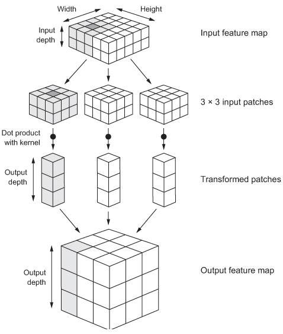

#### 1.1.1 卷积中关键参数   
- 卷积核的大小    
从输入中提取的图块的大小，通常是3×3或5×5

- 过滤器的数量    
输出特征图的深度

- 填充(padding)   
假设有6×6的特征图（36个方块），如果以3×3的卷积核进行滑动，最终输出的特征图的尺寸是4×4，也就是说比输入的尺寸小了一些。如果希望输入和输出的特征图空间维度相同，那么可以使用**填充**。   
填充的具体做法是在输入特征图的每一边添加适当数目的行和列，使得每个输入方块都能作为卷积窗口的中心。   
所以padding参数有两个取值，valid和same，valid表示不使用填充，same表示填充后输出和输入的维度相同。

- 步幅(stride)   
卷积时，两个连续窗口的距离是卷积的一个参数，步幅，默认值为1，可以使用步进卷积(strided convolution)，即步幅大于1的卷积。    
步幅为2意味着特征图的宽度和高度都被做了2倍下采样。虽然步进卷积对于一些模型可能有用，但在实践中很少使用。  
为了对特征图进行下采样，通常不使用步幅，而是使用池化(max-pooling)。

卷积的可视化图，
<table style="width:100%; table-layout:fixed; text-align: center;">
  <tr>
    <td>No padding, no strides</td>
    <td>Arbitrary padding, no strides</td>
    <td>Half padding, no strides</td>
    <td>Full padding, no strides</td>
  </tr>
  <tr>
    <td></td>
    <td></td>
    <td></td>
    <td></td>
  </tr>
  <tr>
    <td>No padding, strides</td>
    <td>Padding, strides</td>
    <td>Padding, strides (odd)</td>
  </tr>
  <tr>
    <td></td>
    <td></td>
    <td></td>
  </tr>
</table>

#### 1.1.2 卷积的性质  
- 模式的空间层次结构       
卷积神经网络可以学到模式的**空间层次结构(spatial hierarchies of patterns)**。往往开始的卷积层学习较小的局部模式（比如眼睛，嘴巴等），接下来的卷积层将学习组成上一层的特征模式，依次类推。这使得卷积神经网络可以有效地学习越来越复杂、抽象的视觉概念。（**视觉世界从根本上具有空间层次结构**）   

- 平移不变性    
全连接层从特征空间中学到的是全局模式，而**卷积层学到的局部模式**。如果学习到这个局部模式后，它可以在任何地方识别这个模式(**视觉世界从根本上具有平移不变性**)。这可以使得卷积神经网络可以高效地利用数据，使用较少的训练样本可以学到具有泛化能力的数据表示。

### 1.2 最大池化运算  
最大池化是从输入特征图中提取窗口，并输出每个通道的最大值。它的概念与卷积类似，不同的是最大池化使用硬编码的max张量运算对局部图块进行变换，而卷积则是使用学到的线性变换（卷积核）。    
从参数上看，卷积和最大池化的不同是最大池化通常使用2×2的窗口和步幅2，其目的是将图像下采样2倍，卷积则是使用3×3的窗口和步幅1。   

#### 1.2.1 为什么不删除最大池化层，保留较大的特征图？    
1）不利于学习特征的空间层级结构，如果去掉池化层，这样卷积神经网络从输入中提取的原始图像比例随着层数加深在减少，不足以相应任务的学习。（可以理解为感受到视野在逐步的减少，通过最大池化可以增大感受视野）
2）学习参数较多，最后一层参数在全连接后会很多。（可以理解为通过最大池化可以减少很大部分参数）

#### 1.2.2 使用最大池化的作用   
1）减少需要处理的元素的个数，加速网络的训练，防止过拟合   
2）通过让连续池化层，可以让观测窗口越来越大（即窗口覆盖原始输入的比例越来越大），从而引入空间过滤器的层级结构  

> 这恰好对应上面的那一个问题

#### 1.2.3 相较于平均池化，为什么最大池化更好
特征中往往编码了某种模式下或概念在特征图中的不同位置是否存在，而最大值相较于平均值能够给出更多的信息，**而平均值方法可能导致错过或淡化特征是否存在的信息**。   
合理的下采样策略是首先生成密集的特征图（无步进卷积），然后观察特征在每个小块上的最大激活，而不是查看输入的稀疏窗口（步进卷积）或者对输入图块取平均，这两种方式可能导致错过或者淡化重要特征。


## 2. CNN网络结构   
以**ImageNet**数据集的算法演变来总结CNN算法。大致有LeNet(1998),AlexNet(2012),ZFNet(2013),GoogleNet/Inception(2014),VGGNet(2014),ResNet(2015)。

### 2.1 LeNet(1998)
LeNet是卷积神经网络的祖师爷LeCun在1998年提出，用于解决手写数字识别的视觉任务。自那时起，CNN的最基本的架构就定下来了：卷积层、池化层、全连接层。


#### 2.1.1 LeNet网络架构
经典的LeNet-5结构图如下，
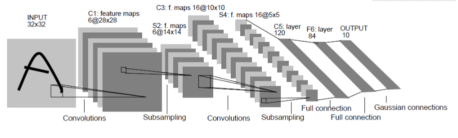

剖析：  
- 第一层，输入层（input），输入图像是单通道的32×32大小的图像，张量形状为(1, 32, 32)  

- 第二层，卷积层（conv1），卷积核尺寸为5×5，步幅(stride)为1，卷积核的数量为6，经过卷积核后的图像尺寸大小为(32-5+1)×(32-5+1)，该层输出的形状为(6, 28, 28)  
> Note: 第二层中，使用6个大小为5*5的卷积核，这部分参数为6×(5×5+1)=156，+1表示一个核有bias，总共有156×28×28=122304个连接，但是只需要学习156个参数，主要是通过权值共享实现

- 第三层，最大化池化层（pool1），池化核的大小为2×2，步幅为2，池化操作后，图像尺寸减半，变为14×14，该层输出后的形状为(6, 14, 14)，训练参数为6×(2×2+1)，连接数量为6×(2×2+1)×14×14   

- 第四层，卷积层（conv2），类似第二层，卷积核尺寸大小为5×5，步幅为1,卷积核数量为16,卷积后的图像大小为（14-5+1），该层输出后的形状为(16, 10, 10)
- 第五层，池化层（pool2），类似第三层，池化核尺寸大小为2×2，步幅为2,池化操作后，图像尺寸减半，变为5×5，该层的输出后的形状为(16, 5, 5)    

- 第六层，卷积层（conv3），卷积核的大小为5×5，步幅为1,卷积核数量为120,则输出后的形状为(120, 1, 1)
- 第七层，全连接层，84个神经元（对应7×12的比特图）
- 第八层，输出层，神经元数量为10（目标共有10个类别），然后经过`softmax`，最后输出概率。

#### 2.1.2 代码实现   

```python
def LeNet():
    model = Sequential()
    model.add(Conv2D(6,(5,5),strides=(1,1),input_shape=(32,32,1),padding='valid',activation='relu',kernel_initializer='uniform'))
    model.add(MaxPooling2D(pool_size=(2,2)))
    model.add(Conv2D(16,(5,5),strides=(1,1),padding='valid',activation='relu',kernel_initializer='uniform'))
    model.add(MaxPooling2D(pool_size=(2,2)))
    model.add(Conv2D(120, (5,5), strides=(1,1), padding='valid',activation='sigmoid')
    model.add(Flatten())
    model.add(Dense(500,activation='sigmoid'))
    model.add(Dense(10,activation='softmax'))
    return model
```
> Note: 上述代码copy网上代码，未实例验证，该工作后期补充  

#### 2.1.3 参考资源   
- [LeNet-5详解](https://cuijiahua.com/blog/2018/01/dl_3.html)


### 2.2 AlexNet(2012)
AlexNet在2012年ImageNet竞赛中以超过第二名10.9个百分点的绝对优势一举夺冠，从此深度学习和卷积神经网络名声鹊起，深度学习的研究如雨后春笋般出现，AlexNet的出现可谓是卷积神经网络的王者归来。

#### 2.2.1 AlexNet网络架构  
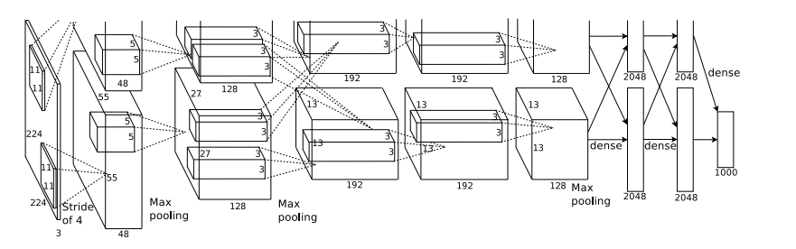
Alex网络结构整体如上图所示，前五层为卷积层，后面三层为全连接层，最终输出的1000类。 

#### 2.2.2 比较LeNet
相比较于LeNet，AlexNet的卷积神经网络总流程固定，只是网络结构还有一些训练技巧上做了很大改进，
主要的改进点：   
- **更深的网络**   
AlexNet共有5层卷积层和3个全连接层，均比LeNet要多   
- **数据增强**   
对原始图像做了随机裁剪，增加模型的泛化能力，避免过拟合   
- **使用Relu**   
使用Relu代替Sigmoid函数，加快收敛速度   
- **使用dropout**   
在网络中加入了dropout策略，dropout具体参考**算法篇/DeepLearning/深度学习基础/deep learning foundation.ipynb**
- **Local Response Normalization**    
局部响应归一层的基本思路是，假如这是网络的一块，比如是 13×13×256， LRN 要做的就是选取一个位置，比如说这样一个位置，从这个位置穿过整个通道，能得到 256 个数字，并进行归一化。进行局部响应归一化的动机是，对于这张 13×13 的图像中的每个位置来说，我们可能并不需要太多的高激活神经元。但是后来，很多研究者发现 LRN 起不到太大作用，因为并不重要，而且我们现在并不用 LRN 来训练网络。

#### 2.2.3 代码实现
```python
def AlexNet():
    model = Sequential()
    model.add(Conv2D(96,(11,11),strides=(4,4),input_shape=(227,227,3),padding='valid',activation='relu',kernel_initializer='uniform'))
    model.add(MaxPooling2D(pool_size=(3,3),strides=(2,2)))
    model.add(Conv2D(256,(5,5),strides=(1,1),padding='same',activation='relu',kernel_initializer='uniform'))
    model.add(MaxPooling2D(pool_size=(3,3),strides=(2,2)))
    model.add(Conv2D(384,(3,3),strides=(1,1),padding='same',activation='relu',kernel_initializer='uniform'))
    model.add(Conv2D(384,(3,3),strides=(1,1),padding='same',activation='relu',kernel_initializer='uniform'))
    model.add(Conv2D(256,(3,3),strides=(1,1),padding='same',activation='relu',kernel_initializer='uniform'))
    model.add(MaxPooling2D(pool_size=(3,3),strides=(2,2)))
    model.add(Flatten())
    model.add(Dense(4096,activation='relu'))
    model.add(Dropout(0.5))
    model.add(Dense(4096,activation='relu'))
    model.add(Dropout(0.5))
    model.add(Dense(1000,activation='softmax'))
    return model
```

### 2.3 ZFNet(2013)
ZFNet是2013ImageNet分类任务的冠军，其网络结构基本和AlexNet一样，不同的是参数做了调整，性能较AlexNet提升了不少。ZF-Net只是将AlexNet第一层卷积核由11变成7，步长由4变为2，第3，4，5卷积层转变为384，384，256。这一年的ImageNet还是比较平静的一届，其冠军ZF-Net的名堂也没其他届的经典网络架构响亮。

#### 2.3.1 ZFNet网络架构
参考AlexNet网络架构图

#### 2.3.2 代码实现
```python
def ZF_Net():
    model = Sequential()  
    model.add(Conv2D(96,(7,7),strides=(2,2),input_shape=(224,224,3),padding='valid',activation='relu',kernel_initializer='uniform'))  
    model.add(MaxPooling2D(pool_size=(3,3),strides=(2,2)))  
    model.add(Conv2D(256,(5,5),strides=(2,2),padding='same',activation='relu',kernel_initializer='uniform'))  
    model.add(MaxPooling2D(pool_size=(3,3),strides=(2,2)))  
    model.add(Conv2D(384,(3,3),strides=(1,1),padding='same',activation='relu',kernel_initializer='uniform'))  
    model.add(Conv2D(384,(3,3),strides=(1,1),padding='same',activation='relu',kernel_initializer='uniform'))  
    model.add(Conv2D(256,(3,3),strides=(1,1),padding='same',activation='relu',kernel_initializer='uniform'))  
    model.add(MaxPooling2D(pool_size=(3,3),strides=(2,2)))  
    model.add(Flatten())  
    model.add(Dense(4096,activation='relu'))  
    model.add(Dropout(0.5))  
    model.add(Dense(4096,activation='relu'))  
    model.add(Dropout(0.5))  
    model.add(Dense(1000,activation='softmax'))  
    return model
```

### 2.4 VGGNet(2014)
VGG-Nets是由牛津大学VGG（Visual Geometry Group）提出，是2014年ImageNet竞赛定位任务的第一名和分类任务的第二名的中的基础网络。VGG可以看成是加深版的AlexNet，均是conv layer+FC layer的组合，从图像中提取CNN特征，VGGNet是首选的网络结构，在许多迁移学习任务中也有很好的表现。

#### 2.4.1 VGGNet网络架构   
下图是VGGNet的网络结构的ABCDE过程，
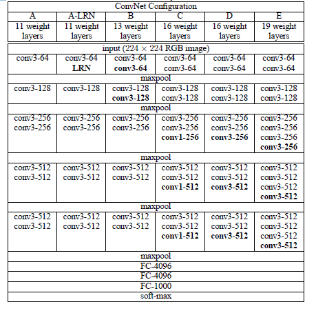

为了解决初始化（权重初始化）的问题，VGG采用一种pre-training的方式，也就是说训练时首先训练A网络，其参数较少网络可以快速收敛，然后使用此时网络的参数作为BCDE网络的初始化权重。  
在D网络中有16个weight layer（conv和fc层数，不包括max-pool层），此时网络称之为VGG-16，E网络称之为VGG-19。   
下图是VGG-16的网络架构图，
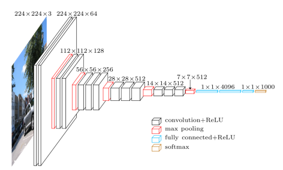

#### 2.4.2 VGG创新点 
- **网络权重的初始化**   
如上面提到的，首先训练A网络，然后利用A网络的参数作为初始化的权重。   

- **卷积层更小的filter尺寸和间隔**  
VGGNet使用的卷积核尺寸为1×1和3×3两种，步幅均为1。
  - 3×3的卷积核的优点   
    多个3×3的卷基层比一个大尺寸filter卷基层有更多的非线性，使得判决函数更加具有判决性
  - 1×1卷积核的优点   
    作用是在不影响输入输出维数的情况下，对输入进行线性形变，然后通过Relu进行非线性处理，增加网络的非线性表达能力。
  
- **三个连续的3×3卷积层**   
两个连续的3×3卷积相当于原来5×5的感受野，三个3×3相当于一个7×7。使用三个的主要优势在于，   
   - 使用三个卷积层将有三个relu，而不是一个，网络会有更多非线性能力，使决策函数更有判别性   
   - 减少参数。比如输入输出都是C个通道，使用3个3×3的conv需要（3×3×3×C×C）=27×C×C，使用7×7的1个conv则需要7×7×C×C=49×C×C。这可以看做是对7×7施加一个正则化，使它分解成3个3×3的卷积。
  
#### 2.4.3 VGG作者的三个结论

- LRN层作用不大    
- 越深的网络效果越好   
- 1×1的卷积也是有效的，但是没有3×3的卷积好，大一些的卷积核可以学习更大的空间特征。

#### 2.4.4 代码实现  
VGG-16的代码实现   
```python
def VGG_16():   
    model = Sequential()
    model.add(Conv2D(64,(3,3),strides=(1,1),input_shape=(224,224,3),padding='same',activation='relu',kernel_initializer='uniform'))
    model.add(Conv2D(64,(3,3),strides=(1,1),padding='same',activation='relu',kernel_initializer='uniform'))
    model.add(MaxPooling2D(pool_size=(2,2)))
    
    model.add(Conv2D(128,(3,2),strides=(1,1),padding='same',activation='relu',kernel_initializer='uniform'))
    model.add(Conv2D(128,(3,3),strides=(1,1),padding='same',activation='relu',kernel_initializer='uniform'))
    model.add(MaxPooling2D(pool_size=(2,2)))
    
    model.add(Conv2D(256,(3,3),strides=(1,1),padding='same',activation='relu',kernel_initializer='uniform'))
    model.add(Conv2D(256,(3,3),strides=(1,1),padding='same',activation='relu',kernel_initializer='uniform'))
    model.add(Conv2D(256,(3,3),strides=(1,1),padding='same',activation='relu',kernel_initializer='uniform'))
    model.add(MaxPooling2D(pool_size=(2,2)))
    
    model.add(Conv2D(512,(3,3),strides=(1,1),padding='same',activation='relu',kernel_initializer='uniform'))
    model.add(Conv2D(512,(3,3),strides=(1,1),padding='same',activation='relu',kernel_initializer='uniform'))
    model.add(Conv2D(512,(3,3),strides=(1,1),padding='same',activation='relu',kernel_initializer='uniform'))
    model.add(MaxPooling2D(pool_size=(2,2)))
    
    model.add(Conv2D(512,(3,3),strides=(1,1),padding='same',activation='relu',kernel_initializer='uniform'))
    model.add(Conv2D(512,(3,3),strides=(1,1),padding='same',activation='relu',kernel_initializer='uniform'))
    model.add(Conv2D(512,(3,3),strides=(1,1),padding='same',activation='relu',kernel_initializer='uniform'))
    model.add(MaxPooling2D(pool_size=(2,2)))
    
    model.add(Flatten())
    model.add(Dense(4096,activation='relu'))
    model.add(Dropout(0.5))
    model.add(Dense(4096,activation='relu'))
    model.add(Dropout(0.5))
    model.add(Dense(1000,activation='softmax'))
    
    return model
```

### 2.5 GoogleNet(2014)
GoogLeNet在2014的ImageNet分类任务上击败了VGGNet夺得冠军，其实力肯定是非常深厚的，GoogLeNet跟AlexNet，VGGNet这种单纯依靠加深网络结构进而改进网络性能的思路不一样，它另辟幽径，在加深网络的同时（22层），也在网络结构上做了创新，引入Inception结构代替了单纯的卷积+激活的传统操作（这思路最早由Network in Network提出）。GoogLeNet进一步把对卷积神经网络的研究推上新的高度。

#### 2.5.1 GoogleNet网络结构   

下面是googleNet的网络架构图，
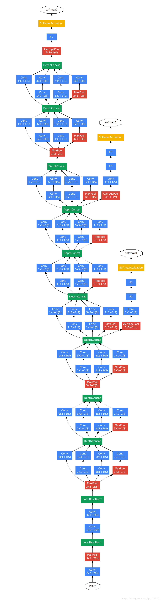

#### 2.5.2 GoogleNet创新点  
googleNet相较于ZFNet和AlexNet等传统卷积网络来说，做了非常大的改进，不再是单纯的网络加深，而是在网络结构上做了很大的创新。

- Inception Module
最大创新就是设计了Inception，Inception图如下，
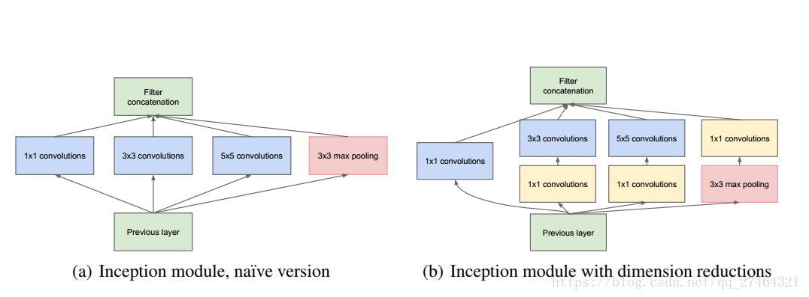

    - Inception初期版本   
      上图中，左边是初期版本，这里使用三个不同的patch size，1X1 3X3 5X5，主要是为了避免patch alignment问题和减少计算量。比如对三个patch分别使用padding=0,1,2进行卷积就可以让卷积后的输出具有相同的尺寸，而patch size较小的时候对应的参数相应也小一些，比如1x1=1,3x3=9,5x5=25，再往后参数数量的增长速度就更快了。由于池化层在卷积神经网络中的作用往往都是起关键作用的，所以Inception model里也加入了一个池化层。但这种设计不是必须的，只是为了更方便。  
      但是初级的版本有个很大的缺点就是参数量和计算量会很大，而且将三个卷积层和一个池化层的输出拼接后的feature map数量会变得很大，随着网络层数的增加，模型会变得很复杂，变得难以训练。
    - Inception改进版本  
      上图中，右边是改进版本，改进版本主要是在初期版本中加入了1×1的卷积层，依次来降低维度，减少计算量。   

以GoogleNet的3a模块为例，输入的feature map是28×28×192，3a模块中1×1卷积通道为64，3×3卷积通道为128,5×5卷积通道为32，如果是左图结构，那么卷积核参数为(1×1×192×64)+(3×3×192×128)+(5×5×192×32)，而右图对3×3和5×5卷积层前分别加入了通道数为96和16的1×1卷积层，这样卷积核参数就变成了1×1×192×64+(1×1×192×96+3×3×96×128)+(1×1×192×16+5×5×16×32)，参数大约减少到原来的三分之一。（可以理解为通过1×1卷积和较小通道数来折中一下，达到减少参数的目的，隐式地增加了模型的非线性表达能力）
GoogleNet利用1×1的卷积降维后，得到了更为紧凑的网络结构，虽然总共有22层，但是参数数量却只是8层的AlexNet的十二分之一（当然也有很大一部分原因是去掉了全连接层）。 

> **Note:**
正如前面在对比AlexNet和VGGNets的结构时提到的，对于卷积核大小的选择是需要经验和大量实验才可以确定的，到底是选3×3呢，还是5×5或者7×7？这个问题并没有一种明确的思路。Inception做法是跳出直线加深网络层数的思路，通过增加“宽度”的方式增加网络复杂度，避免陷入卷积核选择的陷阱，让程序自己学习如何选择卷积核。

- 中间层辅助Loss单元   
为了避免梯度消失，另外，可以提高较低阶段分类器的判别力，这是在提供正则化的同时克服梯度消失问题。GoogleNet在不同的深度地方设置了三个Loss单元，在参数更新时，中间层的两个Loss单元乘以0.3和最后的Loss单元相加作为最终的损失，以此来训练网络，预测时可以不管这两个Loss单元。

- 全连接层变为average-pooling    
将后面的全连接层全部替换为简单的全局平均pooling，在最后参数会变的更少，可以加快训练过程。


#### 2.5.3 googleNet的其它版本   
- Inception-v2
Inception-v2是在第一代的GoogleNet基础上加入了批标准化（Batch Normalization）技术。其具体做法是，对mini-batch中所有的信号量进行统一的归一化，使得一个批次中所有的信号量符合均值为0，方差为1的高斯分布。

- Inception-v3   
Inception-v3在之前的版本上又有提高。其最核心的思想是将卷积核操作继续分解成更小的卷积核。首先，比如，借鉴VGGNets的思路，5×5的卷积可以由连续2层3×3卷积所替代，这样既减少了参数数量，也进一步加快了计算速度。这样的好处是，在经过这样的转换后，不但参数数量进一步减少，计算速度更快，而且网络的深度也加深了，增加了非线性表达能力。


#### 2.5.4 代码实现   

```python
def Conv2d_BN(x, nb_filter,kernel_size, padding='same',strides=(1,1),name=None):
    if name is not None:
        bn_name = name + '_bn'
        conv_name = name + '_conv'
    else:
        bn_name = None
        conv_name = None

    x = Conv2D(nb_filter,kernel_size,padding=padding,strides=strides,activation='relu',name=conv_name)(x)
    x = BatchNormalization(axis=3,name=bn_name)(x)
    return x

def Inception(x,nb_filter):
    branch1x1 = Conv2d_BN(x,nb_filter,(1,1), padding='same',strides=(1,1),name=None)

    branch3x3 = Conv2d_BN(x,nb_filter,(1,1), padding='same',strides=(1,1),name=None)
    branch3x3 = Conv2d_BN(branch3x3,nb_filter,(3,3), padding='same',strides=(1,1),name=None)

    branch5x5 = Conv2d_BN(x,nb_filter,(1,1), padding='same',strides=(1,1),name=None)
    branch5x5 = Conv2d_BN(branch5x5,nb_filter,(1,1), padding='same',strides=(1,1),name=None)

    branchpool = MaxPooling2D(pool_size=(3,3),strides=(1,1),padding='same')(x)
    branchpool = Conv2d_BN(branchpool,nb_filter,(1,1),padding='same',strides=(1,1),name=None)

    x = concatenate([branch1x1,branch3x3,branch5x5,branchpool],axis=3)

    return x

def GoogLeNet():
    inpt = Input(shape=(224,224,3))
    #padding = 'same'，填充为(步长-1）/2,还可以用ZeroPadding2D((3,3))
    x = Conv2d_BN(inpt,64,(7,7),strides=(2,2),padding='same')
    x = MaxPooling2D(pool_size=(3,3),strides=(2,2),padding='same')(x)
    x = Conv2d_BN(x,192,(3,3),strides=(1,1),padding='same')
    x = MaxPooling2D(pool_size=(3,3),strides=(2,2),padding='same')(x)
    x = Inception(x,64)#256
    x = Inception(x,120)#480
    x = MaxPooling2D(pool_size=(3,3),strides=(2,2),padding='same')(x)
    x = Inception(x,128)#512  Loss_0(avg_pool-->1×1conv-->fc-->fc-->softmax)
    x = Inception(x,128)
    x = Inception(x,128)
    x = Inception(x,132)#528  Loss_1(avg_pool-->1×1conv-->fc-->fc-->softmax)
    x = Inception(x,208)#832  
    x = MaxPooling2D(pool_size=(3,3),strides=(2,2),padding='same')(x)
    x = Inception(x,208)
    x = Inception(x,256)#1024
    x = AveragePooling2D(pool_size=(7,7),strides=(7,7),padding='same')(x)
    x = Dropout(0.4)(x)
    x = Dense(1000,activation='relu')(x)
    x = Dense(1000,activation='softmax')(x)
    model = Model(inpt,x,name='inception')
    return model
```

#### 2.5.5 参考资源  
[GoogLeNet](https://blog.csdn.net/qq_27464321/article/details/81254920)   
[GoogleNet的个人理解](https://blog.csdn.net/sunlianglong/article/details/79956734)   
[GoogLeNet学习心得](https://www.cnblogs.com/Allen-rg/p/5833919.html)   


### 2.6 ResNet(2015)  
ResNet（Residual Neural Network）由微软研究院的Kaiming He等四名华人提出，通过使用ResNet Unit成功训练出了152层的神经网络，并在ILSVRC2015比赛中取得冠军，在top5上的错误率为3.57%，同时参数量比VGGNet低，效果非常突出。ResNet的结构可以极快的加速神经网络的训练，模型的准确率也有比较大的提升。同时ResNet的推广性非常好，甚至可以直接用到InceptionNet网络中。

#### 2.6.1 过深的网络带来的问题  
- 梯度消失   
梯度是从后向前传播的，增加网络深度后，比较靠前的层梯度会很小。这意味着这些层基本上学习停滞了，梯度很小，意味着参数的变化很缓慢，从而使得学习过程停滞，直到梯度变得足够大，而这通常需要指数量级的时间。

- 网络退化   
当网络更深时意味着参数空间更大，优化问题变得更难，因此简单地去增加网络深度反而出现更高的训练误差，深层网络虽然收敛了，但网络却开始退化了（随着网络深度增加，矩阵的奇异值变得越来越集中，而小部分出现频率很低的奇异值变得任意的大），即增加网络层数却导致更大的误差。

比如下图，一个56层的网络的性能却不如20层的性能好，这不是因为过拟合（训练集训练误差依然很高），这就是烦人的退化问题。**残差网络ResNet设计一种残差模块可以很大程度上避免退化，从而可以训练更深的网络。**


#### 2.6.2 残差模块
残差模块如下图所示，
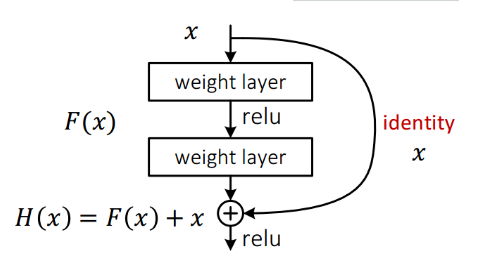
在上图中，数据经过了两条路线，一条是常规路线，另一条是捷径(shortcut)。我们把网络中的一个模块的输入和输出关系看作是y=H(x)，那么直接通过梯度方法求H(x)就会遇到上面提到的退化问题，如果使用了这种带shortcut的结构，那么可变参数部分的优化目标就不再是H(x)，若用F(x)来代表需要优化的部分的话，则H(x)=F(x)+x，也就是F(x)=H(x)-x。因为在单位映射的假设中y=x就相当于观测值，所以F(x)就对应着残差，因而叫残差网络。为啥要这样做，因为作者认为学习残差F(X)比直接学习H(X)简单！设想下，现在根据我们只需要去学习输入和输出的差值就可以了，绝对量变为相对量（H（x）-x 就是输出相对于输入变化了多少），优化起来简单很多。   

考虑到x的维度与F(X)维度可能不匹配情况，需进行维度匹配。这里论文中采用两种方法解决这一问题(其实是三种，但通过实验发现第三种方法会使performance急剧下降，故不采用):

- zero_padding:对恒等层进行0填充的方式将维度补充完整。这种方法不会增加额外的参数   
- projection:在恒等层采用1x1的卷积核来增加维度。这种方法会增加额外的参数    

下图展示了两种形态的残差模块，左图是常规残差模块，有两个3×3卷积核卷积核组成，但是随着网络进一步加深，这种残差结构在实践中并不是十分有效。针对这问题，右图的“瓶颈残差模块”（bottleneck residual block）可以有更好的效果，它依次由1×1、3×3、1×1这三个卷积层堆积而成，这里的1×1的卷积能够起降维或升维的作用，从而令3×3的卷积可以在相对较低维度的输入上进行，以达到提高计算效率的目的。
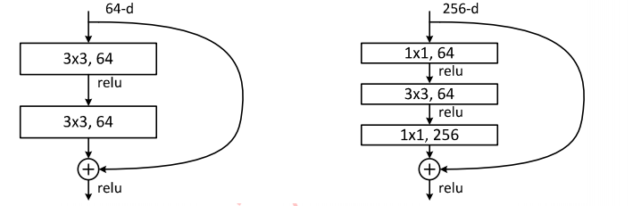

#### 2.6.3 ResNet创新点   
- 极深的网络层数   
网络层数极深，在ImageNet获奖的层数中，层数为152，而且其参数整体比VGG少    

- 引入残差单元   
残差单元的引入解决的网络退化的问题，更重要的是增加了网络学习的精度。  

#### 2.6.4 代码实现   
下面是ResNet-50的实现   
```python
def Conv2d_BN(x, nb_filter,kernel_size, strides=(1,1), padding='same',name=None):
    if name is not None:
        bn_name = name + '_bn'
        conv_name = name + '_conv'
    else:
        bn_name = None
        conv_name = None

    x = Conv2D(nb_filter,kernel_size,padding=padding,strides=strides,activation='relu',name=conv_name)(x)
    x = BatchNormalization(axis=3,name=bn_name)(x)
    return x

def Conv_Block(inpt,nb_filter,kernel_size,strides=(1,1), with_conv_shortcut=False):
    x = Conv2d_BN(inpt,nb_filter=nb_filter[0],kernel_size=(1,1),strides=strides,padding='same')
    x = Conv2d_BN(x, nb_filter=nb_filter[1], kernel_size=(3,3), padding='same')
    x = Conv2d_BN(x, nb_filter=nb_filter[2], kernel_size=(1,1), padding='same')
    if with_conv_shortcut:
        shortcut = Conv2d_BN(inpt,nb_filter=nb_filter[2],strides=strides,kernel_size=kernel_size)
        x = add([x,shortcut])
        return x
    else:
        x = add([x,inpt])
        return x

def ResNet50():
    inpt = Input(shape=(224,224,3))
    x = ZeroPadding2D((3,3))(inpt)
    x = Conv2d_BN(x,nb_filter=64,kernel_size=(7,7),strides=(2,2),padding='valid')
    x = MaxPooling2D(pool_size=(3,3),strides=(2,2),padding='same')(x)
    
    x = Conv_Block(x,nb_filter=[64,64,256],kernel_size=(3,3),strides=(1,1),with_conv_shortcut=True)
    x = Conv_Block(x,nb_filter=[64,64,256],kernel_size=(3,3))
    x = Conv_Block(x,nb_filter=[64,64,256],kernel_size=(3,3))
    
    x = Conv_Block(x,nb_filter=[128,128,512],kernel_size=(3,3),strides=(2,2),with_conv_shortcut=True)
    x = Conv_Block(x,nb_filter=[128,128,512],kernel_size=(3,3))
    x = Conv_Block(x,nb_filter=[128,128,512],kernel_size=(3,3))
    x = Conv_Block(x,nb_filter=[128,128,512],kernel_size=(3,3))
    
    x = Conv_Block(x,nb_filter=[256,256,1024],kernel_size=(3,3),strides=(2,2),with_conv_shortcut=True)
    x = Conv_Block(x,nb_filter=[256,256,1024],kernel_size=(3,3))
    x = Conv_Block(x,nb_filter=[256,256,1024],kernel_size=(3,3))
    x = Conv_Block(x,nb_filter=[256,256,1024],kernel_size=(3,3))
    x = Conv_Block(x,nb_filter=[256,256,1024],kernel_size=(3,3))
    x = Conv_Block(x,nb_filter=[256,256,1024],kernel_size=(3,3))
    
    x = Conv_Block(x,nb_filter=[512,512,2048],kernel_size=(3,3),strides=(2,2),with_conv_shortcut=True)
    x = Conv_Block(x,nb_filter=[512,512,2048],kernel_size=(3,3))
    x = Conv_Block(x,nb_filter=[512,512,2048],kernel_size=(3,3))
    x = AveragePooling2D(pool_size=(7,7))(x)
    x = Flatten()(x)
    x = Dense(1000,activation='softmax')(x)
    
    model = Model(inputs=inpt,outputs=x)
    return model
```

### 2.7 DenseNet(2017) 
DenseNet模型，它的基本思路与ResNet一致，但是它建立的是前面所有层与后面层的密集连接（dense connection），它的名称也是由此而来。DenseNet的另一大特色是通过特征在channel上的连接来实现**特征重用**（feature reuse）。这些特点让DenseNet在参数和计算成本更少的情形下实现比ResNet更优的性能，DenseNet也因此斩获CVPR 2017的最佳论文奖。
#### 2.7.1 DenseBlock模块  
结构如下所示， 
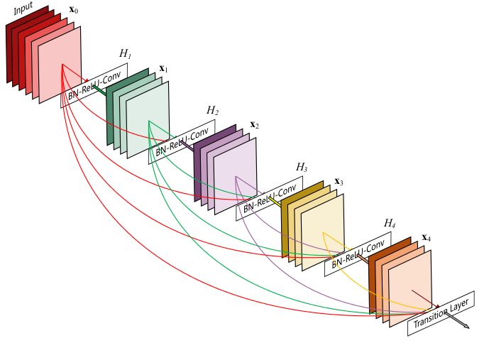 
上图中是一个dense block的示意图，一个block里面的结构如下，与ResNet中的BottleNeck基本一致：BN-ReLU-Conv(1×1)-BN-ReLU-Conv(3×3)，该结构中，网络每一层的输入都是前面所有层输出的并集，而该层所学习的特征图也会被直接传给其后面所有层作为输入。    
一个DenseNet则由多个这种block组成。每个DenseBlock的之间层称为transition layers，由BN−>Conv(1×1)−>averagePooling(2×2)组成。   

#### 2.7.2 密集连接会不会带来冗余？  
答案是不会。密集连接这个词给人的第一感觉就是极大的增加了网络的参数量和计算量。但实际上 DenseNet 比其他网络效率更高，其关键就在于网络每层计算量的减少以及特征的重复利用。DenseNet则是让l层的输入直接影响到之后的所有层，它的输出为：xl=Hl([X0,X1,…,xl−1])，其中[x0,x1,...,xl−1]就是将之前的feature map以通道的维度进行合并。并且由于每一层都包含之前所有层的输出信息，因此其只需要很少的特征图就够了，这也是为什么DneseNet的参数量较其他模型大大减少的原因。这种dense connection相当于每一层都直接连接input和loss，因此就可以减轻梯度消失现象，可以加深网络。需要明确一点，dense connectivity 仅仅是在一个dense block里的，不同dense block 之间是没有dense connectivity的，比如下图所示，
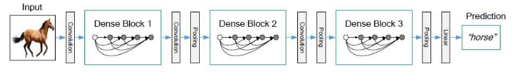

#### 2.7.3 DenseNet创新点   
- 设计了密集连接的方式    
**极大化了ResNet网络的优点**，缓解梯度消失的问题   

- 特征复用   
通过密集连接的方式，将之前的feature map以通道的维度进行合并，这样做可以极大减少模型的参数量   

#### 2.7.4 代码实现   
```python
def conv_block(x, stage, branch, nb_filter, dropout_rate=None, weight_decay=1e-4):
    '''Apply BatchNorm, Relu, bottleneck 1x1 Conv2D, 3x3 Conv2D, and option dropout
        # Arguments
            x: input tensor 
            stage: index for dense block
            branch: layer index within each dense block
            nb_filter: number of filters
            dropout_rate: dropout rate
            weight_decay: weight decay factor
    '''
    eps = 1.1e-5
    conv_name_base = 'conv' + str(stage) + '_' + str(branch)
    relu_name_base = 'relu' + str(stage) + '_' + str(branch)

    # 1x1 Convolution (Bottleneck layer)
    inter_channel = nb_filter * 4  
    x = BatchNormalization(epsilon=eps, axis=concat_axis, name=conv_name_base+'_x1_bn')(x)
    x = Scale(axis=concat_axis, name=conv_name_base+'_x1_scale')(x)
    x = Activation('relu', name=relu_name_base+'_x1')(x)
    x = Convolution2D(inter_channel, 1, 1, name=conv_name_base+'_x1', bias=False)(x)

    if dropout_rate:
        x = Dropout(dropout_rate)(x)

    # 3x3 Convolution
    x = BatchNormalization(epsilon=eps, axis=concat_axis, name=conv_name_base+'_x2_bn')(x)
    x = Scale(axis=concat_axis, name=conv_name_base+'_x2_scale')(x)
    x = Activation('relu', name=relu_name_base+'_x2')(x)
    x = ZeroPadding2D((1, 1), name=conv_name_base+'_x2_zeropadding')(x)
    x = Convolution2D(nb_filter, 3, 3, name=conv_name_base+'_x2', bias=False)(x)

    if dropout_rate:
        x = Dropout(dropout_rate)(x)

    return x

def dense_block(x, stage, nb_layers, nb_filter, growth_rate, dropout_rate=None, weight_decay=1e-4, grow_nb_filters=True):
    ''' Build a dense_block where the output of each conv_block is fed to subsequent ones
        # Arguments
            x: input tensor
            stage: index for dense block
            nb_layers: the number of layers of conv_block to append to the model.
            nb_filter: number of filters
            growth_rate: growth rate
            dropout_rate: dropout rate
            weight_decay: weight decay factor
            grow_nb_filters: flag to decide to allow number of filters to grow
    '''

    eps = 1.1e-5
    concat_feat = x

    for i in range(nb_layers):
        branch = i+1
        x = conv_block(concat_feat, stage, branch, growth_rate, dropout_rate, weight_decay)
        concat_feat = merge([concat_feat, x], mode='concat', concat_axis=concat_axis, name='concat_'+str(stage)+'_'+str(branch))

        if grow_nb_filters:
            nb_filter += growth_rate

    return concat_feat, nb_filter

def transition_block(x, stage, nb_filter, compression=1.0, dropout_rate=None, weight_decay=1E-4):
    ''' Apply BatchNorm, 1x1 Convolution, averagePooling, optional compression, dropout 
        # Arguments
            x: input tensor
            stage: index for dense block
            nb_filter: number of filters
            compression: calculated as 1 - reduction. Reduces the number of feature maps in the transition block.
            dropout_rate: dropout rate
            weight_decay: weight decay factor
    '''

    eps = 1.1e-5
    conv_name_base = 'conv' + str(stage) + '_blk'
    relu_name_base = 'relu' + str(stage) + '_blk'
    pool_name_base = 'pool' + str(stage) 

    x = BatchNormalization(epsilon=eps, axis=concat_axis, name=conv_name_base+'_bn')(x)
    x = Scale(axis=concat_axis, name=conv_name_base+'_scale')(x)
    x = Activation('relu', name=relu_name_base)(x)
    x = Convolution2D(int(nb_filter * compression), 1, 1, name=conv_name_base, bias=False)(x)

    if dropout_rate:
        x = Dropout(dropout_rate)(x)

    x = AveragePooling2D((2, 2), strides=(2, 2), name=pool_name_base)(x)

    return x

def DenseNet121(nb_dense_block=4, growth_rate=32, nb_filter=64, reduction=0.0, dropout_rate=0.0, weight_decay=1e-4, classes=1000, weights_path=None):
    '''Instantiate the DenseNet 121 architecture,
        # Arguments
            nb_dense_block: number of dense blocks to add to end
            growth_rate: number of filters to add per dense block
            nb_filter: initial number of filters
            reduction: reduction factor of transition blocks.
            dropout_rate: dropout rate
            weight_decay: weight decay factor
            classes: optional number of classes to classify images
            weights_path: path to pre-trained weights
        # Returns
            A Keras model instance.
    '''
    eps = 1.1e-5

    # compute compression factor
    compression = 1.0 - reduction

    # Handle Dimension Ordering for different backends
    global concat_axis
    if K.image_dim_ordering() == 'tf':
      concat_axis = 3
      img_input = Input(shape=(224, 224, 3), name='data')
    else:
      concat_axis = 1
      img_input = Input(shape=(3, 224, 224), name='data')

    # From architecture for ImageNet (Table 1 in the paper)
    nb_filter = 64
    nb_layers = [6,12,24,16] # For DenseNet-121

    # Initial convolution
    x = ZeroPadding2D((3, 3), name='conv1_zeropadding')(img_input)
    x = Convolution2D(nb_filter, 7, 7, subsample=(2, 2), name='conv1', bias=False)(x)
    x = BatchNormalization(epsilon=eps, axis=concat_axis, name='conv1_bn')(x)
    x = Scale(axis=concat_axis, name='conv1_scale')(x)
    x = Activation('relu', name='relu1')(x)
    x = ZeroPadding2D((1, 1), name='pool1_zeropadding')(x)
    x = MaxPooling2D((3, 3), strides=(2, 2), name='pool1')(x)

    # Add dense blocks
    for block_idx in range(nb_dense_block - 1):
        stage = block_idx+2
        x, nb_filter = dense_block(x, stage, nb_layers[block_idx], nb_filter, growth_rate, dropout_rate=dropout_rate, weight_decay=weight_decay)

        # Add transition_block
        x = transition_block(x, stage, nb_filter, compression=compression, dropout_rate=dropout_rate, weight_decay=weight_decay)
        nb_filter = int(nb_filter * compression)

    final_stage = stage + 1
    x, nb_filter = dense_block(x, final_stage, nb_layers[-1], nb_filter, growth_rate, dropout_rate=dropout_rate, weight_decay=weight_decay)

    x = BatchNormalization(epsilon=eps, axis=concat_axis, name='conv'+str(final_stage)+'_blk_bn')(x)
    x = Scale(axis=concat_axis, name='conv'+str(final_stage)+'_blk_scale')(x)
    x = Activation('relu', name='relu'+str(final_stage)+'_blk')(x)
    x = GlobalAveragePooling2D(name='pool'+str(final_stage))(x)

    x = Dense(classes, name='fc6')(x)
    x = Activation('softmax', name='prob')(x)

    model = Model(img_input, x, name='densenet')

    if weights_path is not None:
      model.load_weights(weights_path)

    return model
```

## 3. References

[1] [CNN Architectures](https://medium.com/@sidereal/cnns-architectures-lenet-alexnet-vgg-googlenet-resnet-and-more-666091488df5)   
[2] [CNN网络架构演进：从LeNet到DenseNet](https://www.cnblogs.com/skyfsm/p/8451834.html)   
[3] [深度学习--论文回顾：VGG-net](https://blog.csdn.net/u014513323/article/details/85053096)   
[4] [CNN经典模型汇总](https://blog.csdn.net/qq_26591517/article/details/79805884)   
[5] [深度神经网络-退化](https://baijiahao.baidu.com/s?id=1588911196895378943&wfr=spider&for=pc)   
[6] [DenseNet：比ResNet更优的CNN模型](https://www.imooc.com/article/36508)    