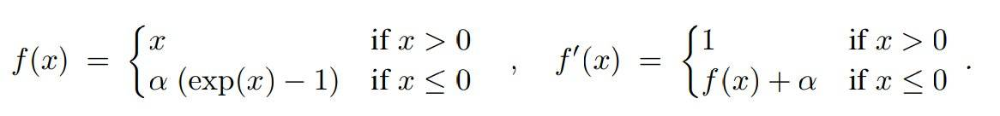
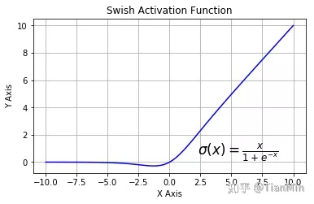
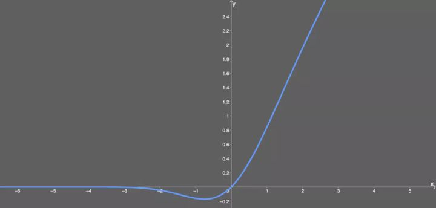

# 激活函数

在神经网络中，激活函数定义了一个神经元的输出，它将神经元的输入值映射到一个范围，比如说(0, 1)或者(-1, 1)等等，这取决于不同的激活函数。

## 1. 激活函数的作用
使用激活函数的目的是为了在网络中添加非线性元素，以此来增加网络的表示能力。假如不添加非线性元素，那么无论网络有多少层，其整体也是线性的，这样的网络显然表示能力较弱。

**神经网络的万能近似定理**认为主要神经网络具有至少一个非线性隐藏层，那么只要给予网络足够数量的隐藏单元，它就可以以任意的精度来近似**任何从一个有限维空间到另一个有限维空间的函数**

## 2. 激活函数的形象解释
参考知乎链接，[激活函数的形象解释](https://www.zhihu.com/question/22334626)

## 3. 常见的激活函数 

激活函数的发展经历了Sigmoid -> Tanh -> ReLU -> Leaky ReLU -> Maxout这样的过程，还有一个特殊的激活函数Softmax，因为它只会被用在网络中的最后一层，用来进行最后的分类和归一化。

### 3.1 sigmoid

函数公式为$\sigma(z) = \frac{1}{1+e^{-z}}, z \in R, \sigma(z) \in (0, 1)$，其导数为$deri(\sigma(z))=\sigma(z)(1-\sigma(z))\in (0, 0.25]$

任意一个实数值将其“挤压”到0到1范围内，适合输出为概率的情况，目前较少采用sigmoid激活函数。

**存在问题：**

- 幂级运算相对耗时

- sigmoid函数在饱和区存在梯度消失

  当神经元的激活在接近0或1处时会饱和，在这些区域梯度几乎为0，这就会导致梯度消失，几乎就有没有信号通过神经传回上一层。

- sigmoid函数的输出不是零中心的，相对收敛速度变慢

  因为如果输入神经元的数据总是正数，那么关于$w$的梯度在反向传播的过程中，将会要么全部是正数，要么全部是负数，这将会导致梯度下降权重更新时出现z字型的下降。
  
  参考[此文章](https://liam.page/2018/04/17/zero-centered-active-function/)

### 3.2 tanh

函数公式为$tanh(z)=2\sigma(2z)-1,z \in R, tanh(z) \in (-1, 1)$

任意一个实数值映射到-1到1之间，其关于0点是中心对称的。

**存在问题：**

tanh解决了sigmoid的输出是不是零中心的问题，但仍然存在饱和问题。

> 为了防止饱和，现在主流的做法会在激活函数前多做一步batch normalization，尽可能保证每一层网络的输入具有均值较小的、零中心的分布。

### 3.3 relu

函数公式为$relu(x) = \max(0, x)$

相较于sigmoid和tanh函数，relu对于随机梯度下降的收敛有巨大的加速作用；sigmoid和tanh在求导时含有指数运算，而ReLU求导几乎不存在任何计算量。

**存在问题：**

ReLU单元比较脆弱并且可能“死掉”，而且是不可逆的，因此导致了数据多样化的丢失。通过合理设置学习率，会降低神经元“死掉”的概率。

### 3.4 Leaky ReLU

函数公式为$f(x)= \max(\epsilon x, x)$ 

其中$\epsilon$是很小的负数梯度值，比如0.01，Leaky ReLU非线性函数图像如下图所示。这样做目的是使负轴信息不会全部丢失，解决了ReLU神经元“死掉”的问题。

> 基于Leak ReLU的改进版本：
>
> - PReLU
>
>   Parametric ReLU，即把$\epsilon$当做每个神经元中的一个参数，是可以通过梯度下降求解的。
>
> - RReLU
>
>   Randomized ReLU，即参数$\epsilon$每次是随机选择（比如从一个均匀分布中进行选择，然后在测试的过程中再进行修正，如果除以均匀分布的中值）

### 3.5 ELU

其中$\alpha$是一个可以调整的参数，它控制着Elue的负部分在何时达到饱和。

存在问题：

存在指数运算。

核心的优点：

相比ReLU，ELU可以取到负值，这让单元激活均值可以更接近0，**加快了收敛速度**，类似于Batch Normalization的效果但是只需要更低的计算复杂度。虽然LReLU和PReLU都也有负值，但是它们不保证在不激活状态下（就是在输入为负的状态下）对噪声鲁棒。反观ELU在输入取较小值时具有软饱和的特性，**提升了对噪声的鲁棒性**。

### 3.6 Maxout

函数公式为$f(x) = \max(w_1x+b_1, w_2x+b_2)$ 

maxout是对ReLU和leaky ReLU的一般化归纳。

**存在问题：**

每个神经元的参数double，这就导致整体参数的数量激增。

### 3.7 SoftPlus

$$
\begin{cases}
f(x) &= \ln(1+e^x) \\
deri(f(x)) &= \ln(1+e^{-x})
\end{cases}
$$

作为 ReLU 的一个不错的替代选择，SoftPlus 能够返回任何大于 0 的值。与 ReLU 不同，SoftPlus 的导数是连续的、非零的，无处不在，从而防止出现dead神经元。

**存在问题**：

SoftPlus 另一个不同于 ReLU 的地方在于其不对称性，不以零为中心，类似sigmoid；

由于导数常常小于 1，也可能出现梯度消失的问题。

> 注意区别log loss的函数是$\log(1 + e^{-z})$

### 3.8 ReLU和Sigmoid比较
1. 避免梯度消失（相对宽阔的兴奋边界）
    - sigmoid函数在输入取绝对值非常大的正值或负值时会出现饱和现象——在图像上表现为变得很平，此时函数会对输入的微小变化不敏感——从而造成梯度消失；   
    - ReLU 的导数始终是一个常数——负半区为 0，正半区为 1——所以不会发生梯度消失现象   
2. 减缓过拟合（稀疏的激活性）  
ReLU 在负半区的输出为0，一旦神经元的激活值进入负半区，那么该激活值就不会产生梯度/不会被训练，造成了网络的稀疏性，这有助于减少参数的相互依赖，缓解过拟合问题的发生
3. 加速计算  
ReLU求导不涉及浮点数计算，故计算过程中，可以加速计算。

### 3.9 Swish

该函数又叫作自门控激活函数，它近期由谷歌的研究者发布，数学公式为：
$$
f(x) = \frac{x}{1+e^{-x}}
$$
函数图像如下：

根据上图，我们可以观察到在 x 轴的负区域曲线的形状与 ReLU 激活函数不同，因此，Swish 激活函数的输出可能下降，即使在输入值增大的情况下。大多数激活函数是单调的，即输入值增大的情况下，输出值不可能下降。而 Swish 函数为 0 时具备单侧有界（one-sided boundedness）的特性，它是平滑、非单调的。

### 3.10 Gelu

高斯误差线性单元激活函数在最近的 Transformer 模型（谷歌的 BERT 和 OpenAI 的 GPT-2）中得到了应用。GELU 的论文来自 2016 年，但直到最近才引起关注。这种激活函数的形式为：
$$
f(x) = 0.5x(1+tanh(\sqrt{\frac{2}{\pi}}(x+0.044715x^3))
$$
函数图像如下：

优点：

- 似乎是 NLP 领域的当前最佳；尤其在 Transformer 模型中表现最好；
- 能避免梯度消失问题。

## 4. 如何选择激活函数

1. 除非在二分类问题中，否则请小心使用sigmoid函数。
2. 可以试试 tanh，不过大多数情况下它的效果会比不上 ReLU 和 Maxout。
3. 如果你不知道应该使用哪个激活函数， 那么请优先选择Relu。
4. 如果你使用了Relu， 需要注意一下Dead Relu问题， 此时你需要仔细选择 Learning rate， 避免出现大的梯度从而导致过多的神经元 “Dead” 。
5. 如果发生了Dead Relu问题， 可以尝试一下**leaky ReLU，ELU**等Relu变体， 说不定会有惊喜。