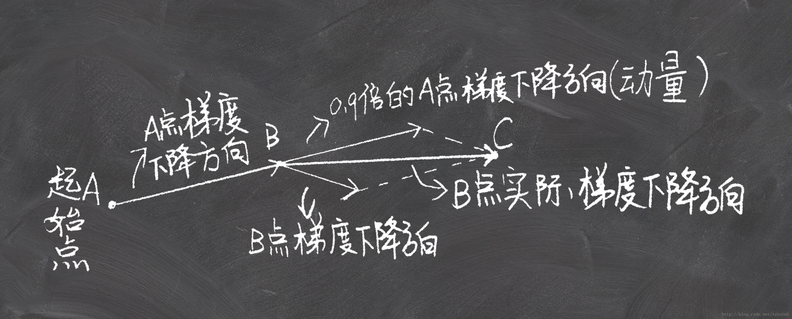
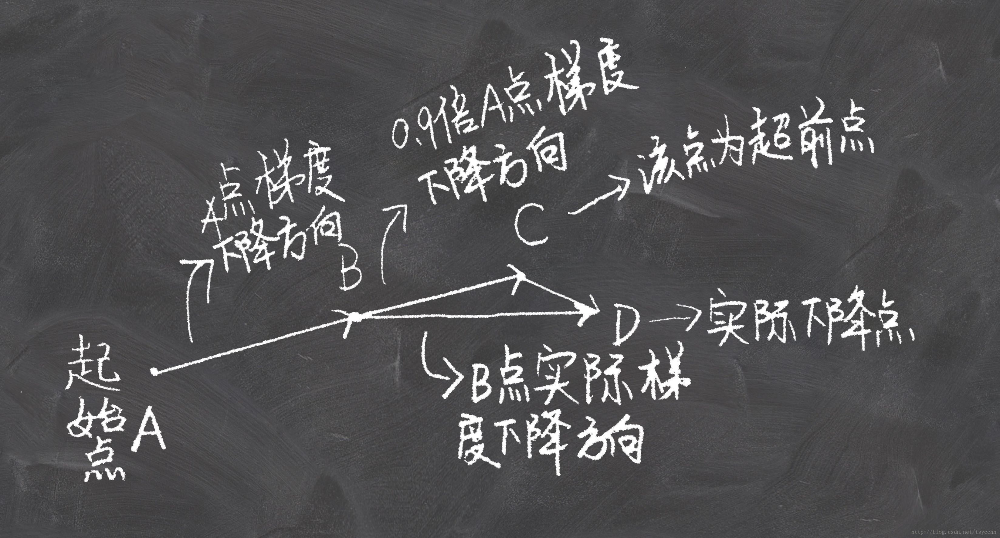
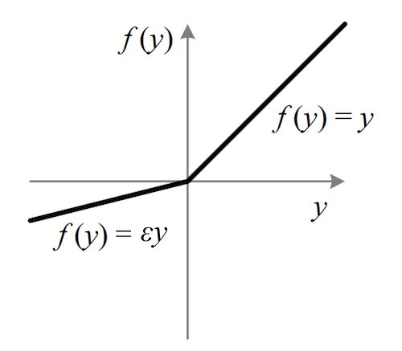

# 深度学习基础

## 1. Data Representation

### 1.1 张量介绍

一般来说，当前所有机器学习系统使用**张量**(tensor)作为数据结构，它是一个数据容器，包含的数据几乎总是数值类型。矩阵是二维张量，它是矩阵向任意维度的推广，张量的维度(dimension)叫做轴(axis)。

- 标量(`0D`张量)   
仅包含一个数字的张量叫做标量(scalar)，也称之为标量张量、零维张量

- 向量(`1D`张量)
  数字组成的数组叫作向量(vector)或者一维张量，如下，

  ```python
  import numpy as np
  
  x = np.array([1, 3, 5, 7])
  print("1D tensor:", x)
  print("1D axis: ", x.ndim)
  
  1D tensor: [1 3 5 7]
  1D axis:  1
  ```
  
- 矩阵(`2D`张量)

  向量组成的数组叫做矩阵(matrix)或者二维张量，如下，

  ```python
  import numpy as np
  
  x = np.random.randint(10, size=(2, 3))
  print("2D tensor: \n", x)
  print("2D axis: ", x.ndim)
  
  2D tensor: 
   [[2 7 4]
   [1 7 2]]
  2D axis:  2
  ```

- `3D`张量

  将多个矩阵组成一个数组便可以得到一个3D张量，如下，

  ```python
  import numpy as np
  
  x = np.random.randint(10, size=(2, 3, 5))
  print("3D tensor: \n", x)
  print("3D axis: ", x.ndim)
  
  3D tensor: 
   [[[7 7 6 9 4]
    [0 7 4 8 7]
    [9 9 1 1 9]]
  
   [[4 2 1 5 7]
    [0 0 8 3 4]
    [1 2 5 9 4]]]
  3D axis:  3
  ```

可以依次类推到更高维度的张量，现实中的数据张量，

- 结构化数据   
2D张量，形状(samples, features)

- 序列数据   
3D张量，形状(samples, timesteps, features)

- 图像数据   
4D张量，形状(samples, channels, height, width)

- 视频数据   
5D张量，形状(samples, frames, channels, height, width)

张量的属性，

- 轴的个数(阶)   
nD张量有n个轴
- 形状   
nD张量的形状为长度为n向量，比如3D张量的形状可以为(1, 2, 4), (2, 5, 7)等等
- 数据类型   
绝大多数情况下张量的类型为数值类型，很少为字符串类型，因为张量存储在预先分配的连续内存中，但是字符串长度是可变的，无法用这种方式存储。

### 1.2 张量计算

#### 1.2.1 逐元素运算

逐元素计算(element-wise)，独立的对张量中的每一个元素进行计算，完全可以实现并行

#### 1.2.2 广播
如果两个不同形状的张量进行相加，较小的张量会被广播(broadcast)，来匹配较大张量的形状，通常广播包含两个小步骤，
1）向较小的张量添加轴（广播轴），使其ndim和大的张量相同
2）将较小的张量沿着新的轴重复

```python
import numpy as np 

x1 = np.random.randint(10, size=(2, 4, 6))
x2 = np.random.randint(10, size=(4, 6))
x = x1+x2

print("tensor operation broadcast:")
print("x1:\n", x1)
print("x2:\n", x2)

print("x1 + x2 = \n")
print(x)

print("x1 shape {} x1 ndim {}".format(x1.shape, x1.ndim))
print("x2 shape {} x2 ndim {}".format(x2.shape, x2.ndim))
print("x shape {} x ndim {}".format(x.shape, x.ndim))

tensor operation broadcast:
x1:
 [[[1 0 8 9 6 1]
  [5 7 5 4 2 7]
  [8 5 1 8 4 8]
  [8 7 8 7 8 1]]

 [[2 3 7 9 3 0]
  [2 9 9 5 5 9]
  [0 9 0 1 7 5]
  [0 5 5 6 5 0]]]
x2:
 [[9 4 5 7 9 0]
 [0 5 7 0 8 8]
 [6 8 1 1 5 5]
 [9 9 6 1 7 1]]
x1 + x2 = 

[[[10  4 13 16 15  1]
  [ 5 12 12  4 10 15]
  [14 13  2  9  9 13]
  [17 16 14  8 15  2]]

 [[11  7 12 16 12  0]
  [ 2 14 16  5 13 17]
  [ 6 17  1  2 12 10]
  [ 9 14 11  7 12  1]]]
x1 shape (2, 4, 6) x1 ndim 3
x2 shape (4, 6) x2 ndim 2
x shape (2, 4, 6) x ndim 3
```

#### 1.2.3 张量点积
一般在Numpy、Keras、Theano和Tensorflow中，使用`*`实现逐元素乘积，在Numpy和Keras中，使用`dot`来实现点积。

```python
import numpy as np 

x1 = np.random.randint(10, size=(2, 4, 6))
x2 = np.random.randint(10, size=(6, 2))

x = np.dot(x1, x2)

print("tensor operation product:")
print("x1:\n", x1)
print("x2:\n", x2)

print("x1 + x2 = \n")
print(x)

print("x1 shape {} x1 ndim {}".format(x1.shape, x1.ndim))
print("x2 shape {} x2 ndim {}".format(x2.shape, x2.ndim))
print("x shape {} x ndim {}".format(x.shape, x.ndim))

tensor operation product:
x1:
 [[[9 2 8 6 4 0]
  [6 9 5 1 0 7]
  [0 1 9 4 0 4]
  [5 2 2 5 2 3]]

 [[5 5 7 2 2 0]
  [8 6 4 1 5 1]
  [9 8 9 4 7 5]
  [3 7 7 3 9 9]]]
x2:
 [[9 6]
 [3 6]
 [3 4]
 [3 5]
 [6 6]
 [5 0]]
x1 + x2 = 

[[[153 152]
  [134 115]
  [ 62  62]
  [ 99  87]]

 [[ 99 110]
  [140 135]
  [211 200]
  [177 157]]]
x1 shape (2, 4, 6) x1 ndim 3
x2 shape (6, 2) x2 ndim 2
x shape (2, 4, 2) x ndim 3
```

## 2. BP(Back Propagation)
在神经网络训练时，往往基于反向传播算法，通过优化算法来优化网络权重。
通常说”BP网络“时，一般是指用BP算法训练的多层前馈神经网络。

### 2.1 数据假设   
对于给定的数据集$D=\{(\vec{x_1}, \vec{y_1}), \ldots, (\vec{x_m}, \vec{y_m})\}, \vec{x_i} \in R^d, \vec{y_i} \in R^l$，相当于数据集包含$m$个样本，每个样本有$d$个属性和对应$l$个标签。   

### 2.2 神经网络假设   
假设网络结构为三层，分别为输入层、隐含层和输出层，其分别对应$d$个输入神经元、$q$个隐含神经元和$l$个输出神经元。假设输入层至隐含层的连接权重为$v_{ih}$，隐含层至输出层的连接权重为$w_{hj}$，隐含层的神经元阈值为$\gamma_{h}$，输出层的神经元阈值为$\theta_{j}$，显然$i \in {1, 2, \cdots, d}, h \in {1, 2, \cdots, q}, j \in {1, 2, \cdots, l}$    
> Note：此处日后有时间可以加一张图，来绘制一下网络结构


### 2.3 神经网络运行(前馈)      
对于某一个训练样本，$(\vec{x_k}, \vec{y_k})$，首先经过加权进入至隐含层，$\alpha_{h}=\sum_{i=1}^d v_{ih} \cdot x_i$，隐含层具体取值为$b_h = f(\alpha_h - \gamma_h)$，然后数据由隐含层进入至输出层，$\beta_j=\sum_{h=1}^q w_{hj} \cdot b_h$，在输出层的具体输出为$\hat{y_j}=f(\beta_j-\theta_j)$，其中函数$f$为sigmoid函数

### 2.4 神经网络更新参数（反向传播，反馈）   
假设我们采用的损失函数为均方损失，那么对于训练样本$(\vec{x_k}, \vec{y_k})$，其对应的损失则为，   
$$L_k=\frac{1}{2}\sum_{j=1}^l(y_j-\hat{y_j})^2$$
上述神经网络中共对应$(d+l+1)q+l$个参数，其中输入层值隐含层权重数量为$d \cdot q$，隐含层阈值数量为$q$，隐含层至输出层权重的数量为$q \cdot l$，输入层阈值数量为$l$.    
BP算法是基于梯度下降策略来对权重进行更新调整，大致形式为，
$v = v - \eta \frac{\partial L}{\partial v}$

### 2.5 具体权重更新推导 
- 参数$w_{hj}$的更新   
基于梯度下降策略，其大致形式为$w_{hj}=w_{hj}-\eta \frac{\partial L_k}{\partial w_{hj}}$，依据链式法则，有如下， 
$$\frac{\partial L_k}{w_{hj}} = \frac{\partial L_k}{\partial \hat{y_{j}}} \cdot \frac{\partial \hat{y_{j}}}{\partial \beta_{j}} \cdot \frac{\partial \beta_{j}}{\partial w_{hj}}$$
其中，
$\frac{\partial L_k}{\partial \hat{y_j}} = \hat{y_j}-y_j$, 
$\frac{\partial \hat{y_j}}{\partial \beta_j} = \hat{y_j}(1-\hat{y_j})$, 
$\frac{\beta_j}{\partial w_{hj}} = b_h$
所以，   
$$\frac{\partial L_k}{w_{hj}} = (\hat{y_j}-y_j) \cdot (\hat{y_j}(1-\hat{y_j})) \cdot b_h$$

- 参数$\theta_j$的更新   
形式为$\theta_j = \theta_j - \eta \frac{\partial L_k}{\partial \theta_j}$，其中， 
$\frac{\partial L_k}{\partial \theta_j} = \frac{\partial L_k}{\partial \hat{y_{j}}} \cdot \frac{\partial \hat{y_j}}{\partial \theta_j}=(\hat{y_j} - y_j) \cdot (\hat{y_j}(\hat{y_j}-1))$

- 参数$v_{ih}$的更新   
形式为$v_{ih} = v_{ih} - \eta \frac{\partial L_k}{\partial v_{ih}}$，依据链式法则，有如下，
$$\frac{\partial L_k}{\partial v_{ih}} = \frac{\partial \alpha_{h}}{\partial v_{ih}} \cdot \frac{\partial b_h}{\partial \alpha_h} \cdot \sum_{j=1}^{l}\frac{\partial \beta_j}{\partial b_h}\frac{\partial \hat{y_j}}{\partial \beta_j} \frac{\partial L_k}{\partial \hat{y_j}}$$ 
其中，
$\frac{\partial \alpha_{h}}{\partial v_{ih}} = x_i$, 
$\frac{\partial b_h}{\partial \alpha_h} = b_h(1-b_h)$, 
$\frac{\partial \beta_j}{\partial b_h} = w_{hj}$,
$\frac{\partial \hat{y_j}}{\partial \beta_j} = \hat{y_j}(1-\hat{y_j})$,
$\frac{\partial L_k}{\partial \hat{y_j}} = \hat{y_j}-y_j$
所以，   
$$\frac{\partial L_k}{\partial v_{ih}} = x_i \cdot b_h(1-b_h) \cdot \sum_{j=1}^{l}w_{hj}\hat{y_j}(1-\hat{y_j})(\hat{y_j}-y_j)$$

- 参数$\gamma_h$的更新   
形式为$\gamma_h = \gamma_h - \eta \frac{\partial L_k}{\partial \gamma_h}$，依据链式法则， 
$$\frac{\partial L_k}{\partial \gamma_h} = \frac{\partial b_h}{\partial \gamma_h} \cdot \sum_{j=1}^{l}\frac{\partial \beta_j}{\partial b_h}\frac{\partial \hat{y_j}}{\partial \beta_j} \frac{\partial L_k}{\partial \hat{y_j}}$$，
根据上面**参数$v_{ih}$的更新**，
$$\frac{\partial L_k}{\partial \gamma_h} = b_h(b_h-1) \cdot \sum_{j=1}^{l}w_{hj}\hat{y_j}(1-\hat{y_j})(\hat{y_j}-y_j)$$

### 2.6 BP算法流程
BP算法具体框架如下，  

------

**输入：**   
$\quad $ 训练集$ D=\{ (\vec{x_k}, \vec{y_k})\}_{k=1}^m, \vec{x_k} \in R_d, \vec{y_k} \in R_l$   
$\quad $ 学习率$\eta$    
$\quad $ 对应的损失函数$L$   
**过程：**    
1.在$(0, 1)$范围内随机初始化网络中所有的连接权值和阈值    
2.**Repeat**  
3.$\quad $ **for all $(\vec{x_k}, \vec{y_k}) \in D:$**   
4.$\qquad $根据**2.2.3 神经网络运行（前馈）**，求得对应输入$\vec{x_k}$的输出$\hat{y_k}$;   
5.$\qquad $分别求参数$w_{hj},\theta_j,v_{ih}, \gamma_h$对应的梯度值$\frac{\partial L_k}{\partial w_{hj}}, \frac{\partial L_k}{\partial \theta_{j}}, \frac{\partial L_k}{\partial v_{ih}}, \frac{\partial L_k}{\partial \gamma_h}$   
6.$\qquad $按照梯度下降的方式，更新参数$w_{hj},\theta_j,v_{ih}, \gamma_h$   
7.$\quad $ **end for**   
8.**until**达到停止条件   
**输出：**    
连接权重和阈值，即$w_{hj},\theta_j,v_{ih}, \gamma_h$

------

### 2.7 BP算法额外说明
上述**2.2.6 BP算法流程**中，每次针对一个训练样本更新权重和阈值，该过程也被称之为**标准BP算法**。需要注意的是，BP算法的目标是最小化训练集的损失，
$$L = \frac{1}{m}\sum_{k=1}^{m}L_k$$
如果上面基于此来推导连接权重和阈值，这样就称之为**累计误差逆传播算法**，两者之间的区别类似于**随机梯度下降(SGD)**和**标准梯度下降**。   
为了达到相同的损失极小点，标准BP算法往往需要更多次数的迭代，累计BP算法需要读取整个训练集一遍后才对参数进行更新，其参数更新频率更新要低的多。  
在大多数任务中，累计损失下降到一定程度后，进一步下降会非常缓慢，这时标准BP往往会获得较好的解。 

## 3. 优化算法
在目录`../../optimization_learning`中目前有一部分传统的优化算法，目前有**GradientDescent**，**CoordinateDescent**和**NewtonMethod**，本部分所介绍的优化算法，主要是深度学习中经常用到的，比如Adagrad，RMSProp，Adam等

在**GradientDescent.ipynb**中提到随机梯度下降可能遇到”峡谷“和”鞍点“两种情况，SGD的改进遵循两个方向，分别是**惯性保持**和**环境感知**。

### 3.1 惯性保持   
惯性保持指的是在SGD中加入动量  

#### 3.1.1 带动量的SGD  
- 作用   
引入动量（Momentum）方法一方面是为了解决“峡谷”和“鞍点”问题；一方面也可以用于SGD加速，特别是针对高曲率、小幅但是方向一致的梯度。   
  - ”峡谷“和”鞍点“：如果把原始的 SGD 想象成一个纸团在重力作用向下滚动，由于质量小受到山壁弹力的干扰大，导致来回震荡；或者在鞍点处因为质量小速度很快减为 0，导致无法离开这块平地。   
  - 动量：动量方法相当于把纸团换成了铁球；不容易受到外力的干扰，轨迹更加稳定；同时因为在鞍点处因为惯性的作用，更有可能离开平地。   
  - 动量方法以一种廉价的方式模拟了二阶梯度（牛顿法）   
  
  
- 算法描述   
  
  从形式上看，动量算法引入了变量$v$充当速度角色，代表参数在参数空间移动的方向和速率，速度$v$累积了梯度元素$g$，相对于$\epsilon, \alpha$越大，之前的梯度对现在的方向影响也越大。   
  在SGD中，步长是梯度范数乘以学习率。现在，步长取决于**梯度序列的大小和排列**。当许多连续的梯度指向相同的方向时，步长最大。   
  如果动量算法总是观测到梯度$g$，那么它回在方向$-g$上不停地加速，知道达到最终速度，其中步长大小为，
  $$
  v \leftarrow \alpha v - \epsilon g \Longrightarrow v \leftarrow \frac{-\epsilon g}{1-\alpha}
  $$
  
- 实践中，$\alpha$的取值为0.5,0.9和0.99，分别对应的步长的2倍、10倍和100倍。   
- 类似于下面所讲的自适应学习率，$\alpha$也可以使用某种策略进行**自适应调整**；一般初始值是一个较小的值，随后慢慢变大。

#### 3.1.2 Nesterov 动量
Nesterov动量和标准动量之间的区别体现在梯度的计算上，Nesterov动量中，梯度计算在施加当前速度之后。 
Nesterov动量可以解释为往标准动量方法中添加了一个**校正因子**。 
Nesterov动量的直观理解：  

> 动量法每下降一步都是由前面下降方向的一个累积和当前点的梯度方向组合而成。于是一位大神（Nesterov）就开始思考，既然每一步都要将两个梯度方向（历史梯度、当前梯度）做一个合并再下降，那为什么不先按照历史梯度往前走那么一小步，按照前面一小步位置的“超前梯度”来做梯度合并呢？如此一来，小球就可以先不管三七二十一先往前走一步，在靠前一点的位置看到梯度，然后按照那个位置再来修正这一步的梯度方向。如此一来，有了超前的眼光，小球就会更加”聪明“, 这种方法被命名为Nesterov accelerated gradient 简称 NAG。 --[NAG](https://blog.csdn.net/tsyccnh/article/details/76673073)

具体算法流程如下， 

在凸批量梯度的情况下，Nesterov动量可以将额外无查收敛率从$O(1/k)$（k步后）改进到$O(1/k^2)$，在随机梯度的情况下，Nestov动量并没有改进收敛率。

#### 3.1.3 momentum和NAG的比较    

- momentum（标准动量）示意图    


- NAG（nesterov动量）示意图   
  

具体实验比较，参考博文[NAG&momentum](https://blog.csdn.net/tsyccnh/article/details/76673073)

### 3.2 自适应学习率 

#### 3.2.1 AdaGrad(2011)  
该算法的思想是独立地适应所有模型参数的学习率，缩放每个参数反比于其所有梯度 历史平方值总和的平方根。 
**具有损失最大偏导的参数相应地有一个快速下降的学习率，而具有小偏导数的参数在学习率上有相对较小的学习率的下降**，净效果是在参数空间中更为平缓的倾斜方向会取得更大的进步。  

- 算法描述   

- 算法优缺点   
  - 优点
    - 可以不用学习率适应参数，对于出现次数较少的特征采用较小的学习率，反之采用较大的学习率。因此可以处理稀疏数据
    - 可以提高SGD的鲁棒性，有人用来训练glove（低频词需要较大的学习率，高频词需要较小的学习率）
  - 缺点
    - 训练深度学习神经网络时，训练开始时积累梯度平方会导致有效学习率过早和过量的减小  
    - 学习率是单调递减的，训练后期学习率过小会导致训练困难，甚至提前结束  

 下面算法**AdaDelta**和**RMSProp**都是为解决**AdaGrad**的学习率过度衰减而产生的。

#### 3.2.2 RMSProp(2012)
RMSProp改变AdaGrad的梯度累积为**指数加权的移动平均**。  
AdaGrad旨在应用于凸问题时快速收敛，当应用于非凸函数训练神经网络时，学习轨迹可能穿过了很多不同的结构，最终到达一个局部是凸的区域，由于AdaGrad根据整个平方梯度的整个历史收缩学习率，可能使得学习率在到达这样的凸结构之前就变得很小。    
RMSProp使用指数衰减平均来丢弃遥远过去的历史，使其能够在找到凸状结构后快速收敛，相当于初始化于有该凸结构的AdaGrad算法。  

- 算法描述   

> Note: RMSProp建议初始值为：$\epsilon=1e-3$，衰减率为$\rho=0.9$

- 带Nesterov动量的RMSProp


#### 3.2.3 AdaDelta(2012)
- AdaDelta 和 RMSProp 是独立发现的，AdaDelta 的前半部分与 RMSProp 完全一致   
- AdaDelta 进一步解决了 AdaGrad 需要设置一个全局学习率的问题   

- 算法描述   

---

**Require:** 衰减速率$\rho$   
**Require:** 初始参数$\boldsymbol{\theta}$   
**Require:** 小常数$\sigma$   
$\quad$ 初始化累计变量$\boldsymbol{r}=0, \boldsymbol{s}=0$   
$\quad$ **while**没有达到停止条件 **do**   
$\qquad$ 从训练集中采样包含$m$个样本$\{\boldsymbol{x^{(1)}}, \cdots, \boldsymbol{x^{(m)}}\}$，对应目标为$\boldsymbol{y^{(i)}}$    
$\qquad$ 计算梯度$\boldsymbol{g} \leftarrow \frac{1}{m}\nabla_{\boldsymbol{\theta}}\sum_{i}L(f(\boldsymbol{x^{(i)}});\boldsymbol{\theta}, \boldsymbol{y^{(i)}})$    
$\qquad$ 累计平方梯度：$\boldsymbol{r_t} \leftarrow \rho \boldsymbol{r_{t-1}}+(1-\rho)\boldsymbol{g} \bigodot \boldsymbol{g}$

> 以上部分和RMSProp一样

$\qquad$ 计算参数更新：$\boldsymbol{\Delta \theta}=-\frac{\sqrt{\boldsymbol{s_{t-1}}+\sigma}}{\sqrt{\boldsymbol{r}+\sigma}}$   
$\qquad$ 应用更新： $\boldsymbol{\theta} \leftarrow \boldsymbol{\theta} + \boldsymbol{\Delta \theta}$   
$\qquad$ 累计参数平方：$\boldsymbol{s_t} \leftarrow \rho \boldsymbol{s_{t-1}}+(1-\rho)\boldsymbol{\Delta \theta} \bigodot \boldsymbol{\Delta \theta}$   
$\quad$ **end while**

---

在AdaDelta算法中，不需要设置默认的学习率，相当于学习率为$\sqrt{\boldsymbol{s_{t-1}}+\sigma}$

- 缺点   
但是到训练后期，进入局部最小值雷区之后，AdaDelta就会反复在局部最小值附近抖动。

#### 3.2.4 Adam(2014)
Adam 在 RMSProp 方法的基础上更进一步：
- 加入了**历史梯度平方的指数衰减平均**   
- 保留了**历史梯度的指数衰减平均**   

- 算法描述  


> 偏差修正： 
> 注意到，s 和 r 需要初始化为 0；且 ρ1 和 ρ2 推荐的初始值都很接近 1（0.9 和 0.999）
> 这将导致在训练初期 s 和 r 都很小（偏向于 0），从而训练缓慢。
> 因此，Adam 通过修正偏差来抵消这个倾向。

- Adam的其它变种  
  - AdaMax  
    - Adam 的一个变种，对梯度平方的处理由指数衰减平均改为指数衰减求最大值
  - Nadam  
    - Nesterov 动量版本的 Adam
  

 ### 3.3 算法可视化  

在图(a)中，我们看到不同算法在损失曲面的等高线上走的不同路线。所有的算法都是从同一个点出发并选择不同路径到达最优点。其中，Adagrad，Adadelta和RMSprop能够立即转移到正确的移动方向上并以类似的速度收敛；而动量法和NAG会导致偏离，想像一下球从山上滚下的画面。然而，NAG能够在偏离之后快速修正其路线，因为NAG通过对最优点的预见增强其响应能力。   
在图(b)中，SGD，动量法和NAG在鞍点处很难打破对称性，尽管后面两个算法最终设法逃离了鞍点。而Adagrad，RMSprop和Adadelta能够快速想着梯度为负的方向移动，其中Adadelta走在最前面。

<div style="float:left;border:solid 1px 000;margin:2px;text-align:center">
 (a)损失曲面等高线优化算法可视化</div>

<div style="float:right;border:solid 1px 000;margin:2px;text-align:center">
(b)鞍点优化算法可视化</div>


### 3.4 优化算法的选择  

如果输入数据是稀疏的，选择任一**自适应学习率算法**可能会得到最好的结果。选用这类算法的另一个好处是无需调整学习率，选用默认值就可能达到最好的结果。    

总的来说，RMSprop是Adagrad的扩展形式，用于处理在Adagrad中急速递减的学习率。RMSprop与Adadelta相同，所不同的是Adadelta在更新规则中不需要设置全局学习率（使用参数的均方根进行更新）。最后，Adam是将偏差校正和动量加入到RMSprop中。在这样的情况下，RMSprop、Adadelta和Adam是很相似的算法并且在相似的环境中性能都不错。Kingma等人指出在优化后期由于梯度变得越来越稀疏，偏差校正能够帮助Adam微弱地胜过RMSprop。综合看来，Adam可能是最佳的选择。

有趣的是，最近许多论文中采用不带动量的SGD和一种简单的学习率的退火策略。已表明，通常SGD能够找到最小值点，但是比其他优化的SGD花费更多的时间，与其他算法相比，SGD更加依赖鲁棒的初始化和退火策略，同时，SGD可能会陷入鞍点，而不是局部极小值点。因此，如果你关心的是快速收敛和训练一个深层的或者复杂的神经网络，你应该选择一个**自适应学习率**的方法。

### 3.5 相关阅读   
- [梯度下降优化算法综述](https://blog.csdn.net/google19890102/article/details/69942970)
- [优化算法理论+代码实现+深度学习知识](http://zh.gluon.ai/chapter_optimization/index.html)

## 4. 激活函数
在神经网络中，激活函数定义了一个神经元的输出，它将神经元的输入值映射到一个范围，比如说(0, 1)或者(-1, 1)等等，这取决于不同的激活函数。

### 4.1 激活函数的作用
使用激活函数的目的是为了在网络中添加非线性元素，以此来增加网络的表示能力。假如不添加非线性元素，那么无论网络有多少层，其整体也是线性的，这样的网络显然表示能力较弱。

### 4.2 神经网络的万能近似定理 
神经网络的万能近似定理认为主要神经网络具有至少一个非线性隐藏层，那么只要给予网络足够数量的隐藏单元，它就可以以任意的精度来近似**任何从一个有限维空间到另一个有限维空间的函数**

### 4.3 激活函数的形象解释
参考知乎链接，[激活函数的形象解释](https://www.zhihu.com/question/22334626)

### 4.4 常见的激活函数 

激活函数的发展经历了Sigmoid -> Tanh -> ReLU -> Leaky ReLU -> Maxout这样的过程，还有一个特殊的激活函数Softmax，因为它只会被用在网络中的最后一层，用来进行最后的分类和归一化。

#### 4.4.1 sigmoid

函数公式为$\sigma(z) = \frac{1}{1+e^{-z}}, z \in R, \sigma(z) \in (0, 1)$，其导数为$deri(\sigma(z))=\sigma(z)(1-\sigma(z))\in (0, 0.25]$

任意一个实数值将其“挤压”到0到1范围内，适合输出为概率的情况，目前较少采用sigmoid激活函数。

**存在问题：**

- sigmoid函数在饱和区存在梯度消失

  当神经元的激活在接近0或1处时会饱和，在这些区域梯度几乎为0，这就会导致梯度消失，几乎就有没有信号通过神经传回上一层。

- sigmoid函数的输出不是零中心的

  因为如果输入神经元的数据总是正数，那么关于$w$的梯度在反向传播的过程中，将会要么全部是正数，要么全部是负数，这将会导致梯度下降权重更新时出现z字型的下降。

#### 4.4.2 tanh

函数公式为$tanh(z)=2\sigma(2z)-1,z \in R, tanh(z) \in (-1, 1)$

任意一个实数值映射到-1到1之间，其关于0点是中心对称的。

**存在问题：**

tanh解决了sigmoid的输出是不是零中心的问题，但仍然存在饱和问题。

> 为了防止饱和，现在主流的做法会在激活函数前多做一步batch normalization，尽可能保证每一层网络的输入具有均值较小的、零中心的分布。

#### 4.4.3 relu

函数公式为$relu(x) = \max(0, x)$

相较于sigmoid和tanh函数，relu对于随机梯度下降的收敛有巨大的加速作用；sigmoid和tanh在求导时含有指数运算，而ReLU求导几乎不存在任何计算量。

**存在问题：**

ReLU单元比较脆弱并且可能“死掉”，而且是不可逆的，因此导致了数据多样化的丢失。通过合理设置学习率，会降低神经元“死掉”的概率。

#### 4.4.4 Leaky ReLU

函数公式为$f(x)= max(\epsilon x, x)$ 

其中$\epsilon$是很小的负数梯度值，比如0.01，Leaky ReLU非线性函数图像如下图所示。这样做目的是使负轴信息不会全部丢失，解决了ReLU神经元“死掉”的问题。更进一步的方法是PReLU，即把$\epsilon$当做每个神经元中的一个参数，是可以通过梯度下降求解的。



#### 4.4.5 Maxout

函数公式为$f(x) = max(w_1x+b_1, w_2x+b_2)$ 

maxout是对ReLU和leaky ReLU的一般化归纳。

**存在问题：**

每个神经元的参数double，这就导致整体参数的数量激增。

#### 4.4.6 ReLU和Sigmoid比较
1. 避免梯度消失（相对宽阔的兴奋边界）
    - sigmoid函数在输入取绝对值非常大的正值或负值时会出现饱和现象——在图像上表现为变得很平，此时函数会对输入的微小变化不敏感——从而造成梯度消失；   
    - ReLU 的导数始终是一个常数——负半区为 0，正半区为 1——所以不会发生梯度消失现象   
2. 减缓过拟合（稀疏的激活性）  
ReLU 在负半区的输出为0，一旦神经元的激活值进入负半区，那么该激活值就不会产生梯度/不会被训练，造成了网络的稀疏性，这有助于减少参数的相互依赖，缓解过拟合问题的发生

3. 加速计算  
ReLU求导不涉及浮点数计算，故计算过程中，可以加速计算。

## 5. 正则化

### 5.1 批标准化(Batch Normalization)  

BN 方法会针对每一批数据，在网络的每一层输入之前增加归一化处理，使输入的均值为 0，标准差为 1。目的是将数据限制在统一的分布下。

#### 5.1.1 算法原理   
具体来说，针对某层的第 k 个神经元，计算这一批数据在第 k 个神经元的均值与标准差(每个数据在该神经元产生一个值，如果这批数据大小是m，那么就产生m个值，然后计算这些值的均值和标准差)，然后将归一化后的值作为该神经元的激活值。
$$\hat{x_k} \leftarrow \frac{x_k-\rm E(x_k)}{\sqrt{(\rm Var(x_k))}}$$
BN 可以看作在各层之间加入了一个新的计算层，对数据分布进行额外的约束，从而增强模型的泛化能力；
但同时 BN 也降低了模型的拟合能力，破坏了之前学到的特征分布；
为了恢复数据的原始分布，BN 引入了一个重构变换来还原最优的输入数据分布,
$$y_k \leftarrow \gamma \cdot \hat{x_k} + \beta$$
其中$\gamma$和$\beta$是可训练参数  

上面的算法框架如下， 


#### 5.1.2 单个样本计算(移动平均)

训练时，按照mini-batch方式训练，可以使用上述的方式进行运算，但是当网络仅仅输入一个样本时，此时显然使用上述方法欠妥，此时模型使用**全局统计量**代替上述的批统计量。    
1）在训练每个batch时，可以预先存储每个batch的均值和方差   
2）最后求所有的batch的均值和方差的期望，  

$$\rm E[x] \leftarrow \rm E[\mu_i]$$

$$\rm Var[x] \leftarrow \frac{m}{m-1} \rm E[\sigma_i^2]$$

其中$\mu_i$和$\sigma_i$表示第i轮的均值和标准差,m为batch_size，系数$\frac{m}{m-1}$用于计算**无偏方差估计**

> Note: 上述方式在原论文中称为**移动平均(moving average)**

目前的$\rm{BN}(x_i)$可以表示为
$$
\begin{equation}\begin{split} 
\rm{BN}(x_i) &= \gamma \frac{x_i-\rm E[x]}{\sqrt{\rm Var[x] + \epsilon}} + \beta \\
&= \frac{\gamma}{\sqrt{\rm Var[x] + \epsilon}}x_i + \left(\beta - \frac{\gamma \rm E[x]}{\sqrt{\rm Var[x] + \epsilon}}\right)
\end{split}\end{equation}
$$
以上整体算法如下，


#### 5.1.3 为什么训练时不采用移动平均
BN author:  
> "It is natural to ask whether we could simply use the moving averages µ, σ to perform the normalization during training, since this would remove the dependence of the normalized activations on the other example in the minibatch. This, however, has been observed to lead to the model blowing up. As argued in [6], such use of moving averages would cause the gradient optimization and the normalization to counteract each other. For example, the gradient step may increase a bias or scale the convolutional weights, in spite of the fact that the normalization would cancel the effect of these changes on the loss. This would result in unbounded growth of model parameters without actually improving the loss. It is thus crucial to use the minibatch moments, and to backpropagate through them."


简言之，作者认为训练时使用移动平均可能会和梯度优化存在冲突，在网络在使用梯度优化时，会对权重增加一些偏移，但是在使用BN后，可能会将这些偏移抵消掉。

#### 5.1.4 BN的作用

- 允许较大的学习率，加快模型收敛速度   
BN通过固定网络层输入（也即前一层的响应）的分布（标准正态）使优化过程中的解空间更平滑，从而确保了梯度更具预测性和稳定性，因此可以使用更大范围的学习率并获得更快的收敛速度。

- 避免深层网络的梯度消失或爆炸问题   
BN通过固定网络层输入的均值和方差，即使网络较深层的响应或梯度过小或过大时，也可通过BN的规范化作用将其缩放到一个比较合理的取值范围，从而避免梯度消失或爆炸问题。

- 减少对参数初始化方法的依赖    
Xavier等参数初始化的目的是为了使网络各层的输入输出具有相同的统计分布，而BN直接对网络层构造标准正态分布的响应，能够达到同样的目的。 

#### 5.1.5 BN相关阅读  
- [深入理解Batch Normalization批标准化](https://www.cnblogs.com/guoyaohua/p/8724433.html)
- [BN具体做法](https://blog.csdn.net/u010899985/article/details/82251932)


### 5.2 L1/L2正则

参考本项目 **算法篇/basic_concepts/Regularization.ipynb**

### 5.3 Dropout

在每个训练批次中，令部分隐藏层节点取值为0，可以减少隐含层节点间的相互作用，可以明显减少过拟合现象。

或者说网络在向前传播时，令神经元的激活值以概率$p$删除(每个神经元以概率$1-p$保留，$p$丢弃)，这样可以增加模型的泛化能力。

#### 5.3.1 训练时流程 
1）随机地按照按照dropout rate删掉部分神经元，输入输出神经元保持不变   
2）输入的批量样本前向传播，然后反向更新网络权重（没有删除的），按照比例$\frac{1}{1-p}$放缩网络权重，完成一次训练    
3）恢复删除的神经元，然后重复步骤1）和步骤2）    
> Note: 上面提到的删掉部分神经元是指以概率$p$产生0或者1(伯努力分布)，然后将0或者1乘对应的权重，0值对应的权重相当于删除神经元  

- 放缩比例$\frac{1}{1-p}$的确定   
  不妨假设某个神经元的dropout前的取值为$x$，个数为$n$，dropout后的期望为$E = p\cdot 0 + (1-p)x$，要想整体期望在删除神经元前后保持一致，$E \cdot \rm{scale} = x$。

  则有放缩比例$\rm{scale}=\frac{1}{1-p}$   

#### 5.3.2 预测时流程  
预测阶段不同于训练阶段，此时不可以随机删除神经元，否则同一个输入可能存在多个不同的预测结果，为了和训练dropout保持一致，采取的策略是将取值调整为$x\rightarrow (1-p)x$
- 放缩$x \rightarrow (1-p)x$的确定    
考虑某一个隐含层的神经元在dropout之前的输出是$x$，在dropout之后的期望值为$E = (1-p)x+p0$，所以为了保持前后期望的一致，即$x \cdot \rm{scale} = E$。于是有将神经元的值调整为$x \rightarrow (1-p)x$   


#### 5.3.3 dropout的作用

1）加快训练速度   
通过随机将删除神经元，相当于减少了需要学习的参数，可以加快训练

2）降低过拟合  
- 类似baggin策略    
可以把dropout类比为将许多神经网络进行集成的bagging方法（bagging参数独立，dropout参数共享）。dropout每次训练次均随机删除掉神经元，相当于每次训练得到一个模型，最后综合这些模型结果得到最终的结果.
- 减少神经元之间的依赖   
这样权值的更新不再依赖于有固定关系的隐含节点的共同作用，阻止了某些特征仅仅在其它特定特征下才有效果的情况，迫使网络去学习更加鲁棒的特征 

## 6. References

1. 弗朗索瓦$\cdot$肖莱. Python 深度学习[M]. 人民邮电出版社 
2. 周志华. 机器学习[M]. 清华大学出版社
3. https://github.com/imhuay/Algorithm_Interview_Notes-Chinese/
4. [深度学习中Dropout原理解析](https://blog.csdn.net/program_developer/article/details/80737724)
5. [梯度下降优化算法综述](https://blog.csdn.net/google19890102/article/details/69942970)
6. [常用激活函数的比较](https://zhuanlan.zhihu.com/p/32610035)


