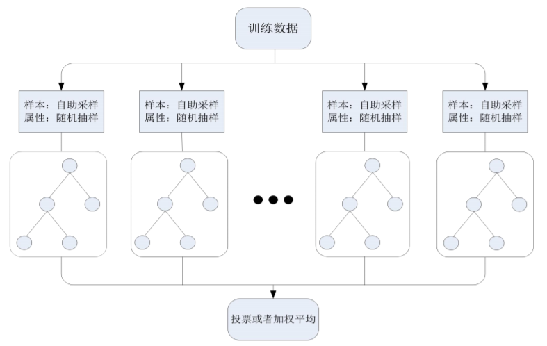
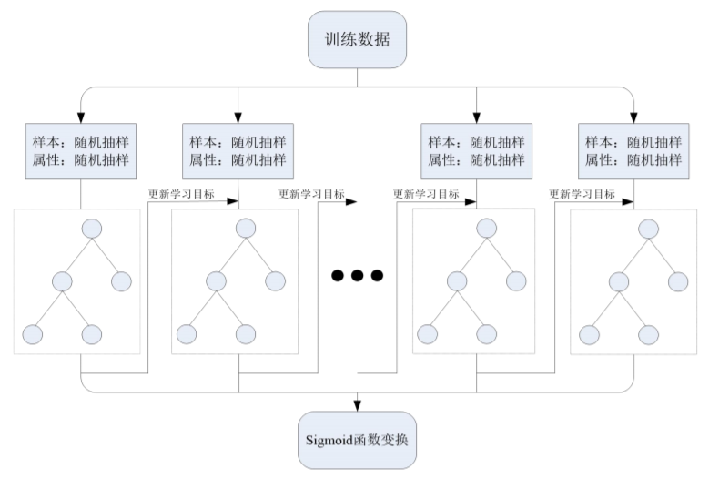

[TOC]

# Ensemble Learning

集成学习（ensemble learning）通过构建并结合多个学习器来完成学习任务。集成学习通过将多个学习器进行结合，通常可以获得比单一学习器显著优越的泛化性能。

但并不是任意的学习器集成都可以提升效果，往往需要学习器满足两点，**准确性和多样性**。

- 准确性

  每个学习器不能太差，如果说有部分学习器比较差，有部分学习器比较好，那么最终集成的结果可能会变差，所以要求学习器需要具备一定的准确性。

- 多样性

  在保证准确性的基础上，需要学习器保持差异性，如果学习器学习的模型都很近似，这样整体提升的效果也是有限的，所以学习之间要保持差异。

目前集成学习大致可以分为两类，Bagging和Boosting，

- Bagging

  学习器之间不存在依赖关系，可以同时生成的并行化方法，相当于每个基学习器可以并行训练，最终再将所有基学习器的预测结果汇总输出最后的预测结果，代表的算法是RandomForest

- Boosting

  学习器之间存在依赖关系，必须串行生成的序列化方法，相当于每个基学习器依赖上一个基学习器的学习，代表的算法是Adaboost和GradientBoosting

下面主要回顾随机森林（Random Forest）和梯度提升树（Gradient Boosting Tree）两种算法。

## 1. 随机森林（Random Forest）

随机森林算法是并行式算法的典型代表，其基学习器采用决策树（CART），有关决策树算法可以参考决策树篇章。下面主要介绍随机森林的两种策略，**样本采样和属性采样选择**，模型架构如下

### 1.1 样本采样

在训练每个基学习器时，其采用**自助采样法**

下面是自助法的做法，给定包含$m$个样本的数据集$D$，我们对它采样产生数据$D^{\prime}$:每次从$D$中随机挑选一个样本，将其拷贝放入$D^{\prime}$，然后再将该样本放回初始数据集$D$中，使得该样本在下次采样时仍有可能被采到；这个过程重复执行$m$次后，我们就得到包含$m$个样本的数据集$D^{\prime}$，这就是自助采样的结果。

从上面的采样过程中可以看到，会存在一部分样本被重复采到，而有部分样本一直没有出现，可以对这部分比例做一个估计，一个样本在采样时，采不到的概率是$1-\frac{1}{m}$，那么这个样本在经过$m$次采样后，仍然没有采样到的概率则为$(1-\frac{1}{m})^m$，取极限得
$$
\lim_{m \to +\infty} (1-\frac{1}{m})^m \to \frac{1}{e} \approx 0.368
$$
也就是说通过自主采样的策略，大约会有36.8%的样本没有被采样到，即初始数据集$D$中约有36.8%的样本未出现在采样数据集$D^\prime$中。对于这部分没有采样到的数据，可以用它来辅助决策树构建过程的剪枝或者用它当做验证集来估计每个基学习器的泛化能力等等。

> 注意思考为什么GB中没有用自助采样（会有重复样本，会存在过拟合）

### 1.2 属性选择

假设原始数据中包含$d$个属性，那么在构建每个决策树时，从$d$个属性中随机选择$k$个属性来构建决策树。随机森林的作者Briiman在其论文中推荐$k=\log_2d$，sklearn的随机森林算法中，其推荐如果是分类任务参数设置$k=\sqrt d$，如果是回归任务$k=d$。

> sklearn中这些值的确定均是根据经验结果来看，实际中需要根据自己的数据进行分析

### 1.3 随机森林的预测

以sklearn接口实现为例，对于分类任务，如果需要预测概率，那么每棵树输出一个概率，最终对所有概率求平均值；如果需要预测类别，那么对每个类别的预测概率求平均，返回平均概率所对应的最大的类别。

> 预测概率时，每个叶子上的正负样本占比作为每颗树正负样本的概率预测，那么对于类别预测，并不是一个简单的投票，相当于对所有类别的概率求平均，返回概率最大类别，相当于是一个加权的投票。

## 2. 梯度提升树（Gradient Boosting Tree）

基于决策树（CART）的梯度提升算法，首先看一下梯度提升（Gradient Boosting）的算法，然后再看一下它和决策树的结合，模型框架如下，

### 2.1 Gradient Boosting

#### 2.1.1 直观理解

在Boosting的框架中，最核心步骤就是如何更新下一次的学习目标，而Gradient Boosting则是采用了负梯度的方向进行目标的更新，这也是其名字的由来。下面大致看一下其目标的更新，

假设当前的学习目标为$y_{now}$，当前学习到的预测值为$y_{now}^{\prime}$，损失函数为$L$，我们最终的目标是想让预测值$y_{now}^{\prime}$和我们的学习目标$y_{now}$一样，这在数学上通常用损失函数来度量，或者说我们想让损失函数$L(y_{now}, y_{now}^{\prime})$尽可量小。那么在梯度提升算法中是如何更新学习目标呢，如下，
$$
y_{next}=y_{now}-\alpha \cdot \left. \frac{\partial L(y_{now}, y)}{\partial y} \right|_{y=y_{now}^{\prime}}
$$
其中，$\alpha$即为每次学习的步长，或者说学习率，$y_{next}$即为下次需要学习的目标。

从上面的形式可以看出，目标更新的方式和梯度下降算法完全一致，只不过这种思想用来更新我们学习的目标。

#### 2.1.2 具体步骤

假设我们的数据集为$\{(x_1,y_1),\cdots, (x_n,y_n)\}$,其中$x_i$表示第$i$个样本的特征向量，$y_i$表示第$i$个样本的学习标签，迭代次数为$M$，可求偏导的损失函数为$L(y,F(x))$。

1. 模型假设

   梯度提升算法是由一系列弱分类器融合而得到一个强分类器，其表达式可以如下，
   $$
   F(x)=\sum_{i=1}^{M}\gamma_i h_i(x)+const
   $$
   其中$M$表示学习器的个数（学习的次数），$h_i(x)$表示第$i$个分类器预测的结果，$\gamma_i$为第$i$个分类器的权重，$const$表示一个常量。

2. 用一个常数初始化模型

   相当于所有的预测值均为一个常数，其表达式如下，
   $$
   F_0(x)={\arg \min}_\gamma \sum_{i=1}^n L(y_i, \gamma)
   $$

3. 对于第$m$个学习器，更新学习目标
   $$
   r_{im}=-\left[ \frac{\partial L(y_i,F(x_i))}{\partial F(x_i)} \right]_{F(x)=F_{m-1}(x)}
   $$
   
4. 训练一个基学习器基于训练集$\{(x_i, r_{im})\}_{i=1}^{n}$

5. 求基学习器所对应的权重$\gamma_m$,
   $$
   \gamma_m={\arg \min}_{\gamma}\sum_{i=1}^n L(y_i,F_{m-1}(x_i)+\gamma h_m(x_i))
   $$

   > 上式中，仅有$\gamma$是未知数，可以通过遍历方式求解

6. 更新目前的模型
   $$
   F_m(x)=F_{m-1}(x)+\gamma_{m}h_m(x)
   $$

接下来循环步骤3-6直至达到迭代次数$M$

### 2.2 基于树模型的梯度提升

原则来说，只需要将上面的基学习器替换为决策树模型即可。但是Frieman在将决策树和梯度提升结合时提出了一些改进。如果基学习器$h_m(x)$为决策树模型，那么它可以表示为如下，
$$
h_m(x)=\sum_{j=1}^{J_m}b_{jm} \cdot sign_{R_{jm}}(x)
$$
其中$J_m$为决策树的叶子数量，$b_{jm}$为区域$R_{jm}$的预测值。

可以将$h_m(x)$代入至上面的式中，如下，
$$
\begin{cases}
F_m(x)=F_{m-1}(x)+\gamma_m h_m(x)\\
F_m(x)=F_{m-1}(x)+\gamma_m \sum_{j=1}^{J_m}b_{jm} \cdot sign_{R_{jm}}(x)
\end{cases}
$$
上式中$\gamma_m$和$b_{jm}$可以合并为一个常数，可以表达为如下，
$$
\begin{cases}
F_m(x)=F_{m-1}(x)+ \sum_{j=1}^{J_m}\gamma_{jm}\cdot sign_{R_{jm}}(x) \\
\gamma_{jm}={\arg \min}_\gamma \sum_{x_i \in R_{jm}} L(y_i, F_{m-1}(x_i)+\gamma)
\end{cases}
$$

### 2.3 正则项的控制

主要用来控制过拟合，增强模型的泛化能力

- 学习率

  这个地方主要体现在如下，
  $$
  F_m(x)=F_{m-1}(x) + v\cdot \gamma_m h_m(x),\quad 0<v<1
  $$

  > 这个地方和**2.1 直观理解**部分有出入，以此部分为主

- 样本采样

  每个基学习器的所用的样本比例

- 属性采样

  每个基学习器所用的属性比例

- 基学习器

  叶子上样本数量，最大叶子数量等等