[TOC]

# NLP

## 1. NLP基本任务概述

### 1.1 句法分析（Lexical Analysis）

句法分析是对自然语言**词汇层面**的分析，是NLP中最基础的工作，主要包括如下

- **分词（Word Segmentation/Tokenization）**

  对没有明显边界的文本进行切分，得到词序列

- 新词发现（New Words Identification）

  找出文本中具有新形势、新意义或是新用法的词

- 形态分析（Morphological Analysis）

  分析单词的形态组成，包括词干（Sterms）、词根（Roots）、词缀（Prefixes and Suffixes）等

- 词性标注（Part-of-speech Tagging）
  确定文本中每个词的词性。词性包括动词（Verb）、名词（Noun）、代词（pronoun）等
  
- 拼写校正（Spelling Correction）
  找出拼写错误的词并进行纠正

### 1.2 句子分析（Sentence Analysis）

对自然语言进行句子层面的分析，包括句法分析和其他句子级别的分析任务

- 组块分析（Chunking）

  标出句子中的短语块，例如名词短语（NP），动词短语（VP）等

- 超级标签标注（Super Tagging）

  给每个句子中的每个词标注上超级标签，超级标签是句法树中与该词相关的树形结构

- 成分句法分析（Constituency Parsing）

  分析句子的成分，给出一棵树由终结符和非终结符构成的句法树

- 依存句法分析（Dependency Parsing）

  分析句子中词与词之间的依存关系，给一棵由词语依存关系构成的依存句法树

- **语言模型（Language Modeling）**

  对给定的一个句子进行打分，该分数代表句子合理性（流畅度）的程度

- 语种识别（Language Identification）

  给定一段文本，确定该文本属于哪个语种

- 句子边界检测（Sentence Boundary Detection）

  给没有明显句子边界的文本加边界

### 1.3 语义分析（Semantic Analysis）

对给定文本进行分析和理解，形成能够表达语义的形式化表示或分布式表示

- 词义消歧（Word Sense Disambiguation）

  对有歧义的词，确定其准确的词义

- 语义角色标注（Semantic Role Labeling）

  标注句子中的语义角色类标，语义角色，语义角色包括施事、受事、影响等

- 抽象语义表示分析（Abstract Meaning Representation Parsing）

  AMR是一种抽象语义表示形式，AMR parser把句子解析成AMR结构

- 一阶谓词逻辑演算（First Order Predicate Calculus）

  使用一阶谓词逻辑系统表达语义

- 框架语义分析（Frame Semantic Parsing）

  根据框架语义学的观点，对句子进行语义分析

- **词汇/句子/段落的向量化表示（Word/Sentence/Paragraph Vector）**

  研究词汇、句子、段落的向量化方法，向量的性质和应用

### 1.4 信息抽取（Information Extraction）

从无结构文本中抽取结构化的信息

- **命名实体识别（Named Entity Recognition）**

  从文本中识别出命名实体，实体一般包括人名、地名、机构名、时间、日期、货币、百分比等

- 实体消歧（Entity Disambiguation）

  确定实体指代的现实世界中的对象

- 术语抽取（Terminology/Giossary Extraction）

  从文本中确定术语

- 共指消解（Coreference Resolution）

  确定不同实体的等价描述，包括代词消解和名词消解

- 关系抽取（Relationship Extraction）

  确定文本中两个实体之间的关系类型

- 事件抽取（Event Extraction）

  从无结构的文本中抽取结构化事件

- **情感分析（Sentiment Analysis）**

  对文本的主观性情绪进行提取

- **意图识别（Intent Detection）**

  对话系统中的一个重要模块，对用户给定的对话内容进行分析，识别用户意图

- 槽位填充（Slot Filling）

  对话系统中的一个重要模块，从对话内容中分析出于用户意图相关的有效信息

### 1.5 顶层任务（High-level Tasks）

直接面向普通用户，提供自然语言处理产品服务的系统级任务，会用到多个层面的自然语言处理技术

- 机器翻译（Machine Translation）：通过计算机自动化的把一种语言翻译成另外一种语言
- 文本摘要（Text summarization/Simplication）：对较长文本进行内容梗概的提取
- 问答系统（Question-Answering Systerm）：针对用户提出的问题，系统给出相应的答案
- 对话系统（Dialogue Systerm）：能够与用户进行聊天对话，从对话中捕获用户的意图，并分析执行
- 阅读理解（Reading Comprehension）：机器阅读完一篇文章后，给定一些文章相关问题，机器能够回答
- 自动文章分级（Automatic Essay Grading）：给定一篇文章，对文章的质量进行打分或分级
- 文本分类（Text Classification）：对于文本预测相应的类别
- 知识图谱（Knowledge Graph）:知识点互相连接而成的语义网络

### 1.6 NLP任务概括

最后简单概括（上面整体说的任务感觉有点多且有点繁琐），通常而言，绝大部分NLP问题可以归入四类任务中，分别是**序列标注**、**分类任务**、**句子关系判断**和**生成式任务**。

- 序列标注（sequence labeling）

  这是最典型的NLP任务，比如中文分词，词性标注，命名实体识别，语义角色标注等都可以归入这一类问题，它的特点是句子中每个单词要求模型根据上下文都要给出一个分类类别。

  这部分任务的特点是：输入为一段文本，输出为一段文本，输入和输出等长（N-N）。

- 分类任务（text classification）

  比如我们常见的文本分类，情感计算，层次分类，多标签分类等都可以归入这一类。

  这部分任务的特点是：输入一段文本，输出为预测的类别（N-1）。

- 句子关系判断

  比如句子相似性判断，阅读理解，语言推理任务（判断两个句子是否具有某种蕴含关系标签）等。

  这部分任务的特点是：输入为多段文本，输出的为一段文本或者标签（n-N-M or 1）。

- 生成式任务（text generation）

  比如机器翻译，文本摘要，写诗造句，看图说话等都属于这一类。它的特点是输入文本内容后，需要自主生成另外一段文字。
  
  这部分任务的特点是：输入为一段文本，输出为一段文本（N-M）。

上面所总结的这四大类任务基本可以涵盖NLP领域的具体任务。基于这部分任务我们可以再分两个角度进行划分和交叉。

- 细分维度

  细分维度是指对某个任务会有很多不同任务，以分类为例，它可以分为二分类、多分类、多标签分类、层次化分类等。

  以阅读理解任务为例，他可以分为抽取式、完形填空式、多项选择式和生成式。

- 交叉维度

  交叉维度是指在某些业务场景下，会使用多个不同NLP任务，比如问答系统，它可能会用到分类任务、序列标注任务

  生成式任务以及阅读理解任务等等。可以理解为灵活使用不同类型的NLP任务来解决业务问题。

### 1.7 学习方向

可以将整体划分为三部分，第一部分为基础的NLP算法，第二部分为NLP具体的任务，第三部分则为具体案例应用。

- 第一部分 **NLP基础算法**

  这部分为NLP的最基础部分，常见的NLP算法，也就是下面介绍的各个相关的模型以及目前新出的模型。

  这部分需要**学习**相关的算法，**总结**算法，**了解**算法。

  - 学习算法

    对于之前已经学习和总结过的算法，要不断的回顾和复习。

    对于和自己业务相关的算法，要学习paper，学习其他人的总结。

    对于其他相关的算法，可以不用细致学习，但是明白算法的原理，能够用自己话术表达。

  - 总结算法

    总结是至关重要的一步，要按照自己的框架进行整理，转化为自己的知识，按照下面算法框架总结即可。

  - 了解算法

    对于其他领域的算法以及属于NLP但是不太相关的算法，多做了解，拓宽思路。

  > 公众号或者博客的算法总结，paper（NLP相关算法会议）

- 第二部分 **NLP具体任务**

  这部分适合第一部分相辅相成的，主要强调的是需要对整体NLP任务有宏观的任务和理解。

  比如说阅读理解任务、知识图谱、机器翻译等等，需要对这些任务解决的问题有清晰的认识以及对这些任务所涉及的基础算法有清晰的认知。

  > 可以根据自己的实际情况列举优先级，比如说机器翻译，可能用的少，可以优先级排低，或者只是了解大概即可

- 第三部分 **NLP案例应用**

  这部分是最复杂的一部分，相当于是第一部分和第二部分的错综的结合，设计到业务的理解，业务出数据的处理，算法的改进以及工程的实施等等。但是这部分是提升最大地方，可以**拓宽自己的思路**（包括算法的设计和应用+业务数据&逻辑的处理+工程），我们的目的就是要通过算法解决业务场景的问题，所以这部分内容**必须必须必须**定期学习且总结。

  > 可以在公众号、DataFun论坛上多多学习其他企业的实际应用案例

## 2. NLP相关模型

### 2.1 语言模型(基础)

简单地说，**语言模型就是用来计算一个句子的概率的模型，也就是判断一句话是否是人话的概率**

即给定一个句子$S = w_1w_2\cdots w_n$，那么它的概率$P(S)$为
$$
P(S) = P(w_1w_2\cdots w_n) = p(w_1) \cdot p(w_2 | w_1) \cdot p(w_3| w_1 w_2) \cdots p(w_n|w_1 \ldots w_{n-1})
$$
上式表达了一个句子的准确计算概率，但是这种方式存在两个大问题：

1. 參数空间过大

   条件概率$p(w_n|w_1 \ldots w_{n-1})$的可能性太多，估算困难

2. 数据稀疏严重

   对于非常多词对的组合，在语料库中都没有出现，依据最大似然估计得到的概率将会是0

#### 2.1.1 n-gram模型

为了参数空间过大的问题，引入了马尔科夫假设，**随意一个词出现的概率只与它前面出现的有限的一个或者几个词有关**，往往分为三种情况

- unigram

  如果一个词的出现与它周围的词是独立的，那么我们就称之为unigram也就是一元语言模型。
  $$
  P(S) = P(w_1w_2\cdots w_n) = p(w_1)\cdot p(w_2) \cdots p(w_n)
  $$

- bigram

  如果一个词的出现仅依赖于它前面出现的一个词，那么我们就称之为bigram也就是二元语言模型。
  $$
  \begin{aligned}
  P(S) &= P(w_1w_2\cdots w_n) \\
       &= p(w_1) \cdot p(w_2 | w_1) \cdot p(w_3| w_1 w_2) \cdots p(w_n|w_1 \ldots w_{n-1}) \\
       &= p(w_1) \cdot p(w_2 | w_1) \cdot p(w_3| w_2) \cdots p(w_n|w_{n-1}) 
  \end{aligned}
  $$

- trigram

  假设一个词的出现仅依赖于它前面出现的两个词，那么我们就称之为trigram,三元语言模型

> 一般来说，N元模型就是假设当前词的出现概率只与它前面的N-1个词有关

像上面提到条件概率，往往通过语料库中词汇进行估算，
$$
p(w_i | w_{i-1} w_{i-2}) = \frac{count(w_i w_{i-1} w_{i-2})}{count(w_{i-1} w_{i-2})}
$$

> 在实践中用的最多的就是bigram和trigram了，高于四元的用的非常少，由于训练它须要更庞大的语料，并且数据稀疏严重，时间复杂度高，精度却提高的不多。

#### 2.1.2 平滑

针对上面提出的第二个问题，假设有一个词组在训练语料中没有出现过，那么它的频次就为0，但实际上能不能认为它出现的概率为0呢？显然不可以，我们无法保证训练语料的完备性。那么，解决的方法是什么？如果我们默认每一个词组都出现1次呢，无论词组出现的频次是多少，都往上加1，这就能够解决概率为0的问题了。

上述的方法就是加1平滑，也称为拉普拉斯平滑。

类似的平滑方法还有很多，如加法平滑、古德-图灵平滑和K平滑等等

### 2.2 TF-IDF

TF-IDF是两部分的组合，分别为TF和IDF。

- TF

  TF（Term Frequency）指词频，即一个词汇在一篇文章的频率，计算公式如下：
  $$
  TF = \frac{词在文章中的词数}{文章的总词数}
  $$
  对于一篇文章来说，往往TF越大的词汇重要性越高，但是对于一些停用词或者常见词汇来说，他们的TF可能很大，但是对于区分文章没有什么帮助，此时需要对词汇加入一个权重进行衡量，衡量一个词是不是常见词汇。**可以理解为如果一个词比较少见，但是在该文章中却多次出现，那么就反应这篇文章的特性。**

- IDF

  IDF（Inverse Document Frequency）指逆文档频率，计算公式如下：
  $$
  IDF = \log(\frac{语料库总文章数量}{包含该词的文章数 + 1})
  $$
  如果一个词汇越常见，那么IDF值就会越小。

那么TF-IDF的计算公式则为TF-IDF=TF*IDF，从公式可以看出，**TF-IDF与一个词在文档中的出现次数成正比，与该词在整个语言中的出现次数成反比。**

#### 2.2.1 用途

- 提取文章的topN关键词

  计算出文档的每个词的TF-IDF值，然后按降序排列，取Top N即可。

- 信息检索

  对于一组搜索词汇（"中国"、"蜜蜂"、"养殖"）来说，首先计算各自的TF-IDF值，然后相加作为该文档和这组搜索词汇的相似度，对于所有的文档均进行该操作，选取最高相似度的文档即可。

#### 2.2.2 优缺点

- 优点

  TF-IDF算法的优点是简单快速，解释性强。

- 缺点

  - 重要词汇可能出现次数不多

    单纯以"词频"衡量一个词的重要性，不够全面，有时重要的词可能出现次数并不多

  - 忽略词汇的位置关系

    这种算法无法体现词的位置信息，出现位置靠前的词与出现位置靠后的词，都被视为重要性相同，这是不正确的。（一种解决方法是，对全文的第一段和每一段的第一句话，给予较大的权重）

### 2.3 LDA&LSA


### 2.4 模型概述

[这篇文章](https://mp.weixin.qq.com/s?__biz=MzA4MTk3ODI2OA==&mid=2650344227&idx=1&sn=a40c9f90fb58d8a28713d01214f41f00&chksm=87811dd0b0f694c615a4ecad32dceb9cabf425d25f231a1e3df5295807e8d4e9d84730dd7fa7&mpshare=1&scene=1&srcid=&sharer_sharetime=1567043328434&sharer_shareid=e53fc678b87c854a7577418ee1c671ac&pass_ticket=6%2BFt82b20NkDrXw7JtruZMEmpKehLR8Y1SJBjeUyIHfZ%2FAO1GgK5sIACDx8vanDS#rd)提及了NLP的一些主流模型。

- 词向量的表示模型（word embedding）

  [word2vec(2013)](https://blog.csdn.net/itplus/article/details/37969519)，[glove(2014)](http://www.fanyeong.com/2018/02/19/glove-in-detail/)，fasttext(2016)

  > [该文章](https://blog.csdn.net/sinat_26917383/article/details/54850933)对glove，fasttext和wordrank做了讲述和对比，比较详细。
  
- RNN的改进和扩展

  - LSTM/GRU
  - Seq2Seq
  - Attention(2014)
  - Transfomer(2017.6, self-attention)
  - Transformer-XL(2019.1)

  对于文本类型的数据，常用的方法就是使用RNN模型，它主要针对的任务类型为N vs N，N vs 1，1 vs N，其中N vs N表示N个输入和N个输出，其余类似。当输入输出不定长时，任务类型为N vs M时，原生的RNN模型有一定的局限，延伸的一个变种叫作Encoder-Decoder模型，也称之为Seq2Seq模型，像机器翻译，原始的输入和输出一般情况下是不等长的，之后在此基础上引入了attention机制，再之后引入了self-attention机制。

  > 该[文章](https://zhuanlan.zhihu.com/p/28054589)大致罗列了RNN模型和seq2seq以及Attention机制

  *Attention机制最早是在视觉图像领域提出来的，应该是在九几年思想就提出来了，但是真正火起来应该算是2014年google mind团队的这篇论文《Recurrent Models of Visual Attention》，他们在RNN模型上使用了attention机制来进行图像分类。随后，Bahdanau等人在论文《Neural Machine Translation by Jointly Learning to Align and Translate》中，使用类似attention的机制在机器翻译任务上将翻译和对齐同时进行，他们的工作算是第一个将attention机制应用到NLP领域中。接着attention机制被广泛应用在基于RNN/CNN等神经网络模型的各种NLP任务中。2017年，google机器翻译团队发表的《Attention is all you need》中大量使用了自注意力（self-attention）机制来学习文本表示。自注意力机制也成为了大家近期的研究热点，并在各种NLP任务上进行探索。*

- Contextual Word Embedding

  产生背景：标注数据量不足，难以学到复杂的上下文表示，想利用非标注数据进行学习。

  [这篇文章](https://zhuanlan.zhihu.com/p/56382372)以Q&A的方式对nlp中的词向量对比：word2vec/glove/fastText/elmo/GPT/bert做了阐述。
  
  张俊林老师的[从Word Embedding到Bert模型—自然语言处理中的预训练技术发展史](https://zhuanlan.zhihu.com/p/49271699)，说的非常好，还有[放弃幻想，全面拥抱Transformer：自然语言处理三大特征抽取器（CNN/RNN/TF）比较](https://zhuanlan.zhihu.com/p/54743941)
  
  - [ELMo(2018.3, bi-lstm)](https://zhuanlan.zhihu.com/p/51679783) 之后紧跟着出现了ULMFit和GPT
  - OpenAI GPT(2018.6, transformer)
  - BERT(2018.10, transformer)
  - [GPT-2(2019.2)](https://zhuanlan.zhihu.com/p/56865533)
  - XLNet(2019.6.19, transfomer-xl)
  

接下来对上面核心几部分一一进行学习。

## 3. 词向量（WordEmbedding）

这部分主要复习word2vec、fasttext和glove。

### 3.1 Word2vec

NLP 里的词语，是人类的抽象总结，是符号形式的（比如中文、英文、拉丁文等等），所以需要把他们转换成数值形式，或者说——嵌入到一个数学空间里，这种嵌入方式，就叫词嵌入（word embedding)，而 word2vec，就是词嵌入（word embedding）的一种。

在word2vec中，有两个训练的模型，分别为CBOW(Continuous Bag-Of-Words)和SG(Skig-Gram)模型，还有关于模型的训练技巧，主要包括HS(hierarchical softmax)和NS(negative sampling)。

#### 3.1.1 CBOW

CBOW的模式为给定一个词的上下文，然后来预测这个词。如下图所示，


上图便是CBOW基本框架，整体可以表示给定一个词上下文的$C$个词，然后来预测这个词。

上图中CBOW模型共分为三层，分别为输入层、隐藏层和输出层。

- 输入层

  输入层为输入的上下文的$C$个词，分别为$x_{1k}, \ldots, x_{Ck}$，在模型中one-hot encoder来表示每一个词。

- 隐藏层

  将输入层的$C$个词向量**相加求平均**便来到隐藏层。

- 输出层

  由隐藏层再映射回词表大小$V$的向量，其中概率最大位置，便表示模型预测的词汇。

上图整体运行模式为，首先根据训练数据（语料库）构建好词表，该词表的大小为$V$，表示词表中存在$V$个词汇，之后根据词表将输入的$C$个词汇进行one-hot encoder编码，然后初始化一个权重矩阵$W_{V \times N}$，其中$N$表示词向量的维度，可以自己设置。然后用one-hot encoder编码做成权重矩阵得到每个词向量，然后将他们相加求平均得到隐藏层向量，然后初始化另外一个权重矩阵$W^{\prime}_{N \times V}$，然后用隐藏向量左乘$W^{\prime}$，然后通过softmax将其归一至输出层，输出层的向量维度为$V$其中每一个值表示此表中对应词的概率。

在训练阶段，则需要定义好损失函数（可以理解为一个多分类，往往采用交叉熵损失函数），以此来进行反向传播更新模型参数。
$$
\text{Loss} = -\sum_i \ \Bbb{I}_{i\in V} \cdot \text{log} p(w|\text{Context}(w))
$$

> 在模型训练好后，其实并不需要模型来预测，只需要使用每个词的one-hot encoder编码乘以矩阵$W_{V \times N}$得到$N$维向量便是这个词的向量。因为one-hot encoder中只有一个1，其余为0，所以此表中第$i$个词的词向量便是矩阵$W$的第$i$行，得到词向量往往也会称为word embedding，而这个矩阵$W$往往称为look up table，相当于直接查表便可以得到一个词的向量表示。

#### 3.1.2 Skip-Gram

Skip-Gram和CBOW正好相反，为给定一个词，通过这个词来预测它的上下文。其模型结构如下所示，


类似CBOW，矩阵$W_{V\times N}$即为词向量矩阵。loss即为多个预测值的损失累加。

但在实际应用中这种方法（CBOW和Skip-Gram）的训练开销很大，不具有很强的实用性，为了使得模型便于训练，有学者提出了Hierarchical Softmax和Negative Sampling两种改进方法。

#### 3.1.3 HS&NS

对于Hierarchical Softmax，其改进主要有两点，

- 从输入层到隐藏层的映射，没有采用原先的与矩阵W相乘然后相加求平均的方法，而是直接对所有输入的词向量求和。假设输入的词向量为(0,1,0,0)和（0,0,0,1），那么隐藏层的向量为（0,1,0,1）。
- 第二点改进是采用哈夫曼树来替换了原先的从隐藏层到输出层的矩阵$W^{\prime}$ 。哈夫曼树的叶节点个数为词汇表的单词个数$V$，一个叶节点代表一个单词，**而从根节点到该叶节点的路径确定了这个单词最终输出的词向量**。

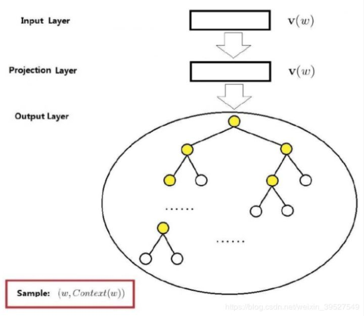

具体来说，这棵哈夫曼树除了根结点以外的所有非叶节点中都含有一个由参数θ确定的sigmoid函数，不同节点中的θ不一样。训练时隐藏层的向量与这个sigmoid函数进行运算，根据结果进行分类，若分类为负类则沿左子树向下传递，编码为0；若分类为正类则沿右子树向下传递，编码为1。

> 可以参考此[文章](https://www.cnblogs.com/pinard/p/7243513.html)的具体流程

负采样（Negative Sample）是另一种用来提高Word2Vec效率的方法，它是基于这样的观察：训练一个神经网络意味着使用一个训练样本就要稍微调整一下神经网络中所有的权重，这样才能够确保预测训练样本更加精确，如果能设计一种方法每次只更新一部分权重，那么计算复杂度将大大降低。

当我们用训练样本（input word:"fox", output word:"quick"）来训练我们的神经网络时，“fox”和“quick”都是经过one-hot编码的。如果我们的vocabulary大小为10000时，在输出层，我们希望“quick”单词那个位置输出1，其余都是0。这些其余我们期望输出0的位置所对应的单词我们成为“negative” word。
当使用负采样时，我们将随机选择一小部分的negative words（比如选5个negative words）来更新对应的权重。我们也会对我们的positive word进行权重更新（上面的例子指的是"quick"）。

> 在论文中，作者指出指出对于小规模数据集，选择5-20个negative words会比较好，对于大规模数据集可以仅选择2-5个negative words。

#### 3.1.4 CBOW&Skip-gram的适用性

CBOW是多个词汇来预测中心词汇，然后通过这个词汇的梯度进行反向更新，平均分配到每个词汇中，这样整体下来预测的次数是V次，多个词汇是汇总平均的结果。相当于每次是一个老师对多个学生的教授，整体进行汇总。

Skip-gram是通过中心词汇来预测周围词汇，然后汇总所有周围的梯度进行反向更新，所有周围词汇来校准这个中心词汇，这样整体下来词汇更新的次数是V次，预测次数大约KV次。因此， **当数据量较少，或者词为生僻词出现次数较少时， 这种多次的调整会使得词向量相对的更加准确**。相当于每次都是多个老师对一个学生专业训练。

参考[文章](https://blog.csdn.net/weixin_38526306/article/details/88803803)

### 3.2 Fasttext

fastText是Facebook于2016年开源的一个词向量计算和文本分类工具，在学术上并没有太大创新。但是它的优点也非常明显，在文本分类任务中，fastText（浅层网络）往往能取得和深度网络相媲美的精度，却在训练时间上比深度网络快许多数量级。在标准的多核CPU上， 能够训练10亿词级别语料库的词向量在10分钟之内，能够分类有着30万多类别的50多万句子在1分钟之内。

#### 3.2.1 n-gram 特征

**基本思想是将文本内容按照字节顺序进行大小为N的滑动窗口操作，最终形成长度为N的字节片段序列**。看下面的例子：

我来到达观数据参观

相应的bigram特征为：我来 来到 到达 达观 观数 数据 据参 参观

相应的trigram特征为：我来到 来到达 到达观 达观数 观数据 数据参 据参观

注意一点：n-gram中的gram根据粒度不同，有不同的含义。它可以是字粒度，也可以是词粒度的。上面所举的例子属于字粒度的n-gram，词粒度的n-gram看下面例子：

我 来到 达观数据 参观

相应的bigram特征为：我/来到 来到/达观数据 达观数据/参观

相应的trigram特征为：我/来到/达观数据 来到/达观数据/参观

> n-gram产生的特征只是作为文本特征的候选集，你后面可能会采用信息熵、卡方统计、IDF等文本特征选择方式筛选出比较重要特征。

word2vec把语料库中的每个单词当成原子的，它会为每个单词生成一个向量。这忽略了单词内部的形态特征，比如：“apple” 和“apples”，“达观数据”和“达观”，这两个例子中，两个单词都有较多公共字符，即它们的内部形态类似，但是在传统的word2vec中，这种单词内部形态信息因为它们被转换成不同的id丢失了。

为了克服这个问题，fastText使用了字符级别的n-grams来表示一个单词。对于单词“apple”，假设n的取值为3，则它的trigram有:

“<ap”, “app”, “ppl”, “ple”, “le>”

其中，<表示前缀，>表示后缀。于是，我们可以用这些trigram来表示“apple”这个单词，进一步，**我们可以用这5个trigram的向量叠加来表示“apple”的词向量**。

这带来两点好处：

1. 对于低频词生成的词向量效果会更好。因为它们的n-gram可以和其它词共享。
2. 对于训练词库之外的单词，仍然可以构建它们的词向量。我们可以叠加它们的字符级n-gram向量。

#### 3.2.2 模型架构


上图即为fasttext架构图，可以看到，和CBOW一样，fastText模型也只有三层：输入层、隐含层、输出层（Hierarchical Softmax），输入都是多个经向量表示的单词，输出都是一个特定的target，隐含层都是对多个词向量的叠加平均。不同的是，CBOW的输入是目标单词的上下文，fastText的输入是多个单词及其n-gram特征，这些特征用来表示单个文档；CBOW的输入单词被onehot编码过，fastText的输入特征是被embedding过；CBOW的输出是目标词汇，fastText的输出是文档对应的类标。

值得注意的是，fastText在输入时，将单词的字符级别的n-gram向量作为额外的特征；在输出时，fastText采用了分层Softmax，大大降低了模型训练时间。

#### 3.2.3 核心思想

仔细观察模型的后半部分，即从隐含层输出到输出层输出，会发现它就是一个softmax线性多类别分类器，分类器的输入是一个用来表征当前文档的向量；模型的前半部分，即从输入层输入到隐含层输出部分，主要在做一件事情：生成用来表征文档的向量。那么它是如何做的呢？叠加构成这篇文档的所有词及n-gram的词向量，然后取平均。叠加词向量背后的思想就是传统的词袋法，即将文档看成一个由词构成的集合。

于是fastText的核心思想就是：**将整篇文档的词及n-gram向量叠加平均得到一个向量，用此向量来表示文档，然后用文档向量做softmax多分类**。这中间涉及到两个技巧：字符级n-gram特征的引入以及分层Softmax分类。

#### 3.2.4 模型参数

一般分类来说核心调整的参数：

epoch和lr。再细致一点就是词向量维度、wordNgram和loss（softmax、hs、ns），还可以指定一些限制项（最小词汇出现的次数和最大次数，最小ngram的出现次数和最大次数）。

> 注意个参数bucket，其会把ngram的信息hash到捅中，相同的桶中的词向量是一致的，所以桶的数量越大冲突的概率就越小。官网默认数量是二百万


### 3.3 Glove

在Glove(Global Vectors for Word Representation)提出前，学习词向量表示的方法主要有两种类型：一种是基于全局矩阵分解的方法，如LSA，另一种是局部上下文窗口的方法，上面的word2vec(CBOW和skip-gram)。但是这两种方法都有各自的缺陷，其中，LSA虽然有效利用了统计信息，但是在词汇类比方面却很差，而word2vec虽然可以很好地进行词汇类比，但是因为这两种方法是基于一个个局部的上下文窗口方法，因此，没有有效地利用全局的词汇共现统计信息。

为了克服全局矩阵分解和局部上下文窗口的缺陷，在2014年，Jeffrey Pennington等人提出了一种新的GloVe方法，**该方法基于全局词汇共现的统计信息来学习词向量**，从而将统计信息与局部上下文窗口方法的优点都结合起来，并发现其效果确实得到了提升。

> 详细的推导过程，参考[文章](https://blog.csdn.net/linchuhai/article/details/97135612)

## 4. Seq2seq的改进

有关RNN的基础模型，类似LSTM和GRU已在**深度学习篇章**进行了总结，这里不再赘述。主要从Attention和Self-Attention机制入手。

有关Attention的介绍，张俊林老师在[知乎的分享](https://www.zhihu.com/question/68482809/answer/264632289)非常简洁明了，有关Self-Attention和Transformer，[这篇分享](https://mp.weixin.qq.com/s/RLxWevVWHXgX-UcoxDS70w)对Attention Is All You Need这篇论文做了详细的解读，简洁明了。

关于Transformer，本质相当于是一个Seq2Seq模型。

### 4.1 Attention机制

深度学习中的注意力机制从本质上讲和人类的选择性视觉注意力机制类似，**核心目标也是从众多信息中选择出对当前任务目标更关键的信息。**

目前大多数注意力模型附着在Encoder-Decoder框架下，**注意力模型是一种通用的思想，本身并不依赖特定的框架**。

下面首先大致过一遍Encoder-Decoder的框架，然后通过Encoder-Decoder框架来理解attention机制，最后引出attention机制的本质思想。

#### 4.1.1 Encoder-Decoder框架

Encoder-Decoder框架如下图，

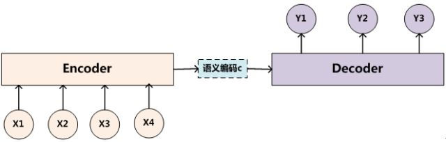

文本处理领域的Encoder-Decoder框架可以这么直观地去理解：可以把它看作适合**处理由一个句子（或篇章）生成另外一个句子（或篇章）**的通用处理模型。对于句子对<Source,Target>，我们的目标是给定输入句子Source，期待通过Encoder-Decoder框架来生成目标句子Target。Source和Target可以是同一种语言，也可以是两种不同的语言。而Source和Target分别由各自的单词序列构成，$\rm{Source} = <x_1, x_2, \ldots, x_m>, \rm{Target}=<y_1, y_2, \ldots, y_n>$，即输入是$m$个词汇的序列，输出是$n$词汇的序列。

- Encoder

  Encoder顾名思义就是对输入句子Source进行编码，将输入句子通过非线性变换转化为中间语义表示$C$，
  $$
  C = F(<x_1, x_2, \ldots, x_m>)
  $$

- Decoder

  对于解码器Decoder来说，其任务是根据句子Source的中间语义表示C和之前已经生成的历史信息($y_1, y_2, \ldots, y_{i-1}$)来生成$i$时刻要生成的词汇，如下，
  $$
  y_{i}=G(C, y_1, y_2, \ldots, y_{i-1})
  $$
  

在文本领域，如果Source是中文句子，Target是英文句子，那么这就是解决机器翻译问题的Encoder-Decoder框架；如果Source是一篇文章，Target是概括性的几句描述语句，那么这是文本摘要的Encoder-Decoder框架；如果Source是一句问句，Target是一句回答，那么这是问答系统或者对话机器人的Encoder-Decoder框架。

在语音识别领域，则Encoder部分输入的是语音流，Decoder输出部分是对应的文本识别信息，显然这对应语音转文本任务；在图像领域，Encoder部分输入的一张图片，Decoder部分输出对应的文本信息，往往这是图像描述任务。

> 一般而言，文本处理和语音识别的Encoder部分通常采用RNN模型，图像处理的Encoder一般采用CNN模型。

#### 4.1.2 Attention In Encoder-Decoder

在上面提及的Encoder-Decoder框架中，是没有使用attention机制的，或者可以说是注意力不集中的“分心模型”，为什么是分心呢，假设输出$<y_1,y_2,y_3>$，则生成的过程如下，
$$
\begin{aligned}
y_1 &= G(C) \\
y_2 &= G(C, y_1) \\
y_3 &= G(C, y_1, y_2)
\end{aligned}
$$
其中$C$为Encoder阶段生成的中间语意表示，函数$G$为Decoder中使用的非线性变换函数。

从上面$<y_1,y_2,y_3>$生成过程可以看出，无论生成哪个词汇，它们对输入句子的使用都是中间的语义编码，没有任何区别，语义编码$C$是由句子Source的每个单词经过Encoder 编码产生的，这意味着不论是生成哪个单词，$y_1$,$y_2$还是$y_3$，**其实句子Source中任意单词对生成某个目标单词$y_i$来说影响力都是相同的**，这是为何说这个模型没有体现出注意力的缘由。这类似于人类看到眼前的画面，但是眼中却没有注意焦点一样。

以机器翻译任务（input：Tom chase Jerry, output: 汤姆追逐杰瑞）为例，

在翻译“杰瑞”这个中文单词的时候，分心模型里面的每个英文单词对于翻译目标单词“杰瑞”贡献是相同的，很明显这里不太合理，显然“Jerry”对于翻译成“杰瑞”更重要，但是分心模型是无法体现这一点的，这就是为何说它没有引入注意力的原因。没有引入注意力的模型在输入句子比较短的时候问题不大，但是如果输入句子比较长，此时所有语义完全通过一个中间语义向量来表示，单词自身的信息已经消失，可想而知会丢失很多细节信息，这也是为何要引入注意力模型的重要原因。上面的例子中，如果引入Attention模型的话，应该在翻译“杰瑞”的时候，体现出英文单词对于翻译当前中文单词不同的影响程度，比如给出类似下面一个概率分布值：（Tom,0.3）(Chase,0.2) (Jerry,0.5)，每个英文单词的概率代表了翻译当前单词“杰瑞”时，注意力分配模型分配给不同英文单词的注意力大小。这对于正确翻译目标语单词肯定是有帮助的，因为引入了新的信息。

同理，**目标句子中的每个单词都应该学会其对应的源语句子中单词的注意力分配概率信息**。这意味着在生成每个单词 $y_i$的时候，原先都是相同的中间语义表示$C$会被替换成根据当前生成单词而不断变化的$C_i$。理解Attention模型的关键就是这里，即由固定的中间语义表示$C$换成了根据当前输出单词来调整成加入注意力模型的变化的$C_i$。

增加了注意力模型的Encoder-Decoder框架理解起来如下所示。

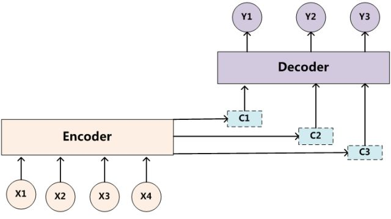

则$y_1,y_2,y_3$的生成过程变为
$$
\begin{aligned}
y_1 &= G(C_1) \\
y_2 &= G(C_2, y_1) \\
y_3 &= G(C_3, y_1, y_2)
\end{aligned}
$$
其中每个$C_i$ 可能对应着不同的源语句子单词的注意力分配概率分布，比如对于上面的英汉翻译来说，其对应的信息可能如下：

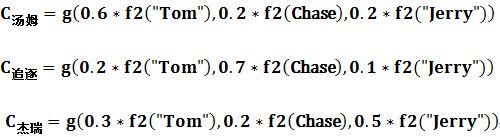

其中，f2函数代表Encoder对输入英文单词的某种变换函数，比如如果Encoder是用的RNN模型的话，这个f2函数的结果往往是某个时刻输入$x_i$后隐层节点的状态值；g代表Encoder根据单词的中间表示合成整个句子中间语义表示的变换函数，一般的做法中，g函数就是对构成元素加权求和，即下列公式：
$$
C_i = \sum_{j=1}^{L_x} a_{ij} \cdot h_j
$$
其中，$L_x$代表输入句子Source的长度，$a_{ij}$代表在Target输出第$i$个单词时Source输入句子中第j个单词的注意力分配系数，而$h_j$则是Source输入句子中第$j$个单词的语义编码。以上面的例子来看，$L_x$显然为3，$i$代表“汤姆”，j=1,2,3分别代表Tom, Chase, Jerry, $a_{ij}$表示“汤姆”和单词Tom, Chase, Jerry的关联程度，分别取值为0.6, 0.2, 0.2; $h_j$表示每个单词的语义编码。

- 注意力分配概率分布值的确定（$a_{ij}$的确定）

  以RNN模型为例，下图是采用RNN模型作为Encoder和Decoder的架构，无attention机制，如下，

  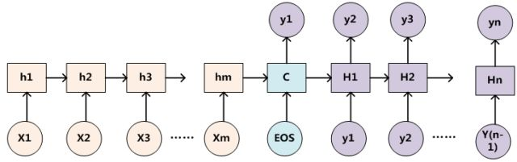

  引入attention机制后，可以表述为，

  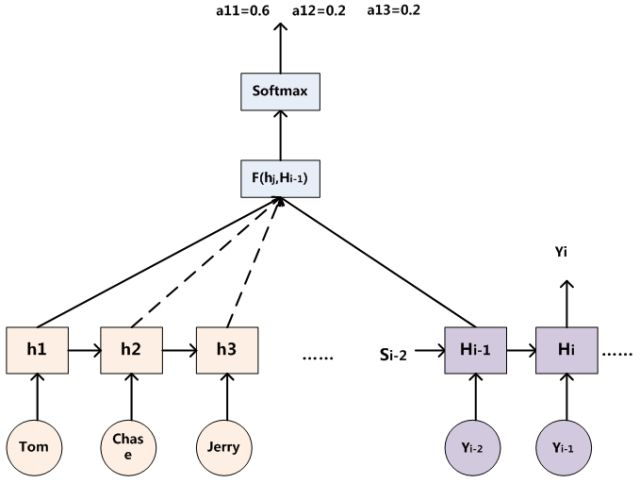
  
  对于采用RNN的Decoder来说，在时刻$i$，如果要生成$y_i$ 单词，我们是可以知道Target在生成$y_i$ 之前的时刻i-1时，隐层节点$i-1$时刻的输出值$H_{i-1}$的，而我们的目的是要计算生成$y_i$ 时输入句子中的单词“Tom”、“Chase”、“Jerry”对$y_i$来说的注意力分配概率分布，那么可以用Target输出句子$i-1$时刻的隐层节点状态$H_{i-1}$去一一和输入句子Source中每个单词对应的RNN隐层节点状态$h_j$进行对比，即通过函数$F(h_j, H_{i-1})$来获得目标单词yi和每个输入单词对应的对齐可能性，这个$F$函数在不同论文里可能会采取不同的方法，然后函数$F$的输出经过Softmax进行归一化就得到了符合概率分布取值区间的注意力分配概率分布数值。
  
  **绝大多数Attention模型都是采取上述的计算框架来计算注意力分配概率分布信息，区别只是在F的定义上可能有所不同。**一般在自然语言处理应用里会把Attention模型看作是输出Target句子中某个单词和输入Source句子每个单词的对齐模型。

#### 4.1.3 Attention本质思想

如果把Attention机制从上面讲述例子中的Encoder-Decoder框架中剥离，并进一步做抽象，可以更容易看懂Attention机制的本质思想，如下，


在上图中，我们输入Source构成元素想象成是由一系列的<Key,Value>数据对构成，此时给定Target中的某个元素Query，通过计算Query和各个Key的相似性或者相关性，得到每个Key对应Value的权重系数，然后对Value进行加权求和，即得到了最终的Attention数值。**所以本质上Attention机制是对Source中元素的Value值进行加权求和，而Query和Key用来计算对应Value的权重系数。**

即可以将其本质思想改写为如下公式：
$$
\rm{Attention}(Query, Source)=\sum_{i=1}^{L_x}Similarity(Query, Key_i)*Value_i
$$
其中$L_x=||\rm{Source}||$代表输入Source的长度。

在上面列举的例子中，此时Key和Value是一样的，都是指$h_j$。

当然，从概念上理解，**把Attention仍然理解为从大量信息中有选择地筛选出少量重要信息并聚焦到这些重要信息上，忽略大多不重要的信息**，这种思路仍然成立。聚焦的过程体现在权重系数的计算上，权重越大越聚焦于其对应的Value值上，即权重代表了信息的重要性，而Value是其对应的信息。

> Attention另外一种解释，也可以将Attention机制看作一种软寻址（Soft Addressing）:Source可以看作存储器内存储的内容，元素由地址Key和值Value组成，当前有个Key=Query的查询，目的是取出存储器中对应的Value值，即Attention数值。通过Query和存储器内元素Key的地址进行相似性比较来寻址，之所以说是软寻址，指的不像一般寻址只从存储内容里面找出一条内容，而是可能从每个Key地址都会取出内容，取出内容的重要性根据Query和Key的相似性来决定，之后对Value进行加权求和，这样就可以取出最终的Value值，也即Attention值。

#### 4.1.4 Attention计算过程

可以将其计算过程大致抽象为三个过程，如下图，


- 第一阶段（根据Query和Key计算两者的相似性或者相关性）

  此阶段需要衡量$\rm{Query}$和$Key_i$的相关性，衡量的方式有多种，

  

- 第二阶段（第一阶段的的分值进行归一化处理）

  对第一阶段得出的值进行归一化，往往采用Softmax方式，
  $$
  a_i = softmax(Sim_i)=\frac{e^{Sim_i}}{\sum_{j=1}^{L_x}e^{Sim_j}}
  $$

- 第三阶段（根据权重系数对Value进行加权求和）

  根据第二阶段得出的权重系数，对Value值进行加权求和即可，
  $$
  Attention(Query, Source)=\sum_{i=1}^{L_x}a_i \cdot \rm{Value}_i
  $$

> 未加入attention机制的encoder-docoder，如果中间语义编码C可以任意长，也可以达到attention的效果，但是其长度往往有限，attention机制可以看作是一种折中的方式。

#### 4.1.5 Attention机制的Q&A

- 为什么要引入Attention机制？

  根据通用近似定理，前馈网络和循环网络都有很强的能力。但为什么还要引入注意力机制呢？

  - 计算机能力的限制

    当要记住很多“信息“，模型就要变得更复杂，然而目前计算能力依然是限制神经网络发展的瓶颈。类似encoder-decoder框架中，未使用attention机制前中间语义编码C显然受制于长度的限制，表达能力有限

  - 优化算法的限制

    虽然局部连接、权重共享以及pooling等优化操作可以让神经网络变得简单一些，有效缓解模型复杂度和表达能力之间的矛盾，但是，如循环神经网络中的长距离以来问题，信息“记忆”能力并不高。

  **可以借助人脑处理信息过载的方式，例如Attention机制可以提高神经网络处理信息的能力。**

  > 我觉得可以说简单点，一个是把重点放在更需要关注的信息上，提高准确率（RNN为结构的encoder-decoder如果只用一个中间状态C，显然会损失很多信息，降低模型的准确率）；再一个是这种注意力机制符合人类分析一些问题的方式，更具有解释性；相比于设计复杂的网络（耗时，耗资源），这样简单的设计有可能会达到相似甚至更好的效果

- Attention机制有哪些？（怎么分类？）

  当用神经网络来处理大量的输入信息时，也可以借鉴人脑的注意力机制，只选择一些关键的信息输入进行处理，来提高神经网络的效率。按照认知神经学中的注意力，可以总体上分为两类：

  - **聚焦式（focus）注意力**

    自上而下的有意识的注意力，**主动注意**——是指有预定目的、依赖任务的、主动有意识地聚焦于某一对象的注意力

  - **显著性（saliency-based）注意力**

    自下而上的有意识的注意力，**被动注意**——基于显著性的注意力是由外界刺激驱动的注意，不需要主动干预，也和任务无关；可以将max-pooling和门控（gating）机制来近似地看作是自下而上的基于显著性的注意力机制。

  在人工神经网络中，注意力机制一般就特指聚焦式注意力。

- Attention机制的变种有哪些？

  - 硬性注意力

    之前提到的注意力是软性注意力，其选择的信息是所有输入信息在注意力分布下的期望。还有一种注意力是只关注到某一个位置上的信息，叫做硬性注意力（hard attention）。硬性注意力有两种实现方式：（1）一种是选取最高概率的输入信息；

    （2）另一种硬性注意力可以通过在注意力分布式上随机采样的方式实现。

    硬性注意力模型的缺点：

    *硬性注意力的一个缺点是基于最大采样或随机采样的方式来选择信息。因此最终的损失函数与注意力分布之间的函数关系不可导，因此无法使用在反向传播算法进行训练。为了使用反向传播算法，一般使用软性注意力来代替硬性注意力。硬性注意力需要通过强化学习来进行训练。*

  - 键值对注意力

    Key!=Value，计算方式同上

  - 多头注意力

    多头注意力（multi-head attention）是利用多个查询Q = [q1, · · · , qM]，来平行地计算从输入信息中选取多个信息。每个注意力关注输入信息的不同部分，然后再进行拼接：

### 4.2 Transformer

该部分介绍参考目录`./算法/Transformer`

### 4.3 Transformer-XL

#### 4.3.1 模型简介

Transformer可以捕获文本的长期以来，但是却局限于文本的固定长度，在这样的背景下，诞生了Transformer-XL，能够在不破坏句子连贯性的基础上，捕获到固定长度之外的文本依赖。其包含两方面的创新，

- segment-level recurrence mechanism
- novel positional encoding scheme

这样方式不仅可以捕获长期依赖还可以解决文本碎片化的问题（the context fragmentation problem）。

最终其学习到的依赖要比RNN长80%，比vanilla Transformer长450%，而且不论长文本还是短文本，其效果均优于两者，在评估阶段其速度要比vanilla Transformer快1800+倍。

#### 4.3.2 模型框架

- Vanilla Transformer Language Models

  用 Transformer 或自注意力机制进行语言建模的核心问题在于，如何将 Transformer 训练为可以把任意长度的上下文有效编码为长度固定的表征。在给定无限内存和计算资源的情况下，一种简单的方法是用无条件的 Transformer 解码器处理整个上下文序列，这和前馈神经网络相似。但在实践中资源都是有限的，因此这种方法不可行。

  一种可行粗略的估计方式是将整个文本切分为固定长度大小文本片段，然后然后在每一个片段中进行训练，这种方式忽略了前一个片段的文本信息，其训练和评估的方式如下图所示，

  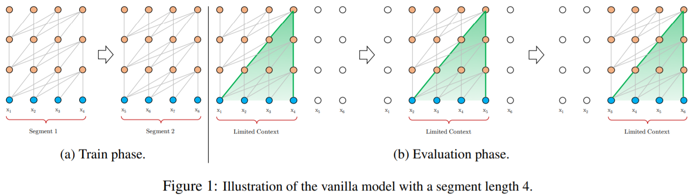

  上面的模型已经优于RNN了，但是仍然存在两个主要的缺陷，

  1. **上下文相关性有限**。字符之间的最大依赖距离受输入长度的限制。例如，该模型不能“使用”出现在几个句子之前的单词。
  2. **上下文破碎**。对于长度超过 512 个字符的文本，其每个段都是从头开始单独训练的。因此，对于每个段的第一个表征以及各个段之间，根本不存在上下文（依赖性）。这会使得训练效率低下，并会影响模型的性能。

- transformer-XL的工作机制

  Transformer-XL 架构基于vanilla Transformer，但引入了两点创新——**循环机制（Recurrence Mechanism）**和**相对位置编码（Relative Positional Encoding）**，以克服 vanilla Transformer 的缺点。与 vanilla Transformer 相比，该架构的另一个优势是它可以被用于单词级和字符级的语言建模。

  - 循环机制

    循环机制的目标是通过利用之前段的信息来实现长期依赖性。与 vanilla Transformer 类似，Transformer-XL 处理第一个标记段，但它会保留隐藏层的输出。处理后面的段时，每个隐藏层都会接收两个输入：

    1. 该段的前一个隐藏层的输出，和 vanilla Transformer 相同（如下图中的灰色箭头所示）。
    2. 上一个隐藏层的输出（如绿色箭头所示），可以使模型创建长期依赖关系。

    从技术上讲，这两个输入会被拼接，然后用于计算当前段（当前层的当前头部）的 Key 和 Value 矩阵。该步骤为网络提供了更多关于每个表征的权重（重要性）的信息，但它不会更改 Value 矩阵。

    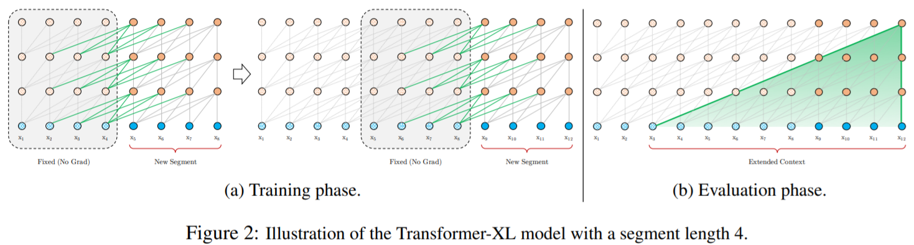

  - 相对位置编码

    循环机制引入了新的挑战——原始位置编码将每个段分开处理，因此，来自不同段的表征会具有相同的位置编码。例如，第一和第二段的第一个表征将具有相同的编码，虽然它们的位置和重要性并不相同（比如第一个段中的第一个表征可能重要性低一些）。这种混淆可能会错误地影响网络。

    对此问题，论文提出了一种新的位置编码方式。这种位置编码是每个注意力模块的一部分。它不会仅在第一层之前编码位置，而且会基于表征之间的相对距离而非绝对位置进行编码。

    > 具体如何做没有细究
  
#### 4.3.3 疑问

  1. 对于transformer，如果一个样本的长度是1000，设定的max_len是512，那么剩下的文本信息怎么办？

     如果序列长度超过固定长度，处理起来就比较麻烦。一种处理方式，就是将文本划分为多个segments。训练的时候，对每个segment单独处理，segments之间没有联系，如下图(a)所示。这存在两个问题，1）因为segments之间独立训练，**所以不同的token之间，最长的依赖关系，就取决于segment的长度**；2）出于效率的考虑，在划分segments的时候，不考虑句子的自然边界，而是根据固定的长度来划分序列，导致分割出来的segments在语义上是不完整的。

  2. 对于划分的多个文本片段，是构建为了多个训练样本（标签一致）or一个样本，多个片段分别分别训练？

  3. 截取的每个片段，相当于是transformer的标准流程么？

3. 预测阶段，transfomrer的流程？

   在预测的时候，会对固定长度的segment做计算，一般取最后一个位置的隐向量作为输出。为了充分利用上下文关系，在每做完一次预测之后，就对整个序列向右移动一个位置，再做一次计算，如图1(b)所示，这导致计算效率非常低。（问题是每个片断的都会有一个输出，应该怎么办？）

4. 预测阶段，transformer-xl的流程？和训练阶段异同？


## 5. Contextual Word Embedding

目前比较流行的contextual word embedding方法有ELMo，GPT，GPT-2，BERT和XLNet。

### 5.1 ELMo

2018年3月份，ELMo(Embeddings from Language Models)出世，该paper是NAACL18 Best Paper。在之前2013年的word2vec及2014年的GloVe的工作中，每个词对应一个vector，对于多义词无能为力。ELMo的工作对于此，提出了一个较好的解决方案。不同于以往的一个词对应一个向量，是固定的。在ELMo世界里，预训练好的模型不再只是向量对应关系，而是一个训练好的模型。使用时，将一句话或一段话输入模型，模型会根据上下文来推断每个词对应的词向量。这样做之后明显的好处之一就是对于多义词，可以结合前后语境对多义词进行理解。比如appele，可以根据前后文语境理解为公司或水果。

#### 5.1.1 模型原理

ELMo是一个双向的语言模型，给定一段话，这段话包含$N$个token，$(t_1, t_2, \ldots, t_N)$。前向语言模型通过给定历史$k-1$个token$(t_1, t_2, \ldots, t_{k-1})$来预测第$k$个token出现的概率，则整个序列可以表示为，
$$
p(t_1, t_2, \ldots, t_N) = \sum_{k=1}^{N} p(t_k|t_1, t_2, \ldots, t_{k-1})
$$
后向语言概率则相反，给定未来序列信息来预测该token的概率，
$$
p(t_1,t_2, \ldots, t_N) = \sum_{k=1}^N p(t_K| t_{k+1}, t_{k+1}, \ldots, t_N)
$$
在确定上述的框架以及预测目标后，接下来需要选取预测目标的模型，ELMo中选用了$L$层的LSTM来作为目标预测模型。以前向语言模型为例，显然在序列$k$位置，每个LSTM层最后会输出一个隐向量$h_{kj}$，其中$j=1,\ldots,L$，隐向量$h_{kL}$通过Softmax层来预测下一个token$t_{k+1}$出现的概率。

则一个基于LSTM的双向语言模型的目标（加入log变换）可以表示为如下，
$$
\sum_{k=1}^N \log p(t_k|t_1,\ldots,t_{k-1};\Theta_x,\overrightarrow{\Theta}_{LSTM},\Theta_s)+\log p(t_k|t_{k+1},\ldots,t_{N};\Theta_x,\overleftarrow{\Theta}_{LSTM},\Theta_s)
$$
其中$\Theta_x$为token representation，$\Theta_s$为softmax层，前向和后向语言模型共享$\Theta_x$和$\Theta_s$参数。

那么ELMo模型的框架如下图所示，


整体来看，ELMO采用了典型的两阶段过程，第一个阶段是利用语言模型进行预训练；第二个阶段是在做下游任务时，从预训练网络中提取对应单词的网络各层的Word Embedding作为新特征补充到下游任务中。

接下来则是根据上图模型结构生成对应的词向量。

#### 5.1.2 词向量

对于每个token$t_k$，$L$层的双向语言模型可以得到$2L+1$个表达，
$$
\begin{align}
R_k &= \{x_k, \overrightarrow{h}_{k,j}, \overleftarrow{h}_{k,j} |j=1,\ldots,L\} \\
&= \{h_{k,j}|j=0,\ldots,L\}
\end{align}
$$
其中$h_{k,0}$表示token层，$h_{k,j}=[\overrightarrow{h}_{k,j};\overleftarrow{h}_{k,j}]$

在上面的词向量中，每个token$t_k$的词向量仍然包括$L+1$个（前向和后向的合并），需要将这些向量变为只有一个才更容易加入下游的任务，在一些简单的例子中，仅仅使用了顶层的词向量表示即$h_{k,L}$，通常来说，可以根据任务为每一层词向量得到一个权重，
$$
ELMo_k^{task} = E(R_k;\Theta^{task})=\gamma^{task}\sum_{j=1}^L s_j^{task}h_{k,j}
$$
其中$s_j^{task}$代表每一层词向量的权重，且$\sum_{j=1}^L s_j^{task}=1$，而$\gamma^{task}$则是对整体词向量的放缩因子

最终使用词向量时可以做词向量的拼接作为最终词向量，如$[x_k; ELMo_k^{task}]$，$[h_k;ELMo_k^{task}]$（任务为SNLI，SQuAD，*个人理解$h_k$是通过其他模型RNNs,CNNs结合$x_k$得到一个中间表示*）

#### 5.1.3 模型使用


一旦Elmo模型预训练结束后，我们应该如何给下游任务使用呢？上图展示了下游任务的使用过程，比如我们的下游任务是QA问题，此时对于问句X，我们可以先将句子X作为预训练好的ELMO网络的输入，这样句子X中每个单词在ELMO网络中都能获得对应的三个Embedding，之后给予这三个Embedding中的每一个Embedding一个权重a，这个权重可以学习得来，根据各自权重累加求和，将三个Embedding整合成一个。然后将整合后的这个Embedding作为X句在自己任务的那个网络结构中对应单词的输入，以此作为补充的新特征给下游任务使用。对于上图所示下游任务QA中的回答句子Y来说也是如此处理。

因为Elmo给下游提供的是每个单词的特征形式，所以这一类预训练的方法被称为***feature-based***方式，像后面提及的GPT和BERT模型都属于***fine-tuning***方式。

> - feature-based
>
>   相当于模型固定了，输入不同的句子，得到每个词的词向量表示（相同的词在不同的句子中词向量显然不同）
>
> - fine-tuning
>
>   相当于模型大致固定，需要根据任务微调。

#### 5.1.4 总结

作者论文中$L=2$，词向量维度为512，作者通过实验表名在双向语言模型中，越高层表示对词义消歧做的越好（表明越高层越能捕获词意信息），而低层更能学习到词的句法信息和词性信息。总体而言，biLM每层学到的东西是不一样的，所以将他们叠加起来，对任务有较好的的提升。

- 优点
  - 词向量会根据语境发生变化，而不是一成不变（一词多义，同一单词在不同的语境中，词向量不同）
  - 可以学习到词的复杂特征，包括词义词性等特征（底层和高层）
- 缺点
  - ELMO 采取双向拼接这种融合特征的能力，相比较于整体整合来说，这样会损失掉一些信息
  
    相当于虽然一个词的周围信息考虑了，但是是在两种不同的训练模式下考量的，不是在一个整体考虑的，这样势必会损失部分信息。
  
  - 在中间模型选择上，使用LSTM模型，在捕获长依赖上存在缺陷，换位Transformer这种结构可能会更好一些。
  
  - L层的双向LSTM，速度上偏慢，无法并行。

### 5.2 OpenAI GPT

GPT提出一种半监督的方式来处理语言理解的任务。使用非监督的预训练和监督方式的微调。我们的目标是学习一个通用的语言标示，可以经过很小的调整就应用在各种任务中。这个模型的设置不需要目标任务和非标注的数据集在同一个领域。模型有两个过程,

1. 通过语言模型在无标签的数据上学习一个深度模型
2. 随后通过相应的监督目标在有标记的数据上微调这个深度模型

#### 5.2.1 模型原理

- 无监督预训练（Unsupervised pre-training）

  假设我们的语料库的token为$U=\{u_1,u_2,\ldots,u_n\}$，然后通过语言模型的目标函数来极大化极大似然，
  $$
  L_1(U)=\sum_i \log p(u_i|u_{i-k},\ldots,u_{i-1}, \Theta)
  $$
  其中$k$是滑动窗口，$\Theta$为模型的参数

  训练的模型为多层的Transformer decoder，简述如下，
  $$
  \begin{align}
  h_0 &= UW_e + W_p \\
  h_l &= \rm{transformer\_block}(h_{l-1})\ \forall l \in [1,n] \\
  P(u) &= \rm{softmax}(h_nW_e^T)
  \end{align}
  $$
  其中$U=(u_{-k},\ldots,u_{-1})$是语料context vector，$W_e$为token的embedding矩阵，$W_p$为position embedding矩阵，$n$为transformer的层数。

- 有监督微调（Supervised fine-tuning）

  假设有标记的训练数据为$C$，其中一个样本其输入的token为$\{x^1, \ldots, x^m\}$，标签为$y$。

  在得到上面的预训练模型后，只需要将上面训练数据集输入的token输入至预训练模型中，得到最优一个transformer block的输出$h_l^m$，然后后面接一个全连接层和softmax即可，
  $$
  P(y|x^1, \ldots, x^m)=\rm{softmax}(h_l^mW_y)
  $$
  则有标记数据集上优化的目标函数为
  $$
  L_2(C) = \sum_{(x,y)} \log P(y|x^1, \ldots, x^m)
  $$
  之后发现将语言模型的目标函数加入起到了不错的效果，此时的目标函数为
  $$
  L_3(C) = L_2(C) + \lambda L_1(C)
  $$

  > 整体看来，预训练阶段需要更新的参数为$W_y$和一些特殊标记的词向量（多输入文本的分割标记）

  Open AI GPT模型的框架图如下，

  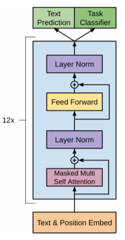

#### 5.2.2 词向量

因为GPT模型属于***fine-tuning***方式，不同于上面的Elmo的***feature-based***方式，往往不会直接提取词向量，而是基于预训练模型进行微调。下面看一下其使用方式。

#### 5.2.3 模型使用


上图展示了GPT在第二阶段如何使用。首先，对于不同的下游任务来说，本来你可以任意设计自己的网络结构，现在不行了，你要向GPT的网络结构看齐，把任务的网络结构改造成和GPT的网络结构是一样的。然后，在做下游任务的时候，利用第一步预训练好的参数初始化GPT的网络结构，这样通过预训练学到的语言学知识就被引入到现在的任务里来了，这是个非常好的事情。然后你可以用手头的任务去训练这个网络，对网络参数进行fine-tuning，使得这个网络更适合解决手头的问题。

对于不同类型的任务略有不同，论文中也给出了示例图，如下，

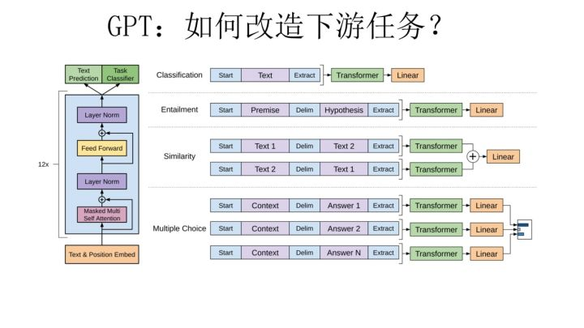

- 分类任务

  基本不需要改动，在输入测加入一个起始和终结符号即可，最后加入一个全连接层即可

- 句子关系判断问题

  比如Entailment，两个句子中间再加个分隔符即可
  
- 对文本相似性判断问题

  把两个句子顺序颠倒下做出两个输入即可，这是为了告诉模型句子顺序不重要
  
- 多项选择问题
  多路输入，每一路把文章和答案选项拼接作为输入即可。

从上图可看出，这种改造还是很方便的，不同任务只需要在输入部分施工即可。

#### 5.2.4 总结

GPT整体对未标记数据来预训练，然后通过有标记数据来微调模型。在预训练阶段，共使用了12层transformer层（其实可以理解为encoder层吧），最后生成的词向量维度为512。

- 优点

  - 采用了预训练+微调的模式，在多个NLP任务中取得了SOTA的效果。

  - 预训练阶段采用了Transformer结构，能更好的捕获文本的长距离依赖。
  - 在微调阶段将语言模型的目标加到整体目标函数中，增加了监督模型的泛化能力且加快模型的收敛速度。

- 缺点

  - 预训练模型的学习目标为单向语言模型，未考虑预测词汇的整体的context，会存在一定损失

### 5.3 BERT

BERT的全称是Bidirectional Encoder Representation from Transformers，即双向Transformer的Encoder，因为decoder是不能获取要预测的信息。模型的主要创新点都在pre-train方法上，即用了Masked LM和Next Sentence Prediction，两种方法分别捕捉词语和句子级别的representation，在整体网络模式上和Open AI GPT类似，分为预训练和微调两个阶段。

BERT的整体网络结构由多层的Transformer Encoder组成，如下图所示，

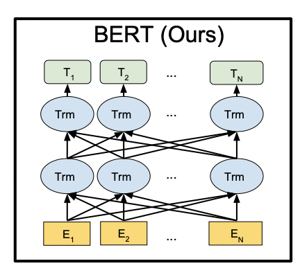

#### 5.3.1 模型原理

**输入表示**

BERT的输入的编码向量（长度是512）是3个嵌入特征的单位和，如下图，这三个词嵌入特征是：

1. word piece嵌入（WordPiece Embedding），word piece是指将单词划分为一组有限的公共字词单元能在单词的有效性和字符的灵活性之间取得一个折中的平衡。例如图4的示例中‘playing’被拆分成了‘play’和‘ing’；（在中文应该是字粒度，没有这一说了）
2. 位置嵌入（Position Embedding），位置嵌入是指将单词的位置信息编码成特征向量，位置嵌入是模型中引入单词位置关系的至关重要的一环。
3. 分割嵌入（Segment Embedding），用于区分两个句子，例如B是否是A的下文（对话场景，问答场景等）。对于句子对，第一个句子的特征值是0，第二个句子的特征值是1。

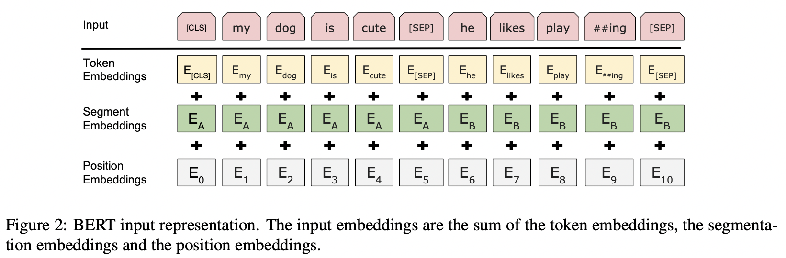

> 上图中，有两个特殊符号[CLS]和[SEP]，其中[CLS]用来表示该特征可以用于分类模型，对于非分类模型，该符号可以省略；[SEP]表示分句符号，用于断开输入语料中的两个句子。

##### 5.3.1.1 预训练任务

BERT是一个多任务模型，它的任务是由两个自监督任务组成，即MLM和NSP。

**Task 1: Masked LM**

为了训练一个比较深的双向表示，将输入进行了随机的mask，然后mask的内容作学习的目标。最终从输入中随机选择15%mask，将这些token作为预测目标。

在BERT的实验中，15%的WordPiece Token会被随机Mask掉。在训练模型时，一个句子会被多次喂到模型中用于参数学习，但是BERT并没有在每次都mask掉这些单词，而是在确定要Mask掉的单词之后，80%的时候会直接替换为[Mask]，10%的时候将其替换为其它任意单词，10%的时候会保留原始Token。

- 80%：`my dog is hairy -> my dog is [mask]`
- 10%：`my dog is hairy -> my dog is apple`
- 10%：`my dog is hairy -> my dog is hairy`

> 原因：如果句子中某个token100%mask掉，在fine-tuning的时候模型就会有一些没有见过的单词；加入随机token的原因就是想保持对每个输入token的分布式表征，否则模型就会记住这个[mask]为token 'hairy'，当然也会带来一些负面影响，不过一个单词随机替换的概率为15%*10%=1.5%，比例很小，可以忽略。

> 论文提到因为只选取15%的token进行预测，所以模型整体的收敛速度很慢，但是最终的效果很好。

**Task 2: Next Sentence Prediction**

Next Sentence Prediction（NSP）的任务是判断句子B是否是句子A的下文。如果是的话输出`IsNext`，否则输出`NotNext`。训练数据的生成方式是从平行语料中随机抽取的连续两句话，其中50%保留抽取的两句话，它们符合IsNext关系，另外50%的第二句话是随机从预料中提取的，它们的关系是NotNext的。这个关系保存在上图中的`[CLS]`符号中。形如下，

```
Input = [CLS] the man went to [MASK] store [SEP]
he bought a gallon [MASK] milk [SEP]
Label = IsNext

Input = [CLS] the man [MASK] to the store [SEP]
penguin [MASK] are flight ##less birds [SEP]
Label = NotNext
```

##### 5.3.1.2 微调任务

对于不同的任务，只需在BERT的基础上调整一下输入和输出即可，对于分类任务，只需要取标记[CLS]最终的embedding$C, C \in R^H$，加一层权重$W, W \in R^{K*H}$，然后softmax即可得到预测概率，
$$
P=softmax(CW^T)
$$
具体任务的改造方式参见下面的**模型使用**部分。

#### 5.3.2 词向量

主要是两种表征方式，一个是微调预训练模型，另外一个是直接通过预训练模型产生词向量（feature-based）。

- 微调预训练模型（这种是主要的形式）

  这个就是上面所说的方式，基于预训练的模型，根据目标任务建立目标函数，微调BERT模型。

- 直接产生词向量（featuer-based）

  相当于不需要微调模型，直接基于预训练的模型产生词向量，然后根据目标任务后面接其它的层。

  > 论文提到这种方式可以实现不错的效果，一些任务上要比微调的方式差些

#### 5.3.3 模型使用

Bert采用和GPT完全相同的两阶段模型，首先是语言模型预训练；其次是使用Fine-Tuning模式解决下游任务。和GPT的最主要不同在于在预训练阶段采用了类似ELMO的双向语言模型，当然另外一点是语言模型的数据规模要比GPT大。

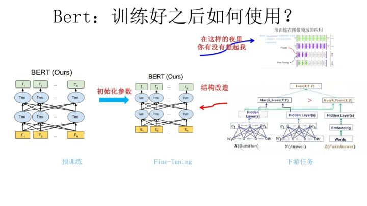

在fine-Tuning阶段，这个阶段的做法和GPT是一样的。当然，它也面临着下游任务网络结构改造的问题，在改造任务方面Bert和GPT有些不同，下面介绍一下。

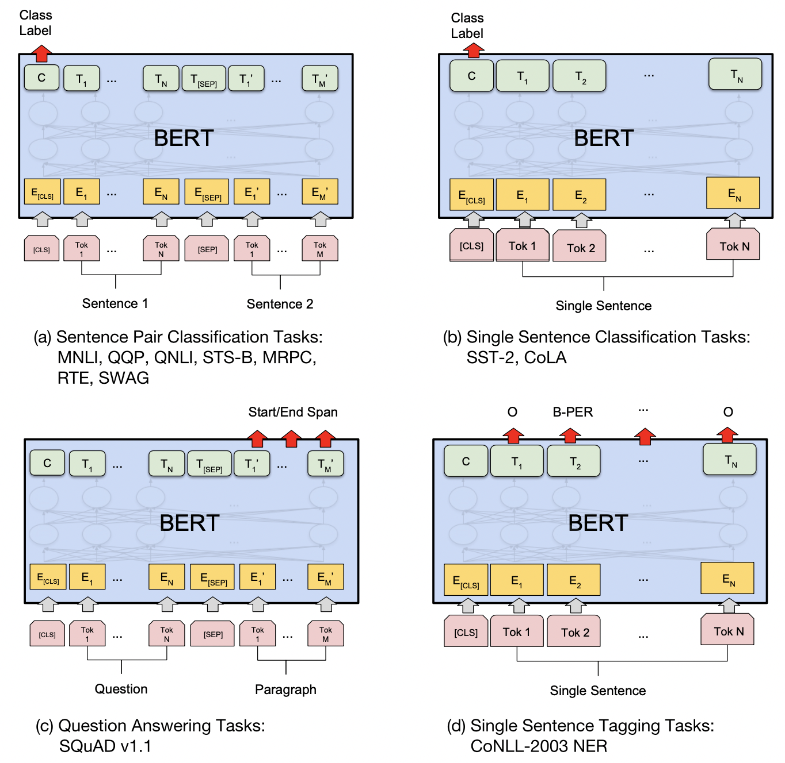

- 句子关系类任务

  输入端，和GPT类似，加上一个起始和终结符号，句子之间加个分隔符即可；输出端，把第一个起始符号（CLS）对应的Transformer最后一层位置上面串接一个softmax分类层即可。

- 单句分类任务

  输入端同GPT一样，对句子增加起始和终结符号，输入部分，和句子关系类任务一致。

- 阅读理解任务

  输入端和句子关系类任务一致（输入是问题和描述文本），在输出端，对描述文本部分的encoding vector接一个全连接层，最终得到答案起始和结束的位置。

- 序列标注任务

  输入端和单句分类任务一致，只需要输出部分Transformer最后一层每个单词对应位置都进行分类即可。

整体来看，NLP四大类任务（序列标注，分类，句子关系判断，生成式任务）都可以比较方便地改造成Bert能够接受的方式。这其实是Bert的非常大的优点，这意味着它几乎可以做任何NLP的下游任务，具备普适性，这是很强的。

#### 5.3.4 总结

BERT最后训练了两组参数的模型，BERT(base)（L=12, H=768, A=12, 整体参数量110M）和BERT(LARGE)（L=24,H=1024,A=16, 整体参数量340M）

其中L表示网络（transformer block）的层数，H表示隐层大小，A表示self-attention的数量。

- 优点

  - 在NLP领域创建了一个真正意义上的深度模型，在此之前ELMo模型整体也就是二层的BiLSTM
  - 提出了双向Transformer encoder表示，语言模型中利用了预测词的context（GPT是单向，ELMo虽然是双向但是分开训练，两个目标函数），学习到的表征能够融合两个方向上的context。
  - 预训练时采用MLM和NSP联合构建构建学习的目标函数（可以通俗理解为玩型填空和句对预测）。

  > 个人理解，加入MLM机制主要原因是想训练深层的语言模型，其次是单词的双向语言表征，如果不加入MLM，每个词预测的话，显然不适用深度模型；加入NSP为了增加两个句子之间的理解，实验证明这对QA和NLI任务有很大的帮助。

- 缺点

  - 在MLM中，随机mask一些token，默认词之间相互独立，这会损失一些信息，这个促使了XLNet的诞生。
  - 预训练阶段因为采取引入[Mask]标记来Mask掉部分单词的训练模式，而微调阶段是看不到这种被强行加入的Mask标记的，所以两个阶段存在使用模式不一致的情形，这可能会带来一定的性能损失

#### 5.3.5 Q&A

- 倘若不加MLM的话，也就是每个单词进行预测，来构建深层双向模型，会存在什么问题？

  过拟合
  
- 使用MLM的作用是啥？

  个人总结：充分学习一个词汇的context信息（双向信息），倘若不做MLM的，模型非常容易记住预测目标词汇，造成过拟合现象，且非常难学习到词汇的context信息，反之通过MLM机制增加模型的泛化学习能力；另外就是这种MLM的设计机制可以使得网络结构比较大（15%的mask词汇中挑选80%作为预测，10%随机填充，10%真实词汇），给模型增加了一些负面信息，让模型更加充分学习周围词汇的相关信息（或者说通过增加扰动迫使模型去学习更加深层的信息）。

  > 先整体进行介绍，然后再介绍具体的内部机制

- 简单介绍BERT模型？

  首先BERT（Bidirectional Encoder From Transformer）是基于一个双向编码的且基于Transformer的语言模型。其中双向是指同时考虑预测词汇的前文信息和后文信息。整体模式是预训练和微调。在预训练阶段创新性的采用了MaskedLM（学习预测词的上下文语义）和NSP（句子级别信息），模型搭建上，基于transformer网络进行了深层的堆叠，来捕获文本的深层语义，整体效果在NLP各个领域基本达到了SOTA效果。

### 5.4 GPT-2

#### 5.4.1 模型原理

GPT2整体仍然分为两阶段，第一阶段和之前类似，预训练，第二阶段则由之前的有监督的微调变为无监督的做下游NLP任务。

- 预训练

  

  如上图所示，GPT2仍然沿用GPT1的模型框架（仍然是采用Transformer做特征抽取，仍然采用单向语言模型作为学习目标），最大的不同之处在于模型参数量和数据方面。

  - 模型参数的变化

    常规的Transformer Big包含24个叠加的block，GPT2则将其增加至48个, batch_size为512，context size从512扩大到1024。

  - 数据方面的变化

    在这部分，论文讲了一大堆数据的重要性，例如数据量、数据多样性、数据**质量**等等对模型的影响。而本论文**旨在尽可能地构建和利用足够大且多样化的数据集，以便模型能应用到尽可能多的不同NLP任务上。**

    GPT2选择了800万互联网网页作为语言模型的训练数据，它们称为WebText，之后对这些数据做了数据质量的筛选，过滤出高质量的网页内容，最终收集的数据大约为40G。

    > 正是因为数据来源广泛所以可以认为是multi task或者multi domain，响应论文的名字

  - 模型输入

    word-levels容易出现OOV问题，byte-levels没有word-levels效果好，论文中采用一种折中方式Byte Pair Encoding，对频繁词和非频繁词做不同处理，将词拆分成子词。

- 无监督的下游任务

  对于下游任务，无需fine-tune，直接使用预训练的模型进行预测。

#### 5.4.2 总结

##### 5.4.2.1 模型分析

- 为什么GPT 2.0第二阶段不通过Finetuning去有监督地做下游任务呢？

  无监督地去做很多第二阶段的任务，只是GPT作者想说明在第一阶段Transformer学到了很多通用的包含各个领域的知识，第二部分各种实验是对这点的例证，如此而已。这是为何说第二阶段其实不重要，因为它不是论文的中心思想，而是说明中心思想的例子。

- GPT 2.0 既然第二阶段是无监督的任务，而它不做Finetuning，那么你训练好一个语言模型，它当然会根据输入的一句话，给你蹦出后面可能紧跟那个单词，这是标准的语言模型过程，这个正常。但是如果这时候让它去做一个文本摘要任务，它怎么知道它现在在做什么事情呢，根据输入，应该输出什么东西呢？

  其实GPT 2.0在做下游无监督任务的时候，给定输入（对于不同类型的输入，加入一些引导字符，引导GPT正确地预测目标，比如如果做摘要，在输入时候加入“TL：DR”引导字符串），它的输出跟语言模型的输出是一样的，就是蹦出一个单词。那么问题来了：对于比如摘要任务，我们期待的输出结果是一句话或者几句话，你给我一个单词，有点太小气，那该怎么办？很简单，继续一个字一个字往出蹦，按照这些字从系统里蹦出来的时间顺序连起来，就是你想要的摘要结果，这种所有任务采取相同的往出蹦字的输出模式也是有点意思的。就是说，**GPT2.0给出了一种新颖的生成式任务的做法，就是一个字一个字往出蹦，然后拼接出输出内容作为翻译结果或者摘要结果。**传统的NLP网络的输出模式一般需要有个序列的产生结构的，而GPT 2.0完全是语言模型的产生结果方式：一个字一个字往出蹦，没有输出的序列结构。

  > 上面内容应该就是关于GPT 2.0，最值得了解的部分以及它的核心思路和思想了。

- GPT2和BERT的关系？

  GPT2其实进一步验证了Bert这种两阶段是个非常有效的**无监督NLP语言知识编码**方法。进一步在哪里？它说明了第一个阶段的预训练过程，如果采用更高质量的数据，采用更宽泛的数据（Web数据量大了估计包含任何你能想到的领域），采用更大量的数据（WebText，800万网页），Transformer采用更复杂的模型（最大的GPT2.0模型是Transformer的两倍层深），那么在Transformer里能学会更多更好的NLP的通用知识。为什么是通用的？因为第二阶段不做任何fine-tuning就能达到更好的效果，而且是各种任务，说明通用性好，通用性好说明了学到了各种类型的语言知识；而这无疑，如果我们第二阶段仍然采取Finetuning，对下游任务的提升效果是可以很乐观地期待的。

- 预训练的改进模式？

  - **数据+模型参数**

    正如GPT2所做，加入越来越多高质量的各种类型的无监督数据，加深你的网络结构，让模型充分学习到各个领域的知识。

  - **多任务训练**

    类似微软提出的MT-DNN，加入各种新型的NLP任务数据，它的好处是有监督，能够有针对性的把任务相关的知识编码到网络参数里，所以明显的好处是学习目标明确，学习效率高；而对应的缺点是NLP的具体有监督任务，往往训练数据量少，于是包含的知识点少；而且有点偏科，学到的知识通用性不强，但这毕竟只是预训练阶段，仅是想通过这种方式让模型有针对性的学习到一些新知识。

##### 5.4.2.2 模型优缺点

模型整体来看改进之处就是数据扩容+参数扩容。

- 优点
  - 通过增大数据量以及改善数据质量的方式，证实了仅通过预训练就可以学到不同领域的通用知识
  - 采用了无监督的下游任务的方式，很容易经过改造后可以做很多的donwstream task，有很大的潜力。

- 缺点
  - 模型参数巨大，约1.5B，对硬件要求较高。
  - 未作fine-tuning，很多NLP任务的效果要远差于fine-tune的模型。

### 5.5 XLNet

#### 5.5.1 模型简介

2019年6月19日，Google推出了XLNet(Generalized Autoregressive Pretraining for Language Understanding)模型，在很多数据集上的效果均优于BERT。BERT利用文本的双向语境和denoising autoencoding的方式在很多数据集中取得了SOTA的效果，但是其采用的MLM（masked language model）忽略了预训练阶段和微调阶段的一致性，基于BERT存在一些不足，XLNet着重从两方面做了优化，

1. 通过打乱文本的方式来学习双向语境包含的信息
2. 使用自回归的方式建模，克服了BERT存在很多局限，同时借鉴了Transformer-XL，可以高效地处理长文本

#### 5.5.2 **Auto-Regressive** & **Auto-Encoder** 

XLNet引入了自回归语言模型（Auto-Regressive）以及自编码语言模型（Auto-Encoder）的提法，

- 自回归语言模型

  在ELMO/BERT出来之前，大家通常讲的语言模型其实是根据上文内容预测下一个可能跟随的单词，就是常说的自左向右的语言模型任务，或者反过来也行，就是根据下文预测前面的单词，这种类型的LM被称为自回归语言模型。

  GPT 就是典型的自回归语言模型。ELMO尽管看上去利用了上文，也利用了下文，但是本质上仍然是自回归LM，这个跟模型具体怎么实现有关系。ELMO是做了两个方向（从左到右以及从右到左两个方向的语言模型），但是是分别有两个方向的自回归LM，然后把LSTM的两个方向的隐节点状态拼接到一起，来体现双向语言模型这个事情的。所以其实是两个自回归语言模型的拼接，本质上仍然是自回归语言模型。

  自回归语言模型有优点有缺点，缺点是只能利用上文或者下文的信息，不能同时利用上文和下文的信息，当然，貌似ELMO这种双向都做，然后拼接看上去能够解决这个问题，因为融合模式过于简单，所以效果其实并不是太好。它的优点，其实跟下游NLP任务有关，比如生成类NLP任务，比如文本摘要，机器翻译等，在实际生成内容的时候，就是从左向右的，自回归语言模型天然匹配这个过程。

- 自编码语言模型

  自编码，将输入复制到输出。BERT的MLM就是自编码语言模型的一种。自回归语言模型只能根据上文预测下一个单词，或者反过来，只能根据下文预测前面一个单词。相比而言，Bert通过在输入X中随机Mask掉一部分单词，然后预训练过程的主要任务之一是根据上下文单词来预测这些被Mask掉的单词，如果你对Denoising Autoencoder比较熟悉的话，会看出，这确实是典型的DAE的思路。那些被Mask掉的单词就是在输入侧加入的所谓噪音。类似Bert这种预训练模式，被称为DAE LM。

  这种DAE LM的优缺点正好和自回归LM反过来，它能**比较自然地融入双向语言模型**，同时看到被预测单词的上文和下文，这是好处。缺点是啥呢？主要在输入侧引入[Mask]标记，**导致预训练阶段和微调阶段不一致的问题**，因为微调阶段是看不到[Mask]标记的。DAE吗，就要引入噪音，[Mask] 标记就是引入噪音的手段，这个正常。

接下来主要讨论XLNet主要的改进。

#### 5.5.3 模型创新点

##### 5.5.3.1 **Permutation Language Modeling**

Bert的自编码语言模型也有对应的缺点，就是XLNet在文中指出的两个，

- 预训练阶段因为采取引入[Mask]标记来Mask掉部分单词的训练模式，而微调阶段是看不到这种被强行加入的Mask标记的，所以两个阶段存在使用模式不一致的情形，这可能会带来一定的性能损失
- Bert在第一个预训练阶段，假设句子中多个单词被Mask掉，这些被Mask掉的单词之间没有任何关系，是条件独立的，而有时候这些单词之间是有关系的，XLNet则考虑了这种关系。

XLnet则是想在去掉上面提到的条件独立的假设下，充分利用双向文本信息。XLNet提取了Permutation Language Modeling这种机制进行建模，如下图所示，这也是本文最大的创新点。

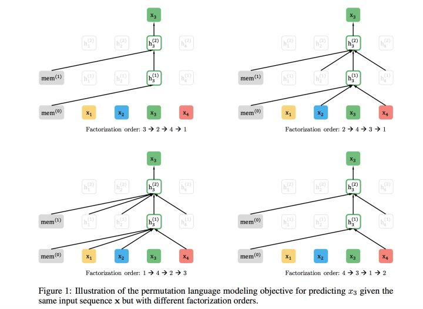

XLNet是想通过自回归的方式来进行语言建模，但是希望利用到双向语言信息，那么需要解决的问题便是怎么能够在单词Ti（需要预测）的上文中Contenxt_before中揉入下文Context_after的内容呢？

- 理论上

  比如包含单词Ti的当前输入的句子X由x1,x2,x3,x4四个单词顺序构成。我们假设，其中，要预测的单词Ti是x3，位置在Position 3，要想让它能够在上文Context_before中，也就是Position 1或者Position 2的位置看到Position 4的单词x4。可以这么做：假设我们固定住x3所在位置，就是它仍然在Position 3，之后**随机排列组合句子中的4个单词，在随机排列组合后的各种可能里，再选择一部分作为模型预训练的输入X**。比如随机排列组合后，抽取出x4,x2，x3,x1这一个排列组合作为模型的输入X。于是，x3就能同时看到上文x2，以及下文x4的内容了。这就是permutation的基本思想。

  这种方式看上去仍然是个自回归的从左到右的语言模型，但是其实通过对句子中单词排列组合，把一部分Ti下文的单词排到Ti的上文位置中，于是，就看到了上文和下文，但是形式上看上去仍然是从左到右在预测后一个单词。

- 实现上

  XLNet采取了Attention掩码的机制，你可以理解为，当前的输入句子是X，要预测的单词Ti是第i个单词，前面1到i-1个单词，在输入部分观察，并没发生变化，该是谁还是谁。但是在Transformer内部，通过Attention掩码，从X的输入单词里面，也就是Ti的上文和下文单词中，随机选择i-1个，放到Ti的上文位置中，把其它单词的输入通过Attention掩码隐藏掉，于是就能够达成我们期望的目标（当然这个所谓放到Ti的上文位置，只是一种形象的说法，其实在内部，就是通过Attention Mask，把其它没有被选到的单词Mask掉，不让它们在预测单词Ti的时候发生作用，如此而已。看着就类似于把这些被选中的单词放到了上文Context_before的位置了）。具体实现的时候，XLNet是用**双流自注意力**实现的，细节可以参考论文，但是基本思想就如上所述，双流自注意力机制只是实现这个思想的具体方式，理论上，你可以想出其它具体实现方式来实现这个基本思想，也能达成让Ti看到下文单词的目标。

###### 5.5.3.1.1 **双流自注意力**

双流自注意力，如下图所示，包含两种自注意力，

1. Content stream attention，和标准的self-attention是一致的

2. Query stream attention，不可以看见当前位置的token信息

   其主要用来代替Bert的那个[Mask]标记的，因为XLNet希望抛掉[Mask]标记符号，但是比如知道上文单词x1,x2，要预测单词x3，此时在x3对应位置的Transformer最高层去预测这个单词，但是输入侧不能看到要预测的单词x3，Bert其实是直接引入[Mask]标记来覆盖掉单词x3的内容的，等于说[Mask]是个通用的占位符号。而XLNet因为要抛掉[Mask]标记，但是又不能看到x3的输入，于是Query流，就直接忽略掉x3输入了，只保留这个位置信息，用参数w来代表位置的embedding编码。其实XLNet只是扔了表面的[Mask]占位符号，内部还是引入Query流来忽略掉被Mask的这个单词。和Bert比，只是实现方式不同而已。

>    **预训练阶段最终预测只使用query stream，因为content stream已经见过当前token了。在fine-tune阶段使用content stream，又回到了传统的self-attention结构。**
>
>    因为不像MLM只用预测部分token，还需要计算permutation，XLNet的计算量更大了，因此作者提出了partial prediction进行简化，即只预测后面1/K个token。

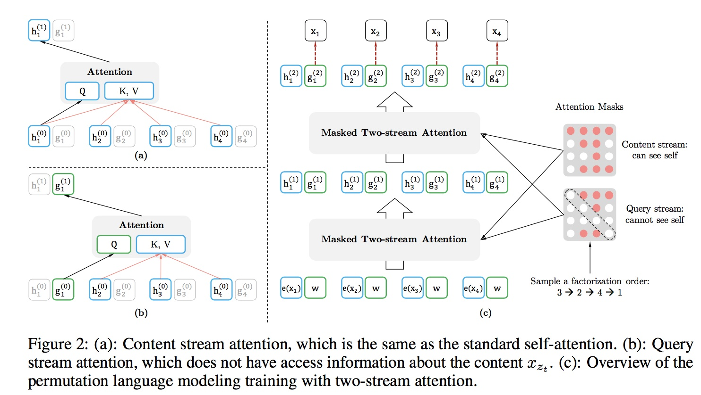

> 上面的矩阵（Query stream attention）中，第一行表示x1可以看到x2,x3,x4，不可以看到自身，即x1，这和上面提到的一致（在预测阶段使用Query steam attention，不能看见预测目标（自身））。同理，第二三四行分别表示x2、x3和x4可以看到的信息。

##### 5.5.3.2  Incorporating Ideas from Transformer-XL

另外一大改进便是将Transformer-XL的思想融入XLNet中。

由于内存和算力的限制，目前长文本都需要进行截断处理，比如BERT的长度是512，无法直接处理长篇文章。为了学习到更长距离的信息，作者参考RNN的隐藏记忆单元，提出Transformer-XL（也是Zhilin Yang和Zihang Dai等人提出的），试图把之前的信息记录下来，让之后的文本片段可以读到之前片段的信息，这样便可以学习到整篇文本的信息。

所以说Transformer-XL的引用主要是用来处理长文本，为了学习到更长距离的信息，后面实验也可以看出，在类似阅读理解任务中，XLNet要显著的优于BERT。

##### 5.5.3.3 Modeling Multiple Segments

BERT采用的NSP(Next Sequence Prediction)，是对两个片段进行建模，XLNet起始也采用了类似的思路，但是发现提升不明显，而后借鉴了Transformer-XL，采用了相对位置编码（Relative Segment Encodings）这种方式，BERT中使用的绝对位置编码。

**相对位置编码的核心思想是仅考虑两个位置是否在同一个片段中，而不是他们属于哪一个片段。**

#### 5.5.4 Comparison with BERT

同BERT进行比较来看，两者仍然沿用了两阶段（预训练+微调）的语言模型，而其不同之处则是上面提出的XLNet三个创新点（PLM/借鉴Transformer-XL处理长文本/对多片段建模）。

接下来着重拿PLM(Permutation Language Model)和BERT比较一下，PLM是XLNet的核心创新点，下面的比较主要参考了张俊林老师的[XLNet:运行机制及和Bert的异同比较](https://zhuanlan.zhihu.com/p/70257427)。

- BERT预训练里带有[Mask]标记导致的和微调过程不一致的问题

  尽管看上去，XLNet在预训练机制引入的Permutation Language Model这种新的预训练目标，和BERT采用Mask标记这种方式，有很大不同。其实深入思考一下，会发现，两者本质是类似的。区别主要在于：BERT 是直接在输入端显式地通过引入Mask标记，在输入侧隐藏掉一部分单词，让这些单词在预测的时候不发挥作用，要求利用上下文中其它单词去预测某个被Mask掉的单词；而XLNet则抛弃掉输入侧的Mask标记，通过Attention Mask机制，在Transformer内部随机Mask掉一部分单词（这个被Mask掉的单词比例跟当前单词在句子中的位置有关系，位置越靠前，被Mask掉的比例越高，位置越靠后，被Mask掉的比例越低），让这些被Mask掉的单词在预测某个单词的时候不发生作用。所以，本质上两者并没什么太大的不同，只是Mask的位置，Bert更表面化一些，XLNet则把这个过程隐藏在了Transformer内部而已， 这样，就可以抛掉表面的[Mask]标记。

- BERT里面被Mask掉单词的相互独立问题

  论文中提到，BERT中存在的词独立假设会使得模型学习不到目标词之间的依赖。

  一个例子为例，假设句子为[New, York, is, a, city]。假设BERT和XLNet均挑选[New, York]作为预测目标，那么两者的的目标函数分别为：
  $$
  \begin{cases}
  Loss_{bert} = \log p(\rm{New}| \rm{is}\ \rm{a}\ \rm{city}) + \log p(\rm{York} | \rm{is}\ \rm{a}\ \rm{city}) \\
  Loss_{xlnet} = \log p(\rm{New}| \rm{is}\ \rm{a}\ \rm{city}) + \log p(\rm{York} | \rm{New}\ \rm{is}\ \rm{a}\ \rm{city})
\end{cases}
  $$

  上面可以看出XLNet可以学习到pair(New, York)之间的依赖关系，而BERT则忽略了这种关系的学习，整体来看XLNet学习到的关系要多于BERT。
  
  不过张俊林老师在其文章中指出：在预测某个被Mask单词的时候，其它被Mask单词不起作用，这个问题，你深入思考一下，其实是不重要的，因为XLNet在内部Attention Mask的时候，也会Mask掉一定比例的上下文单词，只要有一部分被Mask掉的单词，其实就面临这个问题。而如果训练数据足够大，其实不靠当前这个例子，靠其它例子，也能弥补被Mask单词直接的相互关系问题，因为总有其它例子能够学会这些单词的相互依赖关系（仅是张老师的观点，未见得准确）。

#### 5.5.5 总结

整体来看，XLNet就是围绕着BERT存在的一些缺点而提出了一系列改进方案，但是也保留了当前BERT和其它一些模型的有点，比如GPT2和Transformer-XL，在预训练阶段通过PLM(Permutation Language Model)，吸收了BERT的双向语言模型优势；GPT2的核心是采用了更过且质量更好的数据来预训练，这个特点同样被XLNet吸收进来；同样借鉴了Transformer-XL的思想来处理长文本以及通过相对位置编码来处理多输入片段。

最后结合实验效果来看，最终XLNet起作用的，宏观归纳一下三个因素：

1. PLM(Permutation Language Model)

   采用这种方式主要是为了在自回归的模式下，来融入双向语言信息，BERT中采用的MLM(masked language model)，这种方式存在两个问题，一个是默认假设了token间是相互独立，在学习时也会损失一些token依赖信息；另外一个则是会导致预训练阶段和fine tune阶段模式不一致。

2. 引入Tranformer-XL的思路

   主要引用包含两点，一个是分段RNN机制，可以处理更长的文本信息；另外一个是相对位置编码，可以对更多的片段提取更多信息。

3. 增加了预训练阶段使用的数据规模以及质量

   这部分思路感觉是借鉴了GPT2的想法，大数据量+高质量的数据可以极大提升预训练的效果。

#### 5.5.6 Q&A

- 介绍一下XLNet模型

  XLNet（Generalized Autoregressive Pretraining for Language Understanding）整体采用的模式是预训练+微调的模式，预训练阶段采用了自回归（auto-regressive）的思想，其核心创新点通过引入了PLM(Permutation Language Model)的机制融入了双向语言信息，引入了transformer-xl的思想来处理长文本，采用相对位置编码对多片段进行编码。

## 6. NLP任务模型

该部分主要总结目前比较常见的NLP任务，并说明其常用的解决方案。

### 6.1 文本分类


## 7. NLP Q&A

### 7.1 nlp中的词向量对比

- 文本表示的方法有哪些？
  - 基于one-hot、tf-idf、textrank等的bag-of-words；
  - 主题模型：LSA（SVD）、pLSA、LDA；
  - 基于词向量的固定表征：word2vec、fastText、glove
  - 基于词向量的动态表征：elmo、GPT、bert


## References

- [NLP基本任务](https://blog.csdn.net/lz_peter/article/details/81588430)
- [张俊林-知乎分享](https://www.zhihu.com/question/68482809/answer/264632289)
- [Attention Is All You Need](https://mp.weixin.qq.com/s/RLxWevVWHXgX-UcoxDS70w)
- [谷歌开源先进语言模型 Transformer-XL：集 Transformer 和 RNN 之大成](https://www.infoq.cn/article/wt-KaTfcsAv9E7exzIkF)
- [CMU、谷歌提出Transformer-XL：学习超长上下文关系](https://www.jiqizhixin.com/articles/2019-01-18-5)
- [ELMo原理解析及简单上手使用](https://zhuanlan.zhihu.com/p/51679783)
- [自然语言处理中的语言模型预训练方法（ELMo、GPT和BERT）](https://www.cnblogs.com/robert-dlut/p/9824346.html)
- [BERT详解](https://zhuanlan.zhihu.com/p/48612853)
- [图解BERT模型：从零开始构建BERT](https://cloud.tencent.com/developer/article/1389555)
- [如何评价 BERT 模型？](https://www.zhihu.com/question/298203515)
- [从Word Embedding到Bert模型—自然语言处理中的预训练技术发展史](https://zhuanlan.zhihu.com/p/49271699)
- [论文分享 -- > NLP -- > Language Models are Unsupervised Multitask Learners](https://blog.csdn.net/Mr_tyting/article/details/90722663)
- [效果惊人的GPT 2.0模型：它告诉了我们什么](https://zhuanlan.zhihu.com/p/56865533)
- [如何评价openAI GPT-2?](https://www.zhihu.com/question/312405015)
- [GPT,GPT2,Bert,Transformer-XL,XLNet论文阅读速递](https://zhuanlan.zhihu.com/p/72985558)
- [XLNet:运行机制及和Bert的异同比较](https://zhuanlan.zhihu.com/p/70257427)
- [【NLP】XLNet粗读](https://zhuanlan.zhihu.com/p/70218096)
- [Word2Vec详解](https://zhuanlan.zhihu.com/p/61635013)
- [[NLP] 秒懂词向量Word2vec的本质](https://zhuanlan.zhihu.com/p/26306795)
- [word2vec -- 负采样 -- skip-gram](https://www.jianshu.com/p/fd7efc2ddb88)
- [fastText原理及实践](https://zhuanlan.zhihu.com/p/32965521)
- [NLP︱高级词向量表达（二）——FastText（简述、学习笔记）](https://blog.csdn.net/sinat_26917383/article/details/54850933)
- [深入浅出讲解语言模型](https://zhuanlan.zhihu.com/p/28080127)

- [自然语言处理之语言模型（LM）](https://blog.csdn.net/qq_36330643/article/details/80143960)

- [关于Transformer，面试官们都怎么问](https://mp.weixin.qq.com/s?__biz=MzIxMzkwNjM2NQ==&mid=2247484333&idx=1&sn=7e26a0dc657af9373ce384db94b9b1e1&chksm=97aee57fa0d96c69ce36f58c9ef7ca0a9b4f4cfa9816a8d6295a54dcbe55f29a04ca69630eb4&scene=21#wechat_redirect)


