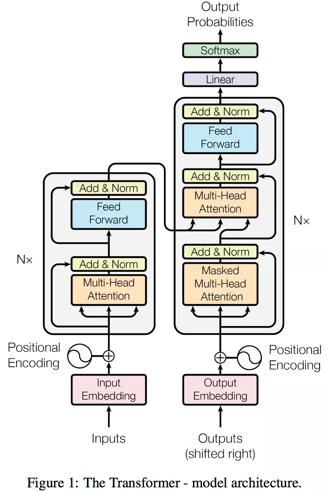
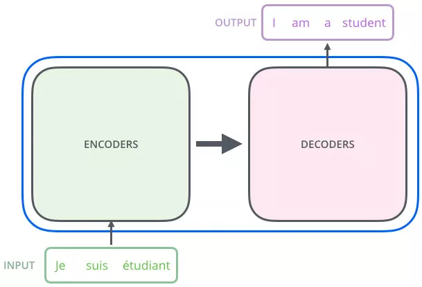
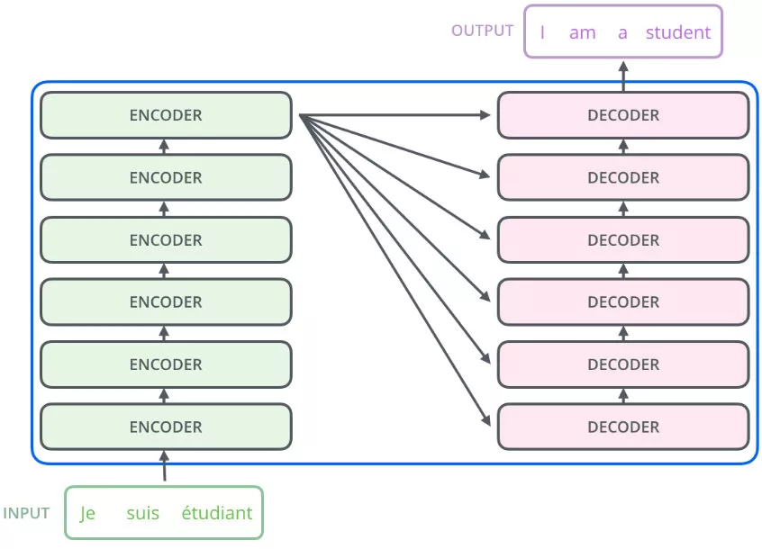
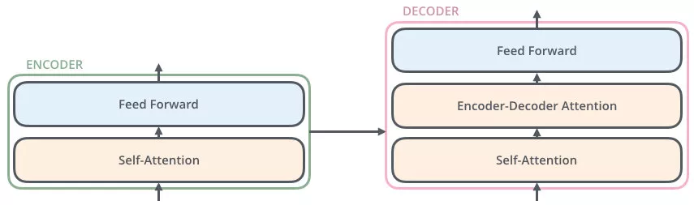
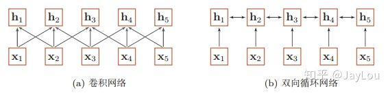

[TOC]

# NLP

## 1. NLP基本任务概述

### 1.1 句法分析（Lexical Analysis）

句法分析是对自然语言词汇层面的分析，是NLP中最基础的工作，主要包括如下

- **分词（Word Segmentation/Tokenization）**

  对没有明显边界的文本进行切分，得到词序列

- 新词发现（New Words Identification）

  找出文本中具有新形势、新意义或是新用法的词

- 形态分析（Morphological Analysis）

  分析单词的形态组成，包括词干（Sterms）、词根（Roots）、词缀（Prefixes and Suffixes）等

- 词性标注（Part-of-speech Tagging）
  确定文本中每个词的词性。词性包括动词（Verb）、名词（Noun）、代词（pronoun）等
  
- 拼写校正（Spelling Correction）
  找出拼写错误的词并进行纠正

### 1.2 句子分析（Sentence Analysis）

对自然语言进行句子层面的分析，包括句法分析和其他句子级别的分析任务

- 组块分析（Chunking）

  标出句子中的短语块，例如名词短语（NP），动词短语（VP）等

- 超级标签标注（Super Tagging）

  给每个句子中的每个词标注上超级标签，超级标签是句法树中与该词相关的树形结构

- 成分句法分析（Constituency Parsing）

  分析句子的成分，给出一棵树由终结符和非终结符构成的句法树

- 依存句法分析（Dependency Parsing）

  分析句子中词与词之间的依存关系，给一棵由词语依存关系构成的依存句法树

- **语言模型（Language Modeling）**

  对给定的一个句子进行打分，该分数代表句子合理性（流畅度）的程度

- 语种识别（Language Identification）

  给定一段文本，确定该文本属于哪个语种

- 句子边界检测（Sentence Boundary Detection）

  给没有明显句子边界的文本加边界

### 1.3 语义分析（Semantic Analysis）

对给定文本进行分析和理解，形成能勾够表达语义的形式化表示或分布式表示

- 词义消歧（Word Sense Disambiguation）

  对有歧义的词，确定其准确的词义

- 语义角色标注（Semantic Role Labeling）

  标注句子中的语义角色类标，语义角色，语义角色包括施事、受事、影响等

- 抽象语义表示分析（Abstract Meaning Representation Parsing）

  AMR是一种抽象语义表示形式，AMR parser把句子解析成AMR结构

- 一阶谓词逻辑演算（First Order Predicate Calculus）

  使用一阶谓词逻辑系统表达语义

- 框架语义分析（Frame Semantic Parsing）

  根据框架语义学的观点，对句子进行语义分析

- **词汇/句子/段落的向量化表示（Word/Sentence/Paragraph Vector）**

  研究词汇、句子、段落的向量化方法，向量的性质和应用

### 1.4 信息抽取（Information Extraction）

从无结构文本中抽取结构化的信息

- **命名实体识别（Named Entity Recognition）**

  从文本中识别出命名实体，实体一般包括人名、地名、机构名、时间、日期、货币、百分比等

- 实体消歧（Entity Disambiguation）

  确定实体指代的现实世界中的对象

- 术语抽取（Terminology/Giossary Extraction）

  从文本中确定术语

- 共指消解（Coreference Resolution）

  确定不同实体的等价描述，包括代词消解和名词消解

- 关系抽取（Relationship Extraction）

  确定文本中两个实体之间的关系类型

- 事件抽取（Event Extraction）

  从无结构的文本中抽取结构化事件

- **情感分析（Sentiment Analysis）**

  对文本的主观性情绪进行提取

- 意图识别（Intent Detection）

  对话系统中的一个重要模块，对用户给定的对话内容进行分析，识别用户意图

- 槽位填充（Slot Filling）

  对话系统中的一个重要模块，从对话内容中分析出于用户意图相关的有效信息

### 1.5 顶层任务（High-level Tasks）

直接面向普通用户，提供自然语言处理产品服务的系统级任务，会用到多个层面的自然语言处理技术

- 机器翻译（Machine Translation）：通过计算机自动化的把一种语言翻译成另外一种语言
- 文本摘要（Text summarization/Simplication）：对较长文本进行内容梗概的提取
- 问答系统（Question-Answering Systerm）：针对用户提出的问题，系统给出相应的答案
- 对话系统（Dialogue Systerm）：能够与用户进行聊天对话，从对话中捕获用户的意图，并分析执行
- 阅读理解（Reading Comprehension）：机器阅读完一篇文章后，给定一些文章相关问题，机器能够回答
- 自动文章分级（Automatic Essay Grading）：给定一篇文章，对文章的质量进行打分或分级
- 文本分类（Text Classification）：对于文本预测相应的类别
- 知识图谱（Knowledge Graph）:知识点互相连接而成的语义网络

## 2. NLP相关模型

[这篇文章](https://mp.weixin.qq.com/s?__biz=MzA4MTk3ODI2OA==&mid=2650344227&idx=1&sn=a40c9f90fb58d8a28713d01214f41f00&chksm=87811dd0b0f694c615a4ecad32dceb9cabf425d25f231a1e3df5295807e8d4e9d84730dd7fa7&mpshare=1&scene=1&srcid=&sharer_sharetime=1567043328434&sharer_shareid=e53fc678b87c854a7577418ee1c671ac&pass_ticket=6%2BFt82b20NkDrXw7JtruZMEmpKehLR8Y1SJBjeUyIHfZ%2FAO1GgK5sIACDx8vanDS#rd)提及了NLP的一些主流模型。

- 词向量的表示模型（word embedding）

  [word2vec(2013)](https://blog.csdn.net/itplus/article/details/37969519)，[glove(2014)](http://www.fanyeong.com/2018/02/19/glove-in-detail/)，fasttext(2016)

  > [该文章](https://blog.csdn.net/sinat_26917383/article/details/54850933)对glove，fasttext和wordrank做了讲述和对比，比较详细。
  
- RNN的改进和扩展

  - LSTM/GRU
  - Seq2Seq
  - Attention(2014)
  - Transfomer(2017.6, self-attention)
  - Transfoer-XL(2019.1)

  对于文本类型的数据，常用的方法就是使用RNN模型，它主要针对的任务类型为N vs N，N vs 1，1 vs N，其中N vs N表示N个输入和N个输出，其余类似。当输入输出不定长时，任务类型为N vs M时，原生的RNN模型有一定的局限，延伸的一个变种叫作Encoder-Decoder模型，也称之为Seq2Seq模型，像机器翻译，原始的输入和输出一般情况下是不等长的，之后在此基础上引入了attention机制，再之后引入了self-attention机制。

  > 该[文章](https://zhuanlan.zhihu.com/p/28054589)大致罗列了RNN模型和seq2seq以及Attention机制

  *Attention机制最早是在视觉图像领域提出来的，应该是在九几年思想就提出来了，但是真正火起来应该算是2014年google mind团队的这篇论文《Recurrent Models of Visual Attention》，他们在RNN模型上使用了attention机制来进行图像分类。随后，Bahdanau等人在论文《Neural Machine Translation by Jointly Learning to Align and Translate》中，使用类似attention的机制在机器翻译任务上将翻译和对齐同时进行，他们的工作算是第一个将attention机制应用到NLP领域中。接着attention机制被广泛应用在基于RNN/CNN等神经网络模型的各种NLP任务中。2017年，google机器翻译团队发表的《Attention is all you need》中大量使用了自注意力（self-attention）机制来学习文本表示。自注意力机制也成为了大家近期的研究热点，并在各种NLP任务上进行探索。下图维attention研究进展的大概趋势。*

- Contextual Word Embedding

  产生背景：标注数据量不足，难以学到复杂的上下文表示，想利用非标注数据进行学习。

  [这篇文章](https://zhuanlan.zhihu.com/p/56382372)对nlp中的词向量对比：word2vec/glove/fastText/elmo/GPT/bert做了阐述。
  
  - [ELMo(2018.3, bi-lstm)](https://zhuanlan.zhihu.com/p/51679783) 之后紧跟着出现了ULMFit和GPT
  - OpenAI GPT(2018.6, transformer)
  - BERT(2018.10, transformer)
  - XLNet(2019.6.19, transfomer-xl)
  

接下来对上面核心几部分一一进行学习。

## 3. 词向量（WordEmbedding）

这部分主要复习word2vec、fasttext和glove

### 3.1 word2vec

### 3.2 fasttext

### 3.3 glove

## 4. Seq2seq的改进

有关RNN的基础模型，类似LSTM和GRU已在**深度学习篇章**进行了总结，这里不再赘述。主要从Attention和Self-Attention机制入手。

有关Attention的介绍，张俊林老师在[知乎的分享](https://www.zhihu.com/question/68482809/answer/264632289)非常简洁明了，有关Self-Attention和Transformer，[这篇分享](https://mp.weixin.qq.com/s/RLxWevVWHXgX-UcoxDS70w)对Attention Is All You Need这篇论文做了详细的解读，简洁明了。

关于Transformer，本质相当于是一个Seq2Seq模型。

### 4.1 Attention机制

深度学习中的注意力机制从本质上讲和人类的选择性视觉注意力机制类似，**核心目标也是从众多信息中选择出对当前任务目标更关键的信息。**

目前大多数注意力模型附着在Encoder-Decoder框架下，**注意力模型是一种通用的思想，本身并不依赖特定的框架**。

下面首先大致过一遍Encoder-Decoder的框架，然后通过Encoder-Decoder框架来理解attention机制，最后引出attention机制的本质思想。

#### 4.1.1 Encoder-Decoder框架

Encoder-Decoder框架如下图，

文本处理领域的Encoder-Decoder框架可以这么直观地去理解：可以把它看作适合**处理由一个句子（或篇章）生成另外一个句子（或篇章）**的通用处理模型。对于句子对<Source,Target>，我们的目标是给定输入句子Source，期待通过Encoder-Decoder框架来生成目标句子Target。Source和Target可以是同一种语言，也可以是两种不同的语言。而Source和Target分别由各自的单词序列构成，$\rm{Source} = <x_1, x_2, \ldots, x_m>, \rm{Target}=<y_1, y_2, \ldots, y_n>$，即输入是$m$个词汇的序列，输出是$n$词汇的序列。

- Encoder

  Encoder顾名思义就是对输入句子Source进行编码，将输入句子通过非线性变换转化为中间语义表示$C$，
  $$
  C = F(<x_1, x_2, \ldots, x_m>)
  $$

- Decoder

  对于解码器Decoder来说，其任务是根据句子Source的中间语义表示C和之前已经生成的历史信息($y_1, y_2, \ldots, y_{i-1}$)来生成$i$时刻要生成的词汇，如下，
  $$
  y_{i}=G(C, y_1, y_2, \ldots, y_{i-1})
  $$
  

在文本领域，如果Source是中文句子，Target是英文句子，那么这就是解决机器翻译问题的Encoder-Decoder框架；如果Source是一篇文章，Target是概括性的几句描述语句，那么这是文本摘要的Encoder-Decoder框架；如果Source是一句问句，Target是一句回答，那么这是问答系统或者对话机器人的Encoder-Decoder框架。

在语音识别领域，则Encoder部分输入的是语音流，Decoder输出部分是对应的文本识别信息，显然这对应语音转文本任务；在图像领域，Encoder部分输入的一张图片，Decoder部分输出对应的文本信息，往往这是图像描述任务。

> 一般而言，文本处理和语音识别的Encoder部分通常采用RNN模型，图像处理的Encoder一般采用CNN模型。

#### 4.1.2 Attention In Encoder-Decoder

在上面提及的Encoder-Decoder框架中，是没有使用attention机制的，或者可以说是注意力不集中的“分心模型”，为什么是分心呢，假设输出$<y_1,y_2,y_3>$，则生成的过程如下，
$$
\begin{aligned}
y_1 &= G(C) \\
y_2 &= G(C, y_1) \\
y_3 &= G(C, y_1, y_2)
\end{aligned}
$$
其中$C$为Encoder阶段生成的中间语意表示，函数$G$为Decoder中使用的非线性变换函数。

从上面$<y_1,y_2,y_3>$生成过程可以看出，无论生成哪个词汇，它们对输入句子的使用都是中间的语义编码，没有任何区别，语义编码$C$是由句子Source的每个单词经过Encoder 编码产生的，这意味着不论是生成哪个单词，$y_1$,$y_2$还是$y_3$，**其实句子Source中任意单词对生成某个目标单词$y_i$来说影响力都是相同的**，这是为何说这个模型没有体现出注意力的缘由。这类似于人类看到眼前的画面，但是眼中却没有注意焦点一样。

以机器翻译任务（input：Tom chase Jerry, output: 汤姆追逐杰瑞）为例，

在翻译“杰瑞”这个中文单词的时候，分心模型里面的每个英文单词对于翻译目标单词“杰瑞”贡献是相同的，很明显这里不太合理，显然“Jerry”对于翻译成“杰瑞”更重要，但是分心模型是无法体现这一点的，这就是为何说它没有引入注意力的原因。没有引入注意力的模型在输入句子比较短的时候问题不大，但是如果输入句子比较长，此时所有语义完全通过一个中间语义向量来表示，单词自身的信息已经消失，可想而知会丢失很多细节信息，这也是为何要引入注意力模型的重要原因。上面的例子中，如果引入Attention模型的话，应该在翻译“杰瑞”的时候，体现出英文单词对于翻译当前中文单词不同的影响程度，比如给出类似下面一个概率分布值：（Tom,0.3）(Chase,0.2) (Jerry,0.5)，每个英文单词的概率代表了翻译当前单词“杰瑞”时，注意力分配模型分配给不同英文单词的注意力大小。这对于正确翻译目标语单词肯定是有帮助的，因为引入了新的信息。

同理，**目标句子中的每个单词都应该学会其对应的源语句子中单词的注意力分配概率信息**。这意味着在生成每个单词 $y_i$的时候，原先都是相同的中间语义表示$C$会被替换成根据当前生成单词而不断变化的$C_i$。理解Attention模型的关键就是这里，即由固定的中间语义表示$C$换成了根据当前输出单词来调整成加入注意力模型的变化的$C_i$。

增加了注意力模型的Encoder-Decoder框架理解起来如下所示。

则$y_1,y_2,y_3$的生成过程变为
$$
\begin{aligned}
y_1 &= G(C_1) \\
y_2 &= G(C_2, y_1) \\
y_3 &= G(C_3, y_1, y_2)
\end{aligned}
$$
其中每个$C_i$ 可能对应着不同的源语句子单词的注意力分配概率分布，比如对于上面的英汉翻译来说，其对应的信息可能如下：

其中，f2函数代表Encoder对输入英文单词的某种变换函数，比如如果Encoder是用的RNN模型的话，这个f2函数的结果往往是某个时刻输入$x_i$后隐层节点的状态值；g代表Encoder根据单词的中间表示合成整个句子中间语义表示的变换函数，一般的做法中，g函数就是对构成元素加权求和，即下列公式：
$$
C_i = \sum_{j=1}^{L_x} a_{ij} \cdot h_j
$$
其中，$L_x$代表输入句子Source的长度，$a_{ij}$代表在Target输出第$i$个单词时Source输入句子中第j个单词的注意力分配系数，而$h_j$则是Source输入句子中第$j$个单词的语义编码。以上面的例子来看，$L_x$显然为3，$i$代表“汤姆”，j=1,2,3分别代表Tom, Chase, Jerry, $a_{ij}$表示“汤姆”和单词Tom, Chase, Jerry的关联程度，分别取值为0.6, 0.2, 0.2; $h_j$表示每个单词的语义编码。

- 注意力分配概率分布值的确定（$a_{ij}$的确定）

  以RNN模型为例，下图是采用RNN模型作为Encoder和Decoder的架构，无attention机制，如下，

  

  引入attention机制后，可以表述为，

  
  
  对于采用RNN的Decoder来说，在时刻$i$，如果要生成$y_i$ 单词，我们是可以知道Target在生成$y_i$ 之前的时刻i-1时，隐层节点$i-1$时刻的输出值$H_{i-1}$的，而我们的目的是要计算生成$y_i$ 时输入句子中的单词“Tom”、“Chase”、“Jerry”对$y_i$来说的注意力分配概率分布，那么可以用Target输出句子$i-1$时刻的隐层节点状态$H_{i-1}$去一一和输入句子Source中每个单词对应的RNN隐层节点状态$h_j$进行对比，即通过函数$F(h_j, H_{i-1})$来获得目标单词yi和每个输入单词对应的对齐可能性，这个$F$函数在不同论文里可能会采取不同的方法，然后函数$F$的输出经过Softmax进行归一化就得到了符合概率分布取值区间的注意力分配概率分布数值。
  
  **绝大多数Attention模型都是采取上述的计算框架来计算注意力分配概率分布信息，区别只是在F的定义上可能有所不同。**一般在自然语言处理应用里会把Attention模型看作是输出Target句子中某个单词和输入Source句子每个单词的对齐模型。

#### 4.1.3 Attention本质思想

如果把Attention机制从上面讲述例子中的Encoder-Decoder框架中剥离，并进一步做抽象，可以更容易看懂Attention机制的本质思想，如下，

在上图中，我们输入Source构成元素想象成是由一系列的<Key,Value>数据对构成，此时给定Target中的某个元素Query，通过计算Query和各个Key的相似性或者相关性，得到每个Key对应Value的权重系数，然后对Value进行加权求和，即得到了最终的Attention数值。**所以本质上Attention机制是对Source中元素的Value值进行加权求和，而Query和Key用来计算对应Value的权重系数。**

即可以将其本质思想改写为如下公式：
$$
\rm{Attention}(Query, Source)=\sum_{i=1}^{L_x}Similarity(Query, Key_i)*Value_i
$$
其中$L_x=||\rm{Source}||$代表输入Source的长度。

在上面列举的例子中，此时Key和Value是一样的，都是指$h_j$。

当然，从概念上理解，**把Attention仍然理解为从大量信息中有选择地筛选出少量重要信息并聚焦到这些重要信息上，忽略大多不重要的信息**，这种思路仍然成立。聚焦的过程体现在权重系数的计算上，权重越大越聚焦于其对应的Value值上，即权重代表了信息的重要性，而Value是其对应的信息。

> Attention另外一种解释，也可以将Attention机制看作一种软寻址（Soft Addressing）:Source可以看作存储器内存储的内容，元素由地址Key和值Value组成，当前有个Key=Query的查询，目的是取出存储器中对应的Value值，即Attention数值。通过Query和存储器内元素Key的地址进行相似性比较来寻址，之所以说是软寻址，指的不像一般寻址只从存储内容里面找出一条内容，而是可能从每个Key地址都会取出内容，取出内容的重要性根据Query和Key的相似性来决定，之后对Value进行加权求和，这样就可以取出最终的Value值，也即Attention值。

**attention的计算过程**

可以将其计算过程大致抽象为三个过程，如下图，

- 第一阶段（根据Query和Key计算两者的相似性或者相关性）

  此阶段需要衡量$\rm{Query}$和$Key_i$的相关性，衡量的方式有多种，

  

- 第二阶段（第一阶段的的分值进行归一化处理）

  对第一阶段得出的值进行归一化，往往采用Softmax方式，
  $$
  a_i = Softmax(Sim_i)=\frac{e^{Sim_i}}{\sum_{j=1}^{L_x}e^{Sim_j}}
  $$

- 第三阶段（根据权重系数对Value进行加权求和）

  根据第二阶段得出的权重系数，对Value值进行加权求和即可，
  $$
  Attention(Query, Source)=\sum_{i=1}^{L_x}a_i \cdot \rm{Value}_i
  $$

> 未加入attention机制的encoder-docoder，如果中间语义编码C可以任意长，也可以达到attention的效果，但是其长度往往有限，attention机制可以看作是一种折中的方式。

#### 4.1.4 Attention机制的Q&A

- 为什么要引入Attention机制？

  根据通用近似定理，前馈网络和循环网络都有很强的能力。但为什么还要引入注意力机制呢？

  - 计算机能力的限制

    当要记住很多“信息“，模型就要变得更复杂，然而目前计算能力依然是限制神经网络发展的瓶颈。类似encoder-decoder框架中，未使用attention机制前中间语义编码C显然受制于长度的限制，表达能力有限

  - 优化算法的限制

    虽然局部连接、权重共享以及pooling等优化操作可以让神经网络变得简单一些，有效缓解模型复杂度和表达能力之间的矛盾；但是，如循环神经网络中的长距离以来问题，信息“记忆”能力并不高。

  **可以借助人脑处理信息过载的方式，例如Attention机制可以提高神经网络处理信息的能力。**

- Attention机制有哪些？（怎么分类？）

  当用神经网络来处理大量的输入信息时，也可以借鉴人脑的注意力机制，只 选择一些关键的信息输入进行处理，来提高神经网络的效率。按照认知神经学中的注意力，可以总体上分为两类：

  - **聚焦式（focus）注意力**

    自上而下的有意识的注意力，**主动注意**——是指有预定目的、依赖任务的、主动有意识地聚焦于某一对象的注意力

  - **显著性（saliency-based）注意力**

    自下而上的有意识的注意力，**被动注意**——基于显著性的注意力是由外界刺激驱动的注意，不需要主动干预，也和任务无关；可以将max-pooling和门控（gating）机制来近似地看作是自下而上的基于显著性的注意力机制。

  在人工神经网络中，注意力机制一般就特指聚焦式注意力。

- Attention机制的变种有哪些？

  - 硬性注意力

    之前提到的注意力是软性注意力，其选择的信息是所有输入信息在注意力分布下的期望。还有一种注意力是只关注到某一个位置上的信息，叫做硬性注意力（hard attention）。硬性注意力有两种实现方式：（1）一种是选取最高概率的输入信息；

    （2）另一种硬性注意力可以通过在注意力分布式上随机采样的方式实现。

    硬性注意力模型的缺点：

    *硬性注意力的一个缺点是基于最大采样或随机采样的方式来选择信息。因此最终的损失函数与注意力分布之间的函数关系不可导，因此无法使用在反向传播算法进行训练。为了使用反向传播算法，一般使用软性注意力来代替硬性注意力。硬性注意力需要通过强化学习来进行训练。*

  - 键值对注意力

    Key!=Value，计算方式同上

  - 多头注意力

    多头注意力（multi-head attention）是利用多个查询Q = [q1, · · · , qM]，来平行地计算从输入信息中选取多个信息。每个注意力关注输入信息的不同部分，然后再进行拼接：

### 4.2 Transformer

自从Attention机制在提出之后，加入Attention的Seq2Seq模型在各个任务上都有了提升，所以现在的seq2seq模型指的都是结合rnn和attention的模型。传统的基于RNN的Seq2Seq模型难以处理长序列的句子，无法实现并行，并且面临对齐的问题。

所以之后这类模型的发展大多数从三个方面入手：

- input的方向性：单向 -> 双向

- 深度：单层 -> 多层

- 类型：RNN -> LSTM GRU

但是依旧受到一些潜在问题的制约，神经网络需要能够将源语句的所有必要信息压缩成固定长度的向量。这可能使得神经网络难以应付长时间的句子，特别是那些比训练语料库中的句子更长的句子；每个时间步的输出需要依赖于前面时间步的输出，这使得模型没有办法并行，效率低；仍然面临对齐问题。

再然后CNN由计算机视觉也被引入到deep NLP中，CNN不能直接用于处理变长的序列样本但可以实现并行计算。完全基于CNN的Seq2Seq模型虽然可以并行实现，但非常占内存，很多的trick，大数据量上参数调整并不容易。

本篇文章创新点在于**抛弃了之前传统的encoder-decoder模型必须结合cnn或者rnn的固有模式，只用Attention**。文章的主要目的在于减少计算量和提高并行效率的同时不损害最终的实验结果。

#### 4.2.1 模型结构

模型框架图如下，

看上去构造还是比较复杂的，先从大面进行理解，然后一步步细化。Transformer的本质仍然是Seq2Seq的思想，采用了Encoder-Decoder框架，如下所示，

论文中提到了Transformer采用了多个Encoder和多个Decoder进行结合，进一步将上图展开后有，

也就是说，Encoder的输出，会和每一层的Decoder进行结合。取其中一层（也即上面第一张模型架构图）进行详细的展示（简化版）如下，

上面提及的结果相当于模型中使用的一个Encoder和一个Decoder，相当于是最上面提到transformer模型架构图的简化形式。在Encoder中，对于输入做Self-Attention，然后前馈输出；在Decoder中，同样对输出进行Self-Attention操作，然后对Encoder中的输出和Self-Attention的结果做一个Attention，最终在前向传播。

该部分对整体框架做了大致介绍，具体每一部分介绍以及code部分移步本目录文件`Transformer`。

#### 4.2.2 Q&A

- 为什么自注意力模型（self-Attention model）在长距离序列中如此强大，卷积或循环神经网络难道不能处理长距离序列吗？

  当使用神经网络来处理一个变长的向量序列时，我们通常可以使用卷积网络或循环网络进行编码来得到一个相同长度的输出向量序列，如图所示：

  

  从上图可以看出，无论卷积还是循环神经网络其实都是对变长序列的一种“局部编码”：卷积神经网络显然是基于N-gram的局部编码；而对于循环神经网络，由于梯度消失等问题也只能建立短距离依赖。

- 要解决这种短距离依赖的“局部编码”问题，从而对输入序列建立长距离依赖关系，有哪些办法呢？

  如果要建立输入序列之间的长距离依赖关系，可以使用以下两种方法：一种方法是增加网络的层数，通过一个深层网络来获取远距离的信息交互，另一种方法是使用全连接网络。

  全连接网络虽然是一种非常直接的建模远距离依赖的模型， 但是无法处理变长的输入序列。不同的输入长度，其连接权重的大小也是不同的。

  这时我们就可以**利用注意力机制来“动态”地生成不同连接的权重**，这就是自注意力模型（self-attention model）。由于自注意力模型的权重是动态生成的，因此可以处理变长的信息序列。

  总体来说，为什么自注意力模型（self-Attention model）如此强大：利用注意力机制来“动态”地生成不同连接的权重，从而处理变长的信息序列。

## 5. Contextual Word Embedding

目前比较流行的contextual word embedding方法有ELMo，GPT，GPT-2，BERT和XLNet。

### 5.1 ELMo

2018年3月份，ELMo(Embeddings from Language Models)出世，该paper是NAACL18 Best Paper。在之前2013年的word2vec及2014年的GloVe的工作中，每个词对应一个vector，对于多义词无能为力。ELMo的工作对于此，提出了一个较好的解决方案。不同于以往的一个词对应一个向量，是固定的。在ELMo世界里，预训练好的模型不再只是向量对应关系，而是一个训练好的模型。使用时，将一句话或一段话输入模型，模型会根据上线文来推断每个词对应的词向量。这样做之后明显的好处之一就是对于多义词，可以结合前后语境对多义词进行理解。比如appele，可以根据前后文语境理解为公司或水果。

#### 5.1.2 模型原理

ELMo是一个双向的语言模型，给定一段话，这段话包含$N$个token，$(t_1, t_2, \ldots, t_N)$。前向语言模型通过给定历史$k-1$个token$(t_1, t_2, \ldots, t_{k-1})$来预测第$k$个token出现的概率，则整个序列可以表示为，
$$
p(t_1, t_2, \ldots, t_N) = \sum_{k=1}^{N} p(t_k|t_1, t_2, \ldots, t_{k-1})
$$
后向语言概率则相反，给定未来序列信息来预测该token的概率，
$$
p(t_1,t_2, \ldots, t_N) = \sum_{k=1}^N p(t_K| t_{k+1}, t_{k+1}, \ldots, t_N)
$$
在确定上述的框架以及预测目标后，接下来需要选取预测目标的模型，ELMo中选用了$L$层的LSTM来作为目标预测模型。以前向语言模型为例，显然在序列$k$位置，每个LSTM层最后会输出一个隐向量$h_{kj}$，其中$j=1,\ldots,L$，隐向量$h_{kL}$通过Softmax层来预测下一个token$t_{k+1}$出现的概率。

则一个基于LSTM的双向语言模型的目标（加入log变换）可以表示为如下，
$$
\sum_{k=1}^N \log p(t_k|t_1,\ldots,t_{k-1};\Theta_x,\overrightarrow{\Theta}_{LSTM},\Theta_s)+\log p(t_k|t_{k+1},\ldots,t_{N};\Theta_x,\overleftarrow{\Theta}_{LSTM},\Theta_s)
$$
其中$\Theta_x$为token representation，$\Theta_s$为softmax层，前向和后向语言模型共享$\Theta_x$和$\Theta_s$参数。

那么ELMo模型的框架如下图所示，

接下来则是根据上图模型结构生成对应的词向量。

#### 5.1.3 词向量

### 5.2 OpenAI GPT

### 5.3 BERT

## 6. NLP任务模型

该部分主要总结目前比较常见的NLP任务，并说明其常用的解决方案。

### 6.1 文本分类

## 7. NLP Q&A

### 7.1 nlp中的词向量对比

- 文本表示的方法有哪些？
  - 基于one-hot、tf-idf、textrank等的bag-of-words；
  - 主题模型：LSA（SVD）、pLSA、LDA；
  - 基于词向量的固定表征：word2vec、fastText、glove
  - 基于词向量的动态表征：elmo、GPT、bert

## References

- [NLP基本任务](https://blog.csdn.net/lz_peter/article/details/81588430)
- [张俊林-知乎分享](https://www.zhihu.com/question/68482809/answer/264632289)

- [Attention Is All You Need](https://mp.weixin.qq.com/s/RLxWevVWHXgX-UcoxDS70w)

