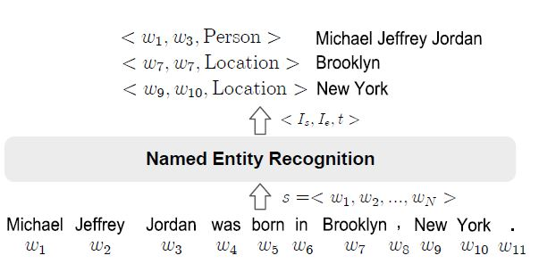
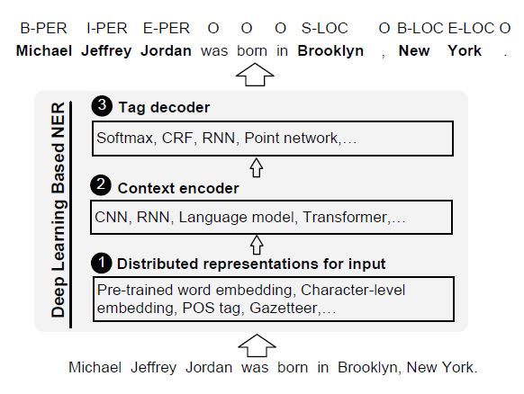
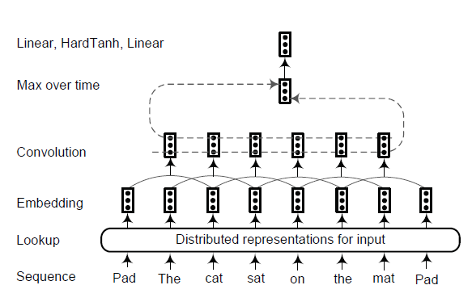
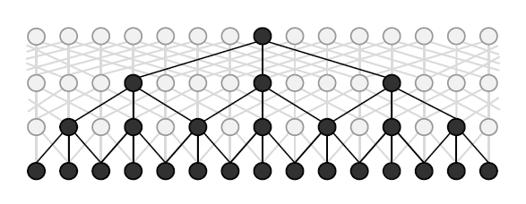
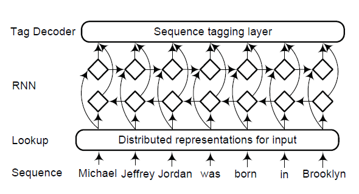
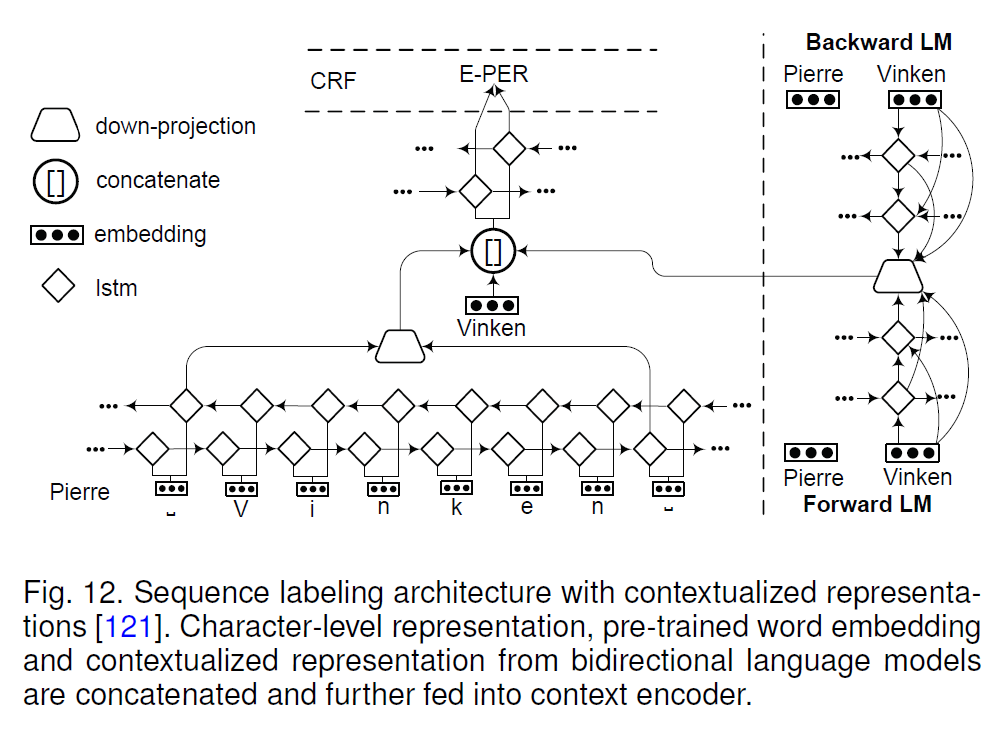
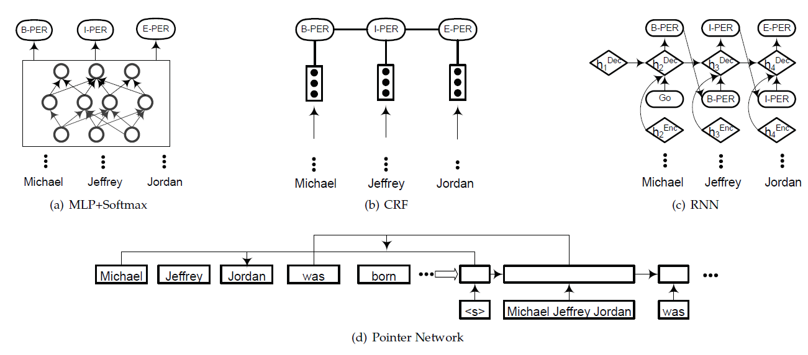

## 1. 简介

命名实体识别（Named Entity Recognition, NER）在从文本中识别出特殊对象，这些对象的语义类别通常在识别前被预定义好，如人、地址、组织等。

命名实体识别不仅仅是独立的信息抽取任务，它在许多大型自然语言处理应用系统如信息检索、自动文本概要、问答任务、机器翻译以及知识建库（知识图谱）中也扮演了关键的角色。

学术上NER所涉及的命名实体一般包括3大类（实体类，时间类，数字类）和7小类（人名、地名、组织机构名、时间、日期、货币、百分比）。

实际应用中，NER模型通常只要识别出人名、地名、组织机构名、日期时间即可，一些系统还会给出专有名词结果（比如缩写、会议名、产品名等）。货币、百分比等数字类实体可通过正则搞定。另外，在一些应用场景下会给出特定领域内的实体，如书名、歌曲名、期刊名等。

NER是NLP中一项基础性关键任务。**从自然语言处理的流程来看，NER可以看作词法分析中未登录词识别的一种，是未登录词中数量最多、识别难度最大、对分词效果影响最大问题。**

> 命名实体识别只是在有限的文本类型（主要是新闻语料中）和实体类别（主要是人名、地名、组织机构名）中取得了不错的效果；与其他信息检索领域相比，实体命名评测预料较小，容易产生过拟合；命名实体识别更侧重高召回率，但在信息检索领域，高准确率更重要；通用的识别多种类型的命名实体的系统性能很差。

## 2. 技术概览

NER在学习的过程中，往往会当作一个序列的标注问题。首先网络输入的是一段文本，记录$w_1,w_2,\ldots, w_n$。NER的任务目标就是给出一个命名实体的起始和中止边界，以及这个实体所对应的实体类别。

如下图所示，

其中<$w_9$, $w_{10}$, Location> New York代表，实体的位置是9和10，实体对应的类别是Location。

整体来看，NER识别的方式有四种，

1. 基于规则的方式

   基于规则的NER系统依赖于人工制定的规则。规则的设计一般基于句法、语法、词汇的模式以及特定领域的知识等。当字典大小有限时，基于规则的NER系统可以达到很好的效果。由于特定领域的规则以及不完全的字典，这种NER系统的特点是高精确率与低召回率，并且类似的系统难以迁移应用到别的领域中去：基于领域的规则往往不通用，对新的领域而言，需要重新制定规则且不同领域字典不同。

2. 无监督方式

   典型的无监督方法如聚类可以利用语义相似性，从聚集的组中抽取命名实体。其核心思路在于利用基于巨大语料得到的词汇资源、词汇模型、统计数据来推断命名实体的类别。不过准确度一般有限。

3. 基于特征的有监督方式

   需要标注数据，同时一般结合精心设计的特征。常用的模型如 HMM, 决策树, 最大熵模型, CRF 等。常用的特征包含词级别特征(大小写, 词的形态, 词性标记),，文档和语料特征(局部语法和共现)等。

4. 基于深度学习的有监督方式

   需要标注数据，不需要手动设计特征，自通通过深层网络进行特征的提取，可以端到端地实现。

现在一般领域性比较强, 数据量特别少的会用规则, 其余基本上都是机器学习或者深度学习. 尤其是在数据量比较充足的时候, **深度学习一般都可以获得比较不错的指标, 有时也会加一些规则辅助**.

## 3. 性能评估

精确匹配(Exact-match Evaluation) 和 宽松匹配(Relaxed-match Evaluation) 评估两种。

首先为了计算 F1, 定义一下 TP, FP, FN

- True Positive(TP): 实体被 NER 识别并标记为该类型 同时和 ground truth 对上了
- False Positive(FP): 实体被 NER 识别并标记为该类型 但是和 ground truth 对不上
- False Negative(FN): 实体没有被识别和标记为该类型, 但 ground truth 对上了

> 每个实体计算一遍，然后计算recall、precision和f1

有了每个实体类别的p指标后, 有两种办法把它们综合在一起:

- Macro averaged F-score: 根据每个类型的值来计算,得到平均值, 相当于把每个类型平等对待
- Micro averaged F-score: 综合所有实体的所有类别的贡献来计算平均值, 相当于把每个实体平等看待.

## 4. 基于深度学习识别

往往来说深度学习的模型识别效果更好，

- NER 受益于 DL 的高度非线性, 相比于传统的线性模型(线性 HMM 和 线性链 CRF), 深度学习模型能够学到更复杂的特征
- 深度学习能够自动学习到对模型有益的特征, 传统的机器学习方法需要需要繁杂的特征工程, 而深度学习则不需要
- 深度学习可以端到端的搭建模型, 这允许我们搭建更复杂的 NER 系统.

### 4.1 识别架构

整体来说分为三部分，第一部分是输入的表示，第二部分是语义的编码，第三部分是标签的解码。

- 输入的分布式表示( Distributed representations for input ): 基于 char 或者 word 嵌入的向量, 同时辅以词性标签(POS), gazetter 等人工特征.
- 语义编码(context encoder): 该层通过 CNN, RNN, LM, Transformer 等网络获取语义依赖.
- 标签解码(tag decoder): 预测输入序列对应的标签, 常用的如 softmax, CRF, RNN, 指针网络(Point Network)

如下图所示：

#### 4.1.1 输入的分布式表示

分布式表示通过把词映射到低维空间的稠密实值向量, 其中每个维度都表示隐含的特征维度. 一般 NER 系统的输入采用三种表示: word-level, char-level, 混合(hybrid) 表示.

- word-level

  Word level 比较好用的工具是 Word2Vec 和 Glove, 除此之外还有 fastText, SENNA等。

- character-level

  除了词级别的, 还可以用基于字级别的向量表示, 现有的字符级标识对于显示利用子单词级信息(如前缀和后缀)很有用. 字符级表示的另一个优点是可以减轻未登录词(OOV)的问题. 所以字符级表示可以处理没见过的词,同时共享词素信息。

- Hybrid Representation

  除了基于字和词的表示外, 一些研究还使用了额外的信息, 如 gazetteers 和 lexical similarity 等 添加到 word 表示中, 添加这些人工特征虽然会增加模型的表现, 不过可能降低模型的迁移泛化能力.

#### 4.1.2 语义编码

这部分即是主体的网络模型部分，基于第一部分的输入的分布式表示后，进行深层次语义的表示。

- 基于CNN的网络结构

  每个词通过向量嵌入转化为对应的向量. 之后通过卷积层来得到局部的特征. 卷积层的输出大小与输入的句子长度有关. 为了获取固定维度的句子表示, 在卷积后增加了池化层. 池化可以用最大池化或者平均池化.最后 tag decoder 使用该句子表示来得到标签的概率分布.如下图所示

  

  论文(Joint extraction of multiple relations and entities by using a hybrid neural network) 观察到 RNN 靠后时间步的影响要大于前面时间步的词. 然而对于整个句子来说, 重要的特征有可能出现在各个角落. 因此他们提出 BLSTM-RE 模型, 其中 BLSTM 用来捕获长期依赖特征, 同时 CNN 用来学习 高级别(high-level)表示. 之后特征被输入到 sigmoid 分类器. 最终 整个句子表示(由 BLSTM 生成) 和 关系表示(sigmoid 分类器生成的) 被输入到另一个 LSTM 网络来预测实体.

  论文(Fast and accurate entity recognition with iterated dilated convolutions) 提出膨胀卷积神经网络(Iterated Dilated Convolutional Neural Networks, ID-CNNs), 该模型在大文本和结构化预测上拥有比传统 CNN 更好的表现. ID-CNNs 的时间复允许固定深度的卷积在整个文档上并行的跑. 下图给出膨胀 CNN 模块的结构. 其中展示了四个堆叠的宽度为3的膨胀卷积. 对于膨胀卷积, 输入宽度的影响会随着深度的增加指数型增长, 同时每层的分辨率没有什么损失. 实验表明, 相比于传统得到 Bi-LSTM-CRF 有 14-20x 倍的加速, 同时保持相当高的准确率.

  下图为 膨胀 CNN 模块示意图, 最大膨胀深度为 4, 宽度为 3. 对最后一个神经元有贡献的神经元都被加黑显示.

  

- 基于RNN的网络结构

  RNN 以及它的变体 LSTM 和 GRU 被证明在序列数据中有较好的效果. 其中前向 RNN 能够有效利用过去的信息, 反向 RNN 能够利用未来的信息, 因此 双向 RNN 能够利用整个序列的信息, 因此 双向 RNN成为深度语义编码的标配结构. 一个传统的基于 RNN 的语义编码结构如下图所示

  

  Huang 等(Bidirectional lstm-crf models for sequence tagging) 最先使用 BiLSTM+CRF 结构用于 序列标注问题(POS, chunking 和 NER). 之后涌现出很多工作都使用 BiLSTM 作为基本结构来编码语义信息.

  论文(Named entity recognition with parallel recurrent neural networks) 在同一输入上采用了多个独立的双向 LSTM 单元. 他们的模型通过使用模型间的正则项促进了 LSTM 单元之间的多样性. 通过将计算分散到多个 LSTM 中, 他们发现模型的中参数减少了.

- 神经语言模型

  语言模型用来描述序列的生成. 给定一个序列$(t_1, t_2, \ldots, t_N)$，则该序列的概率可以表示为
  $$
  P(t_1, t_2, \ldots, t_N)=\prod_{k=1}^{N}p(t_k|t_1,t_2,t_{k-1})
  $$
  类似的，一个后向的序列概率可以表示为
  $$
  P(t_1, t_2, \ldots, t_N) = \prod_{k=1}^Np(t_k|t_{k+1},t_{k+2},\ldots,t_N)
  $$
  对于神经语言模型，可以用 RNN 的每个时间步$t_k$的输出得到概率$p(t_k)$. 在每个位置上, 可以得到两个语义相关的表示(前向和后向), 之后将它们俩结合作为最终语言模型向量表示 $t_k$。 这种语言模型知识已经被很多论文证实在序列标注中很有用。

  论文(Semi-supervised multitask learning for sequence labeling) 提出一个序列标注模型, 该模型要求模型除了预测标签意外, 还要预测它周围的词。在每个时间步, 要求模型预测当前词的标签和下一个词. 反向的网络就预测当前标签和前一个词, 这样网络就预测了当前标签和周围的词.

  论文(Semisupervised sequence tagging with bidirectional language model) 提出 TagLM, 一个语言模型增强序列标注器. 该标注器同时**考虑了预训练词嵌入和双向语言模型嵌入**.

  下面展示了LM-LSTM-CRF的网络结构，

  

  其中左侧下方是 字符级的嵌入, 通过双向 LSTM 得到. 中间 三个黑点那个是预训练得到的词向量, 虚线右侧将上下文嵌入得到的 LM 部分. 它们三个连接得到一个综合的表示, 被输入到 BLSTM 和 CRF 中得到标记序列.

- Transformer

  实际使用中用的是Transformer左侧的那个结构. 很多任务表明 Transformer 在序列生成等多种任务上有很好的表现, 同时可以并行, 效率高.

#### 4.1.3 标签解码

Tag 是NER 的最后一层, 它接收语义表示输出标注序列. 常见的解码方式为: MLP + softmax, CRF, RNN 和指针网络(pointer network). 下图给出了它们的结构示意图

- MLP+softmax

   比如 BLSTM 的输出后面跟一个全连接层进行降维, 再接 softmax 得到标签的概率分布。

- CRF

  自从 CRF 被提出加到神经网络后面用于解码后, 几乎成了一个标配了. 主要是因为 CRF 可以利用全局信息进行标记.

  论文(Segment-level sequence modeling using gated recursive semi-markov conditional random fields) 认为, CRF 虽然强, 但是却不能充分利用段落(segment) 级别的信息, 这是因为词级别的编码表示不能完全表达段落的内在属性. 因此改论文提出 门递归半马尔科夫条件随机场(gated recursive semi-markov CRFs). 该模型直接对段落进行建模, 而不是 词, 并通过 门控递归卷积神经网络自动的学习段落级特征.

  论文(Hybrid semi-markov crf for neural sequence labeling) 提出混合 半马尔科夫 CRFs(hybrid semi-Markov CRFs) 用于序列标注. 该方法直接采用段落而不是词作为基本单元, 词级别特征被用于推导段落分数. 因此该方法能够同时使用 词和段落级别的信息.

- RNN

  论文(Deep active learning for named entity recognition)

- 指针网络

  指针网络应用RNN来学习输出序列的条件概率，其中元素是与输入序列中的位置相对应的离散 token。 它通过使用softmax概率分布作为“指针”来表示可变长度词典。

#### 4.1.4 总结

- 在语义编码中, 用的最多的是 RNN(其中 LSTM最多, GRU 要少一点)
- 解码用的最多的是 CRF. BiLSTM+CRF 组合的网络结构用的最多
- 在向量嵌入方面, 词的话 Word2vec, Glove, SENNA 用的比较多
- 字符级别的 LSTM 比 CNN 多一点.
- 额外特征方面, POS 用的更多一点, 但是，关于是否应该使用外部知识（例如，地名词典和 POS）或如何将其集成到基于DL的NER模型，尚未达成共识。 然而，对诸如新闻文章和网络文档之类的通用域文档进行了大量实验。 这些研究可能无法很好地反映特定领域资源的重要性，例如在特定领域中的地名词典。

### 4.2 深度学习的应用

主要是多任务学习(multi-task learning), 深度迁移学习(deep transfer learning), 深度主动学习(deep active learning), 深度强化学习(deep reinforcement learning), 深度对抗学习(deep adversarial learning) 和 神经元注意力(neural attention) 用于 NER 的进展.

#### 4.2.1 深度多任务学习

多任务学习是一种可以一起学习一组相关任务的方法。 通过考虑不同任务之间的关系，与单独学习每个任务的算法相比，多任务学习算法有望获得更好的结果。

论文(Natural language processing (almost) from scratch) 训练了一个窗口/句子(window/sentence) 网络来同时训练 POS，Chunk，NER和SRL任务。 在窗口网络中共享第一线性层的参数，在句子网络中共享第一卷积层的参数。 最后一层是特定于任务的。 通过最小化所有任务的平均损失来实现训练。 这种多任务机制使训练算法能够发现对所有感兴趣任务有用的内部表示形式。

论文(Multi-task cross-lingual sequence tagging from scratch) 提出了一个多任务联合模型，以学习特定于语言的规律性，同时训练POS，Chunk和NER任务。

论文(Semi-supervised multitask learning for sequence labeling) 发现，通过在训练过程中加入 无监督语言建模训练目标，序列标记模型可以实现性能改进。

除了将NER与其他序列标记任务一起考虑之外，多任务学习框架可以应用于实体和关系的联合提取, 如论文(Joint extraction of entities and relations based on a novel tagging scheme) 和 论文(Joint extraction of multiple relations and entities by using a hybrid neural network).

或将NER建模为两个相关的子任务：实体分割和实体类别预测, 如论文(A multitask approach for named entity recognition in social media data) 和 论文(Multi-task domain adaptation for sequence tagging).

#### 4.2.2 深度迁移学习

迁移学习旨在利用从源领域中学习到的知识来在目标域上执行机器学习任务. 在 NLP 中, 迁移学习也称为领域适应, 对于 NER 任务, 传统方法是通过自举算法(boostrapping alogrithms). 不过近期已经有很多工作使用深度学习来做 NER 的跨领域识别了.

#### 4.2.3 深度主动学习

主动学习背后的关键思想是，如果允许从机器学习算法中选择学习的数据，则机器学习算法的性能将大大降低。 深度学习通常需要大量的训练数据，而这些数据的获取成本很高。 因此，将深度学习与主动学习相结合可以减少数据标注的工作量。

主动学习的训练会进行多轮。但是，传统的主动学习方案对于深度学习而言是昂贵的，因为在每一轮之后，它们都需要使用新标注的样本对分类器进行完全重新训练。由于从头开始进行再训练对于深度学习不切实际，论文(Deep active learning for named entity recognition) 建议对每批新标签进行NER的增量训练。他们将新标记的样本与现有样本混合，并在新一轮查询标签之前为少数几个 epoch 更新神经网络权重。具体而言，在每轮开始时，主动学习算法将要标注的句子选择为预定义的 budget。在接收到选定的标记后，通过对扩充数据集进行训练来更新模型参数。序列标记模型由CNN字符级编码器，CNN 词级编码器和LSTM标签解码器组成。**主动学习算法在选择要标记的句子时采用不确定性采样策略。**也就是说，未标记的示例会根据当前模型在预测相应标签时的不确定性进行排序。在他们的模型中实现了三种排序方法：最低置信度（LC），最大归一化对数概率（MNLP）和贝叶斯主动学习异议(Bayesian Active Learning by Disagreement)（BALD）。实验结果表明，主动学习算法仅使用英语数据集中的 24.9％ 的训练数据和中文数据集中的 30.1％ 的训练数据，即可获得在完整数据上训练的最佳深度学习模型的99％的性能。此外，训练数据的 12.0％和 16.9％ 足以使深度主动学习模型优于在完整训练数据上学习的浅层模型。

#### 4.2.4 深度强化学习

强化学习（RL）是受行为主义心理学启发的机器学习的一个分支，它与 agents 如何在环境中采取行动以最大程度地累积一些奖励有关。该想法的核心思想为， agents 通过与环境互动并从行为中获得回报来从环境中学习。

论文(Improving information extraction by acquiring external evidence with reinforcement learning) 将信息提取任务建模为马尔科夫决策过程(MDP)该过程动态的使用了实体预测任务, 并提供了一组自动生成的替代方案中选择下一个 query 的方法. 模型流程包含从发出搜索查询, 从新来源中提取, 识别获得的特征, 然后重复该过程直到获得足够多的的证据(evidence)为止.

#### 4.2.5 深度对抗学习

对抗学习是在对抗样本上进行学习的模型. 期望模型通过这种方式更加健壮,同时在无干扰时减少测试误差. 对抗网络通过两个网络游戏的形式从训练分布中产生: 一个网络生成候选实例(生成网络),, 另一个评估候选(判别网络). **通常情况下, 生成网络学习潜变量空间映射到目标空间的特定数据分布, 而判别网络则在生成模型生成的数据与真实数据之间进行区分.**

论文(Datnet: Dual adversarial transfer for low-resource named entity recognition) 提出双重对抗迁移网络(Dual adversarial transfer network, DATNet), 目的是解决在 NER 中的资源匮乏问题. 作者通过在原始样本上加一个小扰动制备对抗样本. 对分类器进行真实样本和对抗样本的混合训练以提高泛化性. 实验结果表明, 将知识从大数据集到小数据集上的有效性.

## 5. 展望与挑战

### 5.1 挑战

- 数据标注

  主要问题是数据标注的 质量与一致性问题. 如 “帝国州” 和 “帝国州建筑物” 都被标记为 “位置”, 就会导致实体边界混乱.

  除此之外 , 实体嵌套(nested)的情况也是广泛存在的. 如 GENIA 语料库中有 17% 的实体被嵌套到另一个实体中. 在 ACE 语料中, 有 30% 的句子包含嵌套的命名实体. 因此需要开发通用的标注方案来处理嵌套实体和 fine-grained 实体(一个命名实体可以被分配多个类型).

- 非正式文本和新实体

  前面总结的评测表现大都是基于正式文档(新闻报道)的, 但在用户生成的文本(如 WUT-17)上, 最佳的 F值仅略高于 0.4 . 非正式文本(如推文, 用户评论, 论坛帖子) 的 NER 由于其内容简短, 噪声大, 因此比正式文本更难处理.

  除了文本表达不正式外, 训练集中没有出现过的新实体也是个问题, 尽管深度学习在一定程度上可以处理些没见过的实体, 但面对每天生成的大量新实体, 依旧是一个挑战.

### 5.2 展望

- 细粒度的 NER 以及边界检测

- 基于深度学习的非正式文本 NER

- 将迁移学习进一步应用到 NER 中

- 实体连接和 NER 的联合模型: 实体链接(EL), 也称为命名实体消岐或标准化

- 模型扩展性

  减少参数量，模型压缩和修剪技术也是减少模型学习所需空间和计算时间的选择

## References

- [命名实体识别中的深度学习方法](https://zhuanlan.zhihu.com/p/61069076)
- [命名实体识别（一）](http://pelhans.com/2019/09/23/kg_paper-note4/)

- [一文详解深度学习在命名实体识别(NER)中的应用](https://zhuanlan.zhihu.com/p/43061858)