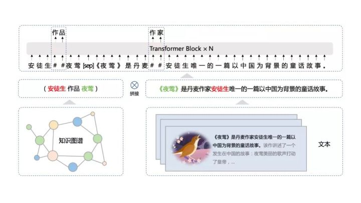

# ERNIE

## 1. 模型简介

下面主要介绍百度的预训练语言模型（ERNIE系列）。

预训练模型（pretrain models, PTM）从整体的发展历史来看，共分为两部分，分别为词嵌入模式、另外则是上下文的词嵌入（语义层面信息）。

第一代 PTM 旨在学习词嵌入。由于下游的任务不再需要这些模型的帮助，因此为了计算效率，它们通常采用浅层模型，如 Skip-Gram 和 GloVe。尽管这些经过预训练的嵌入向量也可以捕捉单词的语义，但它们却不受上下文限制，只是简单地学习「共现词频」。这样的方法明显无法理解更高层次的文本概念，如句法结构、语义角色、指代等等。

而第二代 PTM 专注于学习上下文的词嵌入，如 CoVe、ELMo、OpenAI GPT 以及 BERT。它们会学习更合理的词表征，这些表征囊括了词的上下文信息，可以用于问答系统、[机器翻译](https://cloud.tencent.com/product/tmt?from=10680)等后续任务。另一层面，这些模型还提出了各种语言任务来训练 PTM，以便支持更广泛的应用，因此它们也可以称为预训练语言模型。

预训练模型综述文章：[Pre-trained Models for Natural Language Processing: A Survey](https://arxiv.org/pdf/2003.08271.pdf)

百度在2019年4月的时候，基于BERT模型做了进一步优化，在中文的NLP任务上得到了state-of-the-art的结果。在之后进行了一些列优化，具体的参考[ernie预训练模型相关](http://wiki.baidu.com/pages/viewpage.action?pageId=1525908882)，到2021年出现ernie 3.0，基本上在多数的中文和英文任务上取的SOTA的效果。

## 2. Ernie模型

### 2.1 Ernie 1.0

基本的模型结构和BERT一致，也分为base和large两个版本。

#### masking策略

ERNIE1.0版本首先对原始的MLM（BERT中的MLM）任务进行改进，引入了Entity-level masking和Phrase-level masking，帮助模型更好的学习词汇和短语知识，类似这种方式的mask也成为后来中文预训练的标配。

对于中文来说，例如对于下面的例句：“哈尔滨是黑龙江的省会，国际冰雪文化名城”

BERT在预训练过程中仅是对单个字符进行屏蔽，通过“哈”与“滨”的局部共现判断出“尔”字，但是模型并没有学习到与“哈尔滨”相关的知识，即只是学习到“哈尔滨”这个词，但是并不知道“哈尔滨”所代表的含义；

而ERNIE在预训练时使用的数据是对整个词进行屏蔽，从而学习词与实体的表达，例如屏蔽“哈尔滨”与“冰雪”这样的词，使模型能够建模出“哈尔滨”与“黑龙江”的关系，学到“哈尔滨”是“黑龙江”的省会以及“哈尔滨”是个冰雪城市这样的含义。

#### NSP策略

训练数据方面，除百科类、资讯类中文语料外，ERNIE 1.0 还引入了论坛对话类数据，利用对话语言模式（DLM， Dialogue Language Model）建模Query－Response对话结构，将对话Pair对作为输入，引入Dialogue Embedding标识对话的角色，利用对话响应丢失（DRS， Dialogue Response Loss）学习对话的隐式关系，预测多轮对话（QRQ、QRR、QQR）是否真实，与MLM任务交替训练，进一步提升模型的语义表示能力。

### 2.2 Ernie 2.0

#### 持续预训练学习框架

Ernie 2.0 是基于持续学习的语义理解预训练框架，使用多任务学习增量式构建预训练任务。在ERNIE 2.0中，大量自然语言处理的语料可以被设计成各种类型的自然语言处理任务（Task），这些新构建的预训练类型任务（Pre－training Task）可以无缝的加入到训练框架，从而持续让ERNIE 2.0模型进行语义理解学习，不断的提升模型效果。

#### 预训练任务

与以往采用少量预训练任务目标不同的是，Ernie2.0能够不断地引入大量的预训练任务，以不断提升模型在词汇、句法和语义上的表征能力。因此可以通过多任务学习不断更新预训练模型。

ERNIE 2.0 的预训练包括了三大类学习任务，分别是：

- 词法层任务（word-aware）：学会对句子中的词汇进行预测。
- 语法层任务（structure-aware）：打乱k个句子，预测原始顺序；3分类任务，预测两个句子是相连、出现在同一个文档还是不同文档。
- 语义层任务（semantic-aware）：学会判断句子之间的逻辑关系，例如因果关系、转折关系、并列关系等。

下图是ERNIE 2.0预训练连续学习架构。这个架构包含了一系列共享文本encoding layers来encode上下文信息。这些encoder layers的参数可以被所有的预训练任务更新。有两种类型的loss function：一种是sequence level的loss，一种是word level的loss。在ERNIE 2.0预训练中，一个或多个sentence level的loss function可以和多个token level的loss functions结合来共同更新模型。

### 2.3 Ernie 3.0

Ernie3.0延续了前两个版本的有效改进，**仍然基于持续预训练学习框架进行**，增加了更加复杂且多样化的学习任务，学习任务上，优化了semantic-aware部分，融入知识图谱信息，训练上，采用更大的训练数据，包括4TB的训练语料和5千万的知识图谱三元组。

效果上，刷新50多个NLP任务基准，并登顶SuperGLUE全球榜首。ernie 3.0体验站：https://wenxin.baidu.com/wenxin/ernie

#### 持续预训练学习框架

在结构上，3.0依旧采用持续学习的理念，同时为了适配更多下游任务，增加了**自编码**、**自回归形式**等多个任务网络，整个学习框架如下图，

#### 预训练任务

同样类似在ernie 2.0中三种预训练任务，

- 词汇任务（word-aware）
  Knowledge Masking：同ERNIE1.0
  Document Language Modeling：参考ERNIE-Doc，进行了更长文本的单向语言模型预训练，主要用于提升文本生成能力
- 语法层任务（structure-aware）
  同ernie2.0
- 语义相关（knowledge-aware）
  这部分改进最大，3.0版本这次提出了海量无监督文本与大规模知识图谱的平行预训练方法 （Universal Knowledge-Text Prediction）。将5千万知识图谱三元组与4TB大规模语料中相关的文本组成pair，同时输入到预训练模型之中进行联合掩码训练，

