# Transformer

[TOC]

## 1. 模型简介

自从Attention机制在提出之后，加入Attention的Seq2Seq模型在各个任务上都有了提升，所以现在的seq2seq模型指的都是结合rnn和attention的模型。传统的基于RNN的Seq2Seq模型难以处理长序列的句子，无法实现并行，并且面临对齐的问题。

所以之后这类模型的发展大多数从三个方面入手：

- input的方向性：单向 -> 双向

- 深度：单层 -> 多层

- 类型：RNN -> LSTM GRU

但是依旧受到一些潜在问题的制约，神经网络需要能够将源语句的所有必要信息压缩成固定长度的向量。这可能使得神经网络难以应付长时间的句子，特别是那些比训练语料库中的句子更长的句子；每个时间步的输出需要依赖于前面时间步的输出，这使得模型没有办法并行，效率低；仍然面临对齐问题。

再然后CNN由计算机视觉也被引入到deep NLP中，CNN不能直接用于处理变长的序列样本但可以实现并行计算。完全基于CNN的Seq2Seq模型虽然可以并行实现，但非常占内存，很多的trick，大数据量上参数调整并不容易。

本篇文章创新点在于**抛弃了之前传统的encoder-decoder模型必须结合cnn或者rnn的固有模式，只用Attention**。文章的主要目的在于减少计算量和提高并行效率的同时不损害最终的实验结果。

## 2. 模型结构

模型框架图如下，

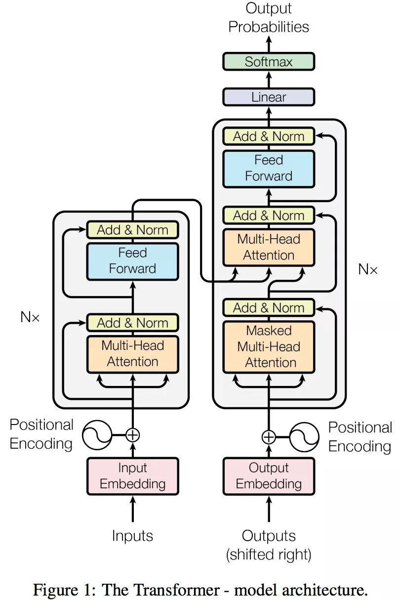

看上去构造还是比较复杂的，先从大面进行理解，然后一步步细化。Transformer的本质仍然是Seq2Seq的思想，采用了Encoder-Decoder框架，如下所示，

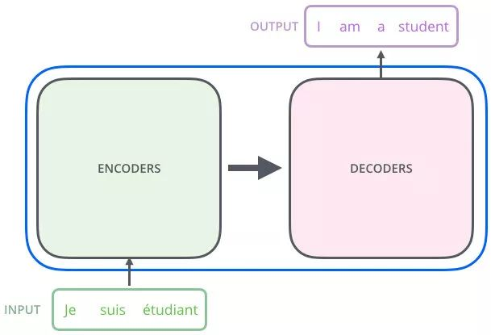

论文中提到了Transformer采用了多个Encoder和多个Decoder进行结合，进一步将上图展开后有，

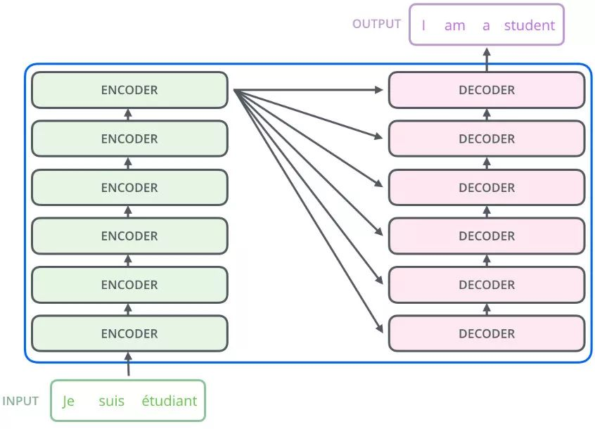

也就是说，Encoder的输出，会和每一层的Decoder进行结合。取其中一层（也即上面第一张模型架构图）进行详细的展示（简化版）如下，

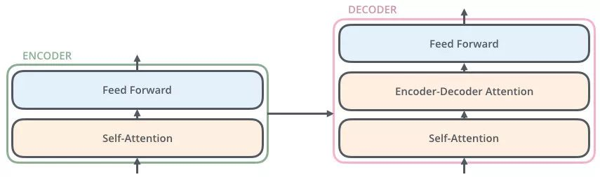

上面提及的结果相当于模型中使用的一个Encoder和一个Decoder，相当于是最上面提到transformer模型架构图的简化形式。在Encoder中，对于输入做Self-Attention，然后前馈输出；在Decoder中，同样对输出进行Self-Attention操作，然后对Encoder中的输出和Self-Attention的结果做一个Attention，最终在前向传播。

该部分对整体框架做了大致介绍，接下来对上面提及的结构进行展开。

### 2.1  Scaled Dot-Product Attention

其结构如下，

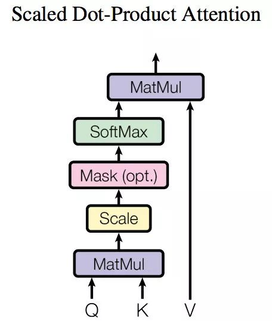

- 第一步生成Q,K,V

  这一步的Q,K,V对应于Attention机制中所提及的Q,K,V。但是这一步之前的输入就只有input的embeeding，如何得到Q,K,V呢？对于给定的输入X，通过三个线性变换将X转换为Q,K,V，

  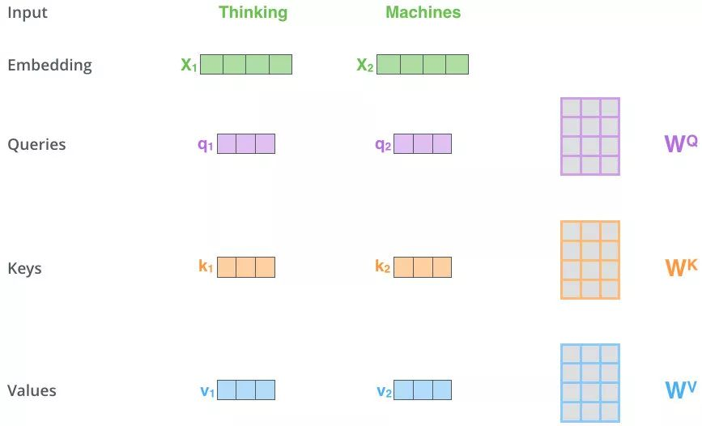

  > 两个单词，Thinking, Machines. 通过嵌入变换会X1,X2两个向量[1 x 4]。分别与Wq,Wk,Wv三个矩阵[4x3]想做点乘得到，{q1,q2},{k1,k2},{v1,v2} 6个向量[1x3]。

- 第二步（Q,K点乘）

  向量{q1,k1}做点乘得到得分(Score) 112, {q1,k2}做点乘得到得分96。

  

- 第三步和第四步（放缩和softmax）

  对该得分进行规范，除以8。**这个在论文中的解释是为了使得梯度更稳定**。之后对得分[14，12]做softmax得到比例 [0.88，0.12]。

  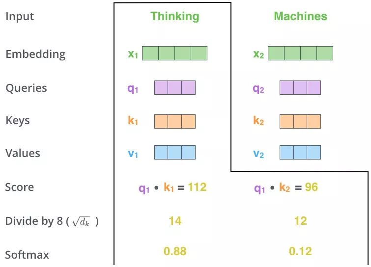

- 第五步（与V做加权）

  在上面得到Q,K的概率分布，与V做加权。

  用得分比例[0.88，0.12] 乘以[v1,v2]值（Values)得到一个加权后的值。将这些值加起来得到z1。这就是这一层的输出。仔细感受一下，用Q,K去计算一个thinking对与thinking, machine的权重，用权重乘以thinking,machine的V得到加权后的thinking,machine的V,最后求和得到针对各单词的输出Z。

  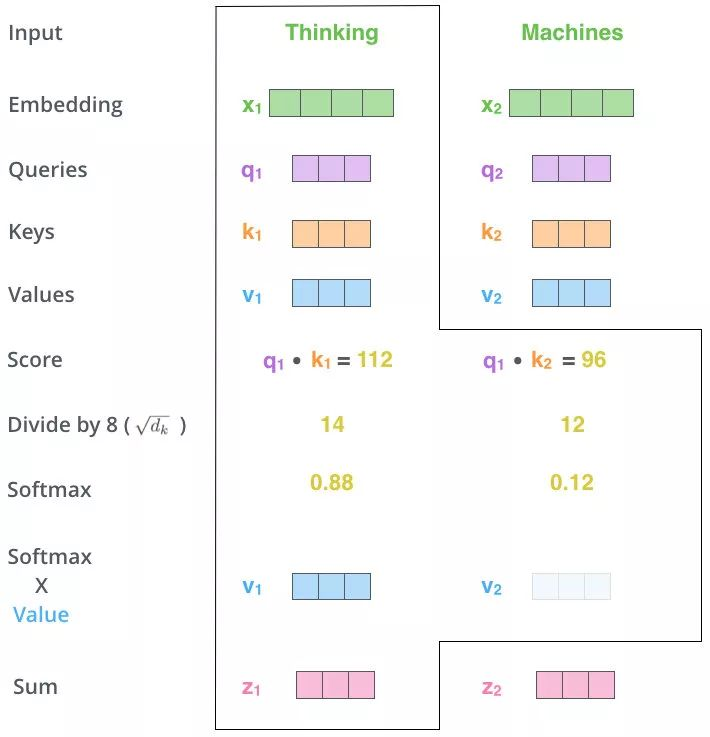

- 整体矩阵表示

  首先根据输入X计算得到Q,K,V。

  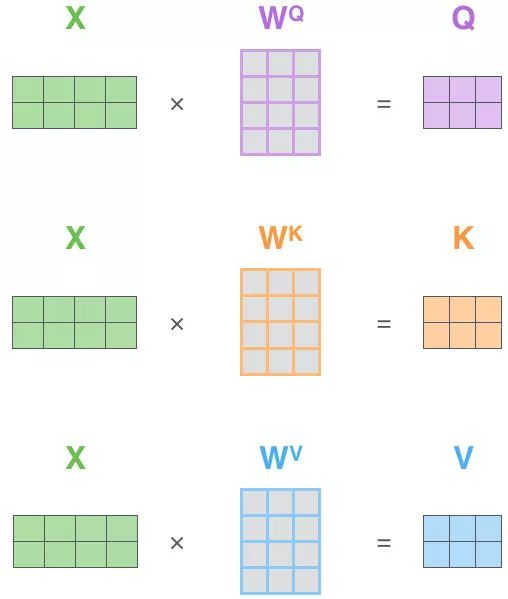

  然后根据Q,K,V计算attention的值。

  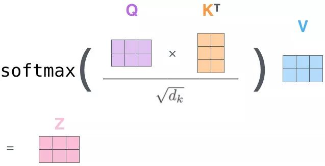

  > Q对K转制做点乘，除以dk的平方根。做一个softmax得到合为1的比例，对V做点乘得到输出Z。那么这个Z就是一个考虑过thinking周围单词(machine)的输出。

  以上这种方式在encoder中被称之为Self-Attention，在decoder中被称之为masked self-attention（不能看到未来的信息），除了这两种attention机制外，还有encoder-decoder attention，即encoder和decoder连接处的attention，这种和传统的encoder-deocoder框架中的attention机制是一致的。

### 2.2 Multi-Head Attention

Multi-Head Attention就是把Scaled Dot-Product Attention的过程做h次，然后把输出Z合起来。论文中，它的结构图如下：

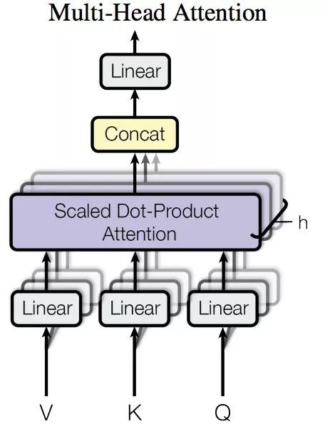

接下来对上面过程做出解释，假设做了8次self-attention，

接下来将8个输出拼接起来，为了和一个的输出形状结果类似，将拼接起来的矩阵乘以矩阵进行放缩，如下，

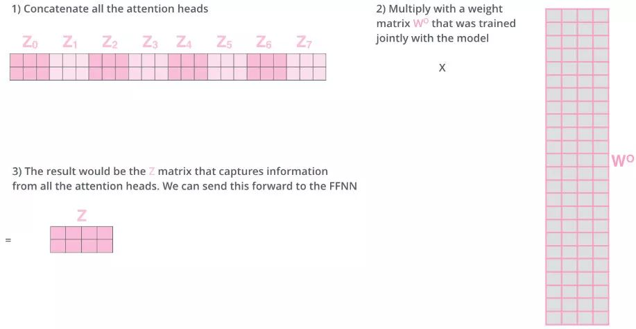

### 2.3 Position Encoding

因为模型不包括Recurrence/Convolution，因此是无法捕捉到序列顺序信息的，例如将K、V按行进行打乱，那么Attention之后的结果是一样的。但是序列信息非常重要，代表着全局的结构，因此必须将序列的分词相对或者绝对position信息利用起来。

这里每个分词的position embedding向量维度也是, 然后将原本的input embedding和position embedding加起来组成最终的embedding作为encoder/decoder的输入。其中position embedding计算公式如下：
$$
\begin{aligned}
PE_{(pos, 2i)} &= sin(pos/10000^{2i/d_{model}}) \\
PE_{(pos, 2i+1)} &= cos(pos/10000^{2i/d_{model}})
\end{aligned}
$$
其中pos表示位置index，i表示dimension index

最终就是将word embedding和position embedding相加作为该输入的embedding，如下，

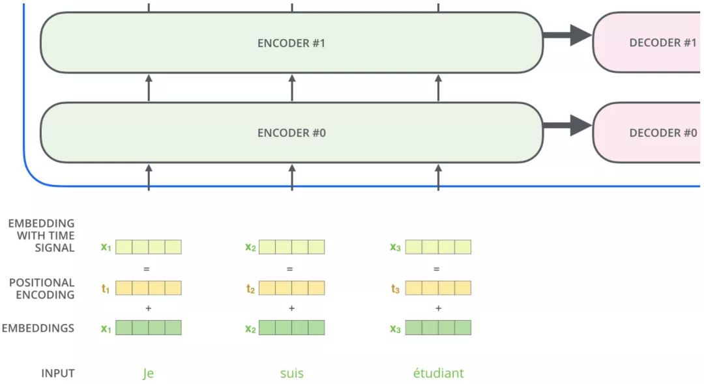

Position Embedding本身是一个绝对位置的信息，但在语言中，相对位置也很重要，Google选择前述的位置向量公式的一个重要原因是，由于我们有：
$$
\begin{aligned}
\sin(\alpha+\beta) &= \sin\alpha \cos\beta + \cos \alpha \sin \beta \\
\cos(\alpha+\beta) &= \cos \alpha \cos \beta - \sin \alpha \sin \beta
\end{aligned}
$$

这表明位置 $k+p$的位置向量可以表示为位置$k$和$p$的特征向量的线性变化，这为模型捕捉单词之间的相对位置关系提供了非常大的便利。

> 在其他NLP论文中，大家也都看过position embedding，通常是一个训练的向量，但是position embedding只是extra features，有该信息会更好，但是没有性能也不会产生极大下降，因为RNN、CNN本身就能够捕捉到位置信息，但是在Transformer模型中，**Position Embedding是位置信息的唯一来源，因此是该模型的核心成分，并非是辅助性质的特征。**

### 2.4 Position-wise Feed-forward Networks

在进行了Attention操作之后，encoder和decoder中的每一层都包含了一个全连接前向网络，对每个position的向量分别进行相同的操作，包括两个线性变换和一个ReLU激活输出：
$$
FFN(x)=\max(0,xW_1+b_1)W_2+b_2
$$

### 2.5 encoder&decoder&output

接下来，对encoder和decoder的内部结构进行剖析，

#### 2.5.1 encoder结构

论文中，提到有6层encoder，每层encoder包含2个sub-layer

- 第一个sub-layer是multi-head self-attention mechanism，用来计算输入的self-attention
- 第二个sub-layer是简单的全连接网络
- 在每个sub-layer我们都模拟了残差网络，每个sub-layer的输出都是$LayerNorm(x + sublayer(x))$

如下所示，

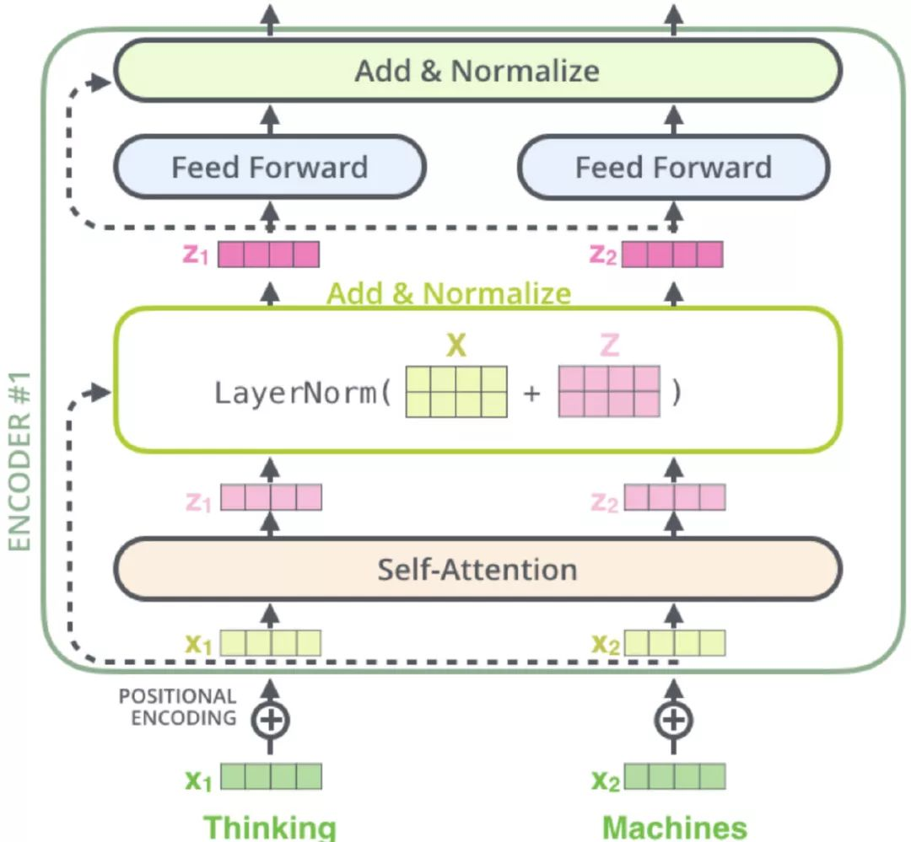

#### 2.5.2 decoder结构

论文中，提到有6层decoder，每层decoder包含3个sub-layer

- 第一个是Masked multi-head self-attention，也是计算输入的self-attention，但是因为是生成过程，因此在时刻 i 的时候，大于 i 的时刻都没有结果，只有小于 i 的时刻有结果，因此需要做Mask

- 第二个sub-layer是全连接网络，与Encoder相同

- 第三个sub-layer是对encoder的输入进行attention计算

  同时Decoder中的self-attention层需要进行修改，因为只能获取到当前时刻之前的输入，因此只对时刻 t 之前的时刻输入进行attention计算，这也称为Mask操作。

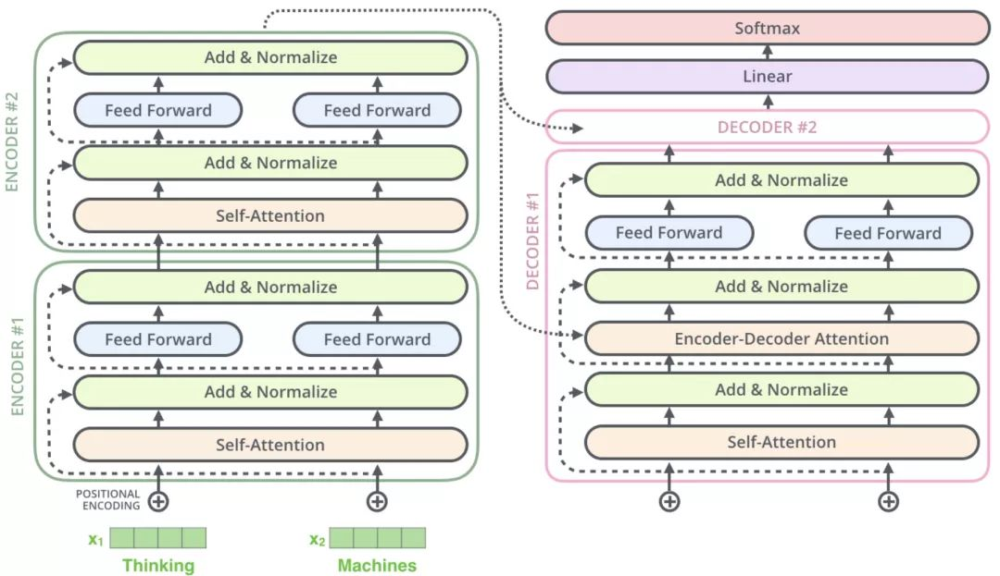

#### 2.5.3 output结构

将Decoder的堆栈输出作为输入，从底部开始，最终进行word预测。

> 输出有两种方式，贪心（一个一个的往后吐）或者beam search（两个两个或者三个三个，按照两个最优的方式往后走）

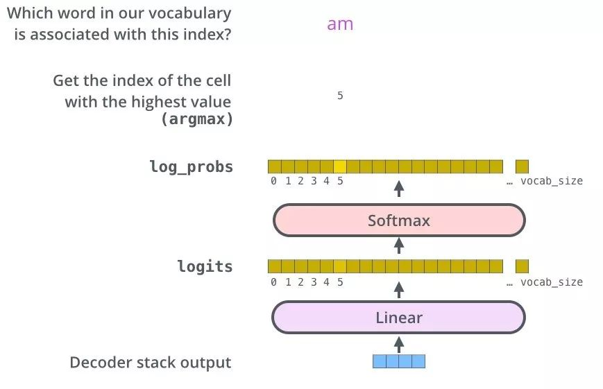

### 2.6 Why Self-Attention

这部分主要是引用原论文中的第四部分Why-Self-Attention，也是其和CNN和RNN整体的一个对比。

整体可以分为三部分，

#### 2.6.1 整体计算的复杂度

序列长度为$n$，嵌入维度为$d$，那么每层计算的复杂度O($n^2d$)

#### 2.6.2 序列整体并行的计算量

可以通过序列最小的操作次数来衡量，显然复杂度为O(1)

#### 2.6.3 长距离依赖

可以用序列中任意两个token的最大依赖距离来衡量，显然复杂度为O(1)

具体和RNN以及CNN比较如下，

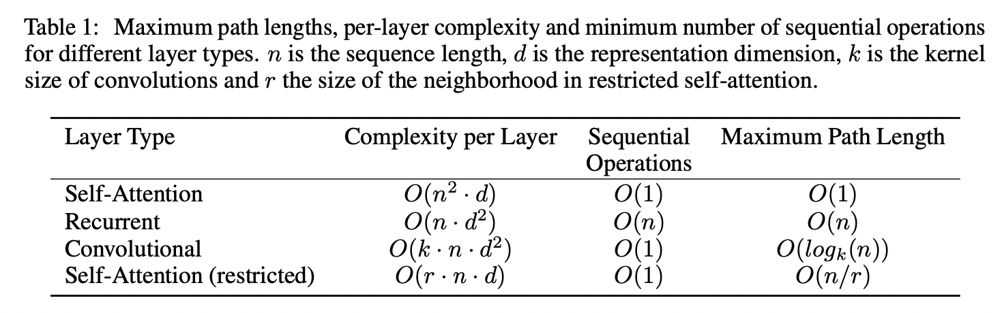

## 3. 模型训练

记录下训练过程的以下几点，

### 3.1 优化器

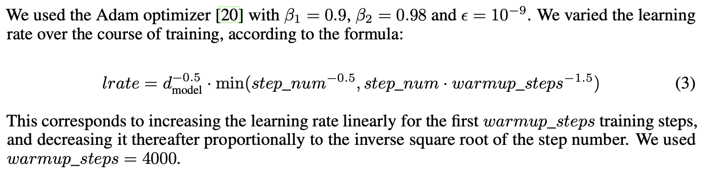

### 3.2 正则项

主要使用了两种类型的正则项，

- dropout

  1）在残差链接和layer norm前对每一层的输出进行dropout

  2）在encoder和decoder的向量输入部分（所有向量相加的地方）进行dropout

  dropout比例为0.1

- label smoothing

  标签平滑的比例为0.1，标签平滑的方式可以参考该[文章介绍](https://blog.csdn.net/qq_43211132/article/details/100510113)

> 关于Transformer的大致代码实现参考本目录代码文件。

## 4. 总结

- 优点
  
  - **算法设计**
  
    其放弃了RNN和CNN这种传统网络，提出用注意力机制来直接学习源语言内部关系和目标，除了算法效果优于之前网络，其可以并行计算，大大加快了计算速度。
  
  - **直接的长距离依赖**
  
    原来的RNN中，第一个词要和第十个词发生关系，必须通过第二~九个词传递，进而产生两者的计算。而在这个过程中，第一帧的信息有可能已经产生了偏差，准确性和速度都难以保证。在Transformer中，由于self-attention的存在，任意两个词都有直接的交互，建立直接依赖。
  
- 缺点
  - Transformer网络具有学习较长期依赖关系的潜力，但是在语言建模的设置中受到**固定长度上下文(fixed-length context)**的限制。
  - Transformer失去的位置信息其实在NLP中非常重要，而论文中在特征向量中加入Position Embedding也只是一个权宜之计，并没有改变Transformer结构上的固有缺陷。
  - 虽然抛弃RNN和CNN虽然非常炫技，但是它也使模型丧失了捕捉局部特征的能力，RNN + CNN + Transformer的结合可能会带来更好的效果。

## 5. Transformer应用

按照时间顺序出现，GPT，BERT，MT-DNN，GPT-2

- GPT（单向二阶段训练模型）

  GPT(Generative Pre-Training)，是OpenAI在2018年提出的模型，利用Transformer模型来解决各种自然语言问题，例如分类、推理、问答、相似度等应用的模型。GPT采用了Pre-training + Fine-tuning的训练模式，使得大量无标记的数据得以利用，大大提高了这些问题的效果。**采用单向的Transfomer模型**。

- BERT（双向二阶段训练模型）

  BERT(Bidirectional Encoder Representation from Transformer)，是Google Brain在2018年提出的基于Transformer的自然语言表示框架。是一提出就大火的明星模型。BERT与GPT一样，采取了Pre-training + Fine-tuning的训练方式，在分类、标注等任务下都获得了更好的效果。**采用双向的Transformer模型**。

- MT-DNN（多任务模型）

  MT-DNN (Multi-Task Deep Neural Networks) 依然采用了BERT的二阶段训练方法以及双向Transformer。在Pre-Training阶段，MT-DNN与BERT几乎完全一样，但是在Fine-Tuning阶段，MT-DNN采用了多任务的微调方式。同时采用Transformer输出的上下文Embedding进行单句分类、文本对相似度、文本对分类以及问答等任务的训练。整个结构如下图所示：

  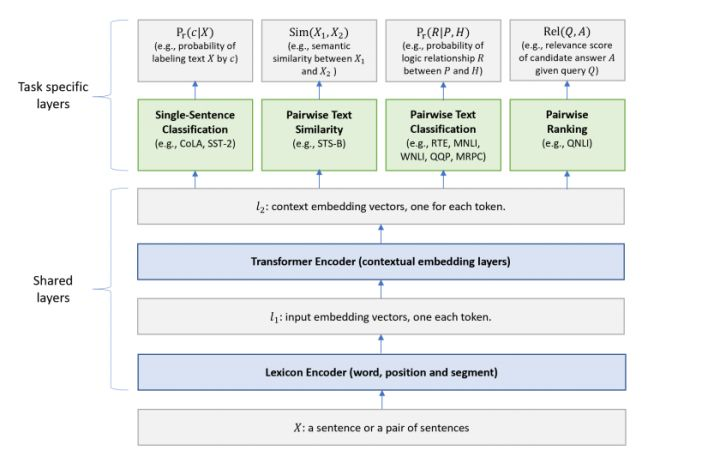

- GPT-2（单向通用模型）

  GPT-2继续沿用了原来在GPT种使用的单向Transformer模型，而这篇文章的目的就是尽可能利用单向Transformer的优势，做一些BERT使用的双向Transformer所做不到的事。那就是通过上文生成下文文本。

  GPT-2的想法就是完全舍弃Fine-Tuning过程，转而使用一个容量更大、无监督训练、更加通用的语言模型来完成各种各样的任务。我们完全不需要去定义这个模型应该做什么任务，因为很多标签所蕴含的信息，就存在于语料当中。就像一个人如果博览群书，自然可以根据看过的内容轻松的做到自动摘要、问答、续写文章这些事。

## 6. Q&A

1. 为什么自注意力模型（self-Attention model）在长距离序列中如此强大，卷积或循环神经网络难道不能处理长距离序列吗？

   当使用神经网络来处理一个变长的向量序列时，我们通常可以使用卷积网络或循环网络进行编码来得到一个相同长度的输出向量序列，如图所示：

   

   从上图可以看出，无论卷积还是循环神经网络其实都是对变长序列的一种“局部编码”：卷积神经网络显然是基于N-gram的局部编码；而对于循环神经网络，由于梯度消失等问题也只能建立短距离依赖。

2. 要解决这种短距离依赖的“局部编码”问题，从而对输入序列建立长距离依赖关系，有哪些办法呢？

   如果要建立输入序列之间的长距离依赖关系，可以使用以下两种方法：一种方法是增加网络的层数，通过一个深层网络来获取远距离的信息交互，另一种方法是使用全连接网络。

   **全连接网络虽然是一种非常直接的建模远距离依赖的模型， 但是无法处理变长的输入序列。不同的输入长度，其连接权重的大小也是不同的。**

   > 相当于一个是全连接网络需要只能固定化输入序列的大小，然后基于这个固定的序列长度来学习网络的连接权重，一旦完成之后，这个权重固定了，无法动态调整（相当于学习到的东西是死的，无法进行类比推理）。相当于虽然可以学习长距离依赖相当于学习到的东西是有很大的局限性（而且未考虑相对位置的关系）

   这时我们就可以**利用注意力机制来“动态”地生成不同连接的权重**，这就是自注意力模型（self-attention model）。由于自注意力模型的权重是动态生成的，因此可以处理变长的信息序列。

   总体来说，为什么自注意力模型（self-Attention model）如此强大：利用注意力机制来“动态”地生成不同连接的权重，从而处理变长的信息序列。

3. 为什么进行multi-head attention或者说他的作用是什么？

   Multi-head Attention 的原因是将模型分为多个头，形成多个子空间，可以让模型去关注不同方面的信息，最后再将各个方面的信息综合起来。其实直观上也可以想到，如果自己设计这样的一个模型，必然也不会只做一次 attention，多次 attention 综合的结果至少能够起到增强模型的作用，也可以类比 CNN 中同时使用「多个卷积核」的作用，直观上讲，多头的注意力「有**助于网络捕捉到更丰富的特征/信息**」。

   > 从不同的专业维度进行学习，可以学习专业1相关知识，专业2相关知识，捕捉丰富的特征。

4. Transformer 相比于 RNN/LSTM，有什么优势？为什么？

   - RNN 系列的模型，并行计算能力很差

     transformer天然支持并行

   - Transformer 的特征抽取能力比 RNN 系列的模型要好

     或者所他可以做self-attention，本身就可以产生直接长距离依赖，而且做了multi-head attention，提取了多方面的综合信息。

5. Transformer 是如何训练的？测试阶段如何进行测试呢？

   - 训练

     Transformer 训练过程与 seq2seq 类似，首先 Encoder 端得到输入的 encoding 表示，并将其输入到 Decoder 端做交互式 attention，之后在 Decoder 端接收其相应的输入（shifted right true label），经过多头 self-attention 模块之后，结合 Encoder 端的输出，再经过 FFN，得到 Decoder 端的输出之后，最后经过一个线性全连接层，就可以通过 softmax 来预测下一个单词(token)，然后根据 softmax 多分类的损失函数，将 loss 反向传播即可，所以从整体上来说，Transformer 训练过程就相当于一个有监督的多分类问题。

     > 需要注意的是，「Encoder 端可以并行计算，一次性将输入序列全部 encoding 出来，但 Decoder 端不是一次性把所有单词(token)预测出来的，而是像 seq2seq 一样一个接着一个预测出来的。」
     >
     > 其实写代码的时候提前构造高这部分的序列，相当于x输入的是两部分，y输入的是一部分，相当于提前交错开。

   - 测试

     而对于测试阶段，其与训练阶段唯一不同的是 Decoder 端最底层的输入（每吐出一个词，要利用这个词，而训练阶段利用的是真实的词）。

6. 为什么说 Transformer 可以代替 seq2seq？或者说为什么trasformer能够取得这么好的效果。

   seq2seq 最大的问题在于「将 Encoder 端的所有信息压缩到一个固定长度的向量中」，序列较长时会有损失，且等权重的喂给decoder端，其不能关注想关注的信息。

   Transformer首先引入了self-attentino机制，序列信息直接的产生依赖关系，而不用类似rnn这种传导机制，其次使用了multi-head attention，丰富其信息的提取维度，然后再通过FFN模式进一步处理特征，而且保留了传统的attention机制的模式，而且引入了N层的encoding block，再次丰富了提取信息的维度。

   > self-attention机制；multi-head attention；多层或多个block；（横向加入self-attention，纵向加入多个这样的部分）

7. Transformer 中句子的 encoder 表示是什么？如何加入词序信息的？

   Transformer Encoder 端得到的是**整个输入序列**的 encoding 表示，其中最重要的是经过了 self-attention 模块和multi-head attention，让输入序列的表达更加丰富，而加入词序信息是使用不同频率的正弦和余弦函数

8. Transformer 如何并行化的？

   Transformer 的并行化主要体现在 self-attention 模块，在 Encoder 端 Transformer 可以并行处理整个序列，并得到整个输入序列经过 Encoder 端的输出，在 self-attention 模块，对于某个序列$x_1, x_2, \ldots, x_n$，self-attention 模块可以直接计算$x_i x_j$的点乘结果，而 RNN 系列的模型就必须按照顺序从$x_i$计算到$x_n$。

9. self-attention 公式中的归一化有什么作用？或者说为什么要归一？（$softmax(q\cdot k/\sqrt{d_k})$）

   **浅层回答**：随着维度$d_k$的增加，点积结果也在变大，这样导致的结果是会将softmax函数推入一个梯度非常小的区域，使得收敛变得困难（出现梯度消失）。

   > 如果一个向量维度某个值及其大，那么softmax之后起就接近为1，导致其余维度接近为0，梯度反向传播时容易出现梯度消失的现象。

   **深层回答**：假设$q$和$k$的分量是具有均值为0，方差为1的独立随机变量，那么它的点积的均值为0，方差为$d_k$，也就是说随着$d_k$变大，其乘积的方差在变大（越大说明不稳定），一个自然的想法就把放缩一下（类似BN的思想），即将其放缩到1，自然而言就是除以$\sqrt{d_k}$。

   具体的推导参考该[链接](https://www.zhihu.com/question/339723385)。

## References

- [Transfomer](https://luozhouyang.github.io/transformer/)
- [Attention Is All You Need](https://mp.weixin.qq.com/s/RLxWevVWHXgX-UcoxDS70w)
- [seq2seq和Transformer](https://www.cnblogs.com/mengnan/p/9871665.html)

- [详解Transformer （Attention Is All You Need）](https://zhuanlan.zhihu.com/p/48508221)

- [transformer-XL](https://mp.weixin.qq.com/s/2J6sFWavTaq9EisMr6xaMQ)
- [Transformer结构及其应用详解--GPT、BERT、MT-DNN、GPT-2](https://zhuanlan.zhihu.com/p/69290203)

- [nlp中的Attention注意力机制+Transformer详解](https://zhuanlan.zhihu.com/p/53682800)