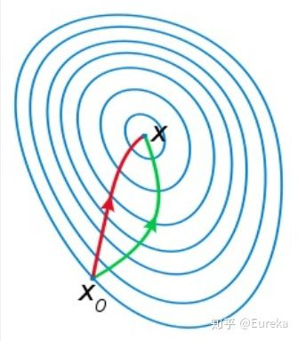

# Newton Method

一般来说，牛顿法主要应用在两个方面，1：求方程的根；2：最优化。

  ## 1. 求方程的根

目标是当$f(x) = 0$求$x$。

对于一些复杂的函数来说，求根往往没有解析解，所以往往通过迭代进行求解。

推导如下：

将函数$f(x)$在$x=x_0$处一阶泰勒展开，
$$
f(x) \approx f(x_0) + f^{\prime}(x_0)(x - x_0)
$$
令$f(x)=0$也即$f(x_0) + f^{\prime}(x_0)(x - x_0) = 0$，求得

$x = x_0 - \frac{f(x_0)}{f^{\prime}(x_0)}$，当然此时的解只是近似解，需要基于此继续迭代，由此有迭代公式为
$$
x_{n+1} = x_{n} - \frac{f(x_n)}{f^{\prime}(x_n)}
$$

## 2. 优化

目标是最小化$f(x), x\in R^n$，显然这是无约束最优化问题。

设$f(x)$有二阶连续偏导数，若第$k$次迭代值为$x^{(k)}$，则将$f(x)$在$x=x^{(k)}$进行二阶泰勒展开，
$$
f(x) \approx f(x^{(k)}) + g(x^{(k)})^{T}\cdot (x-x^{(k)}) + \frac{1}{2} (x - x^{(k)})^T \cdot H(x^{(k)}) \cdot (x - x^{(k)})
$$
其中$g(x^{(k)}) = \frac{\partial f(x)}{\partial x^{(k)}} = \nabla f(x^{(k)})$，$H(x^{(k)}) = [\frac{\partial^2 f}{\partial x_i \partial x_j}]_{n \times n}$，$g(x^{(k)})$是一个向量，$H(x^{(k)})$是一个矩阵，也就是常说的黑塞矩阵(Hessian Matrix)

函数$f(x)$取得极值的必要条件是在极值点处的一阶导数为0，即梯度向量为零，特别地，当$H(x^{(k)})$是正定矩阵时，函数$f(x)$的极值为最小值。

既然我们已知信息，在极值点处的一阶导数为零，我们不妨对泰勒展开式求导，
$$
f^{\prime}(x) = g(x^{(k)}) + H(x^{(k)})(x - x^{(k)}) = 0
$$
那么有$x=x^{(k)}- H^{-1}(x^{(k)})g(x^{(k)})$ ,思路类似方程的根部分，这个解只是一个近似解，需要在此基础上进一步迭代，
$$
x^{(k+1)} = x^{(k)} - H^{-1}(x^{(k)})g(x^{(k)})
$$

### 2.1 牛顿法与梯度下降法

梯度下降法和牛顿法相比，两者都是迭代求解，不过梯度下降法是梯度求解，而牛顿法是用二阶的海森矩阵的逆矩阵求解。相对而言，使用牛顿法收敛更快（迭代更少次数）。但是每次迭代的时间比梯度下降法长。

梯度下降法为$x^{(k+1)} = x^{(k)} - \lambda \nabla f(x^{(k)})$，

牛顿法为$x^{(k+1)} = x^{(k)} - H^{-1}(x^{(k)})g(x^{(k)})$

如下图是一个最小化一个目标方程的例子，红色曲线是利用牛顿法迭代求解，绿色曲线是利用梯度下降法求解。

至于为什么牛顿法收敛更快，通俗来说梯度下降法每次只从你当前所处位置选一个坡度最大的方向走一步，牛顿法在选择方向时，不仅会考虑坡度是否够大，还会考虑你走了一步之后，坡度是否会变得更大。所以，可以说牛顿法比梯度下降法看得更远一点，能更快地走到最底部。更多的可见：最优化问题中，[牛顿法为什么比梯度下降法求解需要的迭代次数更少？](https://www.zhihu.com/question/19723347)

### 2.2 拟牛顿法

在牛顿法的迭代中，需要计算海森矩阵的逆矩阵$H^{-1}$ ，这一计算比较复杂，考虑用一个 $n$ 阶矩阵$G_k = G(x^{(k)})$ 来近似代替 $H^{-1}_k = H^{-1}(x^{(k)})$ 。这就是拟牛顿法的基本想法。

> 具体做法后期有时间再补充吧

## References

- [梯度下降法、牛顿法和拟牛顿法](https://zhuanlan.zhihu.com/p/37524275)