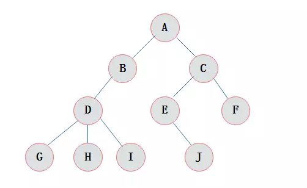
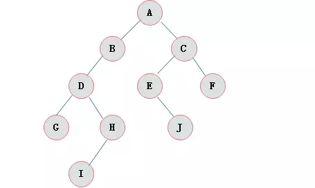
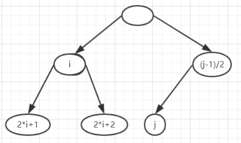
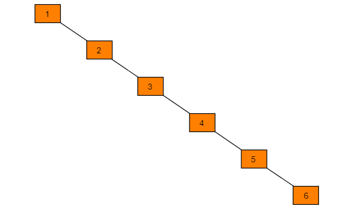
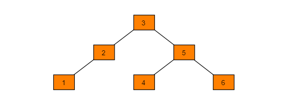
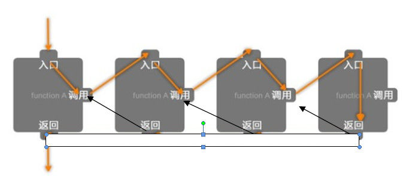

[TOC]
# 数据结构与算法

主要从四个方面来学习**数据结构与算法**，分别为**数据结构**部分、**算法思想**部分、**排序算法**部分和**经典算法题目**部分

## 1. 数据结构

### 1.1 树与二叉树

#### 1.1.1 树的定义以及概念

**树**是n(n>=0)个结点的有限集。n=0时称为空树。

在任意一棵非空树中有，

- 有且仅有一个特定的称为根（root）的结点；
- 当n>1时，其余结点可分为m(m>0)个互不相交的有限集T1、T2、......、Tn，其中每一个集合本身又是一棵树，并且称为根的子树。

> Note: 
>
> 1. n>0时(非空的树)，根结点是唯一的，不可能存在多个根结点，数据结构中的树只能有一个根结点。
>
> 2. m>0时(多个子树)，子树的个数没有限制，但它们一定是互不相交的。

下图是一棵示例的树，



下面是树的一些概念，

- 节点的度

  结点拥有的子树数目称为结点的**度**。在上图中，节点D的度为3，节点J的度为0。

- 结点关系

  - 子结点（孩子结点）

    结点子树的根结点为该结点的孩子结点，上图中B为A的子结点。

  - 父节点（双亲结点）

    类似孩子结点，方向相反，上图中A为B的父节点。

  - 兄弟结点

    父节点相同的两个节点互为兄弟结点，上图中B和C互为兄弟结点。

  - 祖先/子孙结点

    基于上面的父子结点，可以定义传递关系，上图中，A为其余所有结点的祖先结点，反过来其余结点为A的子孙结点。

    > 显然祖先结点包含了父节点

  - 叶子结点

    如果某个结点的子节点均为空（度为0），那么该节点称为叶子结点，上图中，G/H/I/J/F五个结点均为叶子结点

  - 分支结点

    结点度不为0，则该节点为分支结点，可以说除叶子结点外，其余结点均为分支结点

- 路径

  从一个祖先结点到其任何子孙结点都存在一些列边，这样一系列收尾相连的边称为树种的一条**路径**。路径中边的条数称为该路径的**长度**，那么显然有父节点到其子节点的长度为1。上图中，结点B到结点I的路径为（B-D-I）,路径的长度为3。

- 深度/高度/层数

  - 深度

    树中某一结点深度表示从根节点开始至该节点的路径长度，上图中，结点E的深度为3。

  - 高度

    树中某一结点高度表示从该节点出发，至某一个叶节点的最长路径长度，上图中，结点C的高度为2.

  - 层数

    根节点为第一层，往下依次递增。
  
  - 三者关系
  
    树中节点的**最大层数**称之为**树**的**深度**或者**高度**。
  
  > **注意**：从根节点出发计数为0或者1，有不同说法，问题本质相同，提前说明即可，多数算法偏向为后者

#### 1.1.2 二叉树的定义和性质

- 二叉树的定义

  **二叉树**是n(n>=0)个结点的有限集合，该集合或者为空集（称为空二叉树），或者由一个根结点和两棵互不相交的、分别称为根结点的左子树和右子树组成。

  下图为一颗二叉树，

  

  > **二叉树的特点**
  >
  > - 每个结点最多有两棵子树，所以二叉树中不存在度大于2的结点。
  > - 左子树和右子树是有顺序的，次序不能任意颠倒。
  > - 即使树中某结点只有一棵子树，也要区分它是左子树还是右子树。
  > - 二叉树只有五种可能的形态，分别为空二叉树、只有根结点、只有根结点和左子树、只有根结点和右子树和两棵子树均有

- 二叉树的性质

  - 层数对应的结点数量

    在非空的二叉树中，第i层最多有2^(i-1)个结点（i>=1）。

  - 树对应的结点数量

    高度（深度）为h的二叉树至多有2^(h)-1个结点（h>=1）。

  - 叶节点个数和度数为2的结点数量关系

    对于任何非空二叉树，如果其叶节点的个数为n1，度数为2的结点个数为n2，那么n1=n2+1。

#### 1.1.3 二叉树三种形态

二叉树的三种形态分别为**满二叉树**、**扩充二叉树**和**完全二叉树**。

- 满二叉树

  如果二叉树中所有**分支结点**的度数都为2，则它成为一棵满二叉树，显然满二叉树是一般二叉树的一个子集。

- 扩充二叉树

  对于二叉树T，加入足够多的新叶节点，使得T的原有结点都变为度数为2的分支结点，得到的二叉树成为T的**扩充二叉树**，扩充二叉树中，新增的结点称为**外部结点**，原T的结点称为**内部结点**。

- 完全二叉树

  对于一棵高度为h的二叉树，如果第一层至第h层的结点都满（也就是说，对所有的1<=i<=h,第i层有2^(i-1)个结点），如果下一层的结点不满，则所有结点在最左边连续排列，空位都在右边，这样的二叉树称为**完全二叉树**。

  下面为完全二叉树的两个性质：

  - 完全二叉树高度

    n个结点的完全二叉树高度为h=|log2(n)|，即为不大于log2(n)的最大整数

  - 完全二叉树的index

    如果n个结点的完全二叉树，从左至右依次从0编号，那么对任意一个结点i（0<=i<=n-1）

    - 序号为0的结点是根节点
    - 对于i>0，其父节点的编号是(i-1)/2
    - 若2*i+1<n，则其左子节点序号为2\*i+1，否则它无左子节点
    - 若2*i+2<n，则其右子节点序号为2\*i+2，否则它无左子节点

    如下图所示

    

  > 完全二叉树的一些特点，
  >
  > 1）满二叉树一定是完全二叉树，但反过来不一定成立
  >
  > 2）同样结点数目的二叉树，完全二叉树深度最小。
  >
  > 3）如果结点度为1，则该结点只有左孩子，即没有右子树。
  >
  > 4）上面的第二个性质，使其可以方面的存入一个数组中，直接根据下标找到一个结点的子节点和父节点，建立和线性结构的双向映射

#### 1.1.4 二叉树的遍历

二叉树的遍历主要分为两部分，深度优先遍历和宽度优先遍历。

- 深度优先遍历

  深度优先遍历分为三种不同的方式，先根遍历、中根遍历和后根遍历

  - 前根遍历

    即先遍历根节点，然后遍历左子树和右子树，以***1.1.2***中所示的二叉树为例，前根遍历顺序为ABDGHICEJF

  - 中根遍历

    先遍历左子树，然后遍历根节点和右子树，以***1.1.2***中所示的二叉树为例，中根遍历顺序为GDIHBAEJCF

  - 后根遍历

    先遍历左子树和右子树，最后遍历根节点，以***1.1.2***中所示的二叉树为例，后根遍历顺序为GIHDBJEFCA

- 宽度优先遍历

  宽度优先遍历又称之为**层次顺序遍历**，以***1.1.2***中所示的二叉树为例，层次遍历顺序为ABCDEFGHJI

> 深度优先遍历的递归和非递归的code需要熟练掌握，宽度优先遍历的code同样需要熟练掌握

#### 1.1.5 二叉树的应用

- **哈夫曼树**

  - 定义

    给定n个权值作为n个叶子结点，构造一棵二叉树，若带权路径长度达到最小，称这样的二叉树为**最优二叉树**，也称为**哈夫曼树**(Huffman tree)。即带权路径长度最短的树）

  - 应用

    基于哈夫曼树对信息进行编码，在数据压缩上有重要应用，提高了传输的有效性。

- **二叉排序树**

  - 定义

    二叉排序树（Binary Sort Tree），又称二叉查找树（Binary Search Tree），亦称二叉搜索树。

    具有以下性质的二叉树：

    1. 若它的左子树不空，则左子树上所有节点的值均小于它的根节点的值；
    2. 若它的右子树不空，则右子树上所有节点的值均大于它的根节点的值；
    3. 它的左右子树也分别为二叉排序树。

  - 操作代价

    既可以有较高的**插入**和**删除**效率，并且具备较高的**查找**效率。
    
    - 查找代价
    
      任何一个数据的查找过程都需要从根结点出发，沿某一个路径朝叶子结点前进。因此查找中数据比较次数与树的形态密切相关。 
      当树中每个结点左右子树高度大致相同时，树高为logN。则平均查找长度与logN成正比，查找的平均时间复杂度在O(logN)数量级上。 
    
      但是当插入的元素有序时，其退化为单支结构，此时查找时间复杂度在O(N)
    
    - 插入代价
    
      新结点插入到树的叶子上，完全不需要改变树中原有结点的组织结构。插入一个结点的代价与查找一个不存在的数据的代价完全相同。
    
    - 删除代价
    
      当删除一个结点P，首先需要定位到这个结点P，这个过程需要一个查找的代价。然后稍微改变一下树的形态。如果被删除结点的左、右子树只有一个存在，则改变形态的代价仅为O(1)。如果被删除结点的左、右子树均存在，只需要将当P的左孩子的右孩子的右孩子的…的右叶子结点与P互换，在改变一些左右子树即可。因此删除操作的时间复杂度最大不会超过O(logN)。
    
    
    **二叉排序树效率总结**，
    
    查找最好时间复杂度O(logN)，最坏时间复杂度O(N)。 
    插入删除操作算法简单，时间复杂度与查找差不多。

- **平衡二叉树**

  二叉排序树一定程度上可以提高搜索效率，但是当原序列有序，例如序列A = {1，2，3，4，5，6}，构造二叉搜索树就是一颗斜树。依据此序列构造的二叉排序树为右斜树，同时二叉树退化成单链表，搜索效率降低为O(n)。

  如下所示，

  

  因此保持树的高度最小，即可保证树的查找效率。如上结构保存为如下图显然提高查询效率，
  
  
  
  - 定义
  
    平衡二叉树（AVL）是一种二叉排序树，其中每个结点的左子树和右子树的高度差至多等于1。*它是**一种高度平衡的二叉排序树***。意思是说，要么它是一棵空树，要么它的左子树和右子树都是平衡二叉树，且左子树和右子树的深度之差的绝对值不超过1。上图所示即为一棵平衡二叉树。
  
    若定义结点的“平衡因子”  BF（Balance Factor） = 左子树深度 –右子树深度 则：平衡二叉树中所有结点的BF ∈[ -1, 0, 1 ]
  
  - 操作代价
  
    - 查找代价
    
      平衡二叉树是严格平衡的二叉排序树（平衡因子不超过1）。那么查找过程与二叉排序树一样，只是平衡二叉树不会出现最差情况的平衡二叉树(单支树)。因此查找效率最好，最坏情况都是O(logN)数量级的。
    
    - 插入代价
    
      AVL必须要保证严格平衡(|bf|<=1)，那么每一次插入数据使得AVL中某些结点的平衡因子超过1就必须进行旋转操作。事实上，AVL的每一次插入结点操作最多只需要修正一次即可。因此，总体上插入操作的代价仍然在O(logN)级别上(插入结点需要首先查找插入的位置)。
    
    - 删除代价
    
      AVL删除结点的算法可以参见二叉排序树的删除结点，但是删除之后必须检查从删除结点开始到根结点路径上的所有结点的平衡因子。因此删除的代价稍微要大一些。每一次删除操作最多需要O(logN)次旋转。因此，删除操作的时间复杂度为O(logN)+O(logN)=O(2logN)。
    
    **二叉平衡树效率总结**，
    
    查找的时间复杂度维持在O(logN)，不会出现最差情况 
    AVL树在执行每个插入操作时最多需要1次旋转，其时间复杂度在O(logN)左右。 
    AVL树在执行删除时代价稍大，执行每个删除操作的时间复杂度需要O(2logN)。

> 该部分主要熟悉二叉树的几种应用，明确几种二叉树的定义以及应用场景，明确各自的效率

#### 1.1.6 二叉树的练习题目

- 二叉树的遍历

  - [先根遍历](https://leetcode-cn.com/problems/binary-tree-preorder-traversal/)

    1 2020.02.28

    1 2020.04.20（递归+非递归，17min50s）

  - [中根遍历](https://leetcode-cn.com/problems/binary-tree-inorder-traversal/)

    1 2020.02.28

    1 2020.04.20（递归+非递归，9min30s）

  - [后根遍历](https://leetcode-cn.com/problems/binary-tree-postorder-traversal/)

    1 2020.02.28

    1 2020.04.20（递归+非递归，5min50s）

  - [层次遍历](https://leetcode-cn.com/problems/binary-tree-level-order-traversal/)

    1 2020.02.28
    
    1 2020.04.20（递归+非递归，18min50s）
    
    写递归的方法耗时较多

- [ ] [另一个树的子树](https://leetcode-cn.com/problems/subtree-of-another-tree)

  1 2020.02.29

  1 2020.04.20（递归，17min50s）

- [ ] [二叉树的最小深度](https://leetcode-cn.com/problems/minimum-depth-of-binary-tree)

  1 2020.02.29

  1 2020.04.20（递归+非递归，12min50s）

- [ ] [二叉树的所有路径](https://leetcode-cn.com/problems/binary-tree-paths) 

  1 2020.02.29(递归+非递归)

  1 2020.05.03（递归+非递归，21min20s）

- [ ] [二叉树的深度](https://leetcode-cn.com/problems/maximum-depth-of-binary-tree/)

  1 2020.03.01 (递归+非递归)

  1 2020.05.02（递归+非递归，4min43s）

- [ ] [平衡二叉树](https://leetcode-cn.com/problems/balanced-binary-tree)

  1 2020.03.01 

  1 2020.05.02（4min15s）

- [ ] [相同的树](https://leetcode-cn.com/problems/same-tree)

  1 2020.02.29

  1 2020.03.01

  1 2020.05.02（1min44s） 

- [ ] [递增顺序查找树](https://leetcode-cn.com/problems/increasing-order-search-tree)

  1 2020.03.01

  1 2020.05.02（30min） 

- [ ] [叶子相似的树](https://leetcode-cn.com/problems/leaf-similar-trees)

  1 2020.03.03

  1 2020.05.02（10min40s，yield学习了）

- [ ] [对称二叉树](https://leetcode-cn.com/problems/symmetric-tree)

  1 2020.03.03(递归+非递归)

  1 2020.05.02（7min15s，perfect）

- [ ] [翻转二叉树](https://leetcode-cn.com/problems/invert-binary-tree)

  1 2020.03.03(递归+非递归)

  1 2020.05.02（2min8s）

- [ ] [合并二叉树](https://leetcode-cn.com/problems/merge-two-binary-trees)

  1 2020.03.01

  1 2020.05.02（3min30s）

- [ ] [二叉树的坡度](https://leetcode-cn.com/problems/binary-tree-tilt)

  1 2020.03.01

  1 2020.05.02（17min5s，题目意思读错了） 

- [ ] [单值二叉树](https://leetcode-cn.com/problems/univalued-binary-tree)

  1 2020.03.01(递归+非递归)

  1 2020.05.02（8min36s）

- [ ] [从根到叶的二进制数之和](https://leetcode-cn.com/problems/sum-of-root-to-leaf-binary-numbers/)

  1 2020.03.04(递归+非递归)

  1 2020.05.02(12min58s)

- [ ] [左叶子之和](https://leetcode-cn.com/problems/sum-of-left-leaves/)

  1 2020.03.01(递归+非递归)

  1 2020.05.02(10min45s)

- [ ] [层数最深叶子节点的和](https://leetcode-cn.com/problems/deepest-leaves-sum/)

  1 2020.03.01
  
  1 2020.05.02（5min45s）
  
- [ ] [ 二叉搜索树中第K小的元素](https://leetcode-cn.com/problems/kth-smallest-element-in-a-bst/)

  1 2020.05.02（14min18s）

- [ ] [二叉树中第二小的节点](https://leetcode-cn.com/problems/second-minimum-node-in-a-binary-tree/)

  1 2020.05.02（44min）
  
- [ ] [ 从前序与中序遍历序列构造二叉树](https://leetcode-cn.com/problems/construct-binary-tree-from-preorder-and-inorder-traversal/)

  1 2020.05.03

### 1.2 链表

#### 1.2.1 链表定义

用链接关系显式表示元素之间的顺序关系，基于链接技术实现的线性表称为**链接表**或**链表**。

采用链接方式实现线性表的基本思想如下：

- 把表中元素分别存储在一批独立的存储块（**结点**）中。
- 保证从组成表结构中的任一个结点可以找到与其相关的下一个结点。
- 在前一结点里用链接的方式显式地记录与下一个结点之间的关联。

#### 1.2.2 链表的分类

主要分为**单链表**、**循环链表**、**双向链表**和**双向循环链表**。

- 单链表

  在单链表中，与表里的n个元素对应的n个结点通过链接形成一条结点链。显然，要想掌握一个单链表，只需要掌握这个表的首结点，从它出发可以到达其它的结点。这个单链表的首节点称之为**表头变量**或者**表头指针**。

- 循环单链表

  即单链表中，最后一个结点的链接域不是None而是指向表的第一个结点。

- 双向链表

  在单链表的结点中，加入一个前向的引用域来链接前一个元素。

- 双向循环链表

  将双向链表的表首和表尾链接在一起。

#### 1.2.3 链表的操作

操作部分主要包括增加元素、删除元素、修改元素改查和遍历，判断链表是否为空，链表的大小。

- 增

  在链表中增加一个元素，主要考虑表头插入元素，表尾插入元素和一般的插入元素。

- 删

  在链表中删除一个元素，主要考虑删除指定位置的元素，或者删除取值为某个值的元素。

- 改链表中指定位置的元素

- 查找某一元素在链表中是否存在

- 遍历表的元素

- 判断链表是否为空

- 链表的大小

#### 1.2.4 链表的练习题目

- [ ] 将四种链表（单、双、循环、双向）的链表操作（参考**1.2.3 链表操作**部分）分别实现

  > 需要清楚每一种操作的复杂度

- [ ] [反转链表](https://leetcode-cn.com/problems/reverse-linked-list)

  1 2020.3.8(递归+非递归)

- [ ] [反转链表 II](https://leetcode-cn.com/problems/reverse-linked-list-ii)

  1 2020.3.8

- [ ] [两数相加](https://leetcode-cn.com/problems/add-two-numbers)

  1 2020.3.9

- [ ] [环形链表](https://leetcode-cn.com/problems/linked-list-cycle)

  1 2020.3.9(哈希表+双指针)

- [ ] [排序链表](https://leetcode-cn.com/problems/sort-list)

  1 2020.3.13

- [ ] [相交链表](https://leetcode-cn.com/problems/intersection-of-two-linked-lists)

  1 2020.3.13

- [ ] [移除链表元素](https://leetcode-cn.com/problems/remove-linked-list-elements)

  1 2020.3.12(递归+非递归)

- [ ] [删除链表中的节点](https://leetcode-cn.com/problems/delete-node-in-a-linked-list)

  1 2020.3.12

- [ ] [删除排序链表中的重复元素](https://leetcode-cn.com/problems/remove-duplicates-from-sorted-list) 

  1 2020.3.12

- [ ] [删除排序链表中的重复元素 II](https://leetcode-cn.com/problems/remove-duplicates-from-sorted-list-ii)

  1 2020.3.13(递归+非递归)

- [ ] [合并两个有序链表](https://leetcode-cn.com/problems/merge-two-sorted-lists)

  1 2020.3.12

  1 2020.3.13(新思路掌握)

- [ ] [回文链表](https://leetcode-cn.com/problems/palindrome-linked-list)

  1 2020.3.12

- [ ] [链表的中间结点](https://leetcode-cn.com/problems/middle-of-the-linked-list)

  1 2020.3.12(快慢指针)

- [ ] [分隔链表](https://leetcode-cn.com/problems/split-linked-list-in-parts)

  1 2020.3.13

### 1.3 字典

## 2. 算法设计模式

### 2.1 动态规划

#### 2.1.1 定义

动态规划过程是：每次决策依赖于当前状态，又随即引起状态的转移。一个决策序列就是在变化的状态中产生出来的，所以，这种多阶段最优化决策解决问题的过程就称为动态规划。

有关动态规划的思想，可以参考知乎链接[什么是动态规划（Dynamic Programming）？动态规划的意义是什么？](https://www.zhihu.com/question/23995189)

一句话简要概括：动态规划是通过**拆分问题，**定义问题状态和状态之间的关系，使得问题能够以递推（或者说分治）的方式去解决。

#### 2.1.2 练习题目

- [ ] [最大子序和](https://leetcode-cn.com/problems/maximum-subarray)

  1 2019.10.27

  1 2020.01.27

  1 2020.04.12（3min15s）

- [ ] [爬楼梯](https://leetcode-cn.com/problems/climbing-stairs)

  1 2019.10.27

  1 2020.01.27

  1 2020.04.12（2min50s）

- [ ] [不同路径](https://leetcode-cn.com/problems/unique-paths)

  1 2019.11.9

  1 2020.01.27

  1 2020.04.12（8min50s）

- [ ] [不同路径 II](https://leetcode-cn.com/problems/unique-paths-ii)

  1 2019.11.9 

  1 2020.01.27

  1 2020.04.12（9min58s）

- [ ] [打家劫舍](https://leetcode-cn.com/problems/house-robber)

  1 2019.11.09

  1 2020.02.07

  1 2020.04.13（5min）

- [ ] [打家劫舍 II](https://leetcode-cn.com/problems/house-robber-ii)

  1 2019.11.9

  1 2020.02.07 

  1 2020.04.13（6min30s）

- [ ] [零钱兑换](https://leetcode-cn.com/problems/coin-change)

  1 2019.11.12

  1 2020.02.11

  1 2020.04.13（1h）

  1 2020.05.08（16min35s）

  1 2020.05.10（动态规划，完全背包思想）

- [ ] [零钱兑换 II](https://leetcode-cn.com/problems/coin-change-2/)

  区别于爬楼梯（排列），可以参考此[解答](https://leetcode-cn.com/problems/coin-change-2/solution/ling-qian-dui-huan-iihe-pa-lou-ti-wen-ti-dao-di-yo/)

  1 2020.05.10（动态规划，完全背包思想，当时想了好久没有想清楚，老想着约定的套路了，没有仔细定义清楚子问题。）

- [ ] [一和零](https://leetcode-cn.com/problems/ones-and-zeroes)

  1 2020.02.25

  1 2020.04.18（失败，没有定义清楚问题，耗费及其长的时间）

  1 2020.05.08（失败，还是没有思路来定义这个问题，三维度）

  1 2020.05.10（搞定15min，0-1背包的思想）

- [ ] [判断字序列](https://leetcode-cn.com/problems/is-subsequence/)

  1 2020.02.25
  
  1 2020.04.18（17min8s）

新添加的题目

- [ ] [使用最小花费爬楼梯](https://leetcode-cn.com/problems/min-cost-climbing-stairs)

  1 2019.11.17

  1 2020.02.11

  1 2020.04.18（4min50s）

- [ ] [最长上升子序列](https://leetcode-cn.com/problems/longest-increasing-subsequence)

  1 2020.02.26

  1 2020.04.18（25min50s）

- [ ] [预测赢家](https://leetcode-cn.com/problems/predict-the-winner)

  1 2019.11.24

  1 2020.02.21

  1 2020.04.18（36min40s）

- [ ] [目标和](https://leetcode-cn.com/problems/target-sum)

  1 2019.11.17

  1 2020.02.23

  1 2020.04.18（22min50s）

  1 2020.05.10（之前写的存在问题，虽然AC但是本质不是动态规划的，相当于暴力解决，目前已经通过动态规划解决，已可以理解为0-1背包问题）

- [ ] [最长回文子串](https://leetcode-cn.com/problems/longest-palindromic-substring)

  1 2019.11.24

  1 2020.02.12

  1 2020.02.25

  1 2020.04.18（15min20s）

- [ ] [最长回文子序列](https://leetcode-cn.com/problems/longest-palindromic-subsequence)

  1 2020.02.25

  1 2020.04.18（27min40s）

- [ ] [最长公共子串](https://leetcode-cn.com/problems/maximum-length-of-repeated-subarray/)

  1 2020.02.25

  1 2020.04.18（27min25s）

- [ ] [最长公共子序列](https://leetcode-cn.com/problems/longest-common-subsequence/)

  1 2020.02.25

  1 2020.04.18（7min）

- [ ] [最小路径和](https://leetcode-cn.com/problems/minimum-path-sum/)

  1 2020.02.26

  1 2020.04.18（6min39s）

- [ ] [买卖股票的最佳时机](https://leetcode-cn.com/problems/best-time-to-buy-and-sell-stock)-难度1

  1 2019.11.17

  1 2020.02.11

  1 2020.04.18（4min45s）

- [ ] [买卖股票最佳时机II](https://leetcode-cn.com/problems/best-time-to-buy-and-sell-stock-ii/)-难度2

  1 2020.04.19（超时）

- [ ] [ 买卖股票的最佳时机 III](https://leetcode-cn.com/problems/best-time-to-buy-and-sell-stock-iii/)-难度3

  1 2020.04.19（未做出）

- [ ] [买卖股票的最佳时机 IV](https://leetcode-cn.com/problems/best-time-to-buy-and-sell-stock-iv/)-难度4

  1 2020.04.19（搞定）

- [ ] [买卖股票冷冻期](https://leetcode-cn.com/problems/best-time-to-buy-and-sell-stock-with-cooldown/)-难度2

  1 2020.02.26

  1 2020.04.18（45min55s，基本失败）

  1 2020.04.19

  [解题思路](https://leetcode-cn.com/problems/best-time-to-buy-and-sell-stock-with-cooldown/solution/yi-ge-fang-fa-tuan-mie-6-dao-gu-piao-wen-ti-by-lab/)

- [ ] [买卖股票的最佳时机含手续费](https://leetcode-cn.com/problems/best-time-to-buy-and-sell-stock-with-transaction-fee/)-难度2

  1 2020.04.19

- [ ] [三角形最小路径和](https://leetcode-cn.com/problems/triangle/)

  1 2020.02.27
  
  1 2020.04.19（30min）
  
- [ ] [不同的二叉搜索树](https://leetcode-cn.com/problems/unique-binary-search-trees/)

  1 2020.04.11
  
  1 2020.04.19（39min30s）
  
- [ ] [编辑距离](https://leetcode-cn.com/problems/edit-distance/)

  1 2020.03.24

  1 2020.04.19（22min30s）

### 2.2 分治法

#### 2.2.1 定义

把复杂问题分解为相对简单的子问题，分别求解，最后通过组合起子问题的解的方式得到原始问题的解。

#### 2.2.2 练习题目


### 2.3 贪心法

#### 2.3.1 定义

根据问题的信息尽可能做出部分的解（局部最优），并基于部分解逐步扩充得到完整的解（基于局部最优得到全局最优），需要注意的是，在复杂问题下，有可能这种局部的解并不是全局最优的解。

#### 2.3.2 练习题目

- [分发饼干](https://leetcode-cn.com/problems/assign-cookies/)

  1 2020.4.6

- [判断子序列](https://leetcode-cn.com/problems/is-subsequence/)

  1 2020.4.6
  
- [柠檬水找零](https://leetcode-cn.com/problems/lemonade-change/)

  1 2020.4.7

### 2.4 回溯法


### 2.5 分支限界法


### 2.6 枚举法


## 3. 算法实现方式

### 3.1 递归

#### 3.1.1 定义

递归（recursion）是指函数/过程/子程序在运行过程序中直接或间接调用自身而产生的重入现像。

程序调用自身的编程技巧称为递归。

- 递归就是在过程或函数里调用自身
- 在使用递增归策略时，必须有一个明确的**递归结束条件**，称为递归出口。



递归算法一般用于解决三类问题，

- 数据的定义是按递归定义的，eg. Fibonacci函数
- 问题解法按递归算法实现，eg. 回溯
- 数据的结构形式是按递归定义的。(树的遍历，图的搜索)

**递归算法的缺点**，

递归算法解题的运行效率较低。在递归调用的过程当中系统为每一层的返回点、局部量等开辟了栈来存储。递归次数过多容易造成栈溢出等。

#### 3.1.2 练习题目

首先按照该[链接](http://39.96.217.32/blog/4#comment-container)内容将递归的知识详细的过一遍，然后进行下面的练习题。

> 可能会有一些题目和上面存在重复，主要是以**递归的思维**求解这些题目，及时做出总结

以下题目需要使用递归解决，

- [ ] [最长同值路径](https://leetcode-cn.com/problems/longest-univalue-path)

  1 2020.3.4(好题目，动态规划+递归，定义清楚问题来拆解)

- [ ] [二叉搜索树结点最小距离](https://leetcode-cn.com/problems/minimum-distance-between-bst-nodes)

  1 2020.3.4(未做出来当时)

- [ ] [二叉树的最小深度](https://leetcode-cn.com/problems/minimum-depth-of-binary-tree)

  1 2020.3.5

- [ ] [对称二叉树](https://leetcode-cn.com/problems/symmetric-tree)

  1 2020.3.5

- [ ] [平衡二叉树](https://leetcode-cn.com/problems/balanced-binary-tree)

  1 2020.3.5

- [ ] [两两交换链表中的节点](https://leetcode-cn.com/problems/swap-nodes-in-pairs)

  1 2020.3.6

- [ ] [合并二叉树](https://leetcode-cn.com/problems/merge-two-binary-trees)

  1 2020.3.5

- [ ] [翻转二叉树](https://leetcode-cn.com/problems/invert-binary-tree)

  1 2020.3.5

- [ ] [路径总和](https://leetcode-cn.com/problems/path-sum)

  1 2020.3.5

- [ ] [路径总和 II](https://leetcode-cn.com/problems/path-sum-ii) 

  1 2020.3.5

- [ ] [另一个树的子树](https://leetcode-cn.com/problems/subtree-of-another-tree)

  1 2020.3.5 

### 3.2 双指针

#### 3.2.1 定义

定义两个指针，进行滑动求解。核心的第一步要想到用这种方式，其次定义好如何进行滑动动即可。

#### 3.2.2 练习题目

- [和为s的连续正数序列](https://leetcode-cn.com/problems/he-wei-sde-lian-xu-zheng-shu-xu-lie-lcof/)

  1 2020.04.10
  
- [三数之和](https://leetcode-cn.com/problems/3sum/)

  1 2020.05.04

- [最接近的三数之和](https://leetcode-cn.com/problems/3sum-closest/)

  1 2020.05.04

- [四数之和](https://leetcode-cn.com/problems/4sum/)

  1 2020.05.04（n sum）

- [盛最多水的容器](https://leetcode-cn.com/problems/container-with-most-water/)

  1 2020.05.05

### 3.3 二分查找

#### 3.3.1 定义

每次折半的方式进行元素的查找

#### 3.3.2 练习题目

- [二分查找](https://leetcode-cn.com/problems/binary-search/)

  1 2020.05.04 （非递归3min12s；递归3min20s）

- [二维数组中的查找](https://leetcode-cn.com/problems/er-wei-shu-zu-zhong-de-cha-zhao-lcof/)

  1 2020.05.04（递归二分59min；路径法快一些，没有想到）

- [I. 在排序数组中查找数字 I](https://leetcode-cn.com/problems/zai-pai-xu-shu-zu-zhong-cha-zhao-shu-zi-lcof/)

  1 2020.05.04（13min，使用左边界和有边界解决）

- [在排序数组中查找元素的第一个和最后一个位置](https://leetcode-cn.com/problems/find-first-and-last-position-of-element-in-sorted-array/)

  1 2020.05.09

- [搜索插入位置](https://leetcode-cn.com/problems/search-insert-position/)

  1 2020.05.09

- [寻找两个有序数组的中位数](https://leetcode-cn.com/problems/median-of-two-sorted-arrays/)

  1 2020.05.10 （耗时很久，整体思路清晰，但是细节没有理清楚）

## 4. 排序算法

[leetcode排序测试题目](https://leetcode-cn.com/problems/sort-an-array/)

### 4.1 快速排序

1 2020.03.07

1 2020.03.28

1 2020.04.04

1 2020.05.02(6min25s)

时间复杂度分析：

- 最好时间复杂度

  每次都恰好五五分，一次递归共需比较n次，递归深度为$\log n$，所以时间复杂度是$n \log n$

- 最坏时间复杂度

  数据完全是倒序，这样需要比较$n+n-1+n-2+\cdots+1=\frac{1}{2} n(n-1) \sim n^2$.

- 平均时间复杂度

  需要一些递推式，就不细究了，平均复杂度也为$n \log n$.

空间复杂度分析：

主要是递归造成的栈空间的使用，最好情况，递归树的深度为$\log n$，其复杂度也为$\log n$。最坏的情况需要进行n‐1递归调用，其空间复杂度为O(n)，平均的空间复杂度也为O(logn)。

稳定性：不稳定

### 4.2 冒泡排序

1 2020.03.08

1 2020.03.27（三种方式实现）

1 2020.04.04（三种方式实现）

1 2020.05.02（三种实现，9min35s）

**基本思想:** 

冒泡排序，类似于水中冒泡，较大的数沉下去，较小的数慢慢冒起来，假设从小到大，即为较大的数慢慢往后排，较小的数慢慢往前排。

目前了解到两种表达方式：

1. 个人比较常用的

   类似打擂台的方式，每次找到最小的数字，放在最左侧

2. 冒泡方式

   每次相邻的数字两两比较，将大的数字最终"冒"到最右侧（亦或是将最小的数字"冒"到最左侧）

算法复杂度：

平均复杂度：O(n2)

最好复杂度：O(n)

最坏复杂度：O(n2)

空间复杂度：O(1)

稳定性：稳定

###  4.3 选择排序

1 2020.03.08

1 2020.03.27

1 2020.04.04

1 2020.05.02（4min25s）

类似上面冒泡排序中第一种方式，每次找到最小的数字之后，然后再两两交换，不是每次都两两交换。

算法复杂度：

平均复杂度：O(n2)

最好复杂度：O(n2)

最坏复杂度：O(n2)

空间复杂度：O(1)

稳定性： 不稳定

### 4.4 插入排序

1 2020.03.08 

1 2020.03.27

1 2020.04.04

1 2020.05.02（4min19s）

类似打扑克排牌的方式进行，每次在有序的序列中插入一个数字，使得之后的序列仍然是一个有序的序列。

算法复杂度：

平均复杂度：O(n2)

最好复杂度：O(n)

最坏复杂度：O(n2)

空间复杂度：O(1)

稳定性：稳定

### 4.5 归并排序

1 2020.03.08(递归+**非递归**，未实现)

1 2020.03.27(递归)

1 2020.04.04(递归)

1 2020.05.02(递归，19min50s)

```python
# 归并排序，非递归版本
def merge(seq, low, mid, high):
    left = seq[low: mid]
    right = seq[mid: high]
    k = 0 
    j = 0
    result = []
    while k < len(left) and j < len(right):
        if left[k] <= right[j]:
            result.append(left[k])
            k += 1
        else:
            result.append(right[j])
            j += 1
    result += left[k:]
    result += right[j:]
    seq[low: high] = result

def merge_sort(seq):
    i = 1 # i是步长
    while i < len(seq):
        low = 0
        while low < len(seq):
            mid = low + i #mid前后均为有序
            high = min(low+2*i,len(seq))
            if mid < high: 
                merge(seq, low, mid, high)
            low += 2*i
        i *= 2
```

算法思想：合并两个有序的序列。

算法复杂度：

平均复杂度：O(nlogn)

最好复杂度：O(nlogn)

最坏复杂度：O(nlogn)

空间复杂度：O(n)

稳定性： 稳定

### 4.6 堆排序

1 2020.03.11

1 2020.03.27

1 2020.04.04

1 2020.05.02（24min40s）

算法思想：不断的重建堆，弹出最大元素。

算法复杂度：

平均复杂度：O(nlogn)

最好复杂度：O(nlogn)

最坏复杂度：O(nlogn)

空间复杂度：O(1)

稳定性：不稳定

## 5. 经典算法题目

### 5.1 TOP N

[数组中的第K个最大元素](https://leetcode-cn.com/problems/kth-largest-element-in-an-array/)

1 2020.03.13

1 2020.05.02（小顶堆，45min；大顶堆，7min）

方案1：快排取index为k，时间复杂度，NlogN，空间复杂度O（1），不可取

方案2：所有元素构建一个大顶堆，然后弹出k个堆顶，时间复杂度klogN，空间复杂度O(1)

方案3：维护一个k大小的小顶堆，然后遍历所有元素，时间复杂度Nlogk，空间复杂度O(k)（目前此方案是最快）

方案4：快排思想，每次删减部分元素，平均时间复杂度O（N），空间复杂度O（1）

### 5.2 接雨水

[接雨水](https://leetcode-cn.com/problems/trapping-rain-water/)

1 2020.05.05

[盛最多水的容器](https://leetcode-cn.com/problems/container-with-most-water/)

1 2020.05.05

### 5.3 蓄水池抽样

相关理论：


- [抽一个样本](https://leetcode-cn.com/problems/linked-list-random-node/)

  1 2020.05.05

- [随机数索引](https://leetcode-cn.com/problems/random-pick-index/)

  1 2020.05.05

### 5.4 背包问题

参考资料：

[leet总结](https://leetcode-cn.com/problems/coin-change/solution/yong-bei-bao-wen-ti-si-xiang-lai-li-jie-ying-bi-zh/)

[知乎总结](https://zhuanlan.zhihu.com/p/85780471?from_voters_page=true)

#### 5.4.1 0-1背包问题

一个小偷面前有一堆（n个）财宝，每个财宝有重量`w`和价值`v`两种属性，而他的背包只能携带一定重量的财宝（Capacity），在已知所有财宝的重量和价值的情况下，如何选取财宝，可以最大限度的利用当前的背包容量，取得最大价值的财宝（或求出能够获取财宝价值的最大值）。

定义我们的状态转移方程

dp\[i\]\[k]为前i个财宝在容量为k下能够获取的最大价值，最中的答案即为，dp\[n]\[C]

转移方程为：
$$
dp[i][k] = \min
\begin{cases}
dp[i-1][k],\quad 第i个物品不选择 \\
v[i]+dp[i-1][k-w[i]], \quad 第i个物品选择，且k \geq w[i]
\end{cases}
$$

- [分割等和子集](https://leetcode-cn.com/problems/partition-equal-subset-sum/)

  1 2020.05.10

- [一和零](https://leetcode-cn.com/problems/ones-and-zeroes)

  1 2020.05.10

- [目标和](https://leetcode-cn.com/problems/target-sum)

  1 2020.05.10（动态规划中有此题目）

#### 5.4.2 完全（无界）背包问题

如果不限定每种物品的数量，同一样物品想拿多少拿多少，则问题称为无界或完全背包问题。

> 上面的问题相当于是最多拿1次，即拿或者不拿

定义我们的状态转移方程

dp\[i\]\[k]为前i个财宝在容量为k下能够获取的最大价值，最中的答案即为，dp\[n]\[C]

转移方程为：
$$
dp[i][k] = \min
\begin{cases}
dp[i-1][k],\quad 第i个物品不选择 \\
v[i]+dp[i][k-w[i]], \quad 第i个物品选择，且k \geq w[i]
\end{cases}
$$

> 对比0-1背包，状态的定义的最大价值中已经包含了可以任意次的选取。所以核心的不同就是就是第个物品如果选择后，回溯值时是否考虑当前物品。

- [零钱兑换](https://leetcode-cn.com/problems/coin-change/)

  1 2020.05.10（动态规划中有此题目）

- [零钱兑换 II](https://leetcode-cn.com/problems/coin-change-2/)

  1 2020.05.10（动态规划中有此题目）

#### 5.4.3 多重（有界）背包问题

如果限定物品`i`最多只能拿`m[i]`个，则问题称为有界或多重背包问题。

转换为0-1背包问题，多加一层循环，每个物品的次数进行判断。

#### 5.4.4 混合背包

如果物品中既有最多只能拿`m[i]`个物品，又有不限数量的物品，又有只有一件的物品，我们该如何选取呢？

整体思路和上面类似，此时将以上三类背包抽象为固定函数，**依次遍历物品**更新dp即可。

### 5.5 合并K sorted序列


## 6. References

- [二叉树基础](https://www.jianshu.com/p/bf73c8d50dc2)
- [Leetcode——二叉树常考算法整理](https://blog.csdn.net/qq_32690999/article/details/80484440)
- [数据结构与算法——平衡二叉树](https://xiaozhuanlan.com/topic/2937850641)
- [二叉查找树、平衡二叉树、红黑树、B-/B+树性能对比](https://blog.csdn.net/z702143700/article/details/49079107)
- [递归的定义](https://blog.csdn.net/tianping168/article/details/2493335)

## 7. 待做题目

最长重复子序列

给一个数组 A = [2, 4, 8, 3] 输出一个数组 B，其中 B[i] 值为 A 中小于 A[i] 的元素值之和，B 应该为 [0, 5, 9, 2]（小于 2 的有 [0]，小于 4 的有 [2, 3] ...）

原地移动数组，使得元素对应顺序不变，0 值移动到末尾，LeetCode 283

二叉树直径，LeetCode 543

牛妹在练习打字，现在按照时间顺序给出牛妹按下的键（以字符串形式给出, '<' 代表回退 backspace，其余字符均是牛妹打的字符，字符只包含小写字母与 '<'），牛妹想知道最后在屏幕上显示的文本内容是什么

在这个特殊的假期里，由于牛牛在家特别无聊，于是他发明了一个小游戏，游戏规则为：将字符串数字中为偶数位的数字进行翻转，将翻转后的结果进行输出。（头尾双指针)

牛牛有一个 n 个数字的序列，现在牛牛想把这个序列分成 k 段连续段，牛牛想知道分出来的 k 个连续段的段内数字和的最小值最大可以是多少？（我用的递归，似乎大数据过不了，应该考虑尾递归或者用个 Map 存一下已经计算过的片段值）
