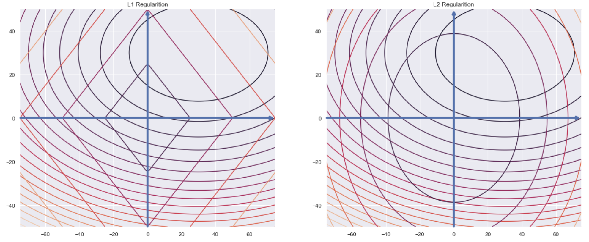

# 正则项

## 摘要

本文章主要讲述了L1和L2的基本定义，以及其所具有的性质，如下：

- L1 
它的主要特性是能够产生稀疏解，某种程度上使得增加模型的”解释性“
- L2 
它的主要特性是偏向于求得较小的解，通过限制权重的大小实现了对模型空间的限制，从而一定程度可以避免过拟合

针对他们的性质，从三个方面做了求证，最后从先验分布的角度将L1、L2和概率分布做了关联，其中L1假设参数服从拉普拉斯分布，L2假设参数服从高斯分布。

## 1. 正则化的定义

维基百科中给正则项做出了如下的解释，

```
In mathematics, statistics, and computer science, particularly in machine learning and inverse problems, regularization is the process of adding information in order to solve an ill-posed problem or to prevent overfitting.
```

 简单理解：正则项是通过添加信息来解决不适定问题（ill-posed）或者防止过拟合，其应用范围很广，包括数理统计、图像以及机器学习中。

> Note：不适定问题，可以简单理解为解可能不存在、不唯一或者不稳定

​        在机器学习中，在损失函数中添加正则项，目的是希望模型在拟合训练数据的同时，尽量使得到的模型尽可能简单，防止过拟合，其基本形式大都如下，
$$
\omega^*=\underset{\omega}{\arg \min} \sum_i{L(y_i, f(x_i;\omega))}+\lambda \Omega(\omega)
$$
其中第一项$\sum_i{L(y_i, f(x_i;\omega))}$衡量模型预测值和真实值之间的损失，第二项$\Omega(\omega)$为正则化项，参数$\lambda$控制正则化的强度

整体可以这样理解：原来模型想要优化的是损失L，此时我们在损失L中又加入了一部分$\Omega$，希望模型同时优化这两部分。

可以看出$\Omega$的内容极为重要，他会关系到最终模型的求解，通常他的形式为L1和L2，下面主要围绕这两部分展开。

## 2. L1和L2的基本形式

### 2.1 P范数

若向量$x \in R^n$，令$x=[x_1, x_2, \cdots, x_n]^T$，则向量$x$的p-范数为
$$||x||_p=(|x_1|^p+|x_2|^p+ \cdots +|x_n|^p)^{\frac{1}{p}}$$

当$p$取0,1,2,$\infty$时候， 
0-范数：$||x||_0$=向量$x$的非零元素的个数 
1-范数: $||x||_1=|x_1|+|x_2|+ \cdots +|x_n| $ 
2-范数：$||x||_2=(|x_1|^2+|x_2|^2+ \cdots +|x_n|^2)^{1/2}$ 
$\infty-$范数：$||x||_{\infty}=\max(|x_1|, |x_2|, \cdots, |x_n|)$

### 2.2 L1和L2

L1和L2就对应到1-范数和2-范数。

假设损失函数L，包含n个待求解的参数（$w_1, w_2, \cdots, w_n$），那么

- 带L1正则项的目标函数
  $$
  \omega^*=\underset{\omega}{\arg \min} \sum_i{L(y_i, f(x_i;\omega))}+\lambda (|\omega_1|+|\omega_2|+...)
  $$

- 带L2正则项的目标函数
  $$
  \omega^*=\underset{\omega}{\arg \min} \sum_i{L(y_i, f(x_i;\omega))}+\lambda (|\omega_1|^2+|\omega_2|^2+...)
  $$

下面讨论下如果假如L1和L2正则，其解会是何种类型。

**为何没有L0正则？**

若将L0正则（也即0范数，向量中非零元素的个数）加入到正则化项中，假如可求解的话，那么得到的解是显然是稀疏的。

但是这样做的话难以优化求解，对应到NP-hard问题（简单理解：需要求解的时间非常长）。

退而求其次，数学家发现，L1范数是L0范数的最优凸近似，并且它比L0范数要容易优化求解。L1范数和L0范数都可以实现稀疏，因此L1是比较常见而L0则几乎不用。

## 3. L1和L2的性质

先抛结论：L1范数易求得稀疏解（会有部分参数为0），L2范数易得到光滑解（整体参数的取值较为均衡，没有极大或者极小）。

下面从三个方面解释上面的结论，分别是损失函数角度、优化的角度和损失函数等高线图。

### 3.1 损失函数来看
假设只有一个参数$\omega$，损失函数为$L(\omega)$，加入L1和L2正则后，有
$$
\begin{cases}
J_{L_1}(\omega)=L(\omega)+\lambda|\omega| \\

J_{L_2}(\omega)=L(\omega)+\lambda\omega^2
\end{cases}
$$
参数的求解往往是沿着负梯度方向（梯度下降），形如下，
$$
w_{t+1} = w_t - \lambda \frac{\partial J}{\partial w}
$$
上面$t$表示第t次更新。

假设$L(\omega)$在$\omega=0$处的导数为$\left. \frac{\partial L(\omega)}{\partial \omega} \right|_{\omega=0}=d_0$
则加入L1和L2正则项的导数为  

- L1在$\omega=0$的导数形式
  $$
  \begin{cases}
  \left. \frac{\partial J_{L_1}(\omega)}{\partial \omega} \right|_{\omega=0^-}=d_0-\lambda  \\
  
  \left. \frac{\partial J_{L_1}(\omega)}{\partial \omega} \right|_{\omega=0^+}=d_0+\lambda
  \end{cases}
  $$
  L1项导数，在$\omega=0$处存在两个导数，$d_0-\lambda$和$d_0+\lambda$，若$d_0-\lambda$和$d_0+\lambda$异号，那么在该处会是一个极小值点，所以**L1正则项更容易产生稀疏解**。

- L2在$\omega=0$的导数形式
  $$
  \left. \frac{\partial J_{L_2}(\omega)}{\partial \omega} \right|_{\omega=0}=d_0+2\lambda \omega=d_0
  $$
  L2的导数在$\omega=0$处的导数仅受到$d_0$影响，朝一个方向变动，整体来说不容易产生零解。

### 3.2 优化角度来看

将带有L1和L2正则项的损失简化为如下，
$$
\begin{cases}
L_1=|\omega_1|+|\omega_2|+\cdots+|\omega_n|, \frac{\partial L_1}{\omega_i}=sign(\omega(i)) \\
L_2=|\omega_1^2|+|\omega_2^2|+\cdots+|\omega_n^2|, \frac{\partial L_2}{\omega_i}=2\omega_i
\end{cases}
$$
上两式中省略$L(\omega)$，因为两者均含此项 。
同样，上面两个式子按照梯度下降法更新参数，假设$0 < \lambda < 1$，

- L1
  $\omega_i=\omega_i-\lambda \cdot sign(\omega(i))$ 
  从上面可以看出，

  当$\omega_i>0$时，权值每次更新都固定减少一个特定值;

  当$\omega_i<0$时，权值更新都固定增加一个特定值，所以综合来看，经过多次迭代，权值容易更新为0。

- L2
  $\omega_i=\omega_i-\eta \cdot 2\omega_i=(1-2\eta)\omega_i$ 
  从上面可以看出$\omega_i$的减少是按比例进行减少，所以不易收敛到0，但是会按比例缩小，所以倾向得到一个较小的值

### 3.3 损失函数等高线图

假设带有L1正则化的损失函数为
$$
J=J_0 + \alpha\sum_{w}{|w|}
$$
因为L1正则中带有绝对值符号，所以J不是完全可微的，我们的任务就是通过优化方法通过优化$w$来求得损失函数的最小值；我们也可以理解为在原损失函数的基础上添加L1正则项，相当于是对$J_0$做了一个约束，令$L=\alpha \sum_{w}{|w|}$，则有$J=J_0+L$，此时任务变为**在约束$L$下求得$J_0$的最小值的解**。
假设只有两个权重$w_1$和$w_2$，此时$L=|w_1|+|w_2|$，指定J为
$$
J_0(w_1, w_2) = 0.3(w_1-30)^2 + (w_2 - 30)^2
$$

从下图可以看出，在固定L的等值线时，原损失函数值的等值线于L线首次相交的地方就是最优解（最终的目的是最小化损失，所以两者均想不断缩小自己的损失圈，但是必须有公共相交部分，可以理解两者首次相交的位置便是问题解），此时四个边角于L线首次接触的概率大些，而四个边角都表示$w_1=0$或者$w_2=0$，所以L1易获得稀疏解。
类似上面L1，对于L2正则的损失函数，有
$$
\begin{equation}\begin{split} 
J
&=J_0+\alpha \sum_w{w^2} \\
&=0.3(w_1-30)^2 + (w_2-30)^2 + \alpha \cdot (w_1^2+w_2^2)\\
\end{split}\end{equation}
$$
从下图可以看出，L2正则图是个圆形，于L1相比没有棱角，这样与损失函数首次交点不容易在坐标轴上，因此L2正则不容易产生稀疏解。



## 4. L1和L2的参数分布

对于L1正则来说，添加L1正则相当于假设参数的分布服从**拉普拉斯分布**，L2则假设参数服从**高斯分布**

- L1-Laplace
概率分布 
$$
\begin{equation}\begin{split} 
f(x|\mu, b)
&= \frac{1}{2b}e^{\left(-\frac{|x-\mu|}{b}\right)}  \\
&= \frac{1}{2b} 
\begin{cases}
e^{\left(-\frac{\mu-x}{b}\right)}, &if\ x \lt \mu \\
e^{\left(-\frac{x-\mu}{b}\right)}, &if\ x \ge \mu
\end{cases}
\end{split}\end{equation}
$$
其中，$\mu$是数学期望，$b>0$是振幅，如果$\mu=0$，那么正半部分是尺度为1/2的指数分布。

- L2-Gaussian
概率分布
$$
f(x)=\frac{1}{\sqrt{2\pi}\sigma}e^{-\frac{(x-\mu)^2}{2\sigma_2}}
$$
其中，$\mu$是数学期望，$\sigma$决定了分布的幅度，当$\mu=0, \sigma=1$时，此时即为标准正态分布

这篇博文[贝叶斯角度看L1，L2正则化](https://blog.csdn.net/haolexiao/article/details/70243292)着重讲述了贝叶斯学派解决问题的方式，一步步带入到正则化的分布上，后面的推导不是很完整；相反这篇博文[L1、L2正则化知识详解](https://www.jianshu.com/p/c9bb6f89cfcc)着重讲解了通过拉普拉斯分布和高斯分布推导的过程（这篇文章的推导必须得看一看），非常详细。 